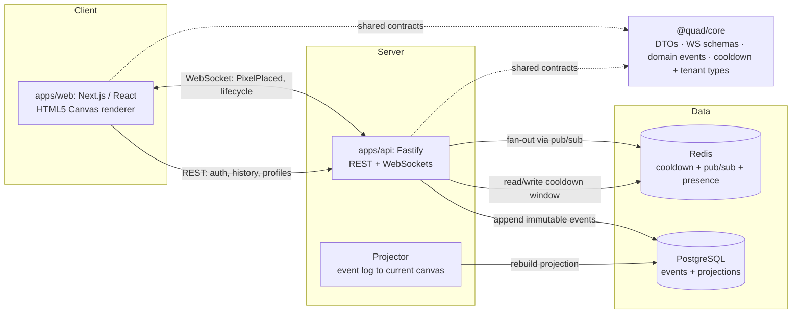

<div align="center">

# Quad

### A whole campus, one pixel canvas, one semester.

*One student. One pixel. One cooldown. One semester-long work of art.*

</div>

---

## The idea

Give every verified student at a university a single shared canvas and one simple power: place a pixel, wait out a cooldown, place another. That's the whole game. There's no way to buy more, no premium tier, no bots, no machine-generated art, no shortcuts.

So whatever ends up on the canvas, a dorm's logo, a club crest, an inside joke, a turf war between two majors, was put there one pixel at a time by real people who showed up and cooperated (or didn't). The art is the receipt of a thousand small decisions.

Then the semester ends. The canvas **freezes**, gets **archived forever**, and becomes a **replay** you can scrub from the first blank pixel to the final piece. It is a time capsule of a campus, made by the campus.

## One rule: everyone is equal

Quad has exactly one non-negotiable value, **fairness**, and every feature bends to it:

- **One account per real, verified student.** No anonymous pixels.
- **One pixel at a time**, behind a cooldown that is **identical for everyone**. It is never personalized, never shortened, never for sale.
- **No pay-to-win.** No premium, no purchased pixels, no NFTs, no generated art.
- **Nothing is ever lost.** The canvas is rebuilt from an immutable log of every placement, so the full story survives, forever.

If you can place a pixel, you have exactly as much influence as anyone else on campus. That is the point.

## What you can do

| | |
| --- | --- |
| **Paint live** | A pixel-perfect canvas with smooth zoom and pan, coordinate readout, and real-time updates over WebSockets. No refresh, no polling. |
| **Feel the cooldown** | A single global cooldown that auto-adjusts between **5 and 20 minutes** with live load, smoothed so it drifts instead of snapping. The same for everyone, always. |
| **Read any pixel's story** | Hover for who placed it and when; click for the full, ordered history of that cell. |
| **Relive the semester** | Every canvas is archived at term's end with a final image, statistics, and a scrub/play/variable-speed **replay** from blank to finished. |
| **Climb the boards** | Profiles with term and lifetime stats and a contribution heatmap; leaderboards that rank real, attributable activity. |
| **Trust the moderation** | Bans, suspensions, and pixel or region rollbacks are all reversible and audit-logged. Nothing is ever hard-deleted. |

## Built for every campus, not just one

Quad is a **platform**, not a single school's project. The app never hardcodes a university: a tenant's name, domains, theme, palette, canvas, and moderators all live in configuration.

**Rutgers University is tenant #1.** Onboarding the next campus (Princeton, Michigan, Penn State, pick one) is a config change, not a rewrite. The code stays tenant-neutral and branded **Quad**; Rutgers lives entirely in tenant config.

---

# Under the hood

A production-quality, real-time, multi-tenant system. A **monorepo** on **pnpm workspaces** + **Turborepo**, Docker-first locally, with shared contracts that keep the client and server honest.

## Architecture



**Every shared contract lives in `@quad/core`** (DTOs, WebSocket payloads, domain events, cooldown types, tenant config) and is consumed by both apps, so there are no duplicated or untyped payloads and the client and server stay in lockstep. Placement is **event-sourced**: each pixel is an immutable `PixelPlaced` event, the live canvas is a projection of that log, and even a moderator rollback is a new compensating event rather than a delete.

## Stack

Exact major versions are pinned in one place, [`docs/TECH_BASELINE.md`](docs/TECH_BASELINE.md), and nowhere else.

| Layer | Technology |
| --- | --- |
| Frontend | Next.js · React · TypeScript · HTML5 Canvas |
| Backend | Fastify · REST + WebSockets |
| Database | PostgreSQL · Prisma |
| Cache / realtime | Redis (cooldown, pub/sub, presence) |
| Auth | email-verification today, university SSO later |
| Monorepo | pnpm workspaces · Turborepo |
| Testing | Vitest · Playwright (+ load gate) |
| Delivery | Docker · Docker Compose · Caddy edge · CI/CD |

## Repository layout

```text
quad-canvas/
├── apps/
│   ├── web/                 # Next.js client: canvas + pan/zoom, placement, auth, profiles, leaderboards, archives, replay
│   └── api/                 # Fastify server: REST + WS, event store, projector, auth, moderation, archives, cooldown
├── packages/
│   ├── core/                # @quad/core: domain types, DTOs, WS schemas, domain events, cooldown + tenant config types
│   ├── db/                  # @quad/db: Prisma schema, client, migrations, repositories
│   ├── realtime/            # @quad/realtime: WS registry + pub/sub adapters
│   ├── render/              # @quad/render: framework-agnostic canvas engine (dirty-region, viewport math)
│   ├── config/              # @quad/config: tenant registry, palette, env loading/validation
│   ├── ui/ · testing/       # @quad/ui shared components · @quad/testing fixtures + harness
│   └── eslint-config/ · tsconfig/   # shared lint + TS base configs
├── docs/                    # product, architecture, and engineering docs, the source of truth (+ adr/)
├── specs/ · templates/      # spec-driven authoring: conventions + scaffolds
├── process/                 # engineering operating model: rules, role guides, playbooks, SPEC_PLAN.md
├── deploy/                  # Caddyfile (edge proxy)
├── scripts/                 # load gate, backup/restore drill, migration-safety, canvas e2e
├── docker-compose.yml · docker-compose.prod.yml   # local datastores · full prod stack
├── pnpm-workspace.yaml · turbo.json · package.json
└── .github/workflows/ci.yml
```

## Run it locally

The whole stack runs from one command:

```bash
# Full stack: Postgres + Redis + migrate + API + web + edge proxy
cp .env.prod.example .env.prod
docker compose -f docker-compose.prod.yml --env-file .env.prod up -d --build
# then open the app through the edge proxy (tenant resolved by Host)
```

Working on the code:

```bash
nvm use 22                          # Node 22 + pnpm 10 (see docs/TECH_BASELINE.md)
pnpm install --frozen-lockfile
pnpm check                          # lint · typecheck · test · build (Turbo-orchestrated)

docker compose up -d --wait postgres redis   # local datastores for integration tests
pnpm --filter api test:integration
docker compose down
```

## Project status

Built and merged to `main`, end to end: the `@quad/*` packages and both apps, realtime, auth, moderation, archives and replay, and dynamic cooldown. Milestone checkpoints **G1 through G5 have passed** and **all MVP acceptance criteria are met and verified** (unit, integration against real Postgres/Redis, and a browser e2e). CI gates every PR (security audit, migration-safety, lint, typecheck, unit, build, integration, load), and the full stack deploys from `docker-compose.prod.yml` behind a Caddy edge proxy.

What's left is launch-stage and external: legal/ToS/university approval and a live cloud target. Live detail lives in [`docs/CHECKPOINTS.md`](docs/CHECKPOINTS.md) and [`docs/ACCEPTANCE_TRACEABILITY.md`](docs/ACCEPTANCE_TRACEABILITY.md).

## Contributing

See [`CONTRIBUTING.md`](CONTRIBUTING.md) for the workflow, PR-size limits, required checks, and the rule that a contract change updates its doc in the same PR. The full engineering model lives in [`docs/ENGINEERING_WORKFLOW.md`](docs/ENGINEERING_WORKFLOW.md) and [`process/`](process/).

## License

[MIT](LICENSE).

---

<div align="center">
<sub>Quad. Built like the product actually matters. Rutgers is tenant&nbsp;#1.</sub>
</div>
