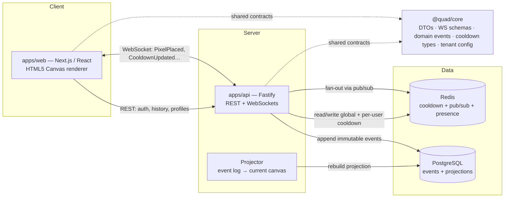

<div align="center">

# Quad

### A collaborative pixel-canvas platform for universities

*One student. One pixel. One cooldown. One semester-long work of art.*

**Status:** 🏗️ Pre-implementation — architecture & specification corpus in progress.
No application code exists yet by design; see [Project Status](#project-status).

</div>

---

## What is Quad?

**Quad** is a production-quality, real-time collaborative pixel canvas inspired by Reddit's r/place, built **exclusively for verified university students**. Each semester, thousands of students at a university work together — and against each other — to create one massive shared piece of digital artwork on a single live canvas. At the end of the semester the canvas is **frozen, archived forever, and turned into a replay** — a permanent historical snapshot of campus culture.

Quad is **not** a Reddit clone and **not** a one-off school project. It is a **multi-tenant platform**: the application never hardcodes any single school. **Rutgers University is tenant #1**, and onboarding the next university (Princeton, Michigan, Penn State, Georgia Tech, …) is a matter of **configuration, not a rewrite**.

> The repository directory is named `quad-canvas`; the **platform and all code are tenant-neutral and branded `Quad`** (`@quad/*` packages). Rutgers lives entirely in tenant configuration.

### Why "every student has equal influence"

The product is built around a single non-negotiable value — **fairness**:

- **One account per real, verified student.** No anonymous participation.
- **One pixel at a time**, gated by a cooldown that is **identical for everyone**.
- **No pay-to-win, no premium, no purchased pixels, no NFTs, no machine-generated art.**
- **Every action is preserved forever** — the canvas is rebuilt from an immutable event log.

---

## Core Features

| Area | What it does |
| --- | --- |
| **Live canvas** | Pixel-perfect HTML5 Canvas with smooth zoom/pan, deep-zoom, coordinate readout, and real-time updates over WebSockets — no polling. |
| **Dynamic global cooldown** | A single global cooldown that auto-adjusts between **5 and 20 minutes** based on live server load, smoothed to avoid oscillation. Identical for every user — never personalized. |
| **Event-sourced history** | Every placement is an immutable `PixelPlaced` event. The current canvas is a *projection*; nothing is ever overwritten or lost. |
| **Pixel stories** | Hover a pixel for owner/coords/time; click it for full placement history and a per-pixel replay. |
| **Semester archives** | Each semester has exactly one official canvas. At semester end it is frozen, archived permanently, and a final image + statistics are generated. |
| **Replay engine** | Scrub, play/pause, variable-speed replay of an entire semester from blank canvas to final artwork. |
| **Profiles & leaderboards** | Pixels placed/surviving, streaks, favorite color, contribution heatmaps; leaderboards across day/semester/all-time. |
| **Heatmaps & analytics** | Most-contested areas, activity-by-hour, color usage, contribution density. |
| **Moderation & auditability** | Ban/suspend, rollback a pixel or a time range, remove offensive artwork — all **attributable and audit-logged**. Nothing is hard-deleted. |
| **Multi-university tenancy** | Each tenant has its own name, domain(s), theme, auth provider, canvas, moderators, and archives. |

---

## Architecture at a Glance

Quad is a **monorepo** managed with **pnpm workspaces** and **Turborepo**, with **Docker-first** local development and a **spec-first** implementation workflow.



**Canonical shared contracts live in `@quad/core`** and are consumed by both the web and API apps — DTOs, WebSocket payload schemas, domain event schemas, cooldown calculation types, and tenant config types. This eliminates duplicated/untyped payloads and keeps the client and server in lockstep.

### Stack

The intended technology stack is below. **Exact major versions and ecosystem assumptions are pinned in one place — [`docs/TECH_BASELINE.md`](docs/TECH_BASELINE.md) — and nowhere else.** Do not scatter version assumptions across docs or code.

| Layer | Technology |
| --- | --- |
| Frontend | Next.js · React · TypeScript · HTML5 Canvas |
| Backend | Fastify · REST + WebSockets |
| Database | PostgreSQL |
| ORM | Prisma |
| Cache / realtime fan-out | Redis (cooldown, pub/sub, presence) |
| Authentication | Auth.js (email-verification MVP → official university CAS/SSO) |
| Build / monorepo | pnpm workspaces · Turborepo |
| Testing | Vitest · Playwright (+ load & a11y testing) |
| Delivery | Docker · Docker Compose · CI/CD · IaC |

---

## Repository Layout

```text
quad-canvas/
├── apps/
│   ├── web/                 # Next.js client (canvas UI, profiles, replay) — scaffolding until START IMPLEMENTATION
│   └── api/                 # Fastify server (REST + WS, event store, projector, cron) — scaffolding until START IMPLEMENTATION
├── packages/
│   ├── core/                # @quad/core — canonical domain types, DTOs, WS schemas, domain events, cooldown + tenant config types
│   ├── db/                  # @quad/db — Prisma schema, client, migrations, repositories
│   ├── realtime/            # @quad/realtime — WS server/client helpers, pub/sub adapters
│   ├── render/              # @quad/render — canvas rendering engine (dirty-region, batching, zoom)
│   ├── config/              # @quad/config — tenant registry, color palette, env loading/validation
│   ├── ui/                  # @quad/ui — shared React component library + design tokens
│   └── testing/             # @quad/testing — shared test utilities, fixtures, factories
├── docs/                    # Product, architecture & engineering docs — the source of truth
│   └── adr/                 # Architecture Decision Records (0001–0010)
├── specs/                   # Spec-driven dev: features, api, websockets, database, events, ui, rendering, security, moderation, testing
├── templates/               # Authoring templates (feature/api/ws/migration/event/ui/canvas/moderation/test-plan/adr/milestone/checkpoint/bugfix/refactor/pr-review)
├── process/                      # engineering process: global rules, per-role guides, playbooks, SPEC_PLAN.md
├── infra/                   # Dockerfiles, IaC, deployment assets
├── tests/                   # Cross-cutting e2e / load / integration suites
├── scripts/                 # Repo automation (lint docs, check links, seed, etc.)
├── docker-compose.yml       # Postgres + Redis + apps for local dev
├── pnpm-workspace.yaml · turbo.json · package.json
└── .github/workflows/ci.yml
```

> See [`process/SPEC_PLAN.md`](process/SPEC_PLAN.md) for the complete intended tree and the full documentation manifest.

---

## The Repo Is the Source of Truth

Quad is built **primarily by a small engineering team through iterative, milestone-by-milestone development.** To make that work at a premium standard, **the repository — not a chat log — is the operating system for the build.** Every product requirement, contract, decision, and budget lives in a file:

| Truth | Lives in |
| --- | --- |
| Product requirements | [`docs/PRODUCT.md`](docs/PRODUCT.md), [`docs/PRINCIPLES.md`](docs/PRINCIPLES.md), [`docs/NON_GOALS.md`](docs/NON_GOALS.md) |
| Technical architecture | [`docs/ARCHITECTURE.md`](docs/ARCHITECTURE.md) + subsystem docs in `docs/` |
| API / WebSocket / event / DB contracts | `docs/API.md`, `docs/WEBSOCKETS.md`, `docs/EVENT_SOURCING.md`, `docs/DATABASE.md` (code in `@quad/core` + `@quad/db`) |
| Architectural decisions | [`docs/adr/`](docs/adr/) |
| Milestones & checkpoints | [`docs/MILESTONES.md`](docs/MILESTONES.md), [`docs/CHECKPOINTS.md`](docs/CHECKPOINTS.md) |
| Testing / security / performance / ops | `docs/TESTING.md`, `docs/SECURITY.md`, `docs/PERFORMANCE.md`, `docs/OPERATIONS.md` |
| Version baseline | [`docs/TECH_BASELINE.md`](docs/TECH_BASELINE.md) |
| engineering workflow | [`docs/ENGINEERING_WORKFLOW.md`](docs/ENGINEERING_WORKFLOW.md), [`process/`](process/) |

**Rule: if an implementation PR changes a contract, the corresponding doc/spec is updated in the same PR.** No undocumented behavior. No invisible architecture.

---

## How This Repository Is Built (Engineering Operating Model)

- **Specs first.** Engineers implement *against* a spec from `specs/` + a milestone from `docs/MILESTONES.md`. They never invent product requirements.
- **Small PRs.** Each milestone is PR-sized and self-contained; no milestone rewrites unrelated subsystems.
- **Tests are mandatory.** Every feature ships with tests; critical subsystems (event sourcing, cooldown, auth, realtime, rendering, moderation) are never "manually verified only."
- **Hard guardrails.** No business logic in React components; no DB writes outside repositories/services; no untyped WebSocket payloads; no schema change without a migration spec; **no Rutgers (or any tenant) hardcoded outside tenant config**; no moderation action without an audit log.
- **Stop conditions.** When requirements are ambiguous or a change touches a contract, the engineer stops and asks for review instead of guessing.

The full governance model, per-role guide instructions, and playbook formats live in [`process/`](process/) and [`docs/ENGINEERING_WORKFLOW.md`](docs/ENGINEERING_WORKFLOW.md).

---

## Getting Started

> ⚠️ **Pre-implementation.** The commands below describe the **target** developer workflow that activates once implementation begins (the explicit `START IMPLEMENTATION` gate). They are documented here so the architecture is unambiguous; they are **not yet runnable**.

```bash
# 1. Prerequisites: see docs/TECH_BASELINE.md for required Node / pnpm / Docker versions
corepack enable

# 2. Install
pnpm install

# 3. Bring up infrastructure (Postgres + Redis) and apps
docker compose up -d
cp .env.example .env            # then fill in secrets

# 4. Database
pnpm --filter @quad/db migrate
pnpm --filter @quad/db seed     # seeds the Rutgers tenant (tenant #1) + a semester canvas

# 5. Develop (Turbo orchestrates web + api)
pnpm dev

# 6. Quality gates
pnpm lint && pnpm typecheck && pnpm test && pnpm test:e2e
```

---

## Project Status

This repository is currently in its **architecture & documentation phase**. The build follows a deliberate, spec-driven sequence so that engineering implementation can proceed milestone-by-milestone without loss of architectural context:

1. **Turn 1 — Bootstrap** *(this commit)*: `README.md` + [`process/SPEC_PLAN.md`](process/SPEC_PLAN.md) (repository strategy, full tree, documentation manifest, generation order, quality bar, governance model).
2. **Phase 1 — Product**: tech baseline + product/principles/non-goals/roadmap/launch docs.
3. **Phase 2 — Core architecture**: architecture, data, events, API, WebSockets, auth, multi-tenancy, cooldown, rendering, moderation, and derived feature docs.
4. **Phase 3 — Engineering process**: security, performance, deployment, engineering workflow, milestones, testing, ops.
5. **Phase 4 — Scaffolding contracts**: templates, specs, role guides, ADRs, and scaffolding-only root config.
6. **Phase 5 — Consistency audit**: cross-corpus verification + the first 10 implementation tasks.

**Implementation code is intentionally not written until the corpus is complete and the owner explicitly issues `START IMPLEMENTATION`.** Track progress in [`process/SPEC_PLAN.md`](process/SPEC_PLAN.md).

---

## Contributing

See [`CONTRIBUTING.md`](CONTRIBUTING.md) for the contribution workflow, PR size limits, required checks, and the doc-update-in-the-same-PR rule. All engineers operate under the guardrails in [`docs/ENGINEERING_WORKFLOW.md`](docs/ENGINEERING_WORKFLOW.md) and [`process/engineering-rules.md`](process/engineering-rules.md).

## License

To be selected before public launch (see `docs/LAUNCH_PLAN.md`).

---

<div align="center">
<sub>Quad — built like the product actually matters. Rutgers is tenant&nbsp;#1.</sub>
</div>
