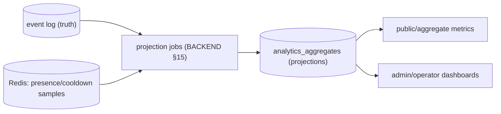
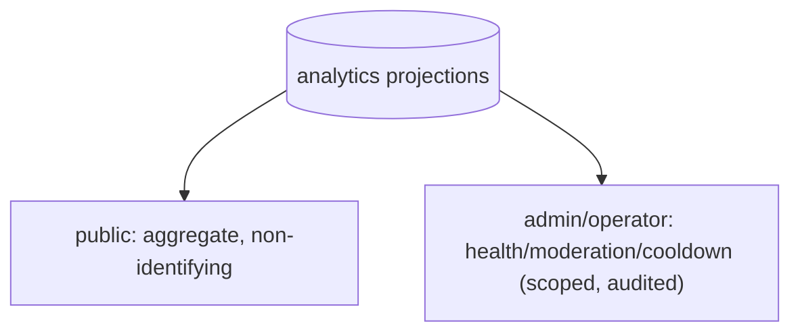

# Quad — Analytics

> **Derived-feature doc.** Analytics are **derived projections, never authoritative**; this doc does not redefine event semantics, storage, or contracts. Conforms to [`EVENT_SOURCING.md`](EVENT_SOURCING.md), [`DATABASE.md`](DATABASE.md), [`BACKEND.md`](BACKEND.md), [`COOLDOWN.md`](COOLDOWN.md), [`MODERATION.md`](MODERATION.md), [`SYSTEM_CONTEXT.md`](SYSTEM_CONTEXT.md), [`MULTI_TENANCY.md`](MULTI_TENANCY.md), [`PRODUCT.md`](PRODUCT.md), [`PRINCIPLES.md`](PRINCIPLES.md). Contradictions flagged in §10.
>
> No app code/schemas/versions. Tenant-neutral (Rutgers Quad = tenant #1).

## 1. Purpose & Scope
Analytics turn the event log + projections into metrics for product insight, archive stats, and operational health (`P-FEAT-7`). **In scope:** metric catalog, derivation pipeline, public-vs-admin scope, freshness, rebuild. **Out of scope:** event semantics (`EVENT_SOURCING.md`), storage (`DATABASE.md`), leaderboard ranking (`LEADERBOARDS.md`), heatmap visualization (`HEATMAPS.md`).

## 2. Responsibilities vs. Non-Responsibilities
| Analytics own | Analytics don't own |
| --- | --- |
| Metric definitions + projection pipeline | The event log/source of truth (`EVENT_SOURCING.md`) |
| Public vs admin/operator scoping | Leaderboard ranking math (`LEADERBOARDS.md`) |
| Freshness/rebuild expectations | Heatmap derivation (`HEATMAPS.md`) |

## 3. Dependency References
`EVENT_SOURCING.md` (source events), `DATABASE.md` (§7 `analytics_aggregates`, §10 projections), `BACKEND.md` (§15 projection jobs), `COOLDOWN.md` (cooldown samples), `MODERATION.md` (rollback/audit counts), `MULTI_TENANCY.md` (scope), `SYSTEM_CONTEXT.md` (`DC*`).

## 4. Metrics Derived from Log/Projections
| Category | Examples |
| --- | --- |
| **Placement volume** | placements/min/hour/day, per term |
| **Active users** | approximate concurrent (presence), unique participants/term |
| **Contested pixels** | cells with most placements/changes |
| **Rollback/moderation counts** | compensations, removals, reports, resolution time |
| **Cooldown samples** | global cooldown value over time + load score |
| **Replay/archive stats** | term totals, final coverage, color usage |
| **Tenant/canvas health** | error rates, projection lag, latency (operational) |

## 5. Source-of-Truth Rule
Analytics are **derived, never authoritative** (`ANALYTICS-INV-1`). The event log is the only truth; every metric is reproducible by replay. Disagreement ⇒ rebuild analytics from the log.

## 6. Projection Pipeline

Incremental where cheap; job-recomputed for heavy aggregates; eventually consistent (§8).

## 7. Privacy
**Aggregate-only by default; no `DC3`** ever (`ANALYTICS-INV-3`). User-scoped metrics exist only as **profile-owned** stats under profile privacy (`PROFILES.md`) — never exposing another user's identity beyond `DC2`. Operational telemetry (`DC5`) stays scrubbed of `DC3` (`BE-INV-10`).

## 8. Public vs Admin/Operator Analytics · Freshness · Rebuild
- **Public/aggregate:** participation totals, color usage, contested areas (non-identifying).
- **Admin/operator:** health, moderation, abuse, cooldown internals (tenant-scoped; operator cross-tenant audited).
- **Freshness:** eventually consistent; "today" metrics refresh promptly; cadence → `PERFORMANCE.md`.
- **Rebuild/backfill:** any analytic is rebuildable from the log (`ANALYTICS-INV-2`); new metrics backfill what the log supports (gaps documented, `EVENT_SOURCING.md` §17).

## 9. Failure Modes · Testing
- **Failure:** projection lag (serve last good + flag), inconsistent stats (rebuild), rebuild mismatch (log is truth; investigate).
- **Testing:** derivation correctness, rebuild determinism vs incremental, aggregate-only/no-`DC3`, tenant isolation, public-vs-admin scoping.

## 10. Decisions Deferred
| Decision | Owner |
| --- | --- |
| Exact metric formulas + windows | impl / product |
| Refresh cadence + cache TTLs | `PERFORMANCE.md` |
| Analytics retention | `DATABASE.md`/`OPERATIONS.md` |
| OLAP/warehouse vs in-DB projections | impl / `DEPLOYMENT.md` |

## 11. Analytics Invariants (`ANALYTICS-INV-*`)
- **`ANALYTICS-INV-1`** Analytics are derived, never authoritative; the event log is the only source of truth.
- **`ANALYTICS-INV-2`** Every metric is rebuildable from the log; rebuild matches incremental within tolerance.
- **`ANALYTICS-INV-3`** Public analytics are aggregate and contain no `DC3`; user-level metrics are profile-owned only.
- **`ANALYTICS-INV-4`** Analytics are tenant-scoped; cross-tenant only via audited operator access.

## 12. Diagrams
### 12.1 Pipeline — §6.
### 12.2 Public vs admin access

## 13. Document Control
- **Path:** `docs/ANALYTICS.md` · **Purpose:** derived metrics/projection definitions.
- **Dependencies:** `EVENT_SOURCING`, `DATABASE`, `BACKEND`, `COOLDOWN`, `MODERATION`, `MULTI_TENANCY`, `SYSTEM_CONTEXT`. **Consumed by:** `LEADERBOARDS`, `HEATMAPS`, `PROFILES`, `ARCHIVES`, `OBSERVABILITY`, `specs/*`.
- **Acceptance:** ☑ metric catalog ☑ derived-not-authoritative ☑ pipeline ☑ aggregate-only/no-`DC3` ☑ public-vs-admin ☑ rebuild ☑ `ANALYTICS-INV-*` ☑ tenant-neutral ☑ no code/versions.
- **Open questions:** §10. **Next:** `docs/LEADERBOARDS.md`.
