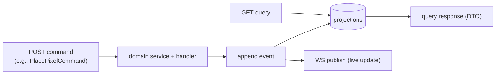
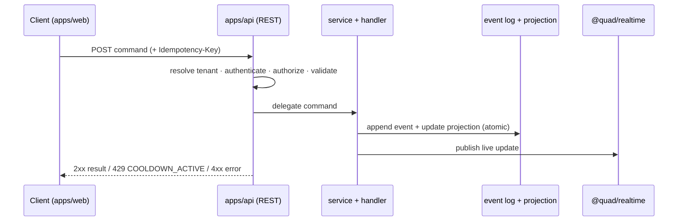
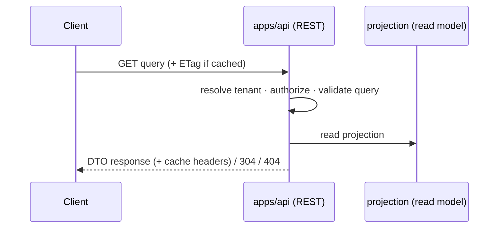

# Quad — REST API Contract

> **This document owns the REST surface: design principles, transport conventions, the resource model, the complete endpoint catalog, the standard error model, idempotency, caching, and the API↔event-sourcing/WebSocket relationships.** It conforms to [`PRODUCT.md`](PRODUCT.md), [`PRINCIPLES.md`](PRINCIPLES.md), [`ARCHITECTURE.md`](ARCHITECTURE.md), [`SYSTEM_CONTEXT.md`](SYSTEM_CONTEXT.md), [`BACKEND.md`](BACKEND.md), [`DATABASE.md`](DATABASE.md), and [`EVENT_SOURCING.md`](EVENT_SOURCING.md); IDs cited (`P-*`, `PRIN-*`, `ARCH-INV-*`, `BE-INV-*`, `ES-INV-*`, `DC*`, `B*`).
>
> **Altitude:** the contract — **paths, methods, auth/tenant scope, DTO *names*, and error conventions.** Concrete **DTO declarations live in `@quad/core`** at implementation. **No** route/source files, **no** WebSocket payloads/lifecycle (`WEBSOCKETS.md`), **no** DB tables/Prisma (`DATABASE.md`), **no** event semantics (`EVENT_SOURCING.md`), **no** versions (`TECH_BASELINE.md`), **no** app code.
>
> **Naming:** platform = **Quad**; **Rutgers Quad** = tenant #1 (example data only). No tenant literal in paths/DTOs (`PRIN-CONFIG-OVER-CODE`).

---

## 1. Purpose & Scope

The REST API is the **command-and-query boundary** between clients and the authoritative backend. Per `ARCHITECTURE.md`/`BACKEND.md`, **REST accepts commands and serves snapshots/history/queries; live updates flow over WebSockets** (`WEBSOCKETS.md`), not polling.

**In scope:** API design principles, transport conventions, auth/tenant expectations at the boundary, response/error model, idempotency, the resource model + **complete endpoint catalog**, per-group endpoint specs (architecture level), DTO naming, caching, rate limiting, moderation/admin safety, security/performance/testing, invariants.

**Out of scope (owned elsewhere):** WS contracts (`WEBSOCKETS.md`), auth mechanics (`AUTHENTICATION.md`), tenant resolution (`MULTI_TENANCY.md`), cooldown algorithm (`COOLDOWN.md`), moderation permission ladder/tools (`MODERATION.md`), DB tables (`DATABASE.md`), event semantics (`EVENT_SOURCING.md`), concrete DTO/types (`@quad/core`).

---

## 2. Responsibilities vs. Non-Responsibilities

| The REST API **owns** | It does **not** own |
| --- | --- |
| Paths, methods, resource model, status/error conventions | Concrete DTO type declarations (those live in `@quad/core`) |
| Which command/query each endpoint maps to | Live update distribution (WebSockets) |
| Auth/tenant scope **expectations** per endpoint | Auth *mechanics* (`AUTHENTICATION.md`) / tenant *resolution* (`MULTI_TENANCY.md`) |
| Idempotency + caching + error contract | Cooldown *computation* (`COOLDOWN.md`); event *semantics* (`EVENT_SOURCING.md`) |
| Output privacy (`DC2` only) at the contract level | Moderation *tools/roles* internals (`MODERATION.md`) |

---

## 3. API Design Principles

- **`API-DP-1` Tenant-scoped by default.** Every endpoint operates within the **resolved tenant** (`B4`); the active tenant comes from request context (host/subdomain — `MULTI_TENANCY.md`), not from a path id. Cross-tenant access exists **only** on explicit platform-operator endpoints (`B5`).
- **`API-DP-2` Typed by `@quad/core`.** Every request/response uses a DTO declared once in `@quad/core` — the same contract the client imports (`ARCH-INV-6`). No untyped payloads.
- **`API-DP-3` No duplicated DTOs.** A shape is defined once; there is no parallel/divergent definition in `apps/api` or `apps/web`.
- **`API-DP-4` No undocumented endpoints.** Every endpoint appears in the catalog (§12); a contract change updates this doc in the **same PR** (`ARCH`/`ENGINEERING_WORKFLOW` governance).
- **`API-DP-5` No business logic in route handlers.** Routes validate + delegate to domain services (`BE`/`FE` parity; `API-INV-4`).
- **`API-DP-6` Commands vs queries.** Commands append events; queries read projections; **no route mutates a projection directly** (`§15`, `ES-INV`).

---

## 4. Transport Conventions

- **HTTPS only**; JSON request/response bodies (binary snapshot is a documented exception, §13).
- **Versioned base path:** `/api/v1/...` (health/readiness are unversioned, §13).
- **Idempotency:** state-changing commands require an **`Idempotency-Key`** header (`§9`).
- **Pagination:** cursor-based for large/append-heavy collections (history, leaderboards), via `?cursor=&limit=`; responses carry a `page` meta with `nextCursor`.
- **Filtering/sorting:** explicit, allow-listed query params per endpoint (e.g., leaderboard `?category=&window=`); never arbitrary client-controlled SQL-like filters.
- **Timestamps:** ISO-8601 UTC in responses (display only; ordering authority is the event sequence, `ES-INV-4`).
- **Correlation:** clients may send `X-Request-Id`; the server generates one if absent and echoes it in responses/errors and logs (no `DC3` in logs, `BE-INV-10`).

---

## 5. Authentication & Authorization at the API Boundary

- Every request runs the boundary pipeline (`BACKEND.md` §5): **resolve tenant → authenticate → authorize → validate**. The API **expects** an authenticated, tenant-scoped identity for protected endpoints; the **mechanism** (session/token, CSRF, WS-handshake crossing) is owned by `AUTHENTICATION.md` + `ADR-0006`.
- **Auth levels** used in the catalog: `public` (`B1`), `participant` (`B2`), `moderator` (`B3`), `admin` (tenant admin, `B3`), `operator` (platform, `B5`).
- **Authorization is server-side and authoritative** regardless of client UI gating (`BE-INV-6`, `FE-INV-10`). No write endpoint is reachable unauthenticated (`PRIN-NO-ANON`).

---

## 6. Tenant Resolution at the API Boundary

- The tenant is **resolved at the edge** and attached to request context; all downstream queries/commands are tenant-scoped (`BE-INV-5`, `API-INV-1`).
- **Paths do not embed a tenant id for the active tenant** (it's contextual) — keeping the API tenant-neutral. Operator endpoints that span tenants take an explicit tenant identifier in the path/body.
- **Cross-tenant access returns `404 NOT_FOUND`** (not 403) to avoid leaking the existence of another tenant's resources (`API-INV-11`, `CTX-INV-2`). Resolution mechanics → `MULTI_TENANCY.md`.

---

## 7. Response Conventions

- **Single resource:** the resource DTO is returned directly (e.g., `PixelResponse`).
- **Collections:** `{ "data": [ ...DTO ], "page": { "nextCursor": string|null, "limit": number } }`.
- **Commands:** return the command result DTO (e.g., `PlacePixelResultResponse`) on success, with the appropriate `2xx`.
- **No leaking of internal/persistence shapes** — responses are `@quad/core` DTOs, never raw rows.
- Successful reads include cache headers where applicable (§17).

---

## 8. Standard Error Model

All errors share one envelope: `{ "error": { "code": string, "message": string, "details"?: object, "requestId": string } }` (declared as `ErrorResponse` in `@quad/core`). `message` is human-safe; **never** contains internals, stack traces, or `DC3` (`API-INV-8`).

| Condition | HTTP | `code` | Notes |
| --- | --- | --- | --- |
| Validation failure | 422 | `VALIDATION_ERROR` | `details` lists field issues |
| Unauthenticated | 401 | `UNAUTHENTICATED` | no/invalid session |
| Forbidden (role/scope) | 403 | `FORBIDDEN` | authenticated but not allowed |
| Not found | 404 | `NOT_FOUND` | also used for cross-tenant (no existence leak) |
| Conflict | 409 | `CONFLICT` | e.g., idempotency replay mismatch, state conflict |
| **Cooldown active** | 429 | `COOLDOWN_ACTIVE` | includes `Retry-After` + remaining ms in `details` (`P-COOL-5/7`) |
| Rate limited | 429 | `RATE_LIMITED` | distinct from cooldown; abuse/edge throttle |
| Tenant mismatch | 404 | `TENANT_MISMATCH` | surfaced as not-found to the client (`API-INV-11`) |
| Internal error | 500 | `INTERNAL` | opaque to client; correlate via `requestId` |

> **Cooldown vs. rate-limit:** both are `429` but **distinct codes**. `COOLDOWN_ACTIVE` is the fairness throttle (expected, per-placement); `RATE_LIMITED` is abuse protection.

---

## 9. Idempotency Contract for Commands

- **All state-changing commands require an `Idempotency-Key`** header (client-generated per intent).
- The server enforces duplicate-safety (`ES-INV-6`, `DB-INV-8`): a retry/double-tap with the **same key** returns the **original result** without appending a second event or charging cooldown twice.
- A **different body under the same key** is a `409 CONFLICT` (key reuse misuse).
- Keys are **tenant-scoped**. This is the API-level face of the event-sourcing idempotency model (`EVENT_SOURCING.md` §12).

---

## 10. Data Privacy Rules

- **Public/participant responses expose only `DC2`** (public handle/display name) for attribution; **never `DC3`** (full email/internal ids) (`API-INV-7`, `DB-INV-7`, `CTX-INV-3`).
- **`me`-style endpoints** may return the caller's own non-public profile fields, but still not raw sensitive identifiers beyond what the caller owns.
- **Moderator/admin/operator responses are explicitly scoped:** any expanded identity context is available only to authorized roles, tenant-scoped, and governed by `MODERATION.md`/`AUTHENTICATION.md` — never via public/participant endpoints.
- Output filtering happens at the DTO boundary so a projection that *contains* sensitive fields can never serialize them to an unauthorized caller.

---

## 11. Resource Model Overview

| Resource group | Purpose |
| --- | --- |
| **Tenant / meta** | Public tenant identity, branding, palette, feature flags |
| **Auth / session** | Reflect current session/identity (mechanics → `AUTHENTICATION.md`) |
| **Current canvas** | Live canvas metadata + snapshot for initial paint |
| **Pixels** | Placement command; hover/quick-look; per-pixel history |
| **Profiles** | Per-user stats + contribution heatmap |
| **Leaderboards** | Ranked activity by category/window |
| **Archives** | Past terms: metadata + artifact pointers |
| **Replay** | Replay metadata/pointers (assets in object storage; derivation in `EVENT_SOURCING`) |
| **Reports** | Submit/track reports |
| **Moderation** | Reports queue + reversible, audited actions (role-scoped) |
| **Admin** | Tenant config, canvas lifecycle, roster (admin/operator) |
| **Analytics / stats** | Aggregate metrics/heatmaps |
| **Health / readiness** | Liveness/readiness probes |

---

## 12. Complete Endpoint Catalog

Active-tenant endpoints are implicitly tenant-scoped (`API-DP-1`). DTO names are illustrative `@quad/core` names. `Auth` per §5.

| Method | Path | Auth | Tenant scope | Request DTO | Response DTO | Main errors | Owner doc |
| --- | --- | --- | --- | --- | --- | --- | --- |
| GET | `/api/v1/tenant` | public | resolved | — | `TenantMetaResponse` | 404 | `MULTI_TENANCY` |
| GET | `/api/v1/tenant/palette` | public | resolved | — | `PaletteResponse` | 404 | `MULTI_TENANCY` |
| GET | `/api/v1/session` | public | resolved | — | `SessionResponse` | — | `AUTHENTICATION` |
| POST | `/api/v1/auth/verify/request` | public | resolved | `RequestVerificationCommand` | `VerificationStartedResponse` | 422,429 | `AUTHENTICATION` |
| POST | `/api/v1/auth/verify/confirm` | public | resolved | `ConfirmVerificationCommand` | `SessionResponse` | 422,409 | `AUTHENTICATION` |
| POST | `/api/v1/auth/signout` | participant | resolved | — | `SignOutResponse` | 401 | `AUTHENTICATION` |
| GET | `/api/v1/canvas/current` | public¹ | resolved | — | `CanvasMetaResponse` | 404 | `EVENT_SOURCING`/`DATABASE` |
| GET | `/api/v1/canvas/current/snapshot` | public¹ | resolved | — | `CanvasSnapshotResponse`² | 404 | `RENDERING`/`DATABASE` |
| POST | `/api/v1/canvas/current/pixels` | participant | resolved | `PlacePixelCommand` | `PlacePixelResultResponse` | 401,403,422,**429 COOLDOWN_ACTIVE**,409 | `EVENT_SOURCING`/`COOLDOWN` |
| GET | `/api/v1/canvas/current/pixels/{x}/{y}` | public¹ | resolved | — | `PixelResponse` (DC2) | 404 | `EVENT_SOURCING` |
| GET | `/api/v1/canvas/current/pixels/{x}/{y}/history` | public¹ | resolved | — | `PixelHistoryListResponse` (DC2) | 404 | `EVENT_SOURCING` |
| GET | `/api/v1/profiles/me` | participant | resolved | — | `MyProfileResponse` | 401 | `PROFILES` |
| GET | `/api/v1/profiles/{handle}` | public¹ | resolved | — | `ProfileResponse` (DC2) | 404 | `PROFILES` |
| GET | `/api/v1/leaderboards` | public¹ | resolved | `ListLeaderboardQuery` | `LeaderboardResponse` (DC2) | 422 | `LEADERBOARDS` |
| GET | `/api/v1/archives` | public¹ | resolved | `ListArchivesQuery` | `ArchiveListResponse` | — | `ARCHIVES` |
| GET | `/api/v1/archives/{term}` | public¹ | resolved | — | `ArchiveResponse` | 404 | `ARCHIVES` |
| GET | `/api/v1/archives/{term}/replay` | public¹ | resolved | — | `ReplayMetaResponse` | 404 | `REPLAY` |
| POST | `/api/v1/reports` | participant | resolved | `SubmitReportCommand` | `ReportResponse` | 401,422,429 | `MODERATION` |
| GET | `/api/v1/moderation/reports` | moderator | resolved | `ListReportsQuery` | `ReportQueueResponse` | 401,403 | `MODERATION` |
| POST | `/api/v1/moderation/actions` | moderator | resolved | `ModerationActionCommand` | `ModerationActionResponse` | 401,403,422,409 | `MODERATION` |
| GET | `/api/v1/admin/tenant/config` | admin | resolved | — | `TenantConfigResponse` | 401,403 | `MULTI_TENANCY` |
| PUT | `/api/v1/admin/tenant/config` | admin | resolved | `UpdateTenantConfigCommand` | `TenantConfigResponse` | 401,403,422 | `MULTI_TENANCY` |
| POST | `/api/v1/admin/canvas/lifecycle` | admin | resolved | `CanvasLifecycleCommand`³ | `CanvasMetaResponse` | 401,403,409 | `ARCHIVES`/`EVENT_SOURCING` |
| GET | `/api/v1/admin/roster` | admin | resolved | `ListRosterQuery` | `RosterResponse` | 401,403 | `MODERATION`/`AUTHENTICATION` |
| POST | `/api/v1/admin/roster/roles` | admin | resolved | `AssignRoleCommand` | `RoleAssignmentResponse` | 401,403,422 | `AUTHENTICATION` |
| GET | `/api/v1/analytics/canvas` | participant¹ | resolved | `AnalyticsQuery` | `AnalyticsResponse` | 422 | `ANALYTICS`/`HEATMAPS` |
| POST | `/api/v1/platform/tenants` | operator | cross-tenant | `OnboardTenantCommand` | `TenantMetaResponse` | 401,403,422 | `MULTI_TENANCY` |
| GET | `/api/v1/platform/tenants` | operator | cross-tenant | `ListTenantsQuery` | `TenantListResponse` | 401,403 | `MULTI_TENANCY` |
| GET | `/healthz` | public | none | — | `HealthResponse` | — | `OBSERVABILITY` |
| GET | `/readyz` | public | none | — | `ReadinessResponse` | 503 | `OBSERVABILITY` |

¹ *Public vs participant on read endpoints depends on the read-only-viewing decision `P-Q-2` (`MULTI_TENANCY.md`); if read-only is disabled, these require `participant`.*
² *Snapshot may use an efficient/binary encoding for the initial paint (shape owned by `RENDERING.md`); it is the documented non-JSON exception.*
³ *`CanvasLifecycleCommand` covers create/activate/freeze/archive transitions, each producing the corresponding lifecycle event (`EVENT_SOURCING.md` §7); destructive deletion is not offered.*

---

## 13. Endpoint Specs by Group (Architecture Level)

- **Tenant / meta** — public reads of tenant identity, palette, and feature flags from `@quad/config`; cacheable (short TTL/ETag).
- **Session / auth state** — `GET /session` reflects the current identity (or anonymous); `auth/verify/*` and `signout` are thin entry points whose mechanics live in `AUTHENTICATION.md` (no passwords, `NG-ANON`).
- **Canvas snapshot/metadata** — `GET /canvas/current` returns term/state/dimensions/palette ref; `GET /canvas/current/snapshot` returns the current projection for initial paint (then the client subscribes via WS for deltas, `§16`).
- **Placement command** — `POST /canvas/current/pixels` accepts `PlacePixelCommand` (x, y, color) + `Idempotency-Key`; the server validates, checks cooldown, appends `PixelPlaced`, updates the projection, and publishes via WS; returns `PlacePixelResultResponse` or `429 COOLDOWN_ACTIVE` (`§8/§9`).
- **Pixel history** — `GET .../pixels/{x}/{y}` (current cell + `DC2` attribution) and `.../history` (ordered per-pixel events as `DC2`), paginated.
- **Profiles** — `me` (own stats) and `{handle}` (public stats + heatmap, `DC2`, honoring privacy `P-PROF-4`).
- **Leaderboards** — ranked queries by `category` + `window` (allow-listed), `DC2`, paginated.
- **Archives** — list + per-term metadata with artifact pointers (immutable; strongly cacheable).
- **Replay metadata** — `ReplayMetaResponse` pointers; **assets** live in object storage and **derivation** in `EVENT_SOURCING.md`/`REPLAY.md` (sanitized default, §15 there).
- **Reports** — participants submit reports (rate-limited); status visible to the reporter as appropriate.
- **Moderation** — reports queue + `ModerationActionCommand`; role+tenant scoped; **every action writes audit; no hard delete** (`§19`).
- **Admin** — tenant config (config-driven, no code change), canvas lifecycle transitions, roster/role management; admin-scoped.
- **Analytics** — aggregate/heatmap reads (`ANALYTICS`/`HEATMAPS`).
- **Health/readiness** — unversioned, tenant-less probes for orchestration/observability.

---

## 14. DTO Naming Conventions

DTOs are declared in `@quad/core` (`API-INV-2`):

- **Query DTOs** (GET inputs): `List<Resource>Query`, `<Resource>Query`.
- **Command DTOs** (state-changing inputs): `<Verb><Resource>Command` (e.g., `PlacePixelCommand`, `SubmitReportCommand`, `ModerationActionCommand`).
- **Response DTOs:** `<Resource>Response`, `<Resource>ListResponse`, `<Verb><Resource>ResultResponse`.
- **Error DTO:** `ErrorResponse` (single shape, §8).
- Names are **stable + canonical** (deprecate, don't rename); no tenant-specific DTO names.

---

## 15. API Relationship to Event Sourcing

- **Commands append events** — `POST` command endpoints produce domain events via the backend (`EVENT_SOURCING.md`); they never write projections directly.
- **Queries read projections** — `GET` endpoints read derived read models (current canvas, history, stats, leaderboards, analytics).
- **No route mutates a projection directly** (`API-INV-5`); projections change only as a consequence of appended events.

---

## 16. API Relationship to WebSockets

- **REST accepts commands and serves snapshots/history/queries; WebSockets distribute live updates** (`WEBSOCKETS.md`).
- **No polling** for live canvas state (`PRIN-ALIVE`, `API-INV-12`): a client fetches the snapshot once (`GET /canvas/current/snapshot`), then receives deltas over WS; on reconnect it re-fetches the snapshot and resubscribes (`EVENT_SOURCING`/`ARCHITECTURE` §11).
- The placement command's *result* returns over REST; its *broadcast* to all clients goes over WS.

---

## 17. Caching Rules

| Cacheable | Not cacheable |
| --- | --- |
| Archives + per-term metadata (immutable) → long TTL + `ETag` | Placement command responses |
| Replay metadata for archived terms (immutable) | `GET /session` + any auth-bearing/private response |
| Tenant meta/palette → short TTL + `ETag` | Moderation/admin/operator responses |
| Leaderboards/analytics → short TTL (eventually consistent) | Current snapshot beyond a very short window (rely on WS for liveness) |

- **`ETag`/conditional requests** for history/archives/profiles; **`Cache-Control: private`** for participant-specific reads; **`no-store`** for commands and sensitive responses.
- **Never shared-cache** responses that could contain participant-private data; never cache anything that could expose `DC3` (none should).

---

## 18. Rate Limiting & Abuse Posture (API Level)

- **Edge rate limiting** per identity and per IP on all endpoints, stricter on write/auth endpoints (`B1`); `429 RATE_LIMITED` on breach.
- **Cooldown is separate** from rate limiting — it's the fairness throttle on placement (`429 COOLDOWN_ACTIVE`), not an abuse control.
- **Abuse hooks** (bot signals, suspicious patterns) sit at the boundary; specifics + thresholds are owned by `SECURITY.md` (`P-ABUSE-*`).

---

## 19. Moderation / Admin API Safety Rules

- **Role-scoped + tenant-scoped** — moderation/admin endpoints require the appropriate role within the resolved tenant (`B3`); operator endpoints are the only cross-tenant ones (`B5`).
- **Audit required** — every moderation/admin state change writes an audit entry atomically with its effect (`API-INV-10`, `DB-INV-6`, `BE-INV-8`).
- **No hard delete** — "removal/rollback" produces compensating events; history is preserved (`PRIN-NO-INVISIBLE-LOSS`).
- **No fairness bypass** — admin/moderation power never shortens cooldown or grants placement advantage (`P-COOL-6`, `NG-UNEQUAL-POWER`).

---

## 20. API Security Considerations

- **Auth/CSRF** mechanics delegated to `AUTHENTICATION.md`; the API **expects** authenticated, authorized, tenant-scoped calls and enforces authorization server-side (`BE-INV-6`).
- **Input validation** — every request validated against its `@quad/core` schema; reject malformed input (`422`).
- **Output filtering** — responses serialize only the DTO's allowed fields; `DC3` is structurally unreachable on public/participant endpoints (`§10`).
- **Tenant isolation** — enforced on every endpoint; cross-tenant attempts return `404` (`§6`).
- **Sensitive-data handling** — no `DC3` in URLs, query params, logs, or errors; `Idempotency-Key`/correlation ids are non-sensitive. Threat model → `SECURITY.md`.

---

## 21. API Performance Considerations

- **Hot placement path** (`POST .../pixels`) is the latency-critical write — minimal work before the append transaction; cooldown check is a fast Redis read.
- **Snapshot size** — `GET .../snapshot` may be large; an efficient/binary encoding + compression is expected (shape → `RENDERING.md`), and the client relies on WS deltas afterward rather than re-fetching.
- **Pixel history query shape** — paginated, index-backed per `(canvas, x, y, sequence)` (`DATABASE.md` §13).
- **Profiles/leaderboards** — paginated, served from projections; eventually-consistent freshness is acceptable.
- Concrete budgets owned by `PERFORMANCE.md`.

---

## 22. Testing Expectations

API test layers (against real api + Postgres/Redis; strategy → `TESTING.md`):

- **Contract tests** — requests/responses conform to `@quad/core` DTOs; the catalog (§12) matches reality (no undocumented endpoints).
- **Route behavior tests** — happy paths + the full error model (§8).
- **Authorization tests** — each auth level enforced; UI-gated actions still rejected server-side.
- **Tenant isolation tests** — cross-tenant access returns `404`; no data leak (`P-AC-13`).
- **Idempotency tests** — duplicate `Idempotency-Key` returns the original result; no double event/cooldown.
- **Cooldown-active tests** — placement during cooldown returns `429 COOLDOWN_ACTIVE` with retry info.
- **Moderation audit tests** — moderation/admin actions write audit + are reversible (no hard delete).
- **Privacy tests** — public/participant responses never include `DC3`.

---

## 23. API Invariants (`API-INV-*`)

- **`API-INV-1`** Every endpoint is tenant-scoped by default; cross-tenant only via operator endpoints.
- **`API-INV-2`** All request/response DTOs are declared in `@quad/core`; no duplicated/untyped payloads.
- **`API-INV-3`** No undocumented endpoints — every endpoint is in the catalog; contract changes update this doc in the same PR.
- **`API-INV-4`** No business logic in route handlers; routes validate + delegate.
- **`API-INV-5`** Commands append events; queries read projections; no route mutates a projection directly.
- **`API-INV-6`** State-changing commands require an `Idempotency-Key` and are duplicate-safe.
- **`API-INV-7`** Public/participant responses expose only `DC2`; never `DC3`.
- **`API-INV-8`** Errors use the standard typed model; internals/`DC3` never leak.
- **`API-INV-9`** Cooldown is enforced server-side; placement returns `429 COOLDOWN_ACTIVE` when active.
- **`API-INV-10`** Moderation/admin endpoints are role+tenant scoped, write audit, and never hard-delete.
- **`API-INV-11`** Cross-tenant access returns `404` (no existence leak).
- **`API-INV-12`** Live canvas updates are via WebSocket, not polling; REST serves snapshots/commands/history.

---

## 24. Diagrams

### 24.1 REST command flow

### 24.2 Query / projection flow

### 24.3 API ↔ event sourcing
See §15 (commands→events→projections; queries←projections; events→WS).

---

## 25. Decisions Deferred to Deeper Docs

| Open decision | Owner |
| --- | --- |
| Concrete DTO field shapes/types | `@quad/core` (implementation) |
| WebSocket message contracts + lifecycle | `WEBSOCKETS.md` |
| Auth/session mechanics, CSRF, verify flow internals | `AUTHENTICATION.md`, `ADR-0006` |
| Tenant resolution mechanism (host/subdomain) | `MULTI_TENANCY.md` |
| Cooldown computation behind `COOLDOWN_ACTIVE` | `COOLDOWN.md` |
| Snapshot encoding (binary/efficient) | `RENDERING.md` |
| Moderation permission ladder + action taxonomy | `MODERATION.md` |
| Read-only viewing → public vs participant on read endpoints | `P-Q-2` → `MULTI_TENANCY.md` |
| Rate-limit thresholds + abuse heuristics | `SECURITY.md` |
| Analytics query taxonomy | `ANALYTICS.md`/`HEATMAPS.md` |

---

## 26. Document Control

- **Path:** `docs/API.md`
- **Purpose:** Define Quad's complete REST contract — paths, resource model, DTO names, error/idempotency/caching conventions — that `apps/api` implements and `apps/web` consumes, built on the events/projections of `EVENT_SOURCING.md`/`DATABASE.md`.
- **Dependencies:** `BACKEND.md`, `DATABASE.md`, `EVENT_SOURCING.md`, `ARCHITECTURE.md`, `SYSTEM_CONTEXT.md`, `PRODUCT.md`, `PRINCIPLES.md`. **Consumed by:** `WEBSOCKETS.md`, `AUTHENTICATION.md`, `MODERATION.md`, `PROFILES.md`, `LEADERBOARDS.md`, `ARCHIVES.md`, `REPLAY.md`, `ANALYTICS.md`, `FRONTEND.md` (client), `@quad/core` (DTOs), `specs/api`.
- **Acceptance checklist:** ☑ all 26 parts present ☑ contract altitude (paths/DTO names/errors; no route/source files or DTO declarations) ☑ design principles (tenant-scoped, `@quad/core`-typed, no dup DTOs, no undocumented endpoints, no logic in routes) ☑ transport conventions ☑ standard error model incl. `COOLDOWN_ACTIVE` vs `RATE_LIMITED` ☑ idempotency contract ☑ privacy (`DC2` only) ☑ complete endpoint catalog (method/path/auth/tenant/req/resp/errors/owner) ☑ per-group specs ☑ DTO naming ☑ API↔ES + API↔WS relationships (no polling) ☑ caching + rate limiting + moderation/admin safety ☑ `API-INV-1…12` ☑ 3 Mermaid diagrams ☑ versions referenced not declared ☑ tenant-neutral (Rutgers = example) ☑ no app code/package files.
- **Open questions:** see §25 (DTO shapes, WS contracts, auth mechanics, read-only public/participant, rate limits).
- **Next recommended:** `docs/WEBSOCKETS.md` (live message contracts + connection lifecycle that distribute the updates these commands produce).
