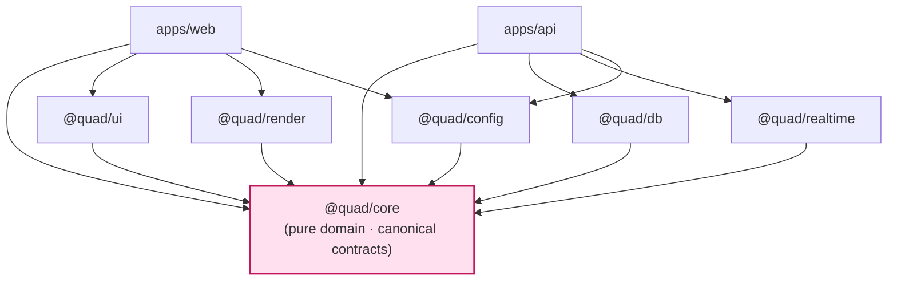
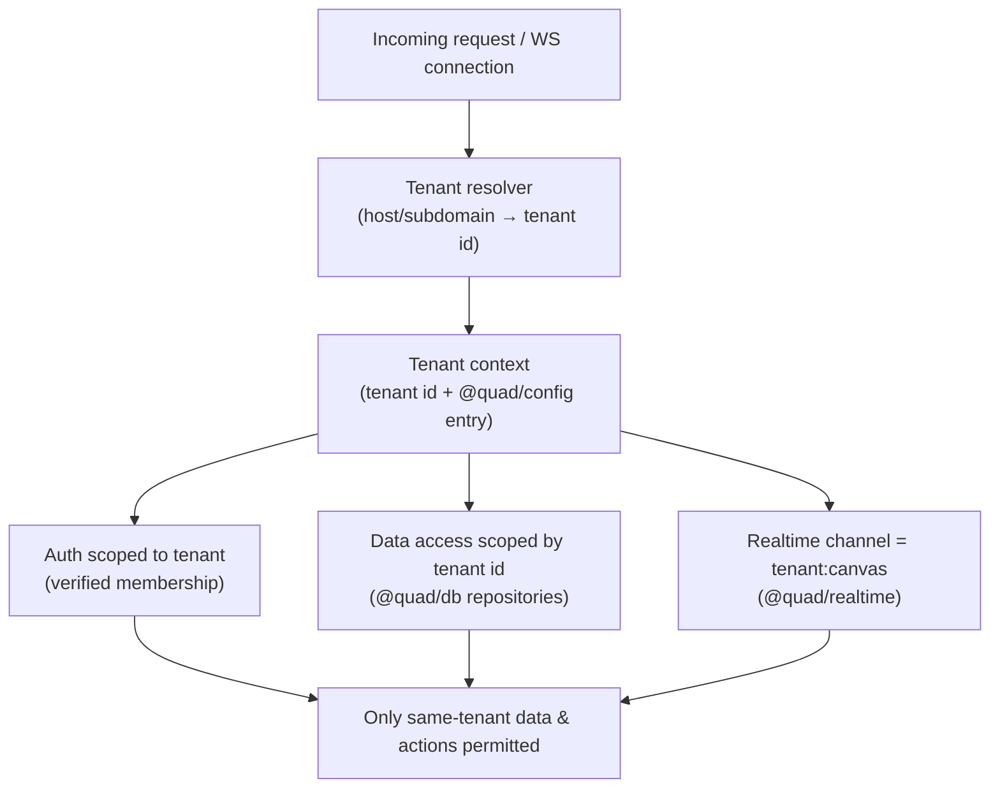
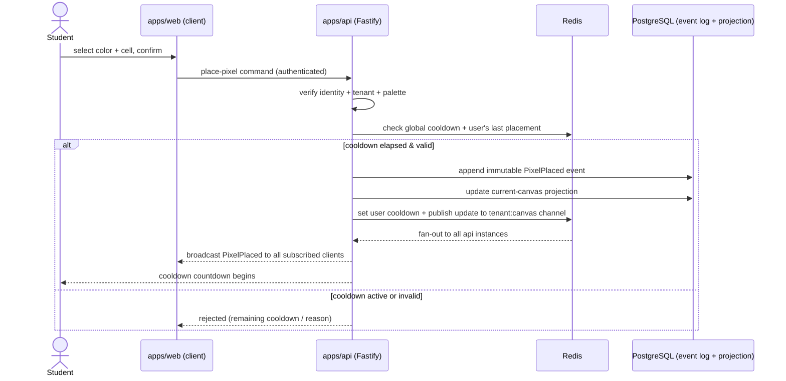
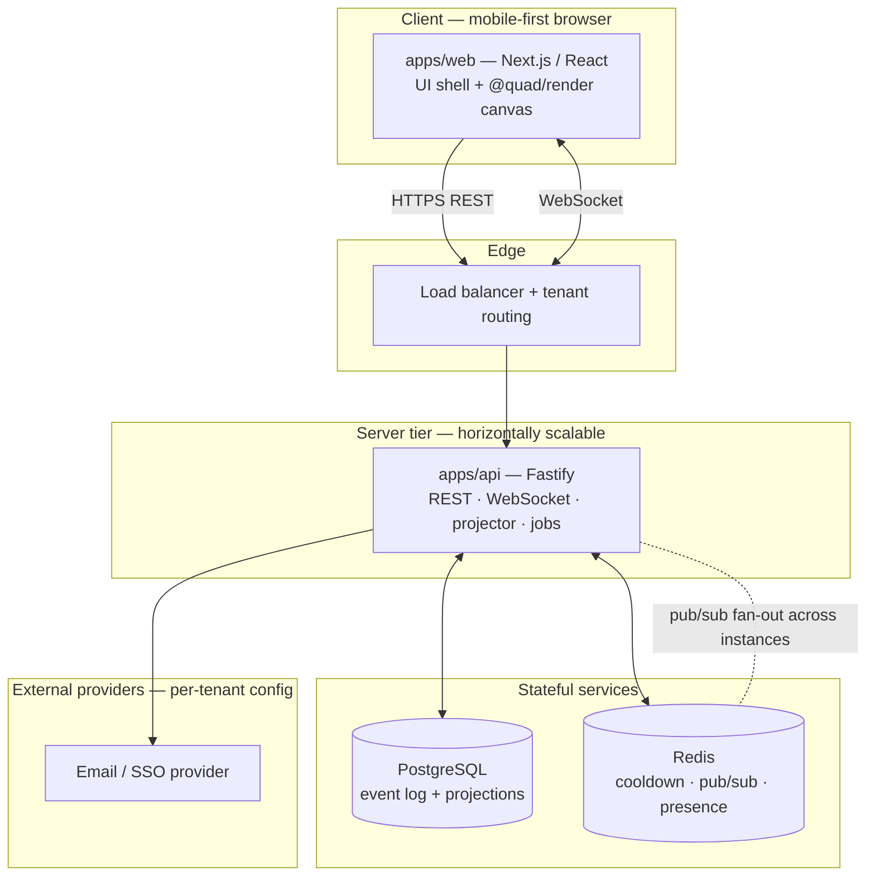

# Quad — System Architecture (Umbrella)

> **This is the umbrella architecture map.** It defines the *shape* of the system — the parts, their boundaries, how they fit, and the invariants they must uphold — and points to the deeper docs that own the details. It is intentionally high-level: **schemas, endpoints, WebSocket payloads, and algorithms do not live here.**
>
> **Conformance:** architecture *serves* product. This document conforms to [`PRODUCT.md`](PRODUCT.md), [`PRINCIPLES.md`](PRINCIPLES.md), [`NON_GOALS.md`](NON_GOALS.md), [`ROADMAP.md`](ROADMAP.md), and [`LAUNCH_PLAN.md`](LAUNCH_PLAN.md); it does not reinterpret them. Where a product requirement is cited it uses its stable ID (`P-*`, `PRIN-*`, `NG-*`).
>
> **Versions:** all technology versions/ecosystem assumptions live in [`docs/TECH_BASELINE.md`](TECH_BASELINE.md). This document names technologies as architectural choices but **declares no versions and contains no version matrix**.
>
> **Naming:** the platform is **Quad** (`@quad/*` packages); **Rutgers Quad** is tenant #1 / first deployment. No tenant is hardcoded in platform logic.
>
> **Detail ownership (deferred):** data model → [`DATABASE.md`](DATABASE.md) · events → [`EVENT_SOURCING.md`](EVENT_SOURCING.md) · REST → [`API.md`](API.md) · realtime payloads → [`WEBSOCKETS.md`](WEBSOCKETS.md) · auth → [`AUTHENTICATION.md`](AUTHENTICATION.md) · cooldown algorithm → [`COOLDOWN.md`](COOLDOWN.md) · rendering internals → [`RENDERING.md`](RENDERING.md) · moderation internals → [`MODERATION.md`](MODERATION.md) · tenancy → [`MULTI_TENANCY.md`](MULTI_TENANCY.md) · context → [`SYSTEM_CONTEXT.md`](SYSTEM_CONTEXT.md).

---

## 1. Architectural Goals

In priority order (fairness first, mirroring `PRINCIPLES.md`):

1. **`ARCH-GOAL-1` Enforce fairness in the system, not the UI.** Cooldown, identity, and placement validity are decided server-side and are impossible to bypass from the client (`PRIN-FAIRNESS`, `P-COOL-6`).
2. **`ARCH-GOAL-2` Permanence by construction.** An append-only event log is the source of truth; everything else is derived and rebuildable (`PRIN-PERMANENCE`, `P-VISION-3`).
3. **`ARCH-GOAL-3` Alive at scale.** Real-time propagation to thousands of concurrent clients per tenant within the performance budget (`PRIN-ALIVE`, `P-CANVAS-7`).
4. **`ARCH-GOAL-4` Tenant isolation by default.** Every data, auth, and realtime path is tenant-scoped; cross-tenant leakage is structurally hard (`PRIN-ISOLATION`, `P-AC-13`).
5. **`ARCH-GOAL-5` Multi-tenant by configuration.** Onboarding a university is config, not code (`PRIN-CONFIG-OVER-CODE`, `P-ADMIN-8`).
6. **`ARCH-GOAL-6` Clean, extensible, testable.** Clean Architecture + SOLID; the critical subsystems are automatable-testable end to end.
7. **`ARCH-GOAL-7` Premium performance on phones.** Rendering and transport designed mobile-first (`PRIN-MOBILE-FIRST`).

Non-goals (`NON_GOALS.md`) shape the architecture too: no chat/DM/social-graph transport, no payment rails, no marketplace/ownership primitives, no machine-generated art ingestion path. The system is deliberately *not* a social network.

---

## 2. Non-Negotiable Constraints Inherited From Principles

Each principle becomes a hard architectural constraint:

| Principle | Architectural constraint |
| --- | --- |
| `PRIN-FAIRNESS` / `PRIN-EQUAL-POWER` | Cooldown is **server-authoritative and global per tenant**; the client never holds trusted placement state. One placement = one validated command. |
| `PRIN-IDENTITY` / `PRIN-NO-ANON` | **No anonymous write path.** Every command is authenticated; every domain event carries an attributed actor. |
| `PRIN-PERMANENCE` / `PRIN-NO-INVISIBLE-LOSS` | **Append-only event log** as truth; projections are derived. Moderation produces **compensating events + audit entries**, never destructive deletes. |
| `PRIN-ISOLATION` | **Tenant id is a first-class dimension** of data access, auth, and realtime channels — not an afterthought filter. |
| `PRIN-CONFIG-OVER-CODE` | Tenant facts live in `@quad/config`; **no tenant literals in platform logic, UI strings, or branches.** |
| `PRIN-MOBILE-FIRST` / `PRIN-ALIVE` | Dedicated rendering engine + WebSocket transport meeting the `PERFORMANCE.md` budgets on mobile. |

These constraints are restated as testable **invariants** in §19.

---

## 3. Monorepo / Package Architecture

A **monorepo** (pnpm workspaces + Turborepo — see `TECH_BASELINE.md`) holding two deployable apps and a set of shared packages. Rationale and tradeoffs: `docs/adr/0002-repository-strategy.md`.

| Package | Type | Responsibility (what it owns) |
| --- | --- | --- |
| `apps/web` | App (Next.js) | Presentation: UI shell, canvas surface, profiles/leaderboards/replay views. **No business logic.** |
| `apps/api` | App (Fastify) | Command handling, domain orchestration, event append, projection maintenance, REST + WebSocket transport, background jobs/cron, projector. |
| `@quad/core` | Library (pure) | **Canonical contracts** + domain logic with no I/O (see §7). |
| `@quad/db` | Adapter | Persistence: schema, repositories, the event store + projection access. Owns Prisma; nobody else touches the DB directly. |
| `@quad/realtime` | Adapter | WebSocket server/client helpers + Redis pub/sub fan-out + presence. |
| `@quad/render` | Library | The high-performance canvas rendering engine (imperative, framework-agnostic core). |
| `@quad/config` | Library | Tenant registry, palette, env loading/validation — the home of all tenant-specific configuration. |
| `@quad/ui` | Library | Shared React components + design tokens. |
| `@quad/testing` | Library | Fixtures, factories, harnesses for unit/integration tests. |

**Boundary rule:** a package owns its concern exclusively. Only `@quad/db` performs database I/O; only `@quad/realtime` opens sockets/pub-sub; only `@quad/config` knows tenant facts. This makes responsibilities auditable and prevents drift.

---

## 4. Clean Architecture & Dependency Direction

Dependencies point **inward toward `@quad/core`**, which is pure (no I/O, no framework, no tenant literals). Adapters (`db`, `realtime`, `render`, `config`, `ui`) depend on `core`; apps depend on packages. **Nothing in `core` imports an adapter or an app.**

This is what makes the codebase resist entropy: business rules sit in `core` and are unit-testable in isolation; transports and storage are swappable adapters; the type system enforces the contracts (§7).

---

## 5. Runtime Architecture

At runtime there are four cooperating tiers; the server tier scales horizontally.

- **Web (`apps/web`)** — serves the UI (server-rendered shell + client canvas). It is a *client* of the api for both REST and WebSockets and holds **no authoritative state**.
- **API (`apps/api`)** — the authoritative core: validates and handles commands, appends events, maintains projections, serves REST, terminates WebSocket connections, runs the **projector** and scheduled jobs (e.g., cooldown recompute, term freeze/archive). Multiple identical instances run behind a load balancer.
- **PostgreSQL** — durable home of the **event log** (truth) and **projections** (read models).
- **Redis** — low-latency **cooldown** state, **pub/sub** fan-out across api instances, and **presence**/concurrency signals.

Because any api instance may hold a given client's WebSocket, **a placement handled by instance A must reach clients on instances B and C** — this is the job of Redis pub/sub (§11). The api is otherwise stateless, enabling horizontal scale (`ARCH-GOAL-3`).

---

## 6. Frontend / Backend / Data / Realtime Boundaries

Four boundaries, each with a one-line contract:

- **Frontend boundary** — *renders state and issues intents.* `apps/web` (+ `@quad/render`, `@quad/ui`) displays the canvas and sends commands; it never decides cooldown, validity, or attribution. Business logic in a React component is a violation (governance rule).
- **Backend boundary** — *owns truth and decisions.* `apps/api` (+ `@quad/core`) is the only place commands are validated and events are created. All authority lives here.
- **Data boundary** — *persists and reads via repositories.* Only `@quad/db` performs DB I/O; the rest of the system speaks domain types, not SQL/Prisma. Direct DB writes outside repositories/services are forbidden.
- **Realtime boundary** — *propagates derived facts.* `@quad/realtime` carries typed events from server to clients and fans out across instances via Redis; it transports facts, it does not author them.

Data flows: **commands** go client → api (decision); **events/updates** go api → clients (notification). The two directions never blur.

---

## 7. `@quad/core` — The Canonical Contract Owner

`@quad/core` is the **single source of truth for shared contracts**. It owns:

- **Domain types** (canvas, pixel, tenant, user, semester/term, moderation concepts).
- **DTOs** for REST request/response shapes.
- **WebSocket payload schemas** (the message contracts).
- **Domain event schemas** (e.g., the `PixelPlaced` family — names/fields canonical here).
- **Cooldown calculation types** (inputs/outputs of the cooldown computation; the *algorithm* is in `COOLDOWN.md`).
- **Tenant configuration types** (the shape `@quad/config` must satisfy).

Both `apps/web` and `apps/api` import these contracts, so the client and server **cannot diverge** on a payload or event shape — a divergence won't type-check. This is the primary structural defense against the "untyped/duplicated DTO" and "untyped WebSocket payload" failure modes. The *detailed* definitions are specified in the relevant child docs, but the **authoritative declarations live in `core`**, and child docs must match it (verified in `CONSISTENCY_AUDIT.md`).

> `@quad/core` contains **no I/O and no tenant literals.** It is pure, deterministic, and the most heavily unit-tested package.

---

## 8. Tenant-Neutral Architecture

Multi-tenancy is woven through the system, not bolted on:

1. **Resolution** — an incoming request or WebSocket connection is mapped to a tenant (e.g., by host/subdomain; mechanism owned by `MULTI_TENANCY.md`).
2. **Context** — a **tenant context** (tenant id + its `@quad/config` entry: branding, domains, palette, dimensions, term schedule, cooldown bounds, moderators) is established and propagated through the request lifecycle.
3. **Enforcement** — auth (membership), data access, and realtime channels are all **scoped by tenant id**.

**Rutgers Quad** is simply the first entry in the tenant registry. There are **no Rutgers branches** in platform logic (`PRIN-CONFIG-OVER-CODE`, verified by `P-AC-12`). Detailed routing/isolation strategy: `MULTI_TENANCY.md`.

---

## 9. Event-Sourced Architecture (High Level)

The write side is event-sourced (rationale: `docs/adr/0003-event-sourcing.md`):

- A user action becomes a **command** (e.g., "place pixel").
- The api **validates** the command (identity, tenant, palette, cooldown).
- On success it **appends an immutable domain event** (e.g., `PixelPlaced`) to the append-only log. Events are never mutated or deleted.
- **Everything derives from the log:** the current canvas, profiles, leaderboards, heatmaps, archives, and replays are all projections/derivations of events.

Moderation is also event-sourced: a rollback/removal is a **compensating event** plus an **audit entry**, preserving the full history (`PRIN-NO-INVISIBLE-LOSS`). The event catalog, schemas, ordering, and storage details belong to `EVENT_SOURCING.md` and `DATABASE.md`.

---

## 10. Current-Canvas Projection (High Level)

The live canvas is a **read model (projection)** derived from the event log:

- Maintained **incrementally** as events are appended, so reads are fast.
- **Rebuildable** at any time by replaying the log (the projection is a cache, never the truth).
- Served efficiently for initial load (a snapshot of current state) so a client can paint immediately, then stay current via realtime deltas.

This separation lets reads be fast and writes be permanent without coupling the two. Storage/format/snapshotting details: `DATABASE.md` + `EVENT_SOURCING.md`; client-side painting: `RENDERING.md`.

---

## 11. Realtime Update Architecture (High Level)

Key points: updates propagate via **Redis pub/sub** so every api instance can notify its connected clients (`ARCH-GOAL-3`). On reconnect, a client receives a **snapshot + subsequent deltas** to converge quickly; because pub/sub is best-effort, the snapshot-on-(re)connect path is what guarantees eventual consistency (`P-CANVAS-7`). Message contracts and the connection lifecycle: `WEBSOCKETS.md`.

---

## 12. Dynamic Cooldown Architecture (High Level)

- **Server-authoritative and global per tenant.** The api computes one cooldown value for the tenant from load signals; clients only display it (`PRIN-FAIRNESS`, `P-COOL-1`).
- **State in Redis.** Current global cooldown + per-user "next allowed" timestamps live in Redis for low-latency checks at placement time.
- **Bounded 5–20 minutes**, changing gradually (smoothed) — the **algorithm, inputs, and smoothing are owned by `COOLDOWN.md`**; this doc only fixes the architecture: where it's computed (api/jobs), where it's stored (Redis), and how it's distributed (WebSocket broadcast).
- **No personalization, no bypass** — there is no code path that shortens one user's cooldown (`P-COOL-6`, `NG-UNEQUAL-POWER`).

---

## 13. Authentication Boundary (High Level)

- Identity is established at an **authentication boundary** using Auth.js (verified university **email** for MVP; official campus **SSO/CAS** later — both tenant-configured). **No custom passwords** (`P-POST-1`, `NG-ANON`).
- Every REST request and **every WebSocket handshake** is authenticated and associated with a tenant-scoped identity before any write.
- A consequential open decision — whether auth is owned at the **web (Next.js)** layer or via **`@auth/core` inside Fastify**, and how the session/token is shared with the WebSocket handshake — is **deferred to `AUTHENTICATION.md` + `docs/adr/0006-authentication-strategy.md`** (flagged in `TECH_BASELINE.md`). This document only asserts the *boundary* exists and that no unauthenticated write is possible.

---

## 14. Moderation & Audit Architecture (High Level)

- Moderation actions are **commands** that produce **compensating domain events** (rollback a pixel/region/time-range, remove artwork) and a **mandatory audit-log entry** (actor, action, target, reason, time). No action without an audit entry (`P-MOD-4`).
- **Nothing is hard-deleted** — the visible canvas changes, the history does not (`PRIN-NO-INVISIBLE-LOSS`, `P-MOD-5`).
- Actions are **role-based and tenant-scoped** (`P-MOD-6`); the role model and tool details live in `MODERATION.md` (+ `docs/adr/0009-moderation-and-auditability.md`).

Because everything is attributable and event-sourced, moderation is precise and reversible by construction — a direct payoff of §9.

---

## 15. Archive, Replay & Analytics Architecture (High Level)

All three are **derivations of the permanent event log** (`ARCH-GOAL-2`):

- **Archive** — at term freeze, the canvas becomes read-only; the api generates a **final image**, **term statistics**, and seals the archive (permanent, browsable, tenant-isolated). Details: `ARCHIVES.md`.
- **Replay** — deterministic reconstruction from the ordered event log; supports play/pause/scrub/speed/jump and per-pixel replay. Details: `REPLAY.md`.
- **Analytics & heatmaps** — derived read models/aggregations (contested areas, hourly activity, color usage, density) computed from events. Details: `ANALYTICS.md`, `HEATMAPS.md`; per-user/leaderboard derivations: `PROFILES.md`, `LEADERBOARDS.md`.

Because they derive from the log, they are reproducible and never the source of truth themselves.

---

## 16. Deployment Topology (High Level)

- **Containerized** web and api images; **managed PostgreSQL and Redis**; **Docker Compose** for local/dev parity (so an engineer or CI gets identical infra). Stack/versions: `TECH_BASELINE.md`.
- **Horizontally scalable api** behind a load balancer; **Redis pub/sub** connects instances for realtime fan-out (§11), and WebSocket session affinity vs. shared-state handling is a deferred decision.
- **CI/CD** runs the quality gates (lint, typecheck, tests, build) before deploy.
- The concrete **deployment target/provider** is deferred to `DEPLOYMENT.md` + `docs/adr/0010-deployment-target.md`. The container diagram of the running system is in §18; environment/secrets/migration/rollback specifics live in `DEPLOYMENT.md`.

---

## 17. Observability, Security & Performance Responsibilities

This umbrella assigns *ownership*; the detail docs define the bars.

- **Observability** (`OBSERVABILITY.md`): the **api** emits structured logs, metrics, and traces; cooldown load signals, WS connection health, and projection lag are first-class metrics. Operations runbooks: `OPERATIONS.md`.
- **Security** (`SECURITY.md`): authorization enforced at the api boundary; **tenant isolation** on every data/realtime path; input validation via the `@quad/core` schemas; rate limiting and abuse hooks at the transport edge. The full threat model + mitigations (account abuse, cooldown bypass, WS abuse, event-log tampering, etc.) live in `SECURITY.md`.
- **Performance** (`PERFORMANCE.md`): testable budgets for canvas load, pixel-update latency, rendering FPS, WS handling, cooldown read/write, projection rebuild, reconnect, and concurrent-user load. Rendering meets them client-side (`RENDERING.md`); transport and data meet them server-side.

---

## 18. Diagrams

### 18.1 System / Container

### 18.2 Package Dependency
See §4 (dependencies point inward to `@quad/core`).

### 18.3 Pixel-Placement Sequence
See §11 (command → validate → append event → update projection → fan-out → broadcast; cooldown begins).

### 18.4 Tenant Isolation
See §8 (resolve → context → tenant-scoped auth/data/realtime).

> The deeper C4 **context** diagram (external actors/systems) is owned by `SYSTEM_CONTEXT.md` (next doc).

---

## 19. Architectural Invariants

Stable, testable rules every implementation must preserve. Violating one is a stop-condition.

- **`ARCH-INV-1`** The event log is **append-only** and the single source of truth; events are never mutated or deleted.
- **`ARCH-INV-2`** Every read model/projection is **derivable by replaying the log**; projections are caches.
- **`ARCH-INV-3`** Cooldown is **server-authoritative and global per tenant**, always within 5–20 min; no code path personalizes or shortens it.
- **`ARCH-INV-4`** Every write is **authenticated and attributed**; there is no anonymous write path.
- **`ARCH-INV-5`** Every data, auth, and realtime path is **tenant-scoped**; cross-tenant access is structurally prevented.
- **`ARCH-INV-6`** `@quad/core` is the **only** declarer of shared contracts (DTOs, WS payloads, domain events, cooldown/tenant types); no duplicate or divergent definitions exist.
- **`ARCH-INV-7`** Dependencies point **inward to `@quad/core`**; `core` imports no adapter/app and contains no I/O.
- **`ARCH-INV-8`** **No tenant literals** in platform logic, UI strings, or branches — tenant facts come only from `@quad/config`.
- **`ARCH-INV-9`** Moderation **never destroys history**; actions are compensating events + audit entries and are reversible.
- **`ARCH-INV-10`** All DB I/O goes through `@quad/db` repositories/services; all socket/pub-sub I/O through `@quad/realtime`.
- **`ARCH-INV-11`** Business logic never lives in React components (`apps/web` is presentation only).

---

## 20. Risks & Decisions Deferred to Deeper Docs

| Risk / open decision | Owner doc / ADR |
| --- | --- |
| Auth ownership (Next.js layer vs `@auth/core` in Fastify) + sharing the session with the WS handshake | `AUTHENTICATION.md`, `ADR-0006` |
| Projection storage/snapshot strategy + event-log volume, indexing, partitioning | `DATABASE.md`, `EVENT_SOURCING.md` |
| WebSocket scaling: session affinity vs. shared state; pub/sub best-effort delivery vs. snapshot-on-reconnect | `WEBSOCKETS.md` |
| Cooldown inputs/weights/smoothing (avoiding oscillation within 5–20 min) | `COOLDOWN.md`, `ADR-0008` |
| Rendering approach: dirty-region/batching/deep-zoom crispness on mobile | `RENDERING.md`, `ADR-0005` |
| Deployment target/provider + secrets/migrations/rollback | `DEPLOYMENT.md`, `ADR-0010` |
| Redis vs. Valkey + pub/sub durability posture | `DEPLOYMENT.md` (flagged in `TECH_BASELINE.md`) |
| Runtime constraint: Node major vs. Prisma support (don't develop on Node 26) | `TECH_BASELINE.md` |
| Moderation role model / permission ladder | `MODERATION.md`, `ADR-0009` |

None of these block the umbrella; each is a known, owned follow-up — surfaced here so the architecture is honest about what it has *not* yet decided.

---

## 21. Document Control

- **Path:** `docs/ARCHITECTURE.md`
- **Purpose:** The umbrella system-architecture map for Quad — parts, boundaries, data flow, and invariants — pointing to the deep docs that own the details.
- **Dependencies:** `PRODUCT.md`, `PRINCIPLES.md`, `NON_GOALS.md`, `ROADMAP.md`, `LAUNCH_PLAN.md` (conforms to), `TECH_BASELINE.md` (versions). **Consumed by:** every Phase 2 architecture doc and the ADRs `0002`–`0010`.
- **Acceptance checklist:** ☑ all 21 required parts present ☑ umbrella altitude (no schemas/endpoints/WS payloads/cooldown algorithm/version matrix) ☑ 4 Mermaid diagrams (system/container, package-dependency, placement sequence, tenant isolation) ☑ invariants stated + testable ☑ deferrals explicitly routed to owning docs/ADRs ☑ conforms to product/principles (IDs cited) ☑ tenant-neutral, no Rutgers hardcoding ☑ versions referenced not declared ☑ no app code / package files.
- **Open questions:** see §20 (all routed to owning docs/ADRs).
- **Next recommended:** `docs/SYSTEM_CONTEXT.md` (C4 context: external actors/systems and trust boundaries).
