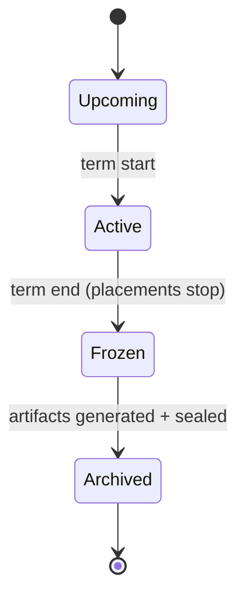
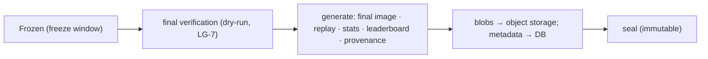
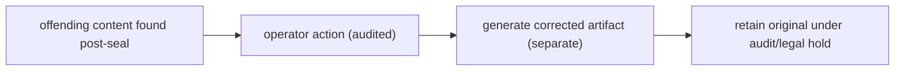

# Quad: Archives

> **Derived-feature doc.** Archives are *derived from* the event log/projections and sealed as permanent artifacts; this doc does **not** redefine event semantics, storage, or moderation rules. Conforms to [`EVENT_SOURCING.md`](EVENT_SOURCING.md), [`DATABASE.md`](DATABASE.md), [`MODERATION.md`](MODERATION.md), [`REPLAY.md`](REPLAY.md), [`ANALYTICS.md`](ANALYTICS.md), [`LEADERBOARDS.md`](LEADERBOARDS.md), [`MULTI_TENANCY.md`](MULTI_TENANCY.md), [`PRODUCT.md`](PRODUCT.md), [`PRINCIPLES.md`](PRINCIPLES.md). Contradictions flagged in §13, never silently fixed.
>
> No app code/schemas/versions. Tenant-neutral (Rutgers Quad = tenant #1).

## 1. Purpose & Scope
Each term's canvas is frozen and **archived forever** as a permanent historical artifact, final image, stats, leaderboard snapshot, and a replay (`P-FEAT-8`, `P-ARCH-1…5`, `P-LIFE-*`). **In scope:** lifecycle, freeze window, artifacts, storage, immutability, exceptional post-archive correction, visibility. **Out of scope:** event semantics (`EVENT_SOURCING.md`), replay UX (`REPLAY.md`), moderation rules (`MODERATION.md`).

## 2. Responsibilities vs. Non-Responsibilities
| Archives own | Archives don't own |
| --- | --- |
| Term lifecycle transitions + freeze window | Event semantics/order (`EVENT_SOURCING.md`) |
| Archive artifacts + storage/metadata relationship | Replay player (`REPLAY.md`) / leaderboard math (`LEADERBOARDS.md`) |
| Immutability + post-archive correction policy | Moderation permission rules (`MODERATION.md`) |

## 3. Dependency References
`EVENT_SOURCING.md` (derivation), `DATABASE.md` (§7 `archives` metadata, §15 blob relationship, partition immutability §14), `MODERATION.md` (§7 freeze-window correction, §15), `REPLAY.md`, `ANALYTICS.md`/`LEADERBOARDS.md` (snapshots), `MULTI_TENANCY.md` (visibility flags).

## 4. Term / Canvas Lifecycle

(Mirrors `PRODUCT.md` §6 / `P-LIFE-*`; no new lifecycle invented here.)

## 5. Freeze Window
Between **Frozen** and **Archived**: **no new placements** (`P-LIFE-4`); a bounded **moderation-correction period** for audited last corrections (`MODERATION.md` §7); a **final verification** step (incl. the archive dry-run gate `LG-7`) before sealing.

## 6. Archive Artifacts
- **Final image** (downloadable; full-resolution).
- **Replay metadata/assets** (precomputed; reproducible from log, `REPLAY.md`).
- **Stats snapshot** (term analytics, `ANALYTICS.md`).
- **Leaderboard snapshot** (final rankings, `LEADERBOARDS.md`).
- **Provenance metadata** (term id, sealed-at, source watermark, integrity reference).

## 7. Storage & Metadata Relationship
**DB holds metadata; object storage holds blobs** (`DATABASE.md` §15): the `archives` row stores pointers (`final_image_ref`, `replay_ref`, `stats_ref`, …) + `sealed_at`; large binaries live in object storage (`B7`). Archived event-log partitions become immutable/cold (`DATABASE.md` §14).

## 8. Immutability After Seal
Once sealed, an archive is **immutable and permanent** (`P-ARCH-1`, `ARCHIVE-INV-1`); never deleted or overwritten.

## 9. Exceptional Post-Archive Correction
If offensive content is discovered after seal (rare), correction is an **operator-level, audited** action that **generates a corrected artifact separately** while **preserving the original** under audit/legal hold (`MODERATION.md` §15, `ARCHIVE-INV-3`). This is exceptional, not routine; routine corrections happen in the freeze window (§5). Exact policy → `ADR-0009`/legal.

## 10. Replay / Final-Image Generation Ownership
- **Replay** for archived terms uses precomputed assets (`REPLAY.md`), always reproducible from the log.
- **Final image generation** is owned here (the archive pipeline) and typically produced **server-side** from the projection/log for full resolution (not the live client renderer, `RENDERING.md` §18).

## 11. Visibility (tenant config)
`archiveVisibility` feature flag (`MULTI_TENANCY.md` §17): **public** vs **members-only**. Visibility never exposes `DC3`; attribution is `DC2`.

## 12. Privacy/Security · Failure Modes · Testing
- **Privacy/Security:** sanitized public artifacts (no removed content re-exposed); no `DC3`; tenant-scoped (`TENANT-INV-5`); integrity reference for tamper detection.
- **Failure modes:** generation fails → retry (dry-run gate prevents term-close surprises, `LG-7`); blob upload fails → not sealed until artifacts durable; partition detach fails → archive metadata still valid, retry cold-move.
- **Testing:** freeze stops placement; artifacts generated + reproducible; immutability enforced; post-archive correction is exceptional+audited+preserves original; visibility flag respected; no `DC3`; tenant isolation.

## 13. Decisions Deferred
| Decision | Owner |
| --- | --- |
| Final-image format/resolution | impl / `PERFORMANCE.md` |
| Replay asset format | `REPLAY.md`/impl |
| Post-archive correction + legal-hold policy | `ADR-0009`/legal (`LG-9`) |
| Cold-storage policy for archived partitions | `DATABASE.md`/`DISASTER_RECOVERY.md` |

## 14. Archive Invariants (`ARCHIVE-INV-*`)
- **`ARCHIVE-INV-1`** Sealed archives are immutable and permanent, never deleted/overwritten.
- **`ARCHIVE-INV-2`** Artifacts are derived from the log and reproducible; the log remains source of truth.
- **`ARCHIVE-INV-3`** Post-archive correction is exceptional, operator-level, audited, and preserves the original artifact.
- **`ARCHIVE-INV-4`** Public archive artifacts are sanitized (no removed content); no `DC3`.
- **`ARCHIVE-INV-5`** Archives are tenant-scoped; visibility follows tenant config.

## 15. Diagrams
### 15.1 Lifecycle: §4.
### 15.2 Archive generation

### 15.3 Post-archive correction (exceptional)

## 16. Document Control
- **Path:** `docs/ARCHIVES.md` · **Purpose:** term freeze/archive lifecycle + permanent artifacts.
- **Dependencies:** `EVENT_SOURCING`, `DATABASE`, `MODERATION`, `REPLAY`, `ANALYTICS`, `LEADERBOARDS`, `MULTI_TENANCY`. **Consumed by:** `REPLAY`, `DISASTER_RECOVERY`, `OPERATIONS`, `specs/*`.
- **Acceptance:** ☑ lifecycle ☑ freeze window ☑ artifacts ☑ storage↔metadata ☑ immutability ☑ post-archive correction ☑ visibility flag ☑ `ARCHIVE-INV-*` ☑ no `DC3`/code/versions ☑ tenant-neutral.
- **Open questions:** §13. **Next:** `docs/ANALYTICS.md`.
