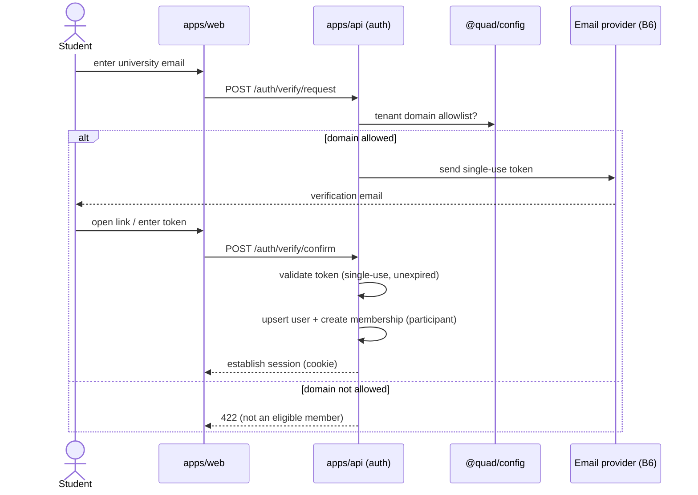
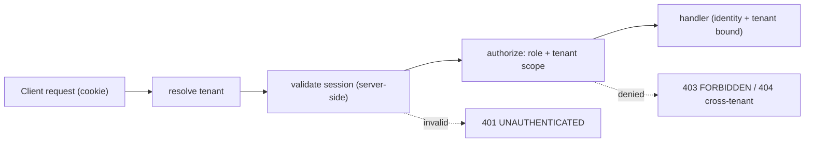
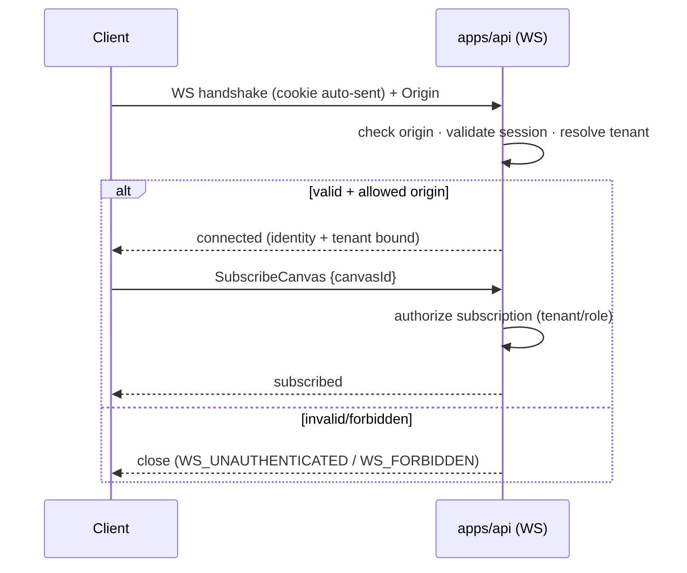

# Quad: Authentication, Membership, Sessions & Roles

> **This document owns identity in Quad: verified-membership authentication, the session model, the role/permission model, the REST and WebSocket auth boundaries, and the Auth.js integration decision.** It conforms to [`PRODUCT.md`](PRODUCT.md), [`PRINCIPLES.md`](PRINCIPLES.md), [`NON_GOALS.md`](NON_GOALS.md), [`SYSTEM_CONTEXT.md`](SYSTEM_CONTEXT.md), [`BACKEND.md`](BACKEND.md), [`API.md`](API.md), and [`WEBSOCKETS.md`](WEBSOCKETS.md); IDs cited (`P-*`, `PRIN-*`, `NG-*`, `B*`, `DC*`, `API-INV-*`, `WS-INV-*`).
>
> **⚠️ Dependency-order note.** The manifest lists `AUTHENTICATION.md` as depending on `MULTI_TENANCY.md`, but **this doc is authored first.** It therefore owns **identity, sessions, membership verification, the role model, the auth boundaries, and the WS/session crossing**, while remaining **tenant-aware and tenant-neutral**. **Detailed tenant routing/resolution mechanics are deferred to [`MULTI_TENANCY.md`](MULTI_TENANCY.md).**
>
> **Altitude:** architecture. **No** Auth.js config, route handlers, adapters, schemas, or migrations. **No** versions (see [`TECH_BASELINE.md`](TECH_BASELINE.md), which already records Auth.js **v5** + `@auth/core`). The formal integration choice is routed to **`ADR-0006`**. **No** app code/package files.
>
> **Naming:** platform = **Quad**; **Rutgers Quad** = tenant #1 (example config). No tenant literal in auth logic (`PRIN-CONFIG-OVER-CODE`).

---

## 1. Purpose & Scope

Identity is the gate that makes Quad **fair and accountable**: one verified student, one account, every action attributable (`PRIN-IDENTITY`, `PRIN-NO-ANON`). This document defines how a person proves university membership, how that becomes a session, what roles exist, and how REST and WebSockets both enforce identity.

**In scope:** auth principles, actor/session/identity models, the MVP email-verification flow, the future SSO path, the Auth.js integration decision, session architecture, REST + WS auth boundaries, tenant-aware membership, roles/permissions, public-handle policy, authorization rules, account lifecycle, privacy mapping, security, audit, rate limiting, testing, invariants.

**Out of scope (owned elsewhere):** tenant routing/resolution (`MULTI_TENANCY.md`), REST paths (`API.md`), WS message lifecycle post-auth (`WEBSOCKETS.md`), moderation tools/permission ladder internals (`MODERATION.md`), full threat model (`SECURITY.md`), the formal Auth.js ADR (`ADR-0006`).

---

## 2. Responsibilities vs. Non-Responsibilities

| Authentication **owns** | It does **not** own |
| --- | --- |
| Verified-membership identity + session issuance/validation | Tenant resolution from host/subdomain (`MULTI_TENANCY.md`) |
| The role model + authorization checks | Moderation tool internals/ladder (`MODERATION.md`) |
| REST + WS auth boundaries (incl. handshake crossing) | WS message catalog/lifecycle after auth (`WEBSOCKETS.md`) |
| Public-handle (`DC2`) vs private-email (`DC3`) policy | Full threat model + mitigations catalog (`SECURITY.md`) |
| Account/membership/role lifecycle + auth audit events | Cooldown/placement decisions (those consume identity, don't define it) |

---

## 3. Core Auth Principles

- **`AUTH-DP-1` Verified university membership**: only a verified member of a tenant may participate (`P-TENANT-2`, `B6`).
- **`AUTH-DP-2` No anonymous writes**: every write/elevated action requires an authenticated, tenant-scoped session (`PRIN-NO-ANON`).
- **`AUTH-DP-3` No custom passwords**: identity is proven by **email verification** (MVP) or **campus SSO** (future); Quad never stores a password (`NG-ANON`, `P-POST-1`).
- **`AUTH-DP-4` Tenant-aware, tenant-neutral**: auth always knows the tenant, but contains **no tenant literals**; domains/providers come from `@quad/config`.
- **`AUTH-DP-5` Server-authoritative identity**: `apps/api` issues and validates identity; clients never self-assert who they are or what role they hold (`BE-INV-1/6`).
- **`AUTH-DP-6` No public full-email exposure**: only the `DC2` handle is public; the `DC3` email is never shown publicly (`P-ATTR-4`, `CTX-INV-3`).

---

## 4. Actor / Session Model

| Actor | Session state | Capability |
| --- | --- | --- |
| **Anonymous viewer** *(only if read-only enabled, `P-Q-2`)* | none | read-only public canvas/replays; **no writes** |
| **Verified participant** | authenticated, tenant-scoped | place pixels, report, manage own profile |
| **Moderator** | authenticated + moderator role (tenant) | moderation tools (audited) |
| **Tenant admin** | authenticated + admin role (tenant) | tenant config, canvas lifecycle, roster |
| **Platform operator** | authenticated + operator (cross-tenant, `B5`) | onboarding, rollover, incident response |

All non-operator actors are confined to one tenant (`B4`).

---

## 5. Identity Model

- **User account**: the identity record: internal id, `DC3` email (minimized), `DC2` public handle/display name, status.
- **Membership**: binds a user to a tenant with a **tenant-scoped role**; carries verification status (`DATABASE.md` §7).
- **Tenant-scoped role** — `participant` | `moderator` | `admin` (per tenant); `operator` is platform-level (cross-tenant).
- **Public handle / display identity (`DC2`)**: what attribution shows everywhere (`P-ATTR-3`).
- **Private email / account identity (`DC3`)**: used only for verification + authorized access; **never public**.

---

## 6. MVP Email Verification Flow

No passwords, a magic-link/code verification gated by the tenant's domain allowlist:

1. **Request verification**, user submits their university email (`POST /api/v1/auth/verify/request`, `API.md`).
2. **Domain allowlist check**, the email domain must match the **resolved tenant's configured domains** in `@quad/config` (e.g., `rutgers.edu`, `scarletmail.rutgers.edu` for tenant #1). Non-matching → rejected (`AUTH-INV-4`).
3. **Send verification email**, a single-use, time-limited token/link is emailed via the email provider (`B6`).
4. **Confirm token**, user clicks/enters the token (`POST /api/v1/auth/verify/confirm`); the server validates it (single-use, unexpired).
5. **Create/update user**, upsert the user account (`DC3` email + `DC2` handle).
6. **Create membership**, bind the user to the tenant with role `participant`, marked verified.
7. **Establish session**, issue a session (`§9`); the user is now a verified participant.



---

## 7. Future CAS / SSO Flow

- **Tenant-configured IdP**: each tenant may configure an official campus identity provider (CAS/SSO) in `@quad/config` (`P-POST-1`); the provider becomes the membership authority (`B6`).
- **Mapping external identity → Quad user**: the SSO subject maps to a Quad user + tenant membership (matching on a stable external id, not the email string).
- **Migration path**: SSO is **additive**: a tenant can switch its membership method from email-verification to SSO without changing the rest of the system; existing users are linked to their SSO identity on first SSO login. Email-verification remains a fallback/config option. No data migration of the canvas/event log is involved.

---

## 8. Auth.js Integration Decision (MVP recommendation → `ADR-0006`)

Quad has a **Next.js client (`apps/web`)** and a **separate Fastify backend (`apps/api`)** that is the authoritative tier for REST **and** WebSockets. Auth.js v5 exposes both a Next integration (`next-auth`) and a framework-agnostic core (`@auth/core`), see `TECH_BASELINE.md`.

| Option | Pros | Cons |
| --- | --- | --- |
| **(A) Auth.js at the Next.js layer** (`next-auth`) | Most ergonomic in Next; easy SSR session | Web becomes the issuer; the **authoritative api must trust web-issued tokens**; awkward cross-app secret/JWKS sharing; **WS (served by Fastify) still needs its own validation** |
| **(B) `@auth/core` hosted in `apps/api` (Fastify)** ✅ recommended | **One auth authority = the tier that already enforces everything**; REST + WS validate the **same** session uniformly; clean revocation; no web→api trust handoff | More wiring (no off-the-shelf `@auth/fastify`; use `@auth/core`'s request handler) |

**Recommendation (MVP): Option B, own authentication in `apps/api` via `@auth/core`.** The backend is already the single authoritative decision-maker (`BE-INV-1`); making it the identity **issuer + validator** aligns identity authority with enforcement authority and gives REST and the WS handshake **one** session to validate. `apps/web` becomes a client that reflects session state (`GET /session`) and routes users through the api's verification endpoints.

This is an architectural recommendation; the **formal decision (and any revisit) is `ADR-0006`.**

---

## 9. Session Architecture

- **Server-validated sessions.** The api issues an **opaque session token** in an **httpOnly, Secure, SameSite cookie** scoped to the tenant domain; session state is held **server-side** (e.g., Redis-backed for fast validation, with account state in Postgres). This enables **immediate revocation**: critical so a ban/suspension instantly cuts access (`AUTH-INV-8`).
- **Why not stateless JWT alone:** a pure JWT can't be revoked before expiry; Quad needs instant kill on ban/suspension. (A short-lived token + server-side revocation list is an acceptable variant; decision in `ADR-0006`.)
- **Lifetime + rotation:** short-to-moderate session lifetime; **rotate the session on authentication** (anti-fixation) and on privilege change.
- **Signout/invalidation:** signout destroys the server-side session; ban/suspension/role-revocation invalidate all of the user's sessions.
- **Redis vs Postgres:** session-validation state may live in Redis (ephemeral, losing it just forces re-login, no data loss, consistent with `DB-INV-12`); durable account/membership state is in Postgres.

---

## 10. REST Auth Boundary

- Every protected REST request runs **resolve tenant → authenticate (validate session cookie) → authorize (role + tenant scope) → validate** (`BACKEND.md` §5).
- **CSRF (high level):** because auth is cookie-based, **state-changing REST requests require CSRF protection**: `SameSite` cookies **plus** a CSRF token/double-submit for unsafe methods; exact scheme is a `SECURITY.md`/`ADR-0006` detail.
- **Role checks:** `participant`/`moderator`/`admin`/`operator` enforced server-side per endpoint (`API.md` catalog); UI gating is never the control (`FE-INV-10`, `BE-INV-6`).



---

## 11. WebSocket Auth Boundary

- **Browser limitation:** browsers cannot set custom headers on the WS handshake (`WEBSOCKETS.md` §5). So the session must ride an **allowed channel**.
- **Options:** (1) **httpOnly session cookie** auto-sent on the same-site/subdomain handshake; (2) a **subprotocol/first-message token**.
- **Recommended:** the **session cookie** (Option 1), it reuses the single api-issued session (Option B in §8) with **no token in JS** (httpOnly), and pairs with **handshake origin checks** to mitigate cross-site WS. (A short-lived first-message token is the fallback if cookie scoping across subdomains is constrained, `ADR-0006`.)
- **Connect-time validation:** the api validates the session at connect and binds the connection to the identity + tenant (`WS-INV-9`).
- **Subscription-time authorization:** `SubscribeCanvas` is checked against tenant scope; mod channels require the moderator role (`WS-INV-3/8`).
- **Reconnect:** re-validates the session on each (re)connect; a revoked session cannot resubscribe.



---

## 12. Tenant-Aware Membership Verification

- **Domain allowlist from tenant config**: eligibility is "email domain ∈ the resolved tenant's configured domains" (`@quad/config`); **no tenant literals** in code (`AUTH-INV-4`, `PRIN-CONFIG-OVER-CODE`).
- **Tenant id on membership + session**: a verified session is **bound to exactly one tenant** (except operator), so all downstream auth is tenant-scoped (`AUTH-INV-5`, `B4`).
- **Routing deferred:** *how* a request maps to a tenant (host/subdomain) is `MULTI_TENANCY.md`'s; auth simply consumes the resolved tenant context.

---

## 13. Role & Permission Model

| Role | Scope | Powers | Constraints |
| --- | --- | --- | --- |
| **participant** | tenant | place, report, own profile | one account; normal cooldown |
| **moderator** | tenant | moderation tools (audited) | reversible, audited; tenant-only |
| **tenant admin** | tenant | tenant config, canvas lifecycle, roster/roles | tenant-only; audited |
| **platform operator** | cross-tenant (`B5`) | onboarding, rollover, incident response | least privilege; audited; must preserve isolation |

- **Least privilege**: each role grants only what it needs; escalation requires an audited grant (`§19`).
- **No placement-power advantage**: elevated roles use **normal placement rules**; moderation power is **separate from** placement and **never** shortens cooldown or grants extra pixels (`P-COOL-6`, `NG-UNEQUAL-POWER`, `AUTH-INV-7`).

---

## 14. Public Identity / Handle Policy

- **`DC2` is the public face**: attribution, profiles, leaderboards show the public handle/display name only.
- **`DC3` (email) is private**: used for verification + authorized access; **never public** (`AUTH-INV-6`).
- **Unresolved handle questions (`P-Q-1`):** is the handle the raw NetID, a derived handle, or a user-chosen display name? What is the default visibility, and may users change it? These are **product decisions** (privacy ↔ accountability) consumed by `PROFILES.md`; auth enforces only that **the email is never the public identifier**.

---

## 15. Authorization Rules

| Action | Required | Notes |
| --- | --- | --- |
| **Placement** | verified participant, active membership, not banned/suspended, within tenant | server-enforced; cooldown applies |
| **Reporting** | verified participant | rate-limited |
| **Moderation** | moderator (tenant) | audited; reversible |
| **Admin tenant config** | tenant admin | audited |
| **Platform tenant onboarding** | operator (`B5`) | cross-tenant; audited |
| **Archive/replay reads** | public *(if read-only enabled, `P-Q-2`)* else participant | sanitized replay default |

Cross-tenant attempts resolve to **`404`** (no existence leak, `API-INV-11`).

---

## 16. Account Lifecycle

- **First verification** → create user + membership (participant), establish session.
- **Repeat login** → since there are no passwords, a returning user with no valid session re-verifies via email magic link (or SSO later) to get a new session; an existing valid session just continues.
- **Membership status changes** → active ↔ suspended ↔ banned; role grants/revocations (audited).
- **Suspension** → temporary block on writes; session invalidated for the duration; reads per policy.
- **Ban** → permanent block; sessions invalidated; account retained for attribution/history (no hard delete, `PRIN-NO-INVISIBLE-LOSS`).
- **Leaving / losing access** → graduation/eligibility changes; re-verification or membership expiry (the policy for cross-term eligibility is open, `P-Q-7`).

---

## 17. Privacy & Data-Class Mapping

| Class | Auth handling |
| --- | --- |
| **`DC2`** public handle | the only identity surfaced publicly |
| **`DC3`** email/account identity | minimized, encrypted at rest, never public, authorized access only |
| **`DC4`** audit | role changes, bans/suspensions, admin/operator + auth-sensitive events recorded (`§19`) |
| **`DC5`** logs | reference **user id**, never email; no `DC3` in telemetry (`BE-INV-10`) |

---

## 18. Security Considerations

(Full mitigations catalog → `SECURITY.md`; flagged here as required.)

- **Token/session theft**: httpOnly + Secure + SameSite cookies; short lifetime; rotation; server-side revocation.
- **Session fixation**: rotate session id on authentication/privilege change.
- **CSRF**: SameSite + CSRF token for state-changing REST (`§10`).
- **Cross-site WS**: handshake **origin allowlist** + cookie SameSite (`§11`).
- **Fake/forwarded university email**: domain allowlist + single-use, expiring tokens; forwarding remains a residual risk that **SSO mitigates** (flagged).
- **Shared accounts / multi-accounting**: one-account principle + abuse detection hooks (`P-ABUSE-1/4`).
- **Role escalation**: server-side role checks + audited grants; no client-asserted roles.
- **Tenant confusion**: session bound to one tenant; cross-tenant → `404`.
- **Brute-force verification abuse**: rate-limited requests, single-use/expiring tokens, throttled confirm attempts (`§20`).

---

## 19. Audit Requirements

The following are **audit-logged** (`DC4`, append-only, atomic with effect, `BE-INV-8`, `DB-INV-6`):

- **Role changes** (grant/revoke moderator/admin/operator).
- **Suspensions / bans** (and their lifting).
- **Admin/operator actions** (tenant config, onboarding, lifecycle).
- **Auth-sensitive events**: sign-in, session revocation, verification-confirm (recorded without `DC3` in operational logs; audit may reference the user id).

---

## 20. Rate Limiting & Abuse Controls for Auth Flows

- **Verification request** rate-limited per email/IP/tenant; **confirm attempts** throttled.
- **Tokens** are single-use and time-limited; reuse/expiry rejected.
- **Session/connection** limits per identity/IP feed abuse detection (`SECURITY.md`, `P-ABUSE-*`).
- Auth endpoints return `429 RATE_LIMITED` on breach (`API.md` §8).

---

## 21. Testing Expectations

(Strategy → `TESTING.md`.)

- **Email verification flow**: request → allowlist → token → confirm → membership → session.
- **Domain allowlist**: only configured tenant domains pass; others rejected.
- **Session validation**: valid/invalid/expired/revoked sessions behave correctly.
- **REST authz**: each role/scope enforced; UI-gated actions still server-enforced.
- **WS handshake/subscription**: connect auth + subscription authorization + reconnect re-validation; revoked session can't resubscribe.
- **Role permissions**: least-privilege boundaries; no placement-power advantage.
- **Privacy**: no `DC3` exposure in any participant/public response or log.
- **Tenant isolation**: sessions can't act cross-tenant; cross-tenant → `404`.
- **CSRF/origin**: state-changing REST + WS handshake reject bad origin/missing CSRF.

---

## 22. Authentication Invariants (`AUTH-INV-*`)

- **`AUTH-INV-1`** No write/elevated action without an authenticated, tenant-scoped session (no anonymous writes).
- **`AUTH-INV-2`** No custom passwords; identity comes only from verified email (MVP) or SSO (future).
- **`AUTH-INV-3`** Identity is server-authoritative, the api issues + validates sessions; clients never self-assert identity/role.
- **`AUTH-INV-4`** Membership verification restricts to the tenant's **configured** domains; no tenant literals.
- **`AUTH-INV-5`** Every session is bound to exactly one tenant (except platform operator); no cross-tenant identity.
- **`AUTH-INV-6`** The full email (`DC3`) is never exposed publicly; only the `DC2` handle.
- **`AUTH-INV-7`** Roles are tenant-scoped (except operator), least-privilege, and grant **no** placement-power advantage.
- **`AUTH-INV-8`** Ban/suspension immediately invalidates the user's sessions/ability to act.
- **`AUTH-INV-9`** REST and WS share one auth authority (the api) and one session; the WS handshake validates that session.
- **`AUTH-INV-10`** Role changes, suspensions/bans, admin/operator and auth-sensitive events are audited.
- **`AUTH-INV-11`** Auth flows are rate-limited; verification tokens are single-use and time-limited.
- **`AUTH-INV-12`** Cookie-authenticated state-changing requests have CSRF protection; WS handshakes enforce origin checks.

---

## 23. Diagrams

- **MVP email verification flow**: §6.
- **Session validation (REST)**: §10.
- **WS handshake auth flow**: §11.
- **Role/permission boundary**: below.

### 23.1 Role / permission boundary
```mermaid
flowchart TB
  ANON["Anonymous viewer (read-only if enabled)"] -->|verify membership| PART["Verified participant"]
  PART -->|role grant (audited)| MOD["Moderator (tenant)"]
  PART -->|role grant (audited)| ADM["Tenant admin"]
  ADM -. platform-level .-> OP["Platform operator (cross-tenant)"]
  PART --- P1["place · report · own profile"]
  MOD --- M1["moderation tools (audited)"]
  ADM --- A1["tenant config · lifecycle · roster"]
  OP --- O1["onboard · rollover · incident (isolation preserved)"]
```

---

## 24. Decisions Deferred to Deeper Docs / ADRs

| Open decision | Owner |
| --- | --- |
| **Formal Auth.js integration** (confirm Option B; cookie vs first-message token; session storage; CSRF scheme) | **`ADR-0006`** + `SECURITY.md` |
| Tenant routing/resolution mechanics | `MULTI_TENANCY.md` |
| Public-handle policy (`P-Q-1`) + changeability | `PROFILES.md` / product |
| Cross-term eligibility / account lifecycle on graduation (`P-Q-7`) | product / `MULTI_TENANCY.md` |
| Moderation permission ladder details | `MODERATION.md` |
| Session lifetime/rotation tuning + connection limits | `SECURITY.md` / `OPERATIONS.md` |
| SSO/CAS provider specifics per tenant | future / `MULTI_TENANCY.md` |
| Data-residency/FERPA posture for `DC3` | `LAUNCH_PLAN.md` (`LG-9`) / `SECURITY.md` |

---

## 25. Document Control

- **Path:** `docs/AUTHENTICATION.md`
- **Purpose:** Define Quad's identity layer, verified-membership auth, sessions, roles, and the REST/WS auth boundaries, and recommend the Auth.js integration (`@auth/core` in `apps/api`) for `ADR-0006`.
- **Dependencies:** `SYSTEM_CONTEXT.md` (`B*`/`DC*`), `BACKEND.md`, `API.md`, `WEBSOCKETS.md`, `PRODUCT.md`, `PRINCIPLES.md`, `NON_GOALS.md`, `TECH_BASELINE.md`. **Forward dependency (deferred):** `MULTI_TENANCY.md` (routing). **Consumed by:** `MULTI_TENANCY.md`, `MODERATION.md`, `SECURITY.md`, `PROFILES.md`, `ADR-0006`, `@quad/core`/`@quad/config`.
- **Acceptance checklist:** ☑ all 25 parts present ☑ dependency-order note (identity here; routing → `MULTI_TENANCY`) ☑ principles (verified membership, no anon writes, no passwords, tenant-neutral, server-authoritative, no public email) ☑ actor/session/identity models ☑ MVP email-verification flow ☑ future SSO path ☑ **Auth.js decision (Option B recommended → `ADR-0006`)** ☑ session architecture (revocable, rotated) ☑ REST + WS auth boundaries (cookie + origin) ☑ tenant-aware membership (config allowlist, no literals) ☑ role/permission model (no placement advantage) ☑ handle policy (`DC2` public, `DC3` private) ☑ authorization rules ☑ account lifecycle ☑ privacy mapping ☑ security + audit + rate limiting ☑ `AUTH-INV-1…12` ☑ 4 Mermaid diagrams ☑ no custom passwords ☑ versions referenced not declared ☑ tenant-neutral (Rutgers = example) ☑ no app code/package files.
- **Open questions:** see §24 (`ADR-0006`, handle policy, eligibility lifecycle, CSRF/session tuning).
- **Next recommended:** `docs/MULTI_TENANCY.md` (tenant model, routing/resolution, isolation enforcement, the mechanics this doc deferred).
