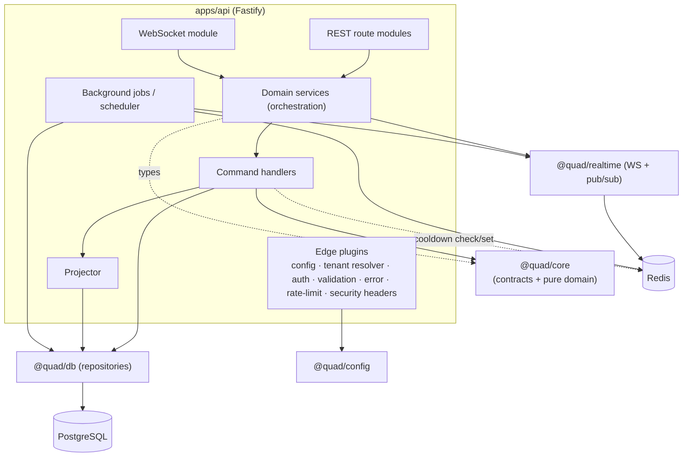
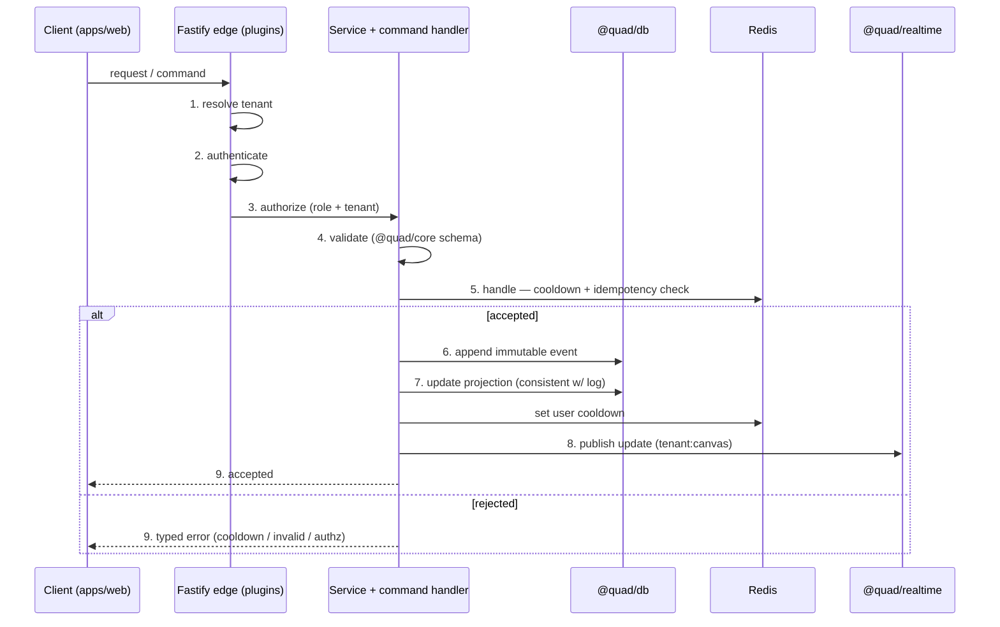
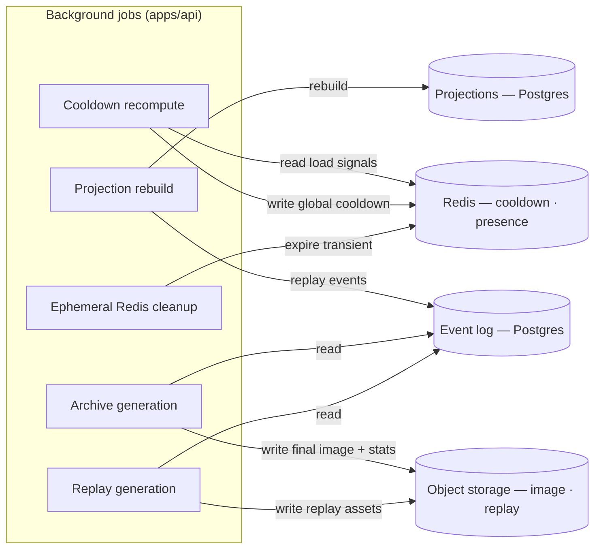

# Quad — Backend Architecture (`apps/api`)

> **This document defines the backend service: the authoritative tier that handles commands, appends events, maintains projections, serves REST + WebSocket transport, and runs background jobs.** It conforms to [`PRODUCT.md`](PRODUCT.md), [`PRINCIPLES.md`](PRINCIPLES.md), [`ARCHITECTURE.md`](ARCHITECTURE.md), [`SYSTEM_CONTEXT.md`](SYSTEM_CONTEXT.md), and [`FRONTEND.md`](FRONTEND.md); IDs are cited (`P-*`, `PRIN-*`, `ARCH-INV-*`, `CTX-INV-*`, `FE-INV-*`, `B*`, `DC*`).
>
> **Altitude:** service architecture only. It says *what `apps/api` is responsible for and how its pieces fit* — **not** the concrete contracts. Detailed REST contracts → [`API.md`](API.md); event semantics/append rules → [`EVENT_SOURCING.md`](EVENT_SOURCING.md); physical schema/Prisma → [`DATABASE.md`](DATABASE.md); WebSocket lifecycle/payloads → [`WEBSOCKETS.md`](WEBSOCKETS.md); auth mechanism → [`AUTHENTICATION.md`](AUTHENTICATION.md); cooldown algorithm → [`COOLDOWN.md`](COOLDOWN.md); moderation internals → [`MODERATION.md`](MODERATION.md).
>
> **No** complete schemas/Prisma models, endpoint specs, WS payload specs, or cooldown formulas. **No** versions (see [`TECH_BASELINE.md`](TECH_BASELINE.md)). **No** app code or package files.
>
> **Naming:** platform = **Quad**; **Rutgers Quad** = tenant #1 (config example only). No tenant literal in backend logic (`PRIN-CONFIG-OVER-CODE`, `ARCH-INV-8`).

---

## 1. Purpose & Scope

`apps/api` is the **authoritative tier** of Quad. Per `ARCHITECTURE.md` §5–§6, it is the only place commands are validated and events are created; the frontend (`FRONTEND.md`) merely renders and orchestrates. Everything that must be *true and fair* — placement validity, cooldown, identity/authorization, tenant isolation, audit — is decided here.

**In scope:** the Fastify service shape, the request/command lifecycle, command handling and domain orchestration, the boundaries with `@quad/db`/`@quad/realtime`/`@quad/core`/`@quad/config`, tenant-context propagation, the auth/cooldown/moderation enforcement boundaries (high level), background jobs, and the error/observability/performance/security/testing responsibilities the backend owns.

**Out of scope (owned elsewhere):** REST contracts (`API.md`), event catalog + append semantics (`EVENT_SOURCING.md`), physical schema (`DATABASE.md`), WS payloads/lifecycle (`WEBSOCKETS.md`), auth mechanism (`AUTHENTICATION.md`), cooldown algorithm (`COOLDOWN.md`), moderation tooling (`MODERATION.md`), canvas rendering (`RENDERING.md`).

---

## 2. Responsibilities vs. Non-Responsibilities

| `apps/api` **is** responsible for | `apps/api` is **not** responsible for |
| --- | --- |
| Validating + handling commands; deciding accept/reject | Rendering or UI (that's `apps/web`/`@quad/render`) |
| **Appending immutable events** (sole writer to the log) | Being the database — it delegates I/O to `@quad/db` (`ARCH-INV-10`) |
| Maintaining projections consistent with the log | Defining tenant facts — those come from `@quad/config` |
| Serving REST + WebSocket transport | Authoring identity-of-record — delegated to the IdP (`B6`) |
| Enforcing cooldown, authz, tenant isolation server-side | Holding presentation/view state (frontend owns that) |
| Writing the moderation **audit log** (`DC4`) | Owning realtime transport internals (delegates to `@quad/realtime`) |
| Running the projector + background jobs | Defining shared contract shapes — imports them from `@quad/core` |

**Governing rule:** `apps/api` is **authoritative**. The client never decides anything fairness/security-critical (`FE-INV-2/3`); the backend is where those decisions actually happen and are enforced (`BE-INV-1`).

---

## 3. Service Boundary Inside the Architecture

`apps/api` sits at the center of the server tier (`ARCHITECTURE.md` §5). It is:

- the **single authoritative decision-maker** and the **single writer** to the event log;
- a **client of** `@quad/db` (persistence), `@quad/realtime` (WS + pub/sub), PostgreSQL, and Redis;
- a **consumer of** `@quad/core` contracts/domain logic and `@quad/config` tenant facts.

It is otherwise **stateless** (no authoritative state in process memory), so instances scale horizontally and coordinate realtime fan-out through Redis (`ARCH-GOAL-3`).

---

## 4. Fastify Application Shape (High Level)

A **plugin-composed** Fastify app (version baseline in `TECH_BASELINE.md`):

- **Edge plugins** — config bootstrap, **tenant resolver**, **authentication**, authorization helpers, **schema validation**, error handler, rate limiting, security headers, request-id/correlation.
- **Transport modules** — REST **route modules** (grouped by feature) and a **WebSocket module**, both speaking `@quad/core` types.
- **Domain service layer** — orchestrators that load state, invoke domain decisions, and persist results.
- **Command handlers** — the only path that changes state (produce events).
- **Repository layer** — `@quad/db` (the only DB I/O).
- **Realtime adapter** — `@quad/realtime` (publish/fan-out, serve WS).
- **Projector** — maintains/rebuilds read models from events.
- **Jobs/scheduler** — background work (§15).

Encapsulation is by Fastify plugin boundaries; request/response validation is schema-driven and tied to `@quad/core` (`§10`). No endpoint or payload shapes are fixed here.

---

## 5. Request / Command Lifecycle

Every state-changing request flows through an ordered pipeline. Each stage has a clear owner; details of any single stage are deferred to that stage's doc.

1. **Tenant resolution** — map the request/connection to a tenant; attach tenant context (`§11`; mechanism → `MULTI_TENANCY.md`).
2. **Authentication / session lookup** — establish the caller's identity from the session/credential (`B2`/`B6`; mechanism → `AUTHENTICATION.md`).
3. **Authorization** — check role + tenant scope for the requested action (`B2`/`B3`/`B5`).
4. **Validation** — validate the payload against the `@quad/core` schema; reject malformed input early.
5. **Command handling** — run the domain decision: check invariants, **cooldown**, and **idempotency** (`§6`, `§13`, `§17`).
6. **Event append** — on acceptance, append the immutable domain event via `@quad/db` (`EVENT_SOURCING.md` owns semantics).
7. **Projection update** — update the read model consistently with the log (`§8`; rebuildable, `BE-INV-4`).
8. **Realtime publish** — publish the update via `@quad/realtime` (Redis pub/sub) for fan-out to subscribed clients (`§9`).
9. **Response** — return a typed result (accepted) or a typed error (rejected: cooldown active / invalid / unauthorized).

Read (query) requests skip stages 5–8: resolve tenant → authenticate (as needed) → authorize → read projection → respond.

---

## 6. Command Handling Model

- Quad uses a **command/query split (CQRS-lite):** **commands** change state by producing events; **queries** read projections. They never mix.
- A **command** is an explicit, named intent (e.g., place a pixel, submit a report, perform a moderation action). The matching **handler** loads only the state it needs, asks the domain (`@quad/core`) to decide, and—on acceptance—emits one or more events.
- **Handlers are the only path to state change** (`BE-INV-2`); there is no out-of-band mutation of the log or projections.
- Acceptance is **all-or-nothing**: a command either appends its event(s) and updates the projection consistently, or it is rejected with a typed error and changes nothing (`§16`).
- Commands carry idempotency context so retries are safe (`§17`).

---

## 7. Domain Orchestration Model

- **Business rules live in `@quad/core`** (pure, I/O-free, unit-tested); `apps/api` **services orchestrate** them (`ARCH-INV-7`).
- A service's shape is: *load* needed state (via repositories) → *decide* (invoke core domain logic) → *persist* events (via repository) → *update* projection → *publish* (via realtime). Services are thin; they wire I/O around pure decisions.
- This keeps the api a **coordination layer** and prevents business logic from leaking into transport/route code (mirrors `FE-INV-1` on the client side).

---

## 8. Repository Boundary with `@quad/db`

- **All database I/O goes through `@quad/db` repositories** (`ARCH-INV-10`, `BE-INV-9`); no service, route, or job issues SQL/Prisma directly.
- Repositories expose **domain-typed** operations (append event, read/update projection, load aggregates, write audit), never leaking persistence types upward.
- **Event append and the dependent projection update must be consistent** (the projection never reflects an event that wasn't durably appended, and is always rebuildable from the log). The concrete transaction/consistency strategy is owned by `EVENT_SOURCING.md` + `DATABASE.md`; this doc only fixes the **invariant** (`BE-INV-3/4`).

---

## 9. Realtime Boundary with `@quad/realtime`

- `apps/api` **authors facts**; `@quad/realtime` **transports** them. The api publishes domain updates (e.g., a placement) to the tenant/canvas channel via Redis pub/sub, and serves WebSocket connections through the realtime adapter.
- Outbound messages are typed by **`@quad/core` WS schemas** (`§10`); the api never sends an untyped payload (`ARCH-INV` analogue → `BE-INV-9`).
- Cross-instance fan-out and best-effort delivery are handled by pub/sub; **convergence is guaranteed by the snapshot-on-(re)connect path**, which the api serves (consistent with `ARCHITECTURE.md` §11 and `FE-INV-3`). Lifecycle/payloads → `WEBSOCKETS.md`.

---

## 10. Contract Boundary with `@quad/core`

- `apps/api` **imports all shared contracts from `@quad/core`** — DTOs, WS payload types, domain event types, cooldown calculation types, tenant config types — and declares **no parallel definitions** (`ARCH-INV-6`, `BE-INV-9`).
- Inbound validation is driven by the core schemas, so what the api accepts and what the client sends are the **same contract** (kills untyped/duplicated payloads). Concrete contract *content* lives in `API.md`/`WEBSOCKETS.md`/`EVENT_SOURCING.md`, but the **authoritative types live in core**.

---

## 11. Tenant Context Propagation

- Tenant is resolved at the **edge** (stage 1) and a **tenant context** (tenant id + `@quad/config` entry) is attached to the request/connection.
- That context is **propagated to every service, repository call, and realtime publish**, so persistence is tenant-scoped and channels are `tenant:canvas` (`ARCH-INV-5`, `CTX-INV-2`, `B4`).
- **No cross-tenant access** occurs except via the platform-operator path (`B5`) under explicit controls + audit (`CTX-INV-7`).
- **No tenant literals** in backend logic (`BE-INV-12`); Rutgers Quad is a registry entry resolved like any tenant. Resolution mechanics → `MULTI_TENANCY.md`.

---

## 12. Authentication & Authorization Boundary (High Level)

- **Authentication** establishes the caller's identity from a session/credential issued at the auth boundary (`B2`/`B6`); the api **trusts the IdP for membership, not the client's claims**.
- **Authorization** checks, per command: is the caller a verified member of *this* tenant (`B2`), and does the action require an elevated role (`B3`) or cross-tenant operator scope (`B5`)?
- Authorization is enforced **server-side regardless of UI gating** — the frontend's role-gating is UX only (`FE-INV-10`); the api is the real control (`BE-INV-6`).
- Mechanism (session/token format, CSRF, where the session crosses into the WS handshake) is deferred to `AUTHENTICATION.md` + `ADR-0006`. **No custom passwords** (`NG-ANON`).

---

## 13. Cooldown Enforcement Boundary (High Level)

- During placement command handling, the api checks the **global cooldown** (current value) and the user's **next-allowed timestamp** in Redis; if the cooldown is active, the command is **rejected** with remaining time (`P-COOL-5/7`). On acceptance, it sets the user's cooldown.
- The cooldown is **server-authoritative, global per tenant, and bounded 5–20 min, with no bypass path** (`PRIN-FAIRNESS`, `ARCH-INV-3`, `P-COOL-1/6`, `BE-INV-7`). The current global value is produced by the **recompute job** (`§15`).
- The **algorithm, inputs, weights, and smoothing** are owned by `COOLDOWN.md` + `ADR-0008`; this doc fixes only *where* it's checked (placement handler), *where* it's stored (Redis), and *that* it is inviolable.

---

## 14. Moderation / Audit Command Boundary (High Level)

- Moderation actions are **commands** that produce **compensating domain events** (rollback a pixel/region/time-range, remove artwork) **plus a mandatory audit-log entry** (`DC4`) — actor, action, target, reason, time.
- **No moderation action without an audit entry** (`P-MOD-4`, `BE-INV-8`); **nothing is hard-deleted** — the visible canvas changes, history does not (`PRIN-NO-INVISIBLE-LOSS`, `P-MOD-5`).
- Actions are **role- and tenant-scoped** (`B3`); authority is enforced server-side. Tool inventory, role model, and action semantics are owned by `MODERATION.md` + `ADR-0009`.

---

## 15. Background Jobs

Jobs run within the api tier (worker topology/scheduler deferred to `DEPLOYMENT.md`/`OPERATIONS.md`). Each is idempotent and tenant-aware.

| Job | Trigger | Reads | Produces | Notes |
| --- | --- | --- | --- | --- |
| **Projection rebuild** | On demand / recovery / migration | Event log | Rebuilt projection | Proves projections are derivable (`BE-INV-4`); must be deterministic |
| **Cooldown recompute** | Periodic | Redis load signals + activity metrics | Updated **global** cooldown (Redis) | Smoothed to avoid oscillation, bounded 5–20 (`P-COOL-4`); algorithm → `COOLDOWN.md` |
| **Archive generation** | Term freeze (`P-LIFE-4/5`) | Event log | Final image + term statistics (object storage) | Must be dry-run-proven before real term close (`LG-7`) |
| **Replay generation** | Term freeze / on demand | Event log | Replay assets/data | Deterministic reconstruction from ordered log (`REPLAY.md`) |
| **Ephemeral Redis cleanup** | Periodic | Redis (presence/transient keys) | Expired/cleaned ephemeral state | Operational hygiene; never touches the durable log |

---

## 16. Error Model (Architecture Level)

- Errors are **domain-typed in `@quad/core`** and mapped to transport at the edge (REST status / WS error message) — the api never leaks framework internals, stack traces, or `DC3` to clients.
- Categories: **validation** (malformed input), **authn/authz** (unauthenticated / forbidden), **not-found**, **conflict** (e.g., cooldown active, idempotency replay), **rate-limited**, **internal**.
- A rejected command changes nothing (`§6`): a failure during append/projection must not leave a partially-applied state (`BE-INV-3/4`).
- The concrete error payload shape lives in `API.md`/`WEBSOCKETS.md`; this doc fixes the **model** (typed, consistent, leak-free).

---

## 17. Idempotency / Duplicate-Request Posture (High Level)

- **State-changing commands are idempotent against retries and duplicates** (`BE-INV-11`): a double-tapped placement or a retried request must not append two events or charge the cooldown twice — critical for fairness (`PRIN-EQUAL-POWER`).
- Mechanism (idempotency keys and/or natural uniqueness constraints) is fixed in shape here but detailed in `EVENT_SOURCING.md`/`DATABASE.md`.
- **Realtime delivery is at-least-once / best-effort**; clients reconcile via snapshot-on-reconnect (`§9`). Writes aim for effectively-once via idempotency; reads/broadcasts tolerate duplication.

---

## 18. Observability Responsibilities

- **Structured logs** — JSON with request/correlation id and tenant id; **never** contain `DC3` (`CTX-INV-8`, `BE-INV-10`).
- **Metrics** — placement rate, current cooldown value, WS connection counts/presence, projection lag, error rates, and latencies. These both **feed the cooldown load score** and validate `PERFORMANCE.md` budgets.
- **Traces** — spans across the request/command lifecycle (`§5`) for latency analysis.
- **Audit-sensitive logging rules** — the **moderation audit log (`DC4`)** is a first-class, durable, append-only record, **distinct from operational telemetry (`DC5`)**; operational logs must never carry `DC3`, and audit entries are authoritative, not debug output. Detail → `OBSERVABILITY.md`.

---

## 19. Performance Responsibilities Owned by Backend

The api owns the **server-side share** of `PERFORMANCE.md` budgets:

- Low-latency **placement hot path** (validate → cooldown check → append → projection → publish).
- Fast **event append** and **projection update**; fast **Redis** cooldown read/write.
- Efficient **WS message handling and fan-out**; fast **snapshot serving** on (re)connect.
- Sustained **concurrent connections** per tenant; **stateless** instances for horizontal scale.

Budgets/targets are defined in `PERFORMANCE.md`; the api is accountable for meeting its portion under load (verified by load tests, `LG-5`).

---

## 20. Security Responsibilities Owned by Backend

The api holds the **real, authoritative** controls (the frontend is defense-in-depth):

- Enforce **authentication, authorization, tenant isolation, and cooldown** as the source of truth (`BE-INV-1/5/6/7`).
- **Validate all input** against `@quad/core` schemas; treat all client data as untrusted.
- **Rate limiting + abuse hooks** at the transport edge (`B1`); guard against botting/cooldown-bypass/WS abuse (`P-ABUSE-*`).
- **Protect event-log integrity** (append-only, no tampering, single writer) and **secrets/datastore access** (`B7`).
- **Never expose `DC3`**; session/CSRF handling per `AUTHENTICATION.md`. Full threat model + mitigations → `SECURITY.md`.

---

## 21. Testing Expectations

Backend test layers (tooling → `TECH_BASELINE.md`; strategy → `TESTING.md`). Critical subsystems are automated, **never manual-only**:

- **Unit** — domain services/handlers + pure `@quad/core` logic.
- **Integration** — api against **real Postgres + Redis** (Dockerized), exercising the full lifecycle.
- **API behavior** — request→response and the typed error model (without re-specifying contracts, which `API.md` owns).
- **WebSocket behavior** — connect/subscribe/broadcast/reconnect convergence.
- **Event append + projection** — append correctness and **deterministic rebuild** from the log.
- **Tenant isolation** — cross-tenant access is denied on every path (`P-AC-13`).
- **Authorization** — role/scope enforcement (incl. that UI-gated actions are still server-enforced).
- **Moderation audit** — every moderation action writes an audit entry and is reversible (no hard delete).

---

## 22. Backend Invariants (`BE-INV-*`)

- **`BE-INV-1`** `apps/api` is the sole authoritative decision-maker for placement validity, cooldown, authorization, and tenant membership.
- **`BE-INV-2`** Every state change goes through a command handler that appends events; no out-of-band mutation.
- **`BE-INV-3`** The event log is append-only with a single writer (the api via `@quad/db`); no destructive writes.
- **`BE-INV-4`** Projections derive from the log and stay consistent with it (always rebuildable).
- **`BE-INV-5`** Every request/command is tenant-scoped; no cross-tenant access except the operator path under controls.
- **`BE-INV-6`** Every write is authenticated and authorized before execution, regardless of UI gating.
- **`BE-INV-7`** Cooldown is enforced server-side, global per tenant, within 5–20 min, with no bypass path.
- **`BE-INV-8`** Every moderation action writes a mandatory audit entry and never hard-deletes history.
- **`BE-INV-9`** All DB I/O via `@quad/db`; all realtime I/O via `@quad/realtime`; all shared contracts from `@quad/core`.
- **`BE-INV-10`** Operational logs/telemetry (`DC5`) never contain `DC3`; the audit log (`DC4`) is append-only and distinct.
- **`BE-INV-11`** State-changing commands are idempotent against retries/duplicates.
- **`BE-INV-12`** No tenant literals in backend logic; tenant facts come only from `@quad/config`.

---

## 23. Diagrams

- **Service component diagram** — §4 (Fastify plugins/layers and their dependencies).
- **Request/command lifecycle** — §5 (the 9-stage pipeline as a sequence).
- **Background job ownership** — §15 (jobs and what they read/produce).

(All three are inline above, at the section that owns them.)

---

## 24. Decisions Deferred to Deeper Docs

| Open decision | Owner |
| --- | --- |
| REST endpoint contracts + concrete error payloads | `API.md` |
| Event catalog, append semantics, ordering, transaction boundary for append+projection | `EVENT_SOURCING.md` |
| Physical schema, Prisma models, indexing/partitioning, projection storage | `DATABASE.md` |
| WebSocket connection lifecycle + payloads + reconnect protocol | `WEBSOCKETS.md` |
| Auth mechanism, session/token format, CSRF, WS-handshake auth crossing | `AUTHENTICATION.md`, `ADR-0006` |
| Cooldown algorithm, inputs, weights, smoothing | `COOLDOWN.md`, `ADR-0008` |
| Moderation tool inventory + role model | `MODERATION.md`, `ADR-0009` |
| Job scheduler / worker topology (in-process vs separate worker) | `DEPLOYMENT.md`, `OPERATIONS.md` |
| Idempotency key strategy specifics | `EVENT_SOURCING.md`/`DATABASE.md` |
| Tenant resolution mechanism | `MULTI_TENANCY.md` |

---

## 24a. Implementation Status (M10–M12)

The pixel-placement command path is implemented in `apps/api` (validate → server-enforced cooldown → atomic append + projection + idempotency via `@quad/db`). Per `BE-INV-6` / `PRIN-NO-ANON`, the placement **domain service takes a verified `Principal` as a typed input** and never trusts client claims. The request→principal step is now implemented (M20): the identity plugin validates the opaque **session cookie** against the server-side session store and the user's **active membership**, setting `request.principal` — anything short of that stays null, so writes reject `401` (no anonymous writes, no header bypass; a ban/suspension drops the membership and cuts access even on a still-valid session). Session **issuance** is implemented (M20b): the domain-allowlisted magic-link front-door (`POST /auth/verify/request` → single-use token via an injected mail transport; `POST /auth/verify/confirm` → tenant-bound, find-or-create user + participant membership → session cookie if active; `POST /auth/signout` → revoke), per `AUTHENTICATION.md` / `ADR-0006`. The read path (`GET …/pixels/{x}/{y}`) returns DC2 attribution only. See `CHECKPOINTS.md` §4b.

## 25. Document Control

- **Path:** `docs/BACKEND.md`
- **Purpose:** Define the `apps/api` service architecture — the authoritative tier for commands, events, projections, transport, and jobs — within the boundaries set by `ARCHITECTURE.md`.
- **Dependencies:** `ARCHITECTURE.md`, `SYSTEM_CONTEXT.md`, `FRONTEND.md`, `PRODUCT.md`, `PRINCIPLES.md`, `TECH_BASELINE.md`. **Consumed by:** `DATABASE.md`, `EVENT_SOURCING.md`, `API.md`, `WEBSOCKETS.md`, `AUTHENTICATION.md`, `COOLDOWN.md`, `MODERATION.md`, `OBSERVABILITY.md`, `TESTING.md`.
- **Acceptance checklist:** ☑ all 25 parts present ☑ service altitude only (no schemas/Prisma/endpoints/WS payloads/cooldown formulas) ☑ full 9-stage request lifecycle ☑ command/query split + orchestration model ☑ package boundaries (`@quad/db`/`@quad/realtime`/`@quad/core`/`@quad/config`) ☑ cooldown/authz/moderation enforcement boundaries ☑ 5 background jobs ☑ error/idempotency/observability/perf/security responsibilities ☑ 3 Mermaid diagrams ☑ `BE-INV-1…12` ☑ versions referenced not declared ☑ tenant-neutral, no Rutgers hardcoding ☑ no app code/package files.
- **Open questions:** see §24 (all routed to owning docs/ADRs).
- **Next recommended:** `docs/DATABASE.md` (physical data model, event-store + projection storage, ERD, indexing/partitioning).
