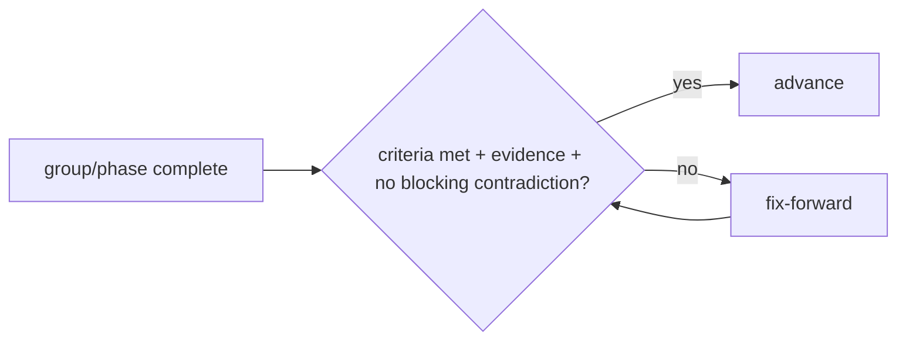
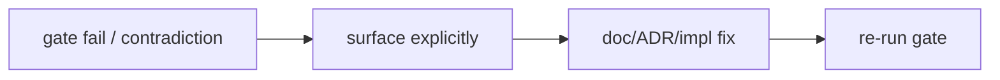

# Quad: Checkpoints

> **Engineering-process doc.** Owns the formal checkpoint gates and their pass/fail protocol. Conforms to [`MILESTONES.md`](MILESTONES.md), [`ENGINEERING_WORKFLOW.md`](ENGINEERING_WORKFLOW.md), [`LAUNCH_PLAN.md`](LAUNCH_PLAN.md), `process/SPEC_PLAN.md`. Does not rewrite any contract; contradictions go to §7. No code/scaffolding; no versions; tenant-neutral (Rutgers Quad = tenant #1).

## 1. Purpose & Scope

Checkpoints are the **gates between phases / milestone-groups**: each defines what must be true before advancing, and what happens if it isn't. They make "don't lose the plot" enforceable.

- **In scope:** the checkpoint list, the template, pass/fail rules, contradiction handling, relationships.
- **Out of scope:** milestone content (`MILESTONES.md`), test detail (`TESTING.md`), launch-gate substance (`LAUNCH_PLAN.md`).

## 2. Responsibilities vs. Non-Responsibilities

| Checkpoints own | Don't own |
| --- | --- |
| Gate definitions + pass/fail protocol | Milestone content (`MILESTONES.md`) |
| Evidence + contradiction handling | Test matrix (`TESTING.md`) / launch substance (`LAUNCH_PLAN.md`) |

## 3. Principles

- **`C-DP-1` Gate before advancing:** a group/phase isn't "done" until its gate passes.
- **`C-DP-2` Fix-forward on failure:** fix and re-gate; never skip a critical gate.
- **`C-DP-3` Evidence required:** a pass needs concrete evidence (tests/commands/results), not assertion (`PROC-INV-4`).
- **`C-DP-4` No skipped critical gates.**
- **`C-DP-5` No product behaviour ahead of its milestone.**

## 4. Checkpoint Gates

| Gate | Criteria | Status |
| --- | --- | --- |
| **Phase 1, Product** | product/principles/non-goals/roadmap/launch coherent | ✅ `SPEC_PLAN.md` §8 |
| **Phase 2, Architecture** | 19 arch docs consistent; invariants set | ✅ `SPEC_PLAN.md` §8 |
| **Phase 3, Engineering/process** | security/perf/deploy/workflow/milestones complete + consistent | ✅ `SPEC_PLAN.md` §8 |
| **Phase 4, Scaffolding** | templates/specs/engineers/ADRs/root config present | ✅ `SPEC_PLAN.md` §8 |
| **Phase 5, Consistency audit** | `CONSISTENCY_AUDIT.md` passes (whole corpus) | ✅ `CONSISTENCY_AUDIT.md` |
| **G1 Foundation** | workspace/CI/packages/app shells/db schema/testing harness green | ✅ **PASS** (§4a) |
| **G2 Placement loop** | M10–M19: place → event → projection → broadcast → render; reconnect converges | ✅ **PASS** (§4b) |
| **G3 Auth/tenant/fairness** | M20–M29: verified membership, isolation, cooldown enforced + fair | ✅ **PASS** (§4b) |
| **G4 Moderation** | M30–M39: reversible + audited moderation; sanitized public surfaces | ✅ **PASS** (§4b) |
| **G5 Replay/archive** | M40–M45: archive dry-run + faithful replay proven | ✅ **PASS** (§4b) |
| **G6 Launch readiness** | M50–M59 + all `LG-*` pass | ◑ **In progress** (§4b): hardening + 9 gates done; `LG-9` + live deploy remain |

> All MVP acceptance criteria (`P-AC-1…13`) are met and verified (`ACCEPTANCE_TRACEABILITY.md`). The system is built and merged to `main`; what remains is launch-stage and external (legal + a live cloud target).

## 4a. Foundation (G1): PASS, 2026-06-25

Verified end-to-end under Node 22:

- **Build:** `pnpm install --frozen-lockfile` · `typecheck` · `build` · `check` (20/20) all green (Turbo-orchestrated).
- **Harness:** `@quad/testing` unit suite green (readiness timeouts + credential redaction); Docker-backed integration green (Postgres `SELECT 1` + Redis `PING`).
- **Protection:** `main` requires a PR, green strict `verify`, and signed/verified commits; force-push and deletion blocked; merges are squash-only.

Foundation in place: the `@quad/*` packages (`core`/`config`/`db` + leaf packages), the `apps/api` and `apps/web` shells, the `@quad/testing` integration harness, the pnpm + Turborepo workspace, strict TypeScript, and lockfile-based CI.

## 4b. Implementation (G2–G6)

Each link is built and verified per layer; integration is Docker-backed against real Postgres + Redis, render/client logic is unit-tested, and the canvas interaction is browser-e2e-tested.

### G2, Placement loop (M10–M19): PASS

- **Write path:** server-authoritative `POST /canvas/current/pixels`, validate (tenant → active canvas → bounds → palette), then one per-canvas-serialized transaction (advisory lock) that enforces idempotency + cooldown and atomically appends `PixelPlaced` + updates the projection.
- **Read surface:** `GET /canvas/current`, `/snapshot`, `/pixels/{x}/{y}`, `/pixels/{x}/{y}/history`, all public, DC2 attribution only.
- **Realtime:** a tenant-scoped WS endpoint (subscribe/heartbeat), with fan-out of `PixelPlaced` over an in-memory or **Redis cross-node** bus.
- **Render + client:** `@quad/render` applies the snapshot + live deltas with seq-watermark dedupe (the reconnect-convergence primitive) and dirty-region tracking; the web `CanvasView` paints a two-step placement (click → pick color → confirm) with a locked in-flight POST.
- **Reconnect:** subscribe-before-snapshot + backoff/resubscribe; convergent by construction.
- **Browser e2e (M19):** the edge proxy gives same-origin tenant-host routing; a Playwright/chromium run against the full stack verified tap-to-place, pan, and pinch (`scripts/e2e-canvas.mjs`).

### G3, Auth / tenant / fairness (M20–M29): PASS

- **Sessions:** opaque 256-bit tokens, server-side state + TTL, immediate revocation, `revokeAllForUser` (a ban kills every session at once); in-memory + Redis.
- **Front door:** magic-link verify (`/auth/verify/request` + `/confirm`, email-domain allowlist, single-use token), httpOnly `SameSite=Lax` cookie; re-verifying never reinstates a suspended/banned member.
- **Authorization:** `requireRole` over `participant < moderator < admin < operator`, enforced server-side; rotation-on-privilege-change.
- **No anonymous writes, no default tenant;** cross-tenant access → 404.
- **Dynamic cooldown:** a pure algorithm maps the recent canvas-wide placement rate to a value bounded **5–20 min** (`dynamicCooldownMs`); the rate input is a Redis per-canvas window counter with a DB fallback. The client shows a live countdown (display only; the server stays authoritative).

### G4, Moderation (M30–M39): PASS

- **Member actions:** suspend / ban / reinstate (moderator-gated), each revoking sessions on suspend/ban + writing an append-only `moderation_actions` audit record (DC4, FK-`RESTRICT`, no hard delete).
- **Admin:** role assignment (rotates sessions), roster, tenant-config read, and canvas lifecycle (activate/freeze/archive + create-new-term, serialized per tenant).
- **Reports:** participant files → moderator queue (content, not reporter identity) → resolve/dismiss/reopen, all audited.
- **Rollback:** pixel and region rollback as replay-correct `PixelRolledBack` compensating events under the per-canvas lock, broadcast so clients revert; public history stays sanitized.
- **Frontend:** profile + leaderboard pages, a report-filing control, a moderator console (`/moderation`), and a pixel inspector (sanitized placement history). The user/moderator/admin surface is complete.

### G5, Replay / archive (M40–M45): PASS

- **Archives:** `GET /archives` (list), `/archives/{term}` (metadata), `/archives/{term}/snapshot` (a past term's final canvas), all immutable + cacheable.
- **Replay:** `GET /archives/{term}/at/{seq}` reconstructs the canvas as of any `seq` by folding the event log (set on `PixelPlaced`, revert on `PixelRolledBack`); verified before/after an overwrite, at seq 0, and on bad input.
- **UI:** `/archives` lists past terms; `/archives/[term]` paints the final canvas; `/archives/[term]/replay` scrubs/plays a term's evolution (slider + play/pause + speed).
- **Remaining (non-blocking):** projection checkpoints/keyframes (fold efficiency for very long terms) and pre-rendered replay assets in object storage. ⏳

### G6, Launch readiness (M50–M59 + `LG-*`): in progress

**M50s hardening, done:** request rate limiting (distinct from the placement cooldown), security headers on every response, DC-safe access logging, proxy-aware client IP, a 16 KiB body limit, a Prometheus `/metrics` endpoint, dependency-checked readiness (`/readyz`), and graceful shutdown.

**Launch gates implemented + CI-enforced:**

| Gate | What proves it |
| --- | --- |
| `LG-1` acceptance | All `P-AC-1…13` met + verified (`ACCEPTANCE_TRACEABILITY.md`) |
| `LG-2` content policy | `CONTENT_POLICY.md`, live in-app at `/policy` |
| `LG-3` moderation reversal | pixel/region rollback + audit (integration, CI) |
| `LG-4` no anonymous writes | principal-gated placement + role gating (integration, CI) |
| `LG-5` load | `pnpm load:gate` (~15k rps, p99 ~6.5 ms vs the 2k/50 ms gate) |
| `LG-6` tenant isolation | cross-tenant → 404 (integration, CI) |
| `LG-7` archive/replay dry run | snapshot + point-in-time reconstruction (integration, CI) |
| `LG-8` backup/restore | `pnpm dr:drill` (dump → restore → row-count + marker match) |
| `LG-10` rollback safety | `pnpm check:migrations` blocks any non-additive forward migration |

**Deploy, verified end-to-end:** `docker-compose.prod.yml` runs Postgres + Redis + a one-shot migrate + the API + the web (Next standalone) + a Caddy edge proxy (one origin: `/api/*` and the WebSocket → api by tenant Host, else → web). Built the images, brought the stack up, and confirmed migrate exit 0 → API `/readyz` 200 → web `/` 200 → through the edge, tenant Host resolves and an unknown Host → 404.

**Remaining for G6:** `LG-9` (legal/ToS/university approval) and the live cloud deployment itself, both external/organizational. On-call wiring pairs with the live target.

## 5. Checkpoint Template

Each checkpoint records: **scope · files/milestones covered · required evidence · tests/commands · risks · contradictions found · pass/fail decision · fix-forward actions.** (Phase checkpoints live in `SPEC_PLAN.md` §8; implementation gates G1–G6 are recorded here against their milestone group.)

## 6. Pass/Fail Rules

- **Pass** = all gate criteria met **with evidence** and **no blocking contradictions**.
- **Fail** = any criterion unmet or a blocking contradiction found → **do not advance**; enter fix-forward (§7); re-run the gate.
- A gate may pass **with noted non-blocking risks** carried forward (logged, owned).

## 7. Contradiction Handling

If a checkpoint finds a contradiction with a settled doc: **stop, surface it explicitly**, and resolve via doc-update/ADR (`ENGINEERING_WORKFLOW.md` §15), never silently diverge. A blocking contradiction fails the gate until resolved.

## 8. Relationship to `MILESTONES.md`

Gates G1–G6 sit at the milestone-group boundaries defined in `MILESTONES.md` §13; a failed gate blocks the next group (`MILESTONE-INV-7`).

## 9. Relationship to `LAUNCH_PLAN.md`

**G6** is the operational expression of the `LAUNCH_PLAN.md` go/no-go gates (`LG-1…LG-10`); passing G6 = launch-ready.

## 10. Checkpoint Invariants (`CHECKPOINT-INV-*`)

- **`CHECKPOINT-INV-1`** No group/phase advances until its gate passes with evidence.
- **`CHECKPOINT-INV-2`** Failure → fix-forward + re-gate; critical gates are never skipped.
- **`CHECKPOINT-INV-3`** Contradictions are surfaced and resolved (doc/ADR), never silently bypassed.
- **`CHECKPOINT-INV-4`** Every checkpoint records evidence + a pass/fail decision.
- **`CHECKPOINT-INV-5`** G6 requires all `LG-*` launch gates.

## 11. Diagrams

## 12. Document Control

- **Path:** `docs/CHECKPOINTS.md` · **Purpose:** formal checkpoint gates + pass/fail protocol.
- **Dependencies:** `MILESTONES`, `ENGINEERING_WORKFLOW`, `LAUNCH_PLAN`, `SPEC_PLAN`. **Consumed by:** all phase/gate execution.
- **Acceptance:** ☑ checkpoint list (phases + G1–G6 + audit) ☑ template ☑ pass/fail ☑ contradiction handling ☑ relationships ☑ `CHECKPOINT-INV-*` ☑ 2 diagrams ☑ no code/versions ☑ tenant-neutral.
- **Next:** `docs/TESTING.md`.
