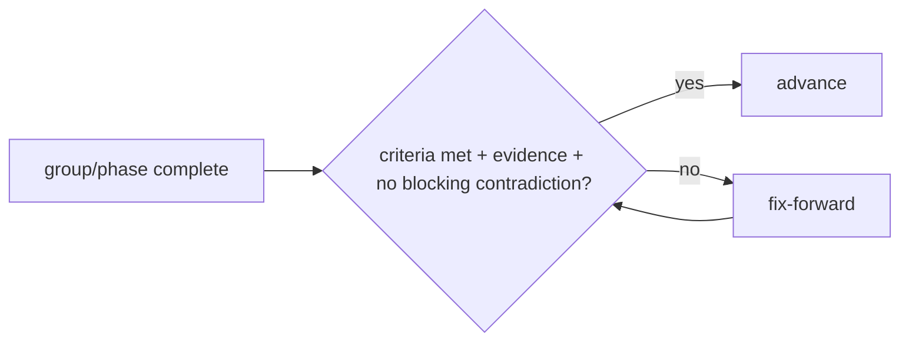
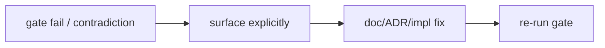

# Quad — Checkpoints

> **Engineering-process doc.** Owns the formal checkpoint gates and their pass/fail protocol. Conforms to [`MILESTONES.md`](MILESTONES.md), [`ENGINEERING_WORKFLOW.md`](ENGINEERING_WORKFLOW.md), [`LAUNCH_PLAN.md`](LAUNCH_PLAN.md), `process/SPEC_PLAN.md`. Does not rewrite any contract; contradictions → §7. No code/scaffolding; no versions; tenant-neutral (Rutgers Quad = tenant #1).

## 1. Purpose & Scope
Checkpoints are the **gates between phases/milestone-groups**: each defines what must be true before advancing, and what happens if it isn't. They make "don't lose the plot" enforceable. **In scope:** checkpoint list, template, pass/fail rules, contradiction handling, relationships. **Out of scope:** milestone content (`MILESTONES.md`), test detail (`TESTING.md`), launch gates' substance (`LAUNCH_PLAN.md`).

## 2. Responsibilities vs. Non-Responsibilities
| Checkpoints own | Don't own |
| --- | --- |
| Gate definitions + pass/fail protocol | Milestone content (`MILESTONES.md`) |
| Evidence + contradiction handling | Test matrix (`TESTING.md`) / launch substance (`LAUNCH_PLAN.md`) |

## 3. Principles
- **`C-DP-1` Gate before advancing** — a group/phase isn't "done" until its gate passes.
- **`C-DP-2` Fix-forward on failure** — fix and re-gate; never skip a critical gate.
- **`C-DP-3` Evidence required** — pass requires concrete evidence (tests/commands/results), not assertion (`PROC-INV-4`).
- **`C-DP-4` No skipped critical gates.**
- **`C-DP-5` No product behaviour ahead of its milestone** — the foundation is built; product features follow their milestone gates.

## 4. Checkpoint List
| Checkpoint | Gates | Recorded |
| --- | --- | --- |
| **Phase 1 — Product** | product/principles/non-goals/roadmap/launch coherent | `SPEC_PLAN.md` §8 ✅ |
| **Phase 2 — Architecture** | 19 arch docs consistent; invariants set | `SPEC_PLAN.md` §8 ✅ |
| **Phase 3 — Engineering/process** | security/perf/deploy/workflow/milestones/support complete + consistent | `SPEC_PLAN.md` §8 ✅ |
| **Phase 4 — Scaffolding** | templates/specs/engineers/ADRs/root config present | `SPEC_PLAN.md` §8 ✅ |
| **G1 Foundation** | workspace/CI/packages/app shells/db schema/testing harness green | **PASS** — §4a (2026-06-25) ✅ |
| **G2 Placement loop** | M10–M19 (place→event→projection→broadcast→render; reconnect converges) | **backend + render model + placement UI landed; e2e pending** — place→event→projection→read→WS fan-out (Redis cross-node)→`@quad/render` buffer→reconnect convergence all Docker-tested, and the web **two-step placement UI** (M17 — click a cell → pick a color → confirm → server-authoritative POST with the session cookie + idempotency key; anonymous → "sign in"; DC2 palette; a11y dialog/status). **Remaining:** the M19 *browser* e2e (needs the tenant-host proxy stood up so the web app's API calls carry the tenant Host) ⏳ |
| **G3 Auth/tenant/fairness** | M20–M29 (verified membership, isolation, cooldown enforced+fair) | **backend substantially done; gaps remain** — Redis sessions, magic-link front-door, `/session`, full + per-user revocation, role-gating, rotation-on-privilege-change; placement cooldown fail-closed in-tx; no anonymous writes, no default tenant. WS-handshake principal (M23): the WS connection now establishes `request.principal` when the handshake carries a valid session (anonymous viewing stays public — consistent with the public snapshot endpoint, by design), and **presence** is wired (`PresencePing` → `PresenceUpdated`; subscribe/leave broadcast the canvas's active count). **Dynamic cooldown** (M25–M26): opt-in load-based cooldown — a pure algorithm maps the recent canvas-wide placement rate (count over a 60 s window) to a value between a floor and the 5–20 min ceiling (`loadScore`/`dynamicCooldownMs`, unit-tested); the placement service measures the rate and applies it, and the placement result returns the live value for the client. Verified (Docker): the cooldown scales with load (0 recent → floor; busier → higher). **Frontend countdown** (M28): after a placement (or a `COOLDOWN_ACTIVE` 429's `retryAfterMs`), the canvas shows a live "Wait M:SS / Xs" countdown and disables Confirm until it elapses — display only; the server stays authoritative. Pure helpers (`formatCountdown`, `remainingMs`) unit-tested. **Redis fast-path** (M27): the load input is a per-canvas **Redis window counter** (`RedisRateCounter` — `GET` to read, `INCR`+`EXPIRE` to record) instead of a DB count per placement; falls back to the indexed DB count when Redis is absent (`InMemoryRateCounter` for single-node/tests, unit-tested). Opt-in via `QUAD_DYNAMIC_COOLDOWN` + `REDIS_URL`. Verified (Docker): the service reads/records via the counter and the cooldown scales. The fairness/cooldown group (M25–M28) is complete ✅ |
| **G4 Moderation** | M30–M39 (reversible+audited moderation; sanitized public surfaces) | **API complete; frontend + lifecycle-create pending** — member actions, role assignment, reports (file/list/resolve), roster, canvas-status lifecycle, tenant-config, **pixel + region rollback** (replay-correct compensating events; sanitized public history), profiles, leaderboards — all DC2-safe + audited. Admin canvas **create** (M37): `POST /api/v1/admin/canvas` creates a new term canvas as the active one — a new term supersedes the current one, so the old active canvas becomes a past-term **archive** (its viewers get a `CanvasLifecycleChanged` broadcast); serialized per tenant (advisory lock — no two-active race), validated (term required + unique → 409; dims 1..512 → 422), audited; profile + leaderboard UIs, a **report-filing control** on the canvas, and a **moderator console** (`/moderation` — lists the moderator-gated report queue + Resolve/Dismiss actions, one-at-a-time lock, non-moderators get an access message), and a **pixel inspector** (selecting a cell shows its sanitized placement history — color swatch + owner handle + time) all landed. The G4 user + moderator + admin **frontend surface is complete** ✅ |
| **G5 Replay/archive** | M40–M45 (archive dry-run + faithful replay proven) | **archives + final-state view** — archives list + per-term + replay **derivation metadata** (event count + seq range), and **`GET /api/v1/archives/{term}/snapshot`** returns a past term's **final canvas state** (its retained projection — view a completed term; immutable + cacheable). **Archives UI:** `/archives` lists past terms; `/archives/[term]` paints the term's final canvas (loads the snapshot into a `@quad/render` buffer) + shows its event count/seq range. **Point-in-time replay:** `GET /api/v1/archives/{term}/at/{seq}` reconstructs the archived canvas as of any `seq` by folding the event log (PixelPlaced sets / PixelRolledBack reverts), so a past term is scrubbable. Verified (Docker): reconstruct before an overwrite → the old color; after → the new; at seq 0 → empty; non-integer seq → 422. **Replay player:** `/archives/[term]/replay` scrubs/plays a term's evolution — a slider (0→toSeq) + Play/Pause drive `/at/{seq}` and paint each reconstructed frame (shared `paintSnapshot`; pure `replayStep`/`nextReplaySeq` unit-tested; stale-render guard). **Remaining:** projection checkpoints/keyframes (fold efficiency for very long terms) and pre-rendered replay **assets** (object storage) ⏳ |
| **G6 Launch readiness** | M50–M59 + all `LG-*` pass | **hardening done; launch gates partial** — all M50s hardening (rate limiting, security headers, access logging, proxy-aware IPs, body limits, metrics, readiness checks, graceful shutdown) + a build+run-verified production Dockerfile, plus **launch-gate CI checks**: high/critical dependency audit + load gate, and now the **full integration suite runs against real Postgres + Redis in CI** (service containers + migrate-deploy) — so every PR proves the **archive/replay dry run** (`LG-7`: snapshot + point-in-time reconstruction), **tenant isolation** (`LG-6`), **moderation reversal + audit** (`LG-3`: pixel/region rollback), and the **no-anonymous-write path + role gating** (`LG-4`). **Deployment manifest:** `docker-compose.prod.yml` (+ `.env.prod.example`) runs the full backend stack — Postgres + Redis + a one-shot **migrate** (applies the additive history) + the **API** (built image), wired with health-gated `depends_on` so the API starts only after the datastores are healthy AND migrations succeeded. **Verified end-to-end:** built the images, brought the stack up, migrate exited 0, and the API came up healthy with `/healthz` 200 and **`/readyz` 200 (`database:ok` + `redis:ok`)** — the "build → migrate → deploy → smoke" shape (`DEPLOYMENT.md` §7) proven against real datastores. **Web image:** `apps/web/Dockerfile` (Next **standalone** output, monorepo trace root) ships a slim runtime; the `web` service joins the compose. **Full stack verified end-to-end:** built all images, brought the stack up — Postgres+Redis healthy → migrate exit 0 → API healthy (`/readyz` 200) → **web healthy, `/` 200 serving the rendered app** (`<title>Quad</title>` + canvas). **Edge proxy:** a Caddy `edge` service fronts both on **one origin** (`DEPLOYMENT.md` §9) — `/api/*` (incl. the WebSocket) → `api`, everything else → `web`; Caddy preserves the Host so the API resolves the tenant (no default tenant). **Verified end-to-end:** through the edge, `/` → the rendered web app (200), `/api/v1/leaderboards` with `Host: rutgers.localhost` → **200 with the tenant resolved**, and an unknown Host → 404 "No tenant for this host" (Host-driven tenant routing proven; same-origin `NEXT_PUBLIC_API_BASE=''` now resolves — also the path that unblocks the browser e2e). **Backup/restore drill (`LG-8`):** `pnpm dr:drill` (`scripts/dr-drill.sh`) seeds a marker, `pg_dump`s the database, restores the dump into a fresh database, and asserts every table's row count matches + the marker survived — proving a no-data-loss restore (monitoring via `/metrics` is wired; runnable rehearsal, exits non-zero on mismatch). **Verified:** drill passes (8 tables match, marker restored). **Content policy (`LG-2`):** `docs/CONTENT_POLICY.md` defines the prohibited-content categories, the proportionate + audited moderator action ladder (rollback → resolve/dismiss → suspend → ban → reinstate; emergency freeze), and due-process/appeals — and it's **available to moderators in-app at `/policy`**, linked from the moderator console. **Remaining:** a live cloud target, on-call wiring (`LG-8`), legal/ToS/university approval (`LG-9`), rehearsed rollback/contingency (`LG-10`), and deploying to a live environment ⏳ |
| **Phase 5 — Consistency audit** | `CONSISTENCY_AUDIT.md` passes (whole corpus) | `CONSISTENCY_AUDIT.md` ✅ |

## 4a. Current State & G1 Foundation Readiness
*Snapshot for the foundation checkpoint — update as the foundation evolves.*

**Completed (merged to `main`):**
- **Specification corpus** complete (product / architecture / engineering-process docs, specs, templates, role guides, ADRs, consistency audit).
- **Workspace foundation** — pnpm + Turborepo, strict TypeScript (`tsconfig.base.json`), `.gitignore` / `.nvmrc` (Node 22), lockfile-based CI (`verify`).
- **Packages** — `@quad/core` (contracts), `@quad/config` (tenant registry/palette/env), `@quad/db` (Prisma schema + client/repositories), and leaf skeletons (`@quad/realtime` / `@quad/render` / `@quad/ui` / `@quad/eslint-config` / `@quad/tsconfig`).
- **Apps** — `apps/api` (Fastify health/readiness shell) and `apps/web` (Next tenant-aware shell).
- **`@quad/testing`** — local integration harness: tenant fixtures + **protocol-level** Postgres/Redis readiness, with unit + Docker-gated integration tests.
- **Repository protection** — `main` requires a PR, green `verify` (strict), and signed/verified commits; force-push and deletion are blocked.

**G1 result — PASS (2026-06-25).** Foundation verified end-to-end under Node 22:
- `pnpm install --frozen-lockfile` · `pnpm typecheck` · `pnpm build` · `pnpm check` (20/20) — all green (Turbo-orchestrated, so workspace deps build first).
- `@quad/testing` unit suite green (incl. readiness-timeout + credential-redaction tests); Docker-backed integration green — `docker compose up -d --wait postgres redis` → `pnpm --filter @quad/testing test:integration` (protocol-level Postgres `SELECT 1` + Redis `PING`) → `docker compose down`.
- `docker compose config` valid; CI `verify` required + strict on `main`; merges are squash-only.

**Expected G1 checks** (Node 22, Turbo-orchestrated so workspace deps build first): `pnpm install --frozen-lockfile` · `pnpm typecheck` · `pnpm build` · `pnpm check` · `docker compose config`. Docker-backed integration (separately): `docker compose up -d --wait postgres redis` → `pnpm --filter @quad/testing test:integration` → `docker compose down`.

**Local services available:** Docker + Compose with **Postgres 17** and **Redis 8** from `docker-compose.yml` (local-only creds; ports 5432 / 6379).

## 4b. G2 Placement Loop — in progress
**Landed (backend placement + read surface, M10–M13).** Server-authoritative `POST /api/v1/canvas/current/pixels`: validate (tenant → current **active** canvas → bounds → palette), then **one per-canvas-serialized transaction** (Postgres advisory lock) that enforces **idempotency replay + cooldown** and appends `PixelPlaced` + updates the projection atomically → `PlacePixelResultResponse`. **Read surface (M13):** `GET /api/v1/canvas/current` (metadata), `/snapshot` (projection for initial paint), `/pixels/{x}/{y}` (cell), and `/pixels/{x}/{y}/history` (cursor-paginated, oldest→newest) — all public, **DC2 attribution only**. Backed by `pixel_events` (append-only truth, FK-`RESTRICT`ed against deletion) + `pixels` (projection) tables (the repo's **first Prisma migration**).

- **Identity** is injected as a verified `Principal` at the service layer (`BE-INV-6`, `PRIN-NO-ANON`); the HTTP request→principal step (sessions) is owned by `AUTHENTICATION.md` / `ADR-0006` and deferred to the auth milestone, so write routes return **401** until then — no anonymous writes, no header bypass.
- **Cooldown** is a minimal fixed, fail-closed boundary derived from the event log; the dynamic load algorithm + Redis fast-path are deferred (`COOLDOWN.md`).
- **Realtime (M14–M15):** `@quad/realtime` holds a tenant-scoped subscription registry; `apps/api` serves a `@fastify/websocket` endpoint at `GET /api/v1/canvas/current/ws` — connect (tenant-resolved; unknown host → `WS_TENANT_MISMATCH` + close), `SubscribeCanvas` (tenant-scoped, acked; cross-tenant → `WS_FORBIDDEN`), and a server heartbeat. **Fan-out (M15):** a successful placement publishes `PixelPlaced` to a `RealtimeBus` — in-memory single-node, or **Redis pub/sub cross-node** — and each node delivers to its local subscribers via the registry. So **place → event → projection → broadcast → subscriber** works end-to-end (REST stays the only authoritative write path; Redis is transport only).
- **Render model (M16):** `@quad/render` holds a framework-agnostic `CanvasBuffer` — applies the REST snapshot (initial paint / reconnect base) + live `PixelPlaced` deltas with **seq-watermark dedupe** (reorder/duplicate-safe; the reconnect-convergence primitive) and dirty-region tracking — plus pure pan/zoom viewport math (screen↔cell, anchored zoom). Unit-tested in Node (no browser); the view layer draws dirty regions from it.
- **Web canvas (M17):** `apps/web` has a framework-agnostic `CanvasClient` (fetch metadata + snapshot, load the buffer, open the WS, `SubscribeCanvas`, apply `PixelPlaced` deltas) driven by a `'use client'` `CanvasView` that paints dirty regions to a `<canvas>` at `/canvas`. Network + socket are injected, so the controller is Node-unit-tested; `CanvasMetaResponse` now carries the canvas `id` for subscription. **Placement UI (M17):** `CanvasView` now supports a **two-step** placement — click a cell (red highlight) → pick a color from the DC2 tenant palette → Confirm → a server-authoritative `POST` with the session cookie + a fresh idempotency key; the in-flight confirm is **locked** (no double-placement), the authoritative 201 result is applied to the buffer (seq-deduped against the live delta) so it paints even mid-reconnect, and anonymous users get a "sign in" message. A11y: labelled canvas, `role=dialog` toolbar, `aria-pressed` swatches, `role=status` live region. Pure helpers (`cellFromPoint`, `placementStatusMessage`) are unit-tested. **Sign-in UI (auth frontend):** `/signin` (email → magic-link request) + `/signin/confirm` (reads `?token` → confirms → the server sets the httpOnly session cookie) + a `SessionBadge` on the canvas (reflects `GET /session` — "Signed in as @handle (role)" / "Sign in", with sign-out). The token is read from the URL only (never stored). Pure mappers (`isLikelyEmail`, `requestMessage`, `confirmMessage`) are unit-tested; the React pages are typecheck + `next build` verified. **Profile + leaderboard UIs (G4 frontend):** `/leaderboards` (ranked top placers, each linking to a profile) and `/profiles/[handle]` (DC2 — display/handle/role/joined + placement count; never email), with loading/empty/not-found states; a leaderboard link sits in the canvas header. Pure `ordinal` helper unit-tested; pages typecheck + `next build` verified.
- **Reconnect convergence (M18):** `CanvasClient` subscribes **before** loading the snapshot (queuing deltas, so none are lost in the gap) and, on an unexpected close, backs off, reopens, re-fetches the snapshot (fresh watermark), resubscribes, and resumes — convergent by construction (the buffer's seq dedup drops anything the new snapshot already covers). Unit-tested with an injected scheduler/socket (reconnect + no-reconnect-after-stop).
- **Auth (M20 + M20b):** a server-authoritative **session store** (opaque 256-bit tokens, server-side state with TTL, immediate revocation — `AUTH-INV-8`; in-memory + Redis) and a fail-closed **principal resolver** (session + **active membership** → principal; wrong-tenant/expired/no-membership → null). An identity plugin reads the `quad_session` cookie and sets `request.principal`, so placement **accepts authenticated writes** (the M10 401-stub lifts) while unauthenticated/no-membership stay `401`. The **magic-link front-door** is implemented (paths per `API.md`): `POST /auth/verify/request` (email-domain allowlist per `tenant.domains`, `AUTH-INV-4` → single-use token → injected mail transport), `POST /auth/verify/confirm` (tenant-bound: consume token → find-or-create user + participant membership → issue session only if the membership is active → httpOnly/`SameSite=Lax` cookie), `POST /auth/signout` (principal-gated revoke). `SameSite=Lax` is the CSRF mitigation for state-changing POSTs. Re-verifying never reinstates a suspended/banned membership. **End-to-end verified** (Docker): Rutgers email → token → session → authenticated placement; off-domain → 403; bad token → 409. `GET /api/v1/session` reflects the current identity (DC2 handle/role) or anonymous, for UI gating (server stays authoritative). The session store supports **`revokeAllForUser`** (a per-user index; a ban/suspension kills every session at once — `AUTH-INV-8` fully, in-memory + Redis). Server-side **role authorization** is in place — a `requireRole(min)` guard over the `participant < moderator < admin < operator` hierarchy that endpoints attach as a preHandler (401/403 enforced server-side; UI gating is never the control). Session **rotation-on-privilege-change** is implemented via the admin role-assignment endpoint (below) — a role change revokes the target's sessions.
- **Moderation — member actions (M30 start):** `POST /api/v1/moderation/actions` (moderator-gated via `requireRole`) handles `suspend_member`/`ban_member`/`reinstate_member` — it sets the membership status, **revokes all the target's sessions** on suspend/ban (`revokeAllForUser` — access cut at once), and writes an **append-only `moderation_actions` audit record** (DC4: actor, action, target, reason, time; FK-`RESTRICT`ed, no hard delete — the repo's first migration now includes it). Verified end-to-end (Docker): a moderator suspends a member → audited + the member can no longer place; non-moderator → 403; anonymous → 401. **Admin (role assignment):** `POST /api/v1/admin/roster/roles` (admin-gated) assigns a tenant role (`participant`/`moderator`/`admin`; `operator` is platform-level, rejected) — atomic with a DC4 audit record, and **rotates the target's sessions** (a privilege change forces re-auth, completing session rotation-on-privilege-change). Verified (Docker): admin promotes a member → audited + role updated + session revoked; non-admin → 403; `operator` → 422. **Reports queue:** `POST /api/v1/reports` (participant-gated — no anonymous reports) files a DC4 report (tenant+canvas scoped); `GET /api/v1/moderation/reports` (moderator-gated) returns the cursor-paginated queue (report content, not reporter identity). Verified (Docker): participant files → moderator sees it; anonymous → 401; non-moderator → 403. Moderators **resolve/dismiss** reports via `POST /moderation/actions` (`resolve_report`/`dismiss_report` → atomic status change + DC4 audit). `GET /api/v1/admin/roster` (admin-gated) lists members (DC2 handle/role/status, cursor-paginated; no email). `POST /api/v1/admin/canvas/lifecycle` (admin-gated) transitions the canvas (activate/freeze/archive) — atomic status change + DC4 audit + a best-effort `CanvasLifecycleChanged` WS broadcast; freezing stops placement (no active canvas) while reads continue. `GET /api/v1/admin/tenant/config` (admin-gated) returns the tenant's config (DC2/config only — slug/title/status/palette/term/domains; no secrets). **Pixel rollback:** a moderator reverses a placement via `POST /moderation/actions` (`pixel_rollback`, `targetRef` = `"x,y"`) — an append-only **`PixelRolledBack`** compensating event (nullable `newColor`) + the projection reverts to the prior placement's color/owner (or empties the cell) + a DC4 audit, all atomic under the per-canvas advisory lock; a best-effort `PixelRolledBack` WS broadcast lets clients revert (the `@quad/render` buffer applies it seq-deduped, like a delta). Verified (Docker): a moderator rolls back a pixel → reverts to empty + compensating event + audit. **Region rollback:** `region_rollback` (`targetRef` = `"x1,y1,x2,y2"`, area-capped) rolls back every placed cell in a rectangle — a `PixelRolledBack` compensating event per cell + one DC4 audit for the region, atomic under the per-canvas lock; a `RegionRolledBack` WS broadcast prompts clients to resync the snapshot. Verified (Docker): a moderator rolls back a 2×2 region → all placed cells revert + one audit + per-cell events. **Archives (G4 start):** `GET /api/v1/archives` (public, tenant-resolved, cursor-paginated, newest first) lists past-term archives (status `archived`); `GET /api/v1/archives/{term}` returns one term's metadata (404 for unknown/active terms) — both immutable + `Cache-Control: public`. Verified (Docker): an archived term lists + fetches; an active term is not an archive (404). **Profiles (G4):** `GET /api/v1/profiles/{handle}` (public, DC2 — handle/display/role/joinedAt + placement count; no email) and `GET /api/v1/profiles/me` (caller's own, principal-gated → 401 anonymous) — both tenant-scoped to active members. Verified (Docker): a member's public profile returns DC2 + `pixelsPlaced`; `/me` returns the caller's own; unknown handle → 404; anonymous `/me` → 401. **Leaderboards (G4):** `GET /api/v1/leaderboards` (public, DC2) ranks active members by placement count — `category`/`window` are **allow-listed** (`placements`/`all`; unknown → 422), banned/handle-less users are omitted, short public cache. Verified (Docker): two members rank by count desc; unknown category → 422; no email leaked. **Replay metadata (G4):** `GET /api/v1/archives/{term}/replay` returns derivation metadata for an archived term — event count + seq range (what a replay would cover); `available:false` until pre-rendered assets are generated to object storage. Verified (Docker): an archived term returns its event count + seq range; unknown term → 404. **Rate limiting (M50s/G5 hardening):** abuse-protection request limiting (`RATE_LIMITED` + `Retry-After`) — **distinct from the placement cooldown** (`COOLDOWN_ACTIVE`): cooldown is per-user placement fairness in the write transaction, this is coarse per-principal/per-IP request-rate protection at the HTTP boundary. Fixed-window limiter (in-memory single-node default; **Redis-backed cross-node** in production, reusing the session client), keyed per tenant + subject, **fails open** on backend error. On by default for placement writes (generous budget, well above the human cooldown rate), the **auth verify endpoints** (per-IP anti-spam on magic-link request / anti-brute-force on confirm), and **report filing** (per-member anti-spam) — each its own bucket/budget, one shared limiter. Verified: limiter unit tests (allow→block→reset, key isolation); HTTP — placement, auth-verify, and report filing each past their budget → 429 `RATE_LIMITED` + `Retry-After`. **Security headers (M50s/G5 hardening):** a fp-wrapped `onRequest` hook sets defensive headers on **every** response (incl. 404/errors) — `X-Content-Type-Options: nosniff`, `X-Frame-Options: DENY`, `Referrer-Policy: no-referrer`, `Strict-Transport-Security`, a strict `Content-Security-Policy: default-src 'none'; frame-ancestors 'none'` (JSON API), `X-Permitted-Cross-Domain-Policies: none`, `Cross-Origin-Resource-Policy: same-origin`. Verified (unit): headers present on a 200 and on a 404. **Access logging (M50s/G5 observability):** an fp-wrapped `onResponse` hook emits one **DC-safe** structured line per request — request id, method, the matched **route template** (e.g. `/api/v1/profiles/:handle`, not the concrete value; path-only, no query string), status, duration (ms), and resolved tenant; deliberately no email/DC3, cookies, auth headers, or body. The payload builder is pure + unit-tested (route-template vs path fallback, rounding, DC-safety assertion). **Request body limits (M50s/G5 hardening):** every endpoint takes a tiny JSON body, so the Fastify `bodyLimit` is capped at **16 KiB** (well below the 1 MiB default) — an oversized payload is rejected **413** before it is buffered (memory-exhaustion defense; configurable). Verified (Docker): a body over the limit → 413. **Metrics (M50s/G5 observability):** `GET /metrics` renders **Prometheus** text — `http_requests_total{method,route,status}` counted by an `onResponse` hook keyed by the **route template** (bounded cardinality, like the access log); counts only, no DC (network-restrict to the scraper in production). Verified: registry unit tests (count + label escaping); HTTP — `/metrics` returns the counter after a request. **Readiness hardening (M50s/G5):** `/readyz` now runs the configured **dependency checks** (the composition root registers a DB `SELECT 1` and a Redis `PING`) — **200 ready** only when checks exist AND all pass, else **503**; failures surface a per-check `fail` and **never leak** the error/DC detail. `/healthz` stays pure liveness (process up). Verified (unit): no checks → 503; all pass → 200 ready; a failing check → 503 with no internal detail (e.g. `ECONNREFUSED`) in the body; liveness unaffected. **Graceful shutdown (M50s/G5):** on `SIGTERM`/`SIGINT` the server **drains** in-flight requests (`app.close`) and only then closes the DB, Redis, and bus — each best-effort (a failing dependency close still attempts the rest), with a **watchdog** that forces exit if anything hangs (a stuck dependency can't wedge the pod) and **idempotent** across repeated signals. The handler is an injectable pure helper (`createGracefulShutdown`); composition root supplies `app.close` + the dependency closers. Verified (unit, 5 cases): drain→cleanups→exit 0; a cleanup fails → exit 1 but the rest still run; close fails → deps still closed; repeated signal is a no-op; a hang trips the watchdog → exit 1. **Deploy manifest (M50s/G5):** a production multi-stage `apps/api/Dockerfile` (+ `.dockerignore`) — builds the whole pnpm/Turbo workspace, generates the Prisma client, and ships a `node:22-slim` runtime running as the non-root `node` user on `0.0.0.0:$PORT`, with `DATABASE_URL`/`REDIS_URL`/`TRUST_PROXY` injected at deploy time and migrations applied out-of-band (`db:migrate:deploy`). **Verified by building the image and running the container:** boots, binds `0.0.0.0:3000`, serves `/healthz` 200 with the security headers + access-log line, `/readyz` 503 (no DB), `/metrics` exposed. Image is ~1.5 GB (carries dev dependencies — prod-only trimming is a follow-up; pnpm's `prune`/`deploy` paths need a TTY or `inject-workspace-packages`, so they're avoided here). **Security gate (G6 / LG):** the CI `verify` job now runs `pnpm audit --audit-level high` — a **high/critical** dependency advisory **fails the build** (moderate/low are reported but don't block). Currently green: 2 known **moderate** advisories remain, both transitive + dev/build-time — `@hono/node-server` (under the Prisma CLI's `@prisma/dev`) and `postcss` (under Next's build). They are present on disk in the image (which ships `node_modules` including dev deps until prod-trimming lands) but **not exercised at runtime** — the API never imports either; they belong to the Prisma CLI dev server and Next's build-time CSS pipeline. The audit runs **before** lint/build so a vulnerable build-time dependency stops the job before it executes. **Load gate (G6 / LG):** `pnpm load:gate` (`scripts/load-gate.mjs`, wired into CI) boots the API in-process on an ephemeral port and drives it over **real HTTP** at fixed concurrency for a fixed duration, then **fails** on a throughput / tail-latency / error-rate regression (default thresholds ≥2000 rps, p99 ≤50 ms, errors ≤1%). Self-contained (targets the dependency-free liveness path — no Postgres/Redis). Observed locally: **~15,200 rps, p99 6.5 ms, 0 errors** — ~7× headroom over the gate, so it catches real regressions without flaking on shared runners. **Proxy-aware client IP:** configurable `trustProxy` (off by default; set from `TRUST_PROXY` in the composition root) so behind the LB `request.ip` resolves the real client from `X-Forwarded-For` — per-IP limiting of anonymous traffic isn't lumped under the proxy socket IP. Verified: two distinct forwarded client IPs get independent verify budgets. **Follow-on:** metrics/counters endpoint; pre-rendered replay assets; the **mutable** tenant-config `PUT`; M19 browser e2e (tenant-host proxy).
- Verified with Docker-backed integration tests: `pnpm --filter api test:integration` (21/21 — placement, the read surface, and WS subscribe/heartbeat/fan-out) and `pnpm --filter @quad/realtime test:integration` (cross-node Redis delivery); plus `@quad/realtime` + `@quad/render` + `web` (`CanvasClient`) unit tests, and a green `next build`.

**G2 — placement loop: functionally complete, verified per layer.** Every link — `place → PixelPlaced event → projection → broadcast → subscriber → buffer → painted canvas`, and reconnect convergence — is implemented and tested (server links via Docker-backed integration tests; render model + client orchestration + reconnect via unit tests). **Remaining (M19):** a full browser end-to-end (Playwright against running api+web — place a pixel, assert it repaints a live client) as the capstone before formally stamping **G2 = PASS**. That e2e belongs with the broader QA/e2e harness and needs the web↔api host wiring; tracked as a follow-on.

**Deferred (own milestones):** moderation, leaderboards, profiles, archives, heatmaps, full session auth, and **read visibility gating** (tenant `readOnlyViewing` / `archiveVisibility` on the public read endpoints) — visibility pairs with auth/membership, so reads are currently open per the documented public-read surface.

## 5. Checkpoint Template
Each checkpoint records: **scope · files/milestones covered · required evidence · tests/commands · risks · contradictions found · pass/fail decision · fix-forward actions.** (Phase checkpoints live in `SPEC_PLAN.md` §8; implementation gates G1–G6 are recorded against their milestone group.)

## 6. Pass/Fail Rules
- **Pass** = all gate criteria met **with evidence** and **no blocking contradictions**.
- **Fail** = any criterion unmet or a blocking contradiction found → **do not advance**; enter fix-forward (§7); re-run the gate.
- A gate may pass **with noted non-blocking risks** carried forward (logged, owned).

## 7. Contradiction Handling
If a checkpoint finds a contradiction with a settled doc: **stop, surface it explicitly**, and resolve via doc-update/ADR (`ENGINEERING_WORKFLOW.md` §15) — **never silently diverge**. Blocking contradiction ⇒ fail the gate until resolved.

## 8. Relationship to `MILESTONES.md`
Gates G1–G6 sit at the milestone-group boundaries defined in `MILESTONES.md` §13; a failed gate blocks the next group (`MILESTONE-INV-7`).

## 9. Relationship to `LAUNCH_PLAN.md`
**G6** is the operational expression of the `LAUNCH_PLAN.md` go/no-go gates (`LG-1…LG-10`); passing G6 = launch-ready.

## 10. Checkpoint Invariants (`CHECKPOINT-INV-*`)
- **`CHECKPOINT-INV-1`** No group/phase advances until its gate passes with evidence.
- **`CHECKPOINT-INV-2`** Failure → fix-forward + re-gate; critical gates are never skipped.
- **`CHECKPOINT-INV-3`** Contradictions are surfaced and resolved (doc/ADR), never silently bypassed.
- **`CHECKPOINT-INV-4`** Every checkpoint records evidence + a pass/fail decision.
- **`CHECKPOINT-INV-5`** G6 requires all `LG-*` launch gates.

## 11. Diagrams

## 12. Document Control
- **Path:** `docs/CHECKPOINTS.md` · **Purpose:** formal checkpoint gates + pass/fail protocol.
- **Dependencies:** `MILESTONES`, `ENGINEERING_WORKFLOW`, `LAUNCH_PLAN`, `SPEC_PLAN`. **Consumed by:** all phase/gate execution.
- **Acceptance:** ☑ checkpoint list (phases + G1–G6 + audit) ☑ template ☑ pass/fail ☑ contradiction handling ☑ rel to MILESTONES/LAUNCH ☑ `CHECKPOINT-INV-*` ☑ 2 diagrams ☑ no code/versions ☑ tenant-neutral.
- **Next:** `docs/TESTING.md`.
