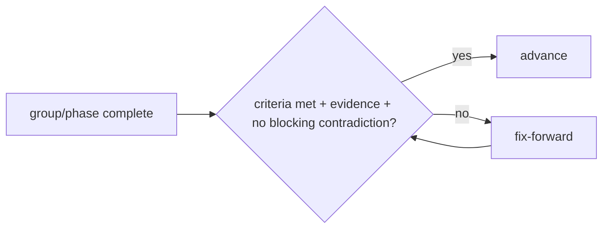
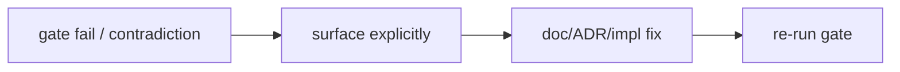

# Quad — Checkpoints

> **Engineering-process doc.** Owns the formal checkpoint gates and their pass/fail protocol. Conforms to [`MILESTONES.md`](MILESTONES.md), [`ENGINEERING_WORKFLOW.md`](ENGINEERING_WORKFLOW.md), [`LAUNCH_PLAN.md`](LAUNCH_PLAN.md), `process/SPEC_PLAN.md`. Does not rewrite any contract; contradictions → §7. No code/scaffolding; no versions; tenant-neutral (Rutgers Quad = tenant #1).

## 1. Purpose & Scope
Checkpoints are the **gates between phases/milestone-groups**: each defines what must be true before advancing, and what happens if it isn't. They make "don't lose the plot" enforceable. **In scope:** checkpoint list, template, pass/fail rules, contradiction handling, relationships. **Out of scope:** milestone content (`MILESTONES.md`), test detail (`TESTING.md`), launch gates' substance (`LAUNCH_PLAN.md`).

## 2. Responsibilities vs. Non-Responsibilities
| Checkpoints own | Don't own |
| --- | --- |
| Gate definitions + pass/fail protocol | Milestone content (`MILESTONES.md`) |
| Evidence + contradiction handling | Test matrix (`TESTING.md`) / launch substance (`LAUNCH_PLAN.md`) |

## 3. Principles
- **`C-DP-1` Gate before advancing** — a group/phase isn't "done" until its gate passes.
- **`C-DP-2` Fix-forward on failure** — fix and re-gate; never skip a critical gate.
- **`C-DP-3` Evidence required** — pass requires concrete evidence (tests/commands/results), not assertion (`PROC-INV-4`).
- **`C-DP-4` No skipped critical gates.**
- **`C-DP-5` No product behaviour ahead of its milestone** — the foundation is built; product features follow their milestone gates.

## 4. Checkpoint List
| Checkpoint | Gates | Recorded |
| --- | --- | --- |
| **Phase 1 — Product** | product/principles/non-goals/roadmap/launch coherent | `SPEC_PLAN.md` §8 ✅ |
| **Phase 2 — Architecture** | 19 arch docs consistent; invariants set | `SPEC_PLAN.md` §8 ✅ |
| **Phase 3 — Engineering/process** | security/perf/deploy/workflow/milestones/support complete + consistent | `SPEC_PLAN.md` §8 ✅ |
| **Phase 4 — Scaffolding** | templates/specs/engineers/ADRs/root config present | `SPEC_PLAN.md` §8 ✅ |
| **G1 Foundation** | workspace/CI/packages/app shells/db schema/testing harness green | **built & merged; verification next** (`chore/foundation-verification`) ⏳ |
| **G2 Placement loop** | M10–M19 (place→event→projection→broadcast→render; reconnect converges) | impl |
| **G3 Auth/tenant/fairness** | M20–M29 (verified membership, isolation, cooldown enforced+fair) | impl |
| **G4 Moderation** | M30–M39 (reversible+audited moderation; sanitized public surfaces) | impl |
| **G5 Replay/archive** | M40–M45 (archive dry-run + faithful replay proven) | impl |
| **G6 Launch readiness** | M50–M59 + all `LG-*` pass | impl |
| **Phase 5 — Consistency audit** | `CONSISTENCY_AUDIT.md` passes (whole corpus) | `CONSISTENCY_AUDIT.md` ✅ |

## 4a. Current State & G1 Foundation Readiness
*Snapshot for the foundation checkpoint — update as the foundation evolves.*

**Completed (merged to `main`):**
- **Specification corpus** complete (product / architecture / engineering-process docs, specs, templates, role guides, ADRs, consistency audit).
- **Workspace foundation** — pnpm + Turborepo, strict TypeScript (`tsconfig.base.json`), `.gitignore` / `.nvmrc` (Node 22), lockfile-based CI (`verify`).
- **Packages** — `@quad/core` (contracts), `@quad/config` (tenant registry/palette/env), `@quad/db` (Prisma schema + client/repositories), and leaf skeletons (`@quad/realtime` / `@quad/render` / `@quad/ui` / `@quad/eslint-config` / `@quad/tsconfig`).
- **Apps** — `apps/api` (Fastify health/readiness shell) and `apps/web` (Next tenant-aware shell).
- **`@quad/testing`** — local integration harness: tenant fixtures + **protocol-level** Postgres/Redis readiness, with unit + Docker-gated integration tests.
- **Repository protection** — `main` requires a PR, green `verify` (strict), and signed/verified commits; force-push and deletion are blocked.

**On a branch (not merged):** documentation/orientation updates (this branch, `docs/foundation-checkpoint-prep`).

**Remaining before G1 passes:** run the full foundation verification (below) and record the result against this gate.

**Expected G1 checks** (Node 22): `pnpm install --frozen-lockfile` · `pnpm -r typecheck` · `pnpm -r build` · `pnpm check` (lint/typecheck/test/build) · `docker compose config` + a Docker-up integration run (`docker compose up -d postgres redis` → `pnpm test:integration`). CI `verify` green on the PR.

**Local services available:** Docker + Compose with **Postgres 17** and **Redis 8** from `docker-compose.yml` (local-only creds; ports 5432 / 6379).

**Do not implement yet:** any product behaviour — pixel placement, event-log writes, projections, auth, WebSockets, the frontend canvas, or moderation. G1 verifies the **foundation**, not product features.

**Next checkpoint task** runs on a dedicated branch: **`chore/foundation-verification`** (work-descriptive; no task/milestone numbers).

## 5. Checkpoint Template
Each checkpoint records: **scope · files/milestones covered · required evidence · tests/commands · risks · contradictions found · pass/fail decision · fix-forward actions.** (Phase checkpoints live in `SPEC_PLAN.md` §8; implementation gates G1–G6 are recorded against their milestone group.)

## 6. Pass/Fail Rules
- **Pass** = all gate criteria met **with evidence** and **no blocking contradictions**.
- **Fail** = any criterion unmet or a blocking contradiction found → **do not advance**; enter fix-forward (§7); re-run the gate.
- A gate may pass **with noted non-blocking risks** carried forward (logged, owned).

## 7. Contradiction Handling
If a checkpoint finds a contradiction with a settled doc: **stop, surface it explicitly**, and resolve via doc-update/ADR (`ENGINEERING_WORKFLOW.md` §15) — **never silently diverge**. Blocking contradiction ⇒ fail the gate until resolved.

## 8. Relationship to `MILESTONES.md`
Gates G1–G6 sit at the milestone-group boundaries defined in `MILESTONES.md` §13; a failed gate blocks the next group (`MILESTONE-INV-7`).

## 9. Relationship to `LAUNCH_PLAN.md`
**G6** is the operational expression of the `LAUNCH_PLAN.md` go/no-go gates (`LG-1…LG-10`); passing G6 = launch-ready.

## 10. Checkpoint Invariants (`CHECKPOINT-INV-*`)
- **`CHECKPOINT-INV-1`** No group/phase advances until its gate passes with evidence.
- **`CHECKPOINT-INV-2`** Failure → fix-forward + re-gate; critical gates are never skipped.
- **`CHECKPOINT-INV-3`** Contradictions are surfaced and resolved (doc/ADR), never silently bypassed.
- **`CHECKPOINT-INV-4`** Every checkpoint records evidence + a pass/fail decision.
- **`CHECKPOINT-INV-5`** G6 requires all `LG-*` launch gates.

## 11. Diagrams

## 12. Document Control
- **Path:** `docs/CHECKPOINTS.md` · **Purpose:** formal checkpoint gates + pass/fail protocol.
- **Dependencies:** `MILESTONES`, `ENGINEERING_WORKFLOW`, `LAUNCH_PLAN`, `SPEC_PLAN`. **Consumed by:** all phase/gate execution.
- **Acceptance:** ☑ checkpoint list (phases + G1–G6 + audit) ☑ template ☑ pass/fail ☑ contradiction handling ☑ rel to MILESTONES/LAUNCH ☑ `CHECKPOINT-INV-*` ☑ 2 diagrams ☑ no code/versions ☑ tenant-neutral.
- **Next:** `docs/TESTING.md`.
