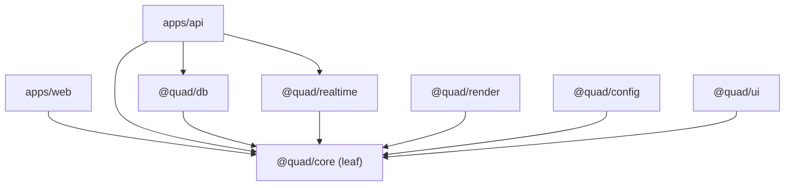
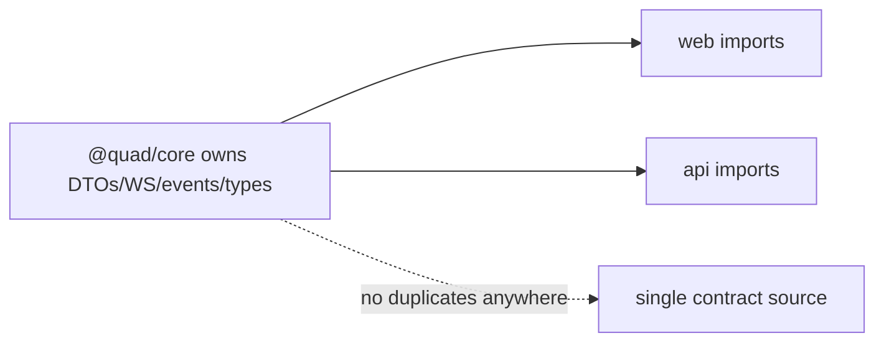

# Quad: Code Quality & Architecture Fitness

> **Engineering-process doc.** Owns coding standards, architecture fitness rules, dependency boundaries, and maintainability. Conforms to `ARCHITECTURE.md`, `ENGINEERING_WORKFLOW.md`, all Phase 2 docs. Does not rewrite contracts; contradictions → unresolved risks. No code/lint-configs (Phase 4); no versions (`TECH_BASELINE.md`); tenant-neutral (Rutgers Quad = tenant #1).

## 1. Purpose & Scope
Code quality is how the codebase **resists entropy** under engineering, milestone-by-milestone development. **In scope:** quality principles, package boundary rules, forbidden patterns, lint/typecheck expectations, architecture fitness checks, dependency + review + refactor rules. **Out of scope:** the test strategy (`TESTING.md`), the review *process* (`REVIEW_PROCESS.md`), concrete lint configs (Phase 4).

## 2. Responsibilities vs. Non-Responsibilities
| Code quality owns | Doesn't own |
| --- | --- |
| Standards + boundary rules + fitness checks | Test strategy (`TESTING.md`) |
| Forbidden patterns + dependency direction | PR review process (`REVIEW_PROCESS.md`) |

## 3. Principles
- **`Q-DP-1` Strict TypeScript**: strict mode; **no `any` in the domain** (`@quad/core`).
- **`Q-DP-2` Clean Architecture**: dependencies point inward to `@quad/core` (`ARCH-INV-7`).
- **`Q-DP-3` Small modules**: single-responsibility; readable over clever.
- **`Q-DP-4` Explicit boundaries**: each package owns its concern; cross-boundary only via public interfaces.
- **`Q-DP-5` Tests with behavior**: behavior changes ship with tests (`TESTING.md`).

## 4. Package Boundary Rules
| Package | Owns | May import |
| --- | --- | --- |
| `@quad/core` | domain + contracts (pure, no I/O) | nothing internal (leaf) |
| `@quad/db` | persistence/repositories (only DB I/O) | `core` |
| `@quad/realtime` | WS + pub/sub (only socket/pub-sub I/O) | `core` |
| `@quad/render` | canvas engine | `core` |
| `@quad/config` | tenant/palette/env config | `core` |
| `@quad/ui` | shared React components | `core` |
| `apps/api` | command handling/transport/jobs | `core`, `db`, `realtime`, `config` |
| `apps/web` | presentation | `core`, `ui`, `render`, `config` |
Dependencies point **inward**; `core` imports no adapter/app; `apps/web` has **no DB access**.

## 5. Forbidden Patterns
- **Duplicate DTOs** (contracts only in `@quad/core`).
- **Untyped WS payloads.**
- **Business logic in React components.**
- **Direct DB writes outside repositories/services.**
- **Hardcoded tenant assumptions** outside `@quad/config`.
- **Undocumented endpoints** (all in `API.md`).
- **Hidden global state.**
- **Unbounded queries** (always paginate/scope).
Each maps to a fitness check (§7) and a review rejection reason (`REVIEW_PROCESS.md`).

## 6. Lint / Typecheck Expectations
Strict TS + lint gate every PR (`TESTING.md` §4); no `any` in domain; consistent module resolution (`tsconfig.base.json`, Phase 4); imports respect boundary rules; dead code/`TODO`-without-issue flagged. Concrete configs are Phase-4 scaffolding.

## 7. Architecture Fitness Checks
Automated/CI checks (where feasible) for: dependency direction (no inward→outward imports; `core` is a leaf); no DB I/O outside `@quad/db`; no socket I/O outside `@quad/realtime`; no tenant literals in shared logic; no business logic in `apps/web` components; every API route present in `API.md`; no duplicate contract types. A failing fitness check blocks merge.

## 8. Dependency Rules
Internal deps via `workspace:*`; the inward-pointing direction in §4 is enforced. External deps: vetted, minimal, security-scanned (`SECURITY.md`/`DEPLOYMENT.md`); versions per `TECH_BASELINE.md` (not redeclared elsewhere). New external deps justified in the PR.

## 9. Code-Review Quality Checks
Reviewers verify §3–§8 (boundaries, forbidden patterns, fitness, typing) alongside spec/tests/docs (`REVIEW_PROCESS.md`); a quality violation alone is grounds for rejection.

## 10. Refactor Rules
Refactors preserve behavior + invariants, **no contract drift**, tests stay green, and don't expand scope (`ENGINEERING_WORKFLOW.md` §10). No speculative rewrites; refactor in small, reviewable steps tied to a need.

## 11. Code-Quality Invariants (`QUALITY-INV-*`)
- **`QUALITY-INV-1`** Strict TS; no `any` in the domain.
- **`QUALITY-INV-2`** Dependencies point inward to `@quad/core`; `core` is pure/leaf; `apps/web` has no DB access.
- **`QUALITY-INV-3`** Contracts exist only in `@quad/core`; no duplicate/untyped payloads.
- **`QUALITY-INV-4`** No business logic in React; no DB writes outside repos/services; no tenant literals in shared logic.
- **`QUALITY-INV-5`** No undocumented endpoints, hidden global state, or unbounded queries.
- **`QUALITY-INV-6`** Fitness checks gate merge; refactors preserve behavior + invariants without scope creep.

## 12. Diagrams

## 13. Document Control
- **Path:** `docs/CODE_QUALITY.md` · **Purpose:** standards, fitness rules, dependency boundaries, maintainability.
- **Dependencies:** `ARCHITECTURE`, `ENGINEERING_WORKFLOW`, all Phase 2 docs, `TECH_BASELINE`. **Consumed by:** `REVIEW_PROCESS`, `TESTING`, every implementation milestone, Phase-4 lint/tsconfig scaffolding.
- **Acceptance:** ☑ principles (strict TS, clean arch) ☑ package boundary rules ☑ forbidden patterns ☑ lint/typecheck ☑ architecture fitness checks ☑ dependency rules ☑ review quality checks ☑ refactor rules ☑ `QUALITY-INV-*` ☑ 2 diagrams ☑ no code/versions ☑ tenant-neutral.
- **Next:** `docs/REVIEW_PROCESS.md`.
