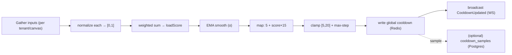
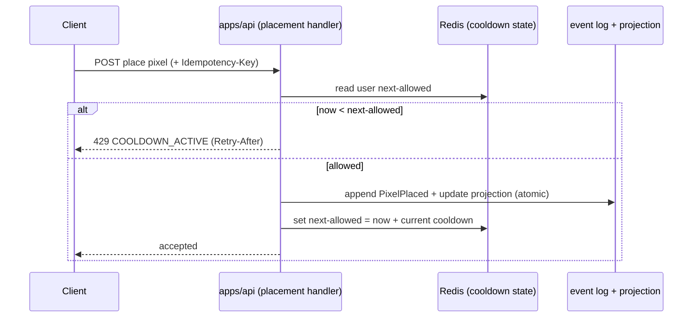
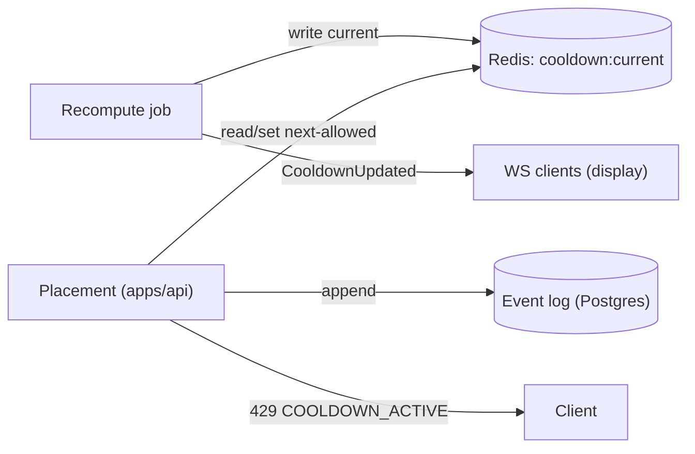
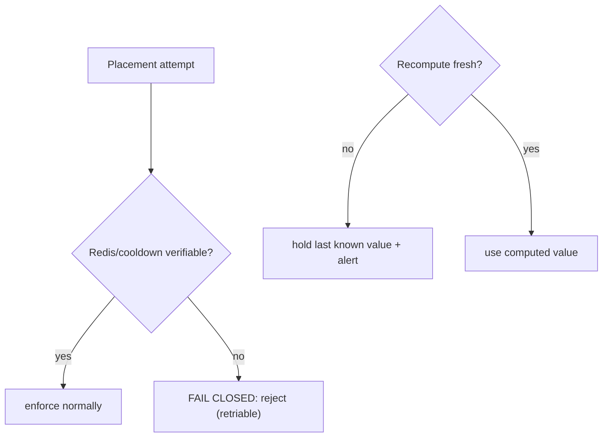

# Quad — Dynamic Global Cooldown

> **This document owns the cooldown: the fairness throttle that gates how often a student may place a pixel.** It defines the load-score model, the score→cooldown mapping, smoothing/anti-oscillation, Redis state, enforcement semantics, and failure/fallback behavior. It conforms to [`PRODUCT.md`](PRODUCT.md), [`PRINCIPLES.md`](PRINCIPLES.md), [`BACKEND.md`](BACKEND.md), [`API.md`](API.md), [`WEBSOCKETS.md`](WEBSOCKETS.md), [`EVENT_SOURCING.md`](EVENT_SOURCING.md), [`DATABASE.md`](DATABASE.md), [`AUTHENTICATION.md`](AUTHENTICATION.md), and [`MULTI_TENANCY.md`](MULTI_TENANCY.md); IDs cited (`P-*`, `PRIN-*`, `BE-INV-*`, `ES-INV-*`, `API-INV-*`, `WS-INV-*`, `TENANT-INV-*`).
>
> **Altitude:** algorithm + enforcement architecture. **No** code, Redis/Lua scripts, cron/worker files, schemas, or config files. Example weights/intervals are **illustrative defaults**, not pinned constants. **No** versions (`TECH_BASELINE.md`). The formal strategy is routed to **`ADR-0008`**.
>
> **Naming:** platform = **Quad**; **Rutgers Quad** = tenant #1 (example). Cooldown is per-tenant; no tenant literal in logic.

---

## 1. Purpose & Scope

The cooldown is how Quad keeps the canvas **fair and survivable under load**: one global value, identical for everyone, that rises with activity (slowing placement, raising the stakes of each pixel) and falls when quiet (encouraging participation). It is the operational embodiment of `PRIN-FAIRNESS`/`PRIN-EQUAL-POWER` and `P-COOL-1…7`.

**In scope:** fairness principles, the product contract (5–20 min), state model, load-score inputs + formula, score→cooldown mapping, smoothing/anti-oscillation, enforcement flow, Redis key model, relationships to Postgres/WS/API, tenant isolation, moderation/admin stance, failure/fallback, observability, security, testing, invariants.

**Out of scope (owned elsewhere):** REST error shape/catalog (`API.md`), WS message contracts (`WEBSOCKETS.md`), physical persistence (`DATABASE.md`), placement event + idempotency semantics (`EVENT_SOURCING.md`), full abuse threat model (`SECURITY.md`), the formal ADR (`ADR-0008`).

---

## 2. Responsibilities vs. Non-Responsibilities

| Cooldown **owns** | It does **not** own |
| --- | --- |
| The load-score model + score→cooldown mapping | The REST error shape (`API.md`) / WS message (`WEBSOCKETS.md`) |
| Smoothing/anti-oscillation + recompute cadence | Placement event append/idempotency *semantics* (`EVENT_SOURCING.md`) |
| Redis cooldown state model + enforcement check | Physical persistence (`DATABASE.md`) |
| Tenant-scoped cooldown + fail-closed posture | The full abuse threat model (`SECURITY.md`) |

---

## 3. Fairness Principles

- **`COOL-DP-1` Global per tenant/canvas** — at any instant one cooldown value applies to the whole tenant canvas (`P-COOL-1`).
- **`COOL-DP-2` Equal power** — everyone placing in the same window waits the same (`PRIN-EQUAL-POWER`).
- **`COOL-DP-3` No bypass** — no paid, earned, admin, or moderator path shortens any user's cooldown (`P-COOL-6`, `NG-UNEQUAL-POWER`).
- **`COOL-DP-4` No client authority** — clients display the cooldown; the server enforces it (`FE-INV-3`, `WS-INV-6`).
- **`COOL-DP-5` No silent changes** — the value changes gradually and **observably** (`P-COOL-4`, `§19`).

---

## 4. Product Contract

- **Minimum: 5 minutes. Maximum: 20 minutes.** These bounds are **never** exceeded (`P-COOL-2`, `COOL-INV-2`).
- The **current global cooldown is visible** to everyone; each user sees their **own remaining** cooldown as a countdown (`P-COOL-5`).
- **Changes are gradual, not jumpy** (`P-COOL-4`) — achieved by smoothing + a max step per recompute (`§9`).
- A tenant may narrow within `[5, 20]` via config but **never beyond** the platform bounds.

---

## 5. Cooldown State Model

| State | Where | Notes |
| --- | --- | --- |
| **Global cooldown value** (per tenant/canvas) | Redis (authoritative live) | Current enforced value; updated by the recompute loop |
| **Per-user next-allowed timestamp** | Redis | When the user may next place; absence ⇒ no active cooldown |
| **Load input metrics** | Redis (+ observability) | Windowed counters/gauges feeding the score |
| **Presence/concurrency** | Redis | Approximate active count (`WEBSOCKETS.md` §16) |
| **Sampled cooldown history** *(optional)* | Postgres (`cooldown_samples`) | Durable value-over-time for analytics/replay/fairness audit |

Live cooldown state is **Redis-owned and ephemeral**; losing it resets timers but **destroys no history** (`DB-INV-12`, `COOL-INV-8`).

---

## 6. Load-Score Inputs

Each input is a signal of system pressure, normalized to `[0,1]` (per tenant/canvas):

| Input | Signal | Source |
| --- | --- | --- |
| **Concurrent users / presence** | demand | Redis presence (`WEBSOCKETS.md`) |
| **Recent placement rate** (placements/min) | demand | Redis windowed counter |
| **Placement hot-path latency** (p95) | api strain | observability/metrics |
| **WS fan-out pressure** (lag/backpressure) | realtime strain | `@quad/realtime` metrics |
| **Redis / Postgres latency** | infra strain | datastore metrics |
| **Error / rate-limit rate** | instability | api metrics |

---

## 7. Load-Score Formula (Architecture Level)

Each raw metric is normalized against a tenant-configured `min`/`target`:

```
norm(x) = clamp01( (x − min) / (target − min) )
loadScore = clamp01( Σ wᵢ · norm(metricᵢ) )      // weights sum to 1
```

**Illustrative default weights** (tunable; `ADR-0008`):

| Input | Weight |
| --- | --- |
| Concurrent users / presence | 0.30 |
| Recent placement rate | 0.25 |
| Placement hot-path latency | 0.20 |
| WS fan-out pressure | 0.10 |
| Redis + Postgres latency | 0.10 |
| Error / rate-limit rate | 0.05 |

`loadScore ∈ [0,1]`. Missing/invalid inputs are handled conservatively (`§18`).

---

## 8. Score → Cooldown Mapping

Default is the **linear** mapping from the product handoff:

```
cooldownTarget(min) = 5 + smoothedScore × 15      // smoothedScore ∈ [0,1]
cooldown = clamp(cooldownTarget, 5, 20)
```

- `score 0 → 5 min`; `score 1 → 20 min` (`P-COOL-3`).
- **Why linear by default:** it's predictable, matches the product spec, and is easy to reason about/observe. A **piecewise/convex** alternative (stay near 5 until activity is high, then ramp) is possible if low-activity participation needs more encouragement — deferred to `ADR-0008` as a tuning choice. The mapping is always clamped to `[5,20]`.

---

## 9. Smoothing / Anti-Oscillation

To satisfy "gradual, not jumpy" (`P-COOL-4`):

- **Exponential smoothing of the score:** `smoothedScoreₜ = α·loadScoreₜ + (1−α)·smoothedScoreₜ₋₁` (illustrative `α ≈ 0.2`).
- **Max step per recompute:** the enforced cooldown changes by at most a small bound per cycle (illustrative `≤ 1 min`), preventing whiplash even on a sudden spike.
- **Recompute interval:** periodic (illustrative `30–60 s`), run by the cooldown-recompute job (`BACKEND.md` §15).
- **Hysteresis / dead-band:** require a sustained change before moving, to avoid flapping around a threshold.

Together these guarantee a smooth, bounded trajectory within `[5,20]`.



---

## 10. Enforcement Flow

At placement (the only place cooldown is *enforced*):

1. The placement command reads the user's **next-allowed timestamp** (Redis).
2. If `now < next-allowed` → **reject `COOLDOWN_ACTIVE`** with remaining time (`API.md` §8).
3. If allowed → the placement proceeds (validate → append event → projection, `EVENT_SOURCING.md`), and **sets the user's next-allowed = now + current global cooldown**.
4. **Idempotency** ensures a retry/double-tap with the same key does **not** append twice or reset/double-charge the timer (`ES-INV-6`, `COOL-INV-6`).

**In-flight timer rule:** the next-allowed is computed from the **global value at placement time**; a later global change affects **future** placements, not an already-running timer (`COOL-INV-7`) — so a user's visible countdown never silently jumps.



---

## 11. Redis Key Model (Architecture Level)

Conceptual keys (names illustrative; tenant/canvas-scoped):

| Key | Holds | TTL |
| --- | --- | --- |
| `t:{tenant}:c:{canvas}:cooldown:current` | current global cooldown (+ score, updatedAt) | persistent (refreshed by job) |
| `t:{tenant}:u:{user}:cooldown:next` | user next-allowed timestamp | **TTL = remaining** (auto-expires → no cooldown) |
| `t:{tenant}:c:{canvas}:metrics:placementRate` | windowed placement counter | sliding window |
| `t:{tenant}:c:{canvas}:presence` | approximate active set/counter | heartbeat TTL |

- **Per-user key TTL = the cooldown duration** — when it expires, absence means "no active cooldown" (clean, self-healing).
- **Cooldown keys must be protected from improper eviction** — evicting a user's cooldown key early would let them place ahead of schedule (a fairness break). The Redis memory policy must **not** evict these keys (or they are isolated); uncertainty ⇒ conservative/fail-closed (`§17/§18`, `COOL-INV-12`).

---

## 12. Postgres Relationship

- **Placements remain event-sourced in Postgres** — the event log is the source of truth (`ES-INV-1`); the cooldown gates *whether* a placement is accepted, but the accepted placement is a durable event.
- **Cooldown live state is Redis** (current value + per-user timers).
- **Optional `cooldown_samples` in Postgres** records the global value over time for analytics/replay/fairness audit (`DATABASE.md` §7).
- **No durable truth depends only on Redis** — Redis loss resets timers, not history (`COOL-INV-8`).

---

## 13. WebSocket Relationship

- `CooldownUpdated` broadcasts the **new global value** when it changes; a connection may also receive its **own remaining** cooldown (`WEBSOCKETS.md` §17).
- These are **display-only** — clients render the countdown; the server enforces (`COOL-DP-4`, `WS-INV-6`).

---

## 14. API Relationship

- A blocked placement returns **`429 COOLDOWN_ACTIVE`** with a **`Retry-After`** header and `details` (remaining ms, current cooldown) — distinct from **`RATE_LIMITED`** (abuse throttle) even though both are `429` (`API.md` §8, `API-INV-9`).

---

## 15. Tenant Isolation

- **Cooldown is per tenant/canvas** — computed from that tenant's load only; **no cross-tenant load bleed** (one busy tenant never raises another's cooldown) (`TENANT-INV-5`, `COOL-INV-10`).
- Keys, metrics, and presence are tenant/canvas-scoped (`§11`).
- **Operator views** of cooldown across tenants are audited (`B5`, `TENANT-INV-6`).

---

## 16. Moderation / Admin Relationship

- **No admin/moderator bypass** — elevated roles place under the **normal** cooldown; moderation power is separate from placement (`COOL-INV-4`, `P-COOL-6`).
- **Emergency manual override** — operators/admins may **freeze placement** or apply a more-restrictive override during an incident (`P-ADMIN-7`), but an override may only **pause or restrict tenant-wide**; it can **never** shorten cooldown for an individual or grant advantage (`COOL-INV-11`).
- **Every override is audited** (`DC4`).

---

## 17. Failure Modes

| Failure | Handling |
| --- | --- |
| **Redis unavailable** | Cannot verify/set cooldown → **fail closed** (reject placements with a retriable error); reads/viewing continue (`§18`, `COOL-INV-9`). |
| **Recompute job delayed** | Hold the **last known** global value (persistent key); do not jump; alert on staleness (`§19`). |
| **Missing presence/input** | Treat as conservative (bias toward higher load) and renormalize over available inputs — never under-throttle. |
| **Clock skew** | Use a **single server-authoritative time source** (api/Redis), never client time. |
| **Duplicate placement retry** | Idempotency prevents double event/double-charge (`§10`). |
| **Cooldown key eviction** | Keys protected from eviction; if absent unexpectedly, treat conservatively/fail-closed (`§11`). |
| **Load spike** | Smoothing + max-step bound the rise; hard cap at 20 min. |
| **Bad metric input** | Validate/clamp; drop outliers; renormalize. |

---

## 18. Fallback Behavior

- **Safe default cooldown** — when the score can't be computed, hold the last known value or fall back to a **conservative configured default** (mid-to-high), never below the floor.
- **Fail closed for placement** — if cooldown state can't be verified (Redis down / key uncertainty), **reject placements** rather than allow unbounded placement. Failing **open** would break fairness and invite abuse, so it is forbidden (`COOL-INV-9`).
- **Degraded mode** — surface a non-alarming status (e.g., via WS/UX) when running on fallback; recover automatically when state returns.

---

## 19. Observability

Exposed for monitoring/alerting (`OBSERVABILITY.md`):

- **Current cooldown** value (per tenant/canvas) and **load score** + each **input metric**.
- **Rejections by reason** (`COOLDOWN_ACTIVE` count/rate).
- **Manual overrides** (who/when/why — audited).
- **Recompute job health** (last run, lag, staleness alerts).

These make `COOL-DP-5` ("no silent changes") enforceable: the cooldown's movement is always visible.

---

## 20. Security & Abuse Considerations

- **Botting** — cooldown + rate limiting + bot-detection hooks (`P-ABUSE-2/3`); cooldown alone slows but doesn't stop bots.
- **Multi-accounting** — cooldown is **per user**, so multiple accounts multiply placements; the **real defense is identity/abuse controls** (`AUTHENTICATION.md`, `SECURITY.md`), not the cooldown — explicitly noted.
- **Shared campus networks** — cooldown is per-user, **not per-IP**, so dorm/library NAT doesn't unfairly throttle; device/IP abuse limits must be balanced accordingly (`SECURITY.md`).
- **Client tampering** — impossible to gain advantage: server-authoritative, client display-only (`COOL-DP-4`).
- **Redis key tampering** — Redis is internal (`B7`), not client-reachable; access controlled.
- **Privileged-user abuse** — no bypass + audited overrides (`§16`).

---

## 21. Testing Expectations

(Strategy → `TESTING.md`; this is a critical subsystem — automated, not manual-only.)

- **Formula tests** — normalization, weighting, clamp `[0,1]`.
- **Smoothing tests** — EMA + max-step bound the trajectory; no oscillation on spiky input.
- **Bounds tests** — output always within `[5,20]`.
- **Placement enforcement** — active cooldown rejects; elapsed allows; sets correct next-allowed.
- **Idempotency / no-double-charge** — retries don't double-set/charge.
- **Redis failure** — placement **fails closed**; viewing continues; recovery works.
- **Tenant isolation** — one tenant's load never affects another's cooldown.
- **WS display update** — `CooldownUpdated` reflects new value; display-only.
- **API `COOLDOWN_ACTIVE`** — correct status/`Retry-After`/details; distinct from `RATE_LIMITED`.
- **Manual override audit** — overrides are tenant-wide, audited, never per-user advantage.

---

## 22. Cooldown Invariants (`COOL-INV-*`)

- **`COOL-INV-1`** Cooldown is global per tenant/canvas and identical for all users in the same window.
- **`COOL-INV-2`** Always within `[5, 20]` minutes; bounds never exceeded.
- **`COOL-INV-3`** Server-authoritative; clients display only, never enforce or decide.
- **`COOL-INV-4`** No bypass — no paid/admin/moderator/role path shortens any user's cooldown.
- **`COOL-INV-5`** Changes are gradual (smoothed + max-step) and observable; never silent or jumpy.
- **`COOL-INV-6`** A placement charges exactly one cooldown (idempotent; no double-charge).
- **`COOL-INV-7`** An in-flight user timer uses the global value at placement time; later global changes affect only future placements.
- **`COOL-INV-8`** Live cooldown state is Redis (ephemeral); no durable truth depends only on Redis; placements stay event-sourced.
- **`COOL-INV-9`** When cooldown state can't be verified, placement **fails closed** (never fail open).
- **`COOL-INV-10`** Cooldown is tenant/canvas-scoped; no cross-tenant load bleed.
- **`COOL-INV-11`** Manual emergency overrides are tenant-wide, audited, and never grant an individual advantage.
- **`COOL-INV-12`** Cooldown keys are protected from improper eviction; eviction/uncertainty ⇒ conservative/fail-closed.

---

## 23. Diagrams

- **Cooldown recompute loop** — §9.
- **Placement enforcement flow** — §10.
- **Redis/API/WS state flow** — below.
- **Failure / fallback flow** — below.

### 23.1 Redis / API / WS state flow


### 23.2 Failure / fallback flow


---

## 24. Decisions Deferred to Deeper Docs / ADRs

| Open decision | Owner |
| --- | --- |
| **Formal cooldown strategy** (final weights, linear vs piecewise, α, max-step, interval, default fallback) | **`ADR-0008`** |
| Concrete input normalization targets per tenant | implementation / config |
| Redis eviction policy + key-protection mechanism | `DEPLOYMENT.md` / implementation |
| Exact `cooldown_samples` retention/sampling | `DATABASE.md` / `ANALYTICS.md` |
| Bot-detection + per-IP/device balance | `SECURITY.md` |
| Emergency-override UX + scope | `MODERATION.md` / `OPERATIONS.md` |

---

## 25. Document Control

- **Path:** `docs/COOLDOWN.md`
- **Purpose:** Define Quad's dynamic global cooldown — load-score model, mapping, smoothing, Redis state, enforcement, and fail-closed behavior — the fairness engine `apps/api` enforces and WS/API surface.
- **Dependencies:** `PRODUCT.md`, `PRINCIPLES.md`, `BACKEND.md`, `API.md`, `WEBSOCKETS.md`, `EVENT_SOURCING.md`, `DATABASE.md`, `AUTHENTICATION.md`, `MULTI_TENANCY.md`. **Consumed by:** `SECURITY.md`, `PERFORMANCE.md`, `OBSERVABILITY.md`, `ADR-0008`, `@quad/core` (cooldown types).
- **Acceptance checklist:** ☑ all 25 parts present ☑ fairness principles (global, equal, no bypass, no client authority, no silent change) ☑ product contract (5–20, visible, gradual) ☑ state model ☑ load-score inputs + formula (normalized, weighted, clamped, example weights) ☑ mapping (5 + score×15, linear default, clamp) ☑ smoothing/anti-oscillation (EMA + max-step + hysteresis) ☑ enforcement flow + in-flight-timer rule ☑ Redis key model + eviction protection ☑ Postgres/WS/API relationships ☑ tenant isolation (no load bleed) ☑ no admin/mod bypass + audited override ☑ failure modes + **fail-closed** fallback ☑ observability ☑ security/abuse ☑ `COOL-INV-1…12` ☑ 4 Mermaid diagrams ☑ versions referenced not declared ☑ tenant-neutral ☑ no app code/scripts/config files.
- **Open questions:** see §24 (`ADR-0008` tuning, eviction policy, normalization targets, override UX).
- **Next recommended:** `docs/RENDERING.md` (the high-performance canvas engine — `@quad/render` — dirty-region rendering, zoom, snapshot/delta consumption, mobile performance).
