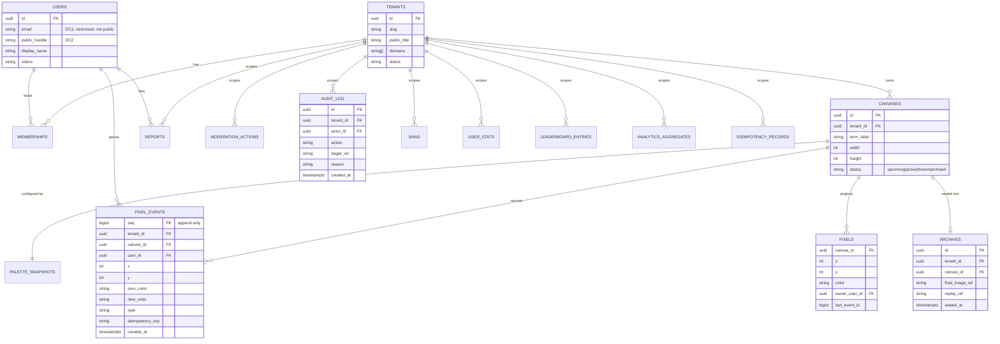

# Quad: Database & Persistence Architecture

> **This document defines the physical data model and persistence architecture: PostgreSQL's role, the logical domains and their tables, the ERD, event-store and projection storage, transactions/consistency, tenant isolation, indexing, partitioning, the Redis↔Postgres boundary, and data-classification mapping.** It conforms to [`PRODUCT.md`](PRODUCT.md), [`PRINCIPLES.md`](PRINCIPLES.md), [`ARCHITECTURE.md`](ARCHITECTURE.md), [`SYSTEM_CONTEXT.md`](SYSTEM_CONTEXT.md), and [`BACKEND.md`](BACKEND.md); IDs cited (`P-*`, `PRIN-*`, `ARCH-INV-*`, `BE-INV-*`, `CTX-INV-*`, `DC*`, `B*`).
>
> **⚠️ Dependency-order note.** The manifest lists `EVENT_SOURCING.md` as a dependency of this doc, but **`DATABASE.md` is authored first.** Therefore this document owns the **physical storage model**, table responsibilities, ERD, indexing, partitioning, repository boundaries, and consistency *requirements*. **Event *semantics*, the event catalog, ordering rules, replay derivation, event versioning, and projection-rebuild semantics, are deferred to [`EVENT_SOURCING.md`](EVENT_SOURCING.md).** Here, `pixel_events` is described as a *table*; what its rows *mean* is `EVENT_SOURCING.md`'s job.
>
> **Altitude:** architecture-level. Tables/fields are described conceptually. **No** `schema.prisma`, migrations, seeds, or repository code. **No** REST DTOs / WS payloads (owned by `API.md`/`@quad/core`). **No** versions (see [`TECH_BASELINE.md`](TECH_BASELINE.md)). **No** app code/package files.
>
> **Naming:** platform = **Quad**; **Rutgers Quad** = tenant #1 (example/seed data only). No tenant literal in the schema (`PRIN-CONFIG-OVER-CODE`, `DB-INV-11`).

---

## 1. Purpose & Scope

Persistence is where Quad's two deepest principles meet the disk: **permanence** (the event log is the source of truth, never lost) and **tenant isolation** (each university's data is fully separate). This document defines *how data is physically organized* to uphold those, while staying fast on the canvas hot path.

**In scope:** PostgreSQL/Prisma roles, ownership rules, logical domains + table responsibility catalog, ERD, event-store + projection storage strategy, transactions/consistency, tenant isolation in the DB, indexing, partitioning/volume, archive↔object-storage relationship, Redis↔Postgres boundary, `DC*` mapping, privacy/security, migration discipline, backup/rebuild posture, performance, testing, invariants.

**Out of scope (owned elsewhere):** event meaning/ordering/replay derivation/catalog (`EVENT_SOURCING.md`), DTOs (`API.md`/`@quad/core`), cooldown algorithm/state mechanics (`COOLDOWN.md`), moderation action semantics (`MODERATION.md`), concrete Prisma/migrations (implementation at `START IMPLEMENTATION`).

---

## 2. Persistence Responsibilities vs. Non-Responsibilities

| Persistence **is** responsible for | It is **not** responsible for |
| --- | --- |
| Durable storage of the **append-only event log** (truth) | Defining what events *mean*/order (`EVENT_SOURCING.md`) |
| Storing **projections** (current canvas, stats, leaderboards) | Computing business decisions (that's `apps/api` + `@quad/core`) |
| Enforcing **tenant scoping** + unique constraints at the data layer | Tenant *resolution* (`MULTI_TENANCY.md`) |
| Durable **moderation/audit** records (`DC4`) | Moderation action *semantics* (`MODERATION.md`) |
| **Idempotency** records for duplicate-safe writes | The idempotency *key strategy* shape (shared with `EVENT_SOURCING.md`) |
| **Archive metadata** + pointers to blobs | Storing large blobs (object storage owns those) |
| Holding **durable** state (truth) | Holding **ephemeral** live cooldown/presence (Redis owns those) |

---

## 3. PostgreSQL's Role in Quad

PostgreSQL is the **durable system of record**. It holds the immutable **event log** *and* the derived **projections**, in one ACID database, because:

- **ACID guarantees protect event-sourcing invariants**: an event and its projection update commit together or not at all (`BE-INV-4`).
- **Rich indexing/partitioning** suit pixel-event volume and the canvas/history/leaderboard query shapes.
- **Strong relational modeling** expresses tenant scoping and referential integrity directly.

Postgres is the truth tier; everything fast-but-ephemeral lives in Redis (`§16`).

---

## 4. Prisma's Role & Boundaries

- Prisma is the **ORM + migration system** used inside `@quad/db` (baseline in `TECH_BASELINE.md`). It provides type-safe access and an auditable, declarative migration workflow (no ad-hoc DDL).
- Prisma types **complement, never replace,** the canonical `@quad/core` domain types, repositories translate persistence rows into domain types at the boundary (`ARCH-INV-6`).
- Prisma is an **implementation detail of `@quad/db`**; nothing above the repository layer imports Prisma. The concrete `schema.prisma` and migrations are authored at `START IMPLEMENTATION`, conforming to this document.

---

## 5. Database Ownership Rules

- **Only `@quad/db` performs database I/O** (`ARCH-INV-10`, `BE-INV-9`, `DB-INV-5`).
- **`apps/api` talks to the DB only through repositories/services** exposed by `@quad/db`: never raw SQL/Prisma in routes, handlers, or jobs.
- **No direct DB writes anywhere else**: not from `apps/web`, not from scripts that bypass repositories. The canvas/event invariants are only enforceable if there is a single, narrow write path.
- Repositories expose **domain-typed** operations (append event, upsert projection cell, read history, write audit, record idempotency).

---

## 6. Logical Domains

The data divides into these domains (tables catalogued in §7):

- **Tenants / universities**: the tenant registry (mirrors `@quad/config` at runtime; persisted for relational integrity).
- **Users / accounts**: identities (`DC3` email + `DC2` public handle).
- **Memberships**: which user belongs to which tenant, with what role.
- **Terms / canvases**: one official canvas per term per tenant, with lifecycle state.
- **Palette / config snapshots**: the palette/config *as used by a canvas*, snapshotted for faithful history.
- **Current pixel projection**: the live canvas read model.
- **Pixel events / event log**: the append-only truth.
- **Cooldown**: *ephemeral live state in Redis*; optional durable **cooldown history** in Postgres for analytics/replay (see §16).
- **Reports**: user-submitted reports.
- **Moderation actions / audit log**: append-only record of moderation/admin actions (`DC4`).
- **Bans / suspensions**: enforcement state, backed by audit.
- **Profiles / stat projections**: per-user derived stats.
- **Leaderboards / stat projections**: ranked derived stats.
- **Archives / final artifacts / replay metadata**: DB metadata pointing to object-storage blobs.
- **Idempotency records**: duplicate-safe command application.

---

## 7. Table Responsibility Catalog (Architecture Level)

Conceptual tables (illustrative key fields; not a schema). **T?** = tenant-scoped. **Kind** = `truth` (source of truth) or `proj` (derivable projection) or `state`.

| Table | Responsibility | Illustrative key fields | T? | DC | Kind |
| --- | --- | --- | --- | --- | --- |
| `tenants` | Tenant registry | id, slug, public_title, domains[], theme_ref, status | n/a | DC1 | truth |
| `users` | Account identity | id, email *(DC3)*, public_handle *(DC2)*, display_name, status, created_at | scoped via membership | DC3/DC2 | truth |
| `memberships` | User↔tenant binding + role | user_id, tenant_id, role, status, verified_at | ✅ | DC3(assoc) | truth |
| `canvases` | One canvas per term per tenant | id, tenant_id, term_label, width, height, status, palette_snapshot_id, starts_at, ends_at | ✅ | DC1 | truth |
| `palette_snapshots` | Palette/config as used by a canvas | id, tenant_id, canvas_id, colors[], captured_at | ✅ | DC1 | truth |
| `pixel_events` | **Append-only event log** | id/seq, tenant_id, canvas_id, user_id, x, y, prev_color, new_color, type, idempotency_key, created_at | ✅ | DC1 | **truth** |
| `pixels` | **Current canvas projection** | tenant_id, canvas_id, x, y, color, owner_user_id, placed_at, last_event_id | ✅ | DC1 | proj |
| `reports` | User reports | id, tenant_id, canvas_id, reporter_user_id, target_ref, reason, status, created_at | ✅ | DC4 | truth |
| `moderation_actions` | Moderation/admin actions (audit) | id, tenant_id, actor_user_id, action_type, target_ref, reason, related_event_id, created_at | ✅ | DC4 | **truth (append-only)** |
| `audit_log` | Broader append-only audit | id, tenant_id, actor_id, action, target_ref, reason, created_at | ✅ | DC4 | **truth (append-only)** |
| `bans` | Bans/suspensions enforcement state | id, tenant_id, user_id, type, reason, starts_at, ends_at, actor_id | ✅ | DC4 | truth |
| `user_stats` | Profile stat projection | tenant_id, user_id, canvas_id?, pixels_placed, surviving, favorite_color, longest_surviving, streak, scope | ✅ | DC2 | proj |
| `leaderboard_entries` | Leaderboard projection | tenant_id, canvas_id/scope, category, user_id, score, rank, window | ✅ | DC2 | proj |
| `analytics_aggregates` | Heatmap/analytics projection | tenant_id, canvas_id, metric, bucket, value | ✅ | DC1 | proj |
| `archives` | Archive metadata + blob pointers | id, tenant_id, canvas_id, final_image_ref, stats_ref, replay_ref, sealed_at | ✅ | DC1 | truth |
| `cooldown_samples` *(optional)* | Durable history of global cooldown values | tenant_id, canvas_id, value, sampled_at | ✅ | DC5/DC1 | proj |
| `idempotency_records` | Duplicate-safe command application | tenant_id, key, command_type, result_ref, created_at | ✅ | — | state |

> `moderation_actions` vs `audit_log`: moderation actions are a typed, first-class part of the audit story; an implementation may unify them or keep `moderation_actions` as a typed view over `audit_log`. Either way, **both are append-only** (`DB-INV-6`). Decision deferred to `MODERATION.md`/implementation.

---

## 8. ERD

(Attributes shown for the load-bearing tables only; the full catalog is §7. Relationship keys always include `tenant_id` per §12.)

---

## 9. Event-Store Storage Strategy (Database Level)

- `pixel_events` is the **append-only event log**: rows are **only ever inserted**, never updated or deleted (`DB-INV-1`). Moderation "rollbacks" are **new compensating events**, not edits (`PRIN-NO-INVISIBLE-LOSS`).
- Each event has a **monotonic ordering key** (`seq`) and a `created_at`; ordering *semantics* (per-canvas vs global, gap handling) are owned by `EVENT_SOURCING.md`.
- Events carry enough to derive any projection (coords, prev/new color, actor, type, time), but **what they mean and how they replay is `EVENT_SOURCING.md`'s** contract; this doc guarantees only that the storage is durable, ordered, and immutable.
- The log is the **crown-jewel data**: its integrity governs backup priority (§20) and partitioning (§14).

---

## 10. Projection Storage Strategy

Projections are derived read models, all **rebuildable** from `pixel_events` (`DB-INV-3`):

- **Current canvas projection (`pixels`)**: exactly **one row per `(canvas, x, y)`** (`DB-INV-10`), upserted on each placement; serves fast hover/snapshot reads. PK on `(canvas_id, x, y)`.
- **User/profile stats (`user_stats`)**: per-user counters (placed, surviving, streak, favorite color) per term and lifetime; updated incrementally as events append, rebuildable on demand.
- **Leaderboard stats (`leaderboard_entries`)**: ranked scores per category/window; refreshed from activity (cadence is a `PERFORMANCE.md` concern).
- **Heatmap/analytics (`analytics_aggregates`)**: bucketed aggregates (contested areas, hourly activity, color usage, density).

Projections may be **maintained incrementally** in the placement transaction (for the hot `pixels` read model) or **recomputed by jobs** (for heavier analytics/leaderboards), the split is a performance choice; correctness rests on rebuildability.

---

## 11. Transaction & Consistency Strategy

This is the correctness boundary `BACKEND.md` deferred. Requirements (mechanism details → `EVENT_SOURCING.md`):

- **Event append + current-projection update are atomic**: committed in a **single transaction**, so `pixels` never reflects an event that wasn't durably appended, and never misses one (`BE-INV-4`, `DB-INV-4`).
- **Idempotency**: a placement's `idempotency_key` is checked/recorded **within the same transaction** (unique on `(tenant_id, key)`), so a retried/double-tapped command appends at most one event and charges cooldown once (`BE-INV-11`, `DB-INV-8`).
- **Moderation audit atomicity**: a moderation action's **effect (compensating event/ban) and its audit row commit together**; there is no state in which an action took effect without an audit entry (`BE-INV-8`, `DB-INV-6`).
- **Heavier projections** (leaderboards, analytics) may be **eventually consistent** (recomputed by jobs), they are not on the atomic placement path, and their staleness window is a product/performance tolerance, not a correctness risk.

---

## 12. Tenant Isolation in the Database

- **`tenant_id` is present on every tenant-scoped table** and is the leading column of tenant-scoped indexes (`§13`).
- **Unique constraints include tenant scope**: e.g., a public handle is unique *within a tenant*, a canvas term label is unique *within a tenant*; uniqueness never spans tenants (`DB-INV-2`).
- **No cross-tenant reads by default**: repository methods require a tenant context and filter by `tenant_id`; the only cross-tenant access is the platform-operator path under explicit controls (`B5`, `CTX-INV-2/7`).
- Isolation is **defense-in-depth**: enforced in repositories (always) and reinforceable at the DB layer (e.g., row-level security as a hardening option, decision deferred to `SECURITY.md`/implementation).

---

## 13. Indexing Strategy

Indexes are designed around the real query shapes (all tenant-scoped indexes lead with `tenant_id` or `canvas_id`):

| Query | Index target |
| --- | --- |
| **Current pixel lookup** (hover/snapshot) | PK on `pixels(canvas_id, x, y)` |
| **Pixel history** (per-cell story) | `pixel_events(canvas_id, x, y, seq)` |
| **Event replay scans** (whole canvas, ordered) | `pixel_events(canvas_id, seq)` (clustering/partition-aligned) |
| **Leaderboards** | `leaderboard_entries(tenant_id, canvas_id, category, score)` |
| **Moderation/report queues** | `reports(tenant_id, status, created_at)`; `audit_log(tenant_id, created_at)` |
| **Profiles** | `user_stats(tenant_id, user_id, scope)` |
| **Tenant isolation filters** | `tenant_id` as the leading column on tenant-scoped indexes |
| **Idempotency** | unique `idempotency_records(tenant_id, key)` |

Exact index list/types are finalized with the Prisma schema at implementation; this fixes the *strategy*.

---

## 14. Partitioning / Volume Strategy for Pixel Events

`pixel_events` is the highest-volume table (potentially millions of rows per active term).

- **Partition the event log by canvas** (and/or tenant), so each term's events live in their own partition. Because **each canvas is bounded to one term**, a frozen/archived canvas's partition becomes **read-only and cold-storable**: never rewritten (`DB-INV-1`).
- **Benefits:** partition pruning keeps current-canvas queries fast; archived partitions can be detached/cold-stored; tenant isolation aligns with partition boundaries.
- Time-based sub-partitioning within a canvas is an option for very large terms.
- The **exact partition mechanism** (declarative partitioning, `pg_partman`, detach-to-cold-storage policy) is deferred to implementation/`DEPLOYMENT.md`/`DISASTER_RECOVERY.md`; this fixes the *approach*: partition per canvas, archived partitions immutable.

---

## 15. Archive & Replay Storage Relationship

- **Database holds metadata; object storage holds blobs.** When a canvas is archived (`P-LIFE-5`), the `archives` row stores **pointers** (`final_image_ref`, `stats_ref`, `replay_ref`) to artifacts in object storage (`B7`), plus `sealed_at`.
- **Final images and replay/export assets are binary blobs** → object storage, not Postgres (keeps the DB lean and serves large files efficiently).
- **Replay data itself derives from `pixel_events`** (the ordered log); replay *generation* may pre-render assets to object storage, but the source of truth remains the event log (`REPLAY.md` owns derivation). The DB keeps the index/metadata that ties a term to its artifacts.
- Archived canvas partitions + archive metadata + object-storage blobs together form the **permanent, immutable** record (`P-ARCH-1`).

---

## 16. Redis vs. PostgreSQL Boundary

The rule: **anything whose loss would break permanence or fairness-*history* must be in Postgres; Redis holds only ephemeral, reconstructable state.**

| Redis (ephemeral, low-latency) | PostgreSQL (durable truth) |
| --- | --- |
| Current **global cooldown value** (live) | Event log (`pixel_events`) |
| Per-user **next-allowed** cooldown timestamp | All projections (`pixels`, stats, leaderboards) |
| **Presence / concurrency** counts | Accounts, memberships, canvases, palette snapshots |
| **Pub/sub** fan-out messages | Reports, moderation actions, **audit log**, bans |
| Transient rate-limit counters | Archive metadata, idempotency records |
| (optionally) hot caches of projections | (optionally) durable **cooldown history** (`cooldown_samples`) |

Notes:
- **Live cooldown state in Redis is acceptable as ephemeral**: losing it resets timers but **destroys no history or fairness record**: and the durable *value-over-time* (for analytics/replay/audit) can be sampled into Postgres (`cooldown_samples`). Cooldown *mechanics* are owned by `COOLDOWN.md`.
- Redis is a **cache/coordination layer, never a source of truth** (`ARCHITECTURE.md` §5).

---

## 17. Data Classification Mapping (`DC1…DC5`)

Mapping the `SYSTEM_CONTEXT.md` classes onto storage:

| Class | Where it lives |
| --- | --- |
| **`DC1` public canvas data** | `pixel_events` (content), `pixels`, `analytics_aggregates`, `archives`, palette snapshots |
| **`DC2` public handle / display identity** | `users.public_handle`/`display_name`; surfaced in `user_stats`, `leaderboard_entries`, attribution reads |
| **`DC3` private account identity** | `users.email`, internal ids, `memberships.verified_at`/status; **never** in public projections |
| **`DC4` moderation / audit data** | `reports`, `moderation_actions`, `audit_log`, `bans` |
| **`DC5` operational telemetry** | **Not** in the app DB — flows to observability; `cooldown_samples` is operational/analytics-grade, scrubbed of `DC3` |

---

## 18. Privacy & Security Considerations

- **`DC3` minimization**: store the minimum identity needed (email + status); never copy email into projections, attribution, leaderboards, or analytics (`CTX-INV-3`, `DB-INV-7`).
- **No full email in public-facing queries**: repository methods that serve public/participant reads select **only `DC2`** (`P-ATTR-4`, `FE-INV-5`); `DC3` is reachable only via authorized paths.
- **Audit-log access is restricted**: `DC4` is readable only by authorized moderators/admins/operators (tenant-scoped), and is **append-only** (`P-MOD-4`).
- **Encryption at rest** is provided by the managed datastore (`B7`); secrets/credentials per `SECURITY.md`/`DEPLOYMENT.md`.
- **Email/PII handling** must respect the data-residency/FERPA posture set in `LAUNCH_PLAN.md` (`LG-9`).

---

## 19. Migration & Spec Discipline

- **No schema change without a migration spec** (`templates/database-migration-spec.md`), every change is reviewed, reversible-aware, and documented (`DB-INV-9`).
- **A schema change updates this doc + the relevant specs in the same PR** (the contract-and-doc-in-the-same-PR governance rule, `ARCHITECTURE.md`/`ENGINEERING_WORKFLOW.md`).
- Migrations run via Prisma's migration workflow; destructive migrations on the event log are **forbidden** (it is append-only).
- Adding a tenant is **data/config, not a migration** (`PRIN-CONFIG-OVER-CODE`); Rutgers Quad is seed/example data.

---

## 20. Backup / Restore & Projection-Rebuild Posture (High Level)

- **The event log is the highest backup priority.** Managed PostgreSQL backups + point-in-time recovery protect `pixel_events`; its integrity is paramount (`PRIN-PERMANENCE`).
- **Projections are rebuildable** from the log, so they tolerate looser RPO, but are still backed up for fast recovery (avoid a full multi-million-row replay on every restore).
- **Restore + rebuild drills** are a launch gate (`LG-8`) and are owned operationally by `DISASTER_RECOVERY.md`/`OPERATIONS.md`.
- **Archived partitions/blobs** are immutable and independently durable (object storage durability + DB metadata).

---

## 21. Performance Considerations (Database Level)

- **Hot path:** current-pixel read (PK lookup on `pixels`) and event append (sequential insert into the active canvas partition) must be fast; the placement transaction (append + `pixels` upsert + idempotency) is the latency-critical write.
- **Partition pruning** keeps active-canvas scans off archived data (`§14`).
- **Index discipline** per `§13`; avoid over-indexing the write-heavy `pixel_events`.
- **Connection pooling** (managed pooler/driver adapter) is required at scale, flagged in `TECH_BASELINE.md`, owned by `DEPLOYMENT.md`.
- Concrete latency/throughput **budgets are owned by `PERFORMANCE.md`**; the DB is accountable for its share under load.

---

## 22. Testing Expectations

Persistence test layers (against **real Postgres**, Dockerized; tooling → `TECH_BASELINE.md`, strategy → `TESTING.md`):

- **Repository tests**: each repository's domain-typed operations behave correctly and leak no persistence types.
- **Migration tests**: migrations apply cleanly forward; schema matches expectations; no destructive change to the event log.
- **Tenant isolation tests**: cross-tenant reads/writes are impossible through repositories; unique constraints are tenant-scoped (`P-AC-13`).
- **Event-append + projection consistency tests**: append and `pixels` update are atomic; failure leaves no partial state (`§11`).
- **Projection rebuild tests**: rebuilding projections from the log is **deterministic** and matches incrementally-maintained state (`DB-INV-3`).
- **Moderation audit atomicity tests**: every moderation effect commits with its audit row; no effect without audit (`DB-INV-6`).

---

## 23. Database Invariants (`DB-INV-*`)

- **`DB-INV-1`** `pixel_events` is append-only, no `UPDATE`/`DELETE`; rollbacks are new compensating events.
- **`DB-INV-2`** Every tenant-scoped row has `tenant_id`; unique constraints include tenant scope.
- **`DB-INV-3`** All projections are derivable (rebuildable) from the event log.
- **`DB-INV-4`** Event append and current-projection update are atomic (single transaction).
- **`DB-INV-5`** Only `@quad/db` performs DB I/O; no direct writes elsewhere.
- **`DB-INV-6`** Every moderation/admin action writes an append-only audit row atomically with its effect.
- **`DB-INV-7`** `DC3` (full email/internal ids) never appears in public-facing queries/projections; only `DC2` is exposed publicly.
- **`DB-INV-8`** Idempotency records make duplicate command application impossible (unique `(tenant_id, key)`).
- **`DB-INV-9`** No schema change without a migration spec + same-PR doc update.
- **`DB-INV-10`** The current canvas projection has exactly one row per `(canvas, coordinate)`.
- **`DB-INV-11`** No tenant literals in the schema; Rutgers Quad is seed/example data only.
- **`DB-INV-12`** Durable truth lives in Postgres; Redis holds only ephemeral, reconstructable state.

---

## 24. Decisions Deferred to Deeper Docs

| Open decision | Owner |
| --- | --- |
| Event catalog, meaning, ordering rules, replay derivation, event versioning, projection-rebuild semantics | `EVENT_SOURCING.md` |
| Concrete `schema.prisma`, migrations, exact indexes/constraints | implementation (`START IMPLEMENTATION`) |
| Partition mechanism + archived-partition cold-storage policy | implementation / `DEPLOYMENT.md` / `DISASTER_RECOVERY.md` |
| Whether `moderation_actions` is unified with `audit_log` | `MODERATION.md` / implementation |
| Cooldown live-state mechanics + whether `cooldown_samples` is kept | `COOLDOWN.md` |
| Row-level-security hardening for tenant isolation | `SECURITY.md` / implementation |
| Connection pooling / driver adapter | `DEPLOYMENT.md` (flagged in `TECH_BASELINE.md`) |
| Archive blob formats (final image, replay assets) | `ARCHIVES.md` / `REPLAY.md` |
| API-visible DTO shapes | `API.md` / `@quad/core` |

---

## 25. Document Control

- **Path:** `docs/DATABASE.md`
- **Purpose:** Define Quad's physical data model and persistence architecture, event store, projections, tables, ERD, consistency, tenant isolation, indexing, partitioning, and the Redis↔Postgres boundary, that `@quad/db` implements.
- **Dependencies:** `ARCHITECTURE.md`, `BACKEND.md`, `SYSTEM_CONTEXT.md`, `PRODUCT.md`, `PRINCIPLES.md`, `TECH_BASELINE.md`. **Forward dependency (deferred):** `EVENT_SOURCING.md` (event semantics, see dependency-order note). **Consumed by:** `EVENT_SOURCING.md`, `API.md`, `MODERATION.md`, `PROFILES.md`, `LEADERBOARDS.md`, `ANALYTICS.md`, `ARCHIVES.md`, `DISASTER_RECOVERY.md`.
- **Acceptance checklist:** ☑ all 25 parts present ☑ architecture altitude (no `schema.prisma`/migrations/seeds/repo code) ☑ dependency-order note (physical model here; event semantics → `EVENT_SOURCING`) ☑ table responsibility catalog + ERD ☑ event-store append-only + projection-rebuildable strategy ☑ atomic append+projection + idempotency + audit atomicity ☑ tenant isolation (`tenant_id`, tenant-scoped uniqueness) ☑ indexing + partitioning ☑ Redis↔Postgres boundary ☑ `DC1…DC5` mapping ☑ privacy (`DC3` minimization, no public email) ☑ migration discipline ☑ `DB-INV-1…12` ☑ versions referenced not declared ☑ tenant-neutral (Rutgers = seed data only) ☑ no app code/package files.
- **Open questions:** see §24 (event semantics, partition mechanism, RLS, audit unification, pooling).
- **Next recommended:** `docs/EVENT_SOURCING.md` (event catalog, ordering, append rules, projection-rebuild + replay derivation semantics).
