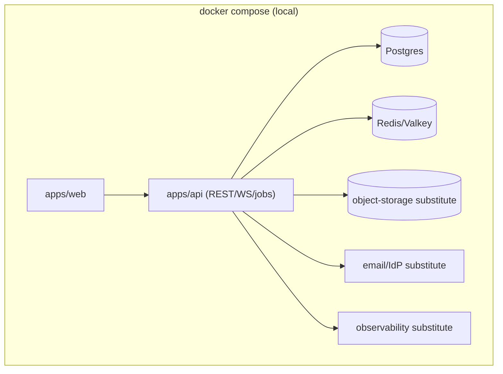
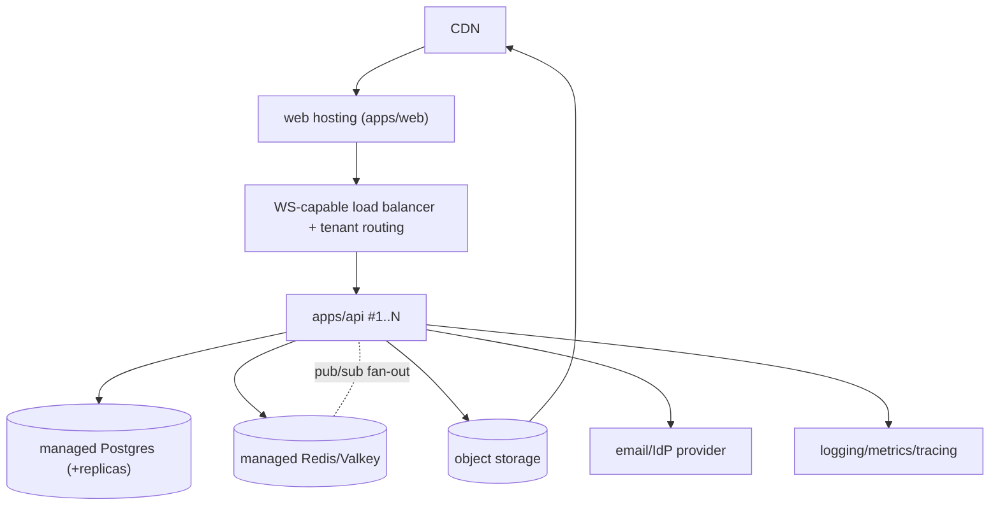
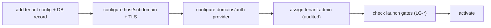
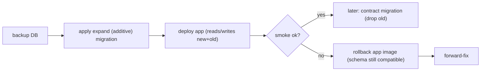

# Quad: Deployment & Infrastructure

> **This document owns deployment: environment strategy, topology, CI/CD shape, secrets posture, migrations, release/rollback, tenant onboarding, and infrastructure assumptions.** It conforms to all completed docs and does **not** rewrite their contracts.
>
> **Altitude:** topology + strategy. **No** real Dockerfiles/compose/CI/env/IaC/migration files in this doc, those live in the repo (`apps/api/Dockerfile`, `apps/web/Dockerfile`, `docker-compose.prod.yml`, `deploy/Caddyfile`, `.github/workflows/ci.yml`). **No** versions (`TECH_BASELINE.md`). Tenant-neutral (Rutgers Quad = tenant #1). The deployment **provider** is deferred to **`ADR-0010`**.

---

## 1. Purpose & Scope
Define how Quad runs everywhere, from a laptop to production, reproducibly, securely, and rollback-ready, so the architecture's guarantees (fairness, permanence, isolation, performance) hold in the real world. **In scope:** environments, topologies, deployment units, routing, secrets, DB/Redis/object-storage deployment, CI/CD, release/rollback, tenant onboarding, jobs, data protection, DR/perf/security/observability deployment concerns, failure modes, deployment tests, invariants. **Out of scope:** dashboards/alerts (`OBSERVABILITY.md`), runbooks (`OPERATIONS.md`), RPO/RTO + restore drills (`DISASTER_RECOVERY.md`), contract definitions (their docs).

## 2. Responsibilities vs. Non-Responsibilities
| Deployment **owns** | It does **not** own |
| --- | --- |
| Environment/topology/CI-CD/secrets/migration/rollback strategy | Contract definitions (API/WS/DB/auth/tenant/etc.) |
| Infrastructure assumptions + provider-agnostic shape | The chosen provider (`ADR-0010`) |
| Tenant onboarding deployment steps | Dashboards/alerts (`OBSERVABILITY.md`), runbooks (`OPERATIONS.md`) |
| Migration/release safety rules | RPO/RTO + restore drills (`DISASTER_RECOVERY.md`) |

## 3. Deployment Principles
- **`D-DP-1` Reproducible environments**: Docker-first; same image promoted across envs.
- **`D-DP-2` No secrets in the repo**: injected at runtime, rotatable, per-env (`DEPLOY-INV-2`).
- **`D-DP-3` Staging mirrors production shape**: same topology, isolated data/secrets.
- **`D-DP-4` Tenant-neutral deployment**: tenants added by config, never by deploy changes (`DEPLOY-INV-3`).
- **`D-DP-5` Safe migrations**: controlled step, backup-first, expand/contract (`§11`).
- **`D-DP-6` Rollback-ready releases**: app images instantly revertible; data migrations forward-fix (`§16`).
- **`D-DP-7` Observability from day one**: logs/metrics/traces wired before launch.

## 4. Environment Model
| Env | Purpose | Data/secrets |
| --- | --- | --- |
| **Local** | dev on a laptop (Docker-first) | disposable; no real secrets |
| **Test/CI** | automated gates | ephemeral, seeded |
| **Staging** | production-like rehearsal (load/security/migration) | isolated; separate secrets + tenant config |
| **Production** | live Rutgers Quad (+ future tenants) | managed; least-privilege secrets |

## 5. Local Development Topology
`docker compose` brings up: **`apps/web`** (Next.js), **`apps/api`** (Fastify REST+WS+jobs), **Postgres**, **Redis/Valkey**, an **object-storage substitute** (e.g., S3-compatible local), an **email/IdP substitute** (mailcatcher/local provider), and a lightweight **observability substitute**. Gives every engineer/dev identical infra (`ARCHITECTURE.md` §16). No real secrets; `.env` from `.env.example` (Phase 4).

## 6. Staging Topology
Production-like but fully isolated: separate **tenant config**, **secrets**, datastores, and object storage. Serves as the **migration rehearsal**, **load test**, and **security test** target (`PERFORMANCE.md` `LG-5`, `SECURITY.md` §18). The archive **dry-run gate** (`LG-7`) runs here before any real term close.

## 7. Production Topology
| Component | Role |
| --- | --- |
| **Web hosting** | serves `apps/web` (SSR shell + static) behind CDN |
| **API hosting** | horizontally-scaled `apps/api` instances behind a WS-capable load balancer |
| **Managed Postgres** | event log + projections (+ read replicas for queries) |
| **Managed Redis/Valkey** | cooldown, pub/sub fan-out, presence, sessions |
| **Object storage + CDN** | archive artifacts, replay assets, final images |
| **Email/IdP provider** | verification (MVP) / SSO (future), per tenant |
| **Logging/metrics/tracing** | telemetry sink (`DC5`, no `DC3`) |
| **CI/CD** | build → scan → migrate → deploy → smoke → promote |

## 8. Application Deployment Units
- **`apps/web`**: stateless web tier; **no direct DB access** (`DEPLOY-INV-6`); talks to `apps/api`.
- **`apps/api`**: stateless server tier; REST + WS; scales horizontally.
- **Background jobs/workers**: cooldown recompute, projection jobs, archive/replay generation, cleanup (`§18`); deployable **in-api or as a separate worker** (topology deferred); must be **idempotent**.
- **Migration runner**: a **separate, controlled one-shot step** in the pipeline, **not** app boot (`§11`, `DEPLOY-INV-4`).

## 9. Networking & Routing
- **Host/subdomain tenant routing**: the edge maps Host → tenant (`MULTI_TENANCY.md` §6); **unknown host → no tenant context** (platform landing / reject; `DEPLOY-INV-10`, `TENANT-INV-1`).
- **Custom-domain future path**: config maps a custom domain → tenant; TLS provisioning per domain (deferred).
- **TLS everywhere**: HTTPS + **WSS**; the LB must support **WS upgrade** + long-lived connections.
- **API/web routing**: web behind CDN; api behind the WS-capable LB; WS connections are stateless re: routing (snapshot-on-reconnect tolerates re-routing, `WEBSOCKETS.md` §12), so strict sticky sessions are not required for correctness (affinity is a nicety).

## 10. Secrets & Environment Variables
**No real values in the repo**, only a documented `.env.example` (Phase 4). Categories (illustrative; not values):

| Category | Examples |
| --- | --- |
| Auth/session | session signing secret, `@auth/core` secret, CSRF secret |
| Database | Postgres URL/credentials (+ replica URL) |
| Redis | Redis/Valkey URL/credentials |
| Object storage | bucket + access credentials |
| Email/IdP | provider API key / SSO client secret (per tenant) |
| Observability | telemetry ingest tokens |

**Rotation posture:** all secrets rotatable without data loss (session-signing rotation supported); **per-env separation** (no prod secrets in dev). Secrets injected at runtime via a secrets manager (provider deferred).

## 11. Database Deployment
- **Managed Postgres** expected (`TECH_BASELINE.md`).
- **Migrations** run as a controlled pipeline step (`§14`), **ordered**, with a **backup before migration**.
- **Expand/contract (parallel-change):** additive/backward-compatible migrations deploy **before** the app; destructive "contract" steps run only after the app no longer needs the old shape, enabling zero-downtime and safe app rollback.
- **Rollback posture:** schema rollback is limited (forward-fix preferred, `§16`); the **event log is append-only**: no destructive migration on it.
- **Partitioning/cold-archive:** archived canvas partitions become immutable/cold (`DATABASE.md` §14).

## 12. Redis/Valkey Deployment
- Holds **cooldown state, WS pub/sub, presence, sessions** (`DATABASE.md` §16).
- **Eviction policy:** cooldown (and session) keys must **not** be evicted improperly (early eviction = unfair early placement / forced logout), configure a policy that protects them (`COOL-INV-12`).
- **Fail-closed implication:** Redis unavailable → placements reject; viewing continues (`COOL-INV-9`); no durable data lost (`DEPLOY-INV-7`).
- **Topology/sharding** (single vs cluster; Redis vs Valkey image/license) deferred to `ADR-0010`/`TECH_BASELINE.md`.

## 13. Object Storage & CDN
- Stores **archive artifacts, replay assets, final images** (`ARCHIVES.md`).
- **Access control:** scoped buckets; **signed/controlled URLs**; public archive visibility follows the tenant flag (`MULTI_TENANCY.md` §17), never world-open by default.
- **No `DC3` in artifacts** (`DEPLOY-INV-8`); CDN caches immutable artifacts (`PERFORMANCE.md` B14).

## 14. CI/CD Pipeline

```mermaid
flowchart LR
  I["install"] --> L["lint"] --> TC["typecheck"] --> UT["unit tests"]
  UT --> IT["integration tests (PG+Redis)"] --> B["build images"]
  B --> SC["security: dep + secret scan"] --> MC["migration check (dry-run)"]
  MC --> DS["deploy staging"] --> SM["smoke tests"] --> PROMO["promote production"]
  PROMO --> PSM["prod smoke tests"]
```

All gates must pass before deploy; staging smoke before prod promote (`DEPLOY-INV-11`). Turbo's task graph keeps gates fast (`ARCHITECTURE.md`).

## 15. Release Strategy
- **Small releases** (one milestone / PR-sized).
- **Migration ordering:** **migration-before-app** for additive/expand changes (safe, backward-compatible); **contract** migrations only after the app stops using the old shape.
- **Feature flags** (incl. per-tenant flags, `MULTI_TENANCY.md` §17) to decouple deploy from release.
- **Canary/gradual rollout** if the provider supports it (deferred).
- **Smoke tests** after each deploy; **rollback triggers** = failed smoke / error-rate or latency breach (approaching `PERFORMANCE.md` blocking thresholds) / security alarm.

## 16. Rollback Strategy
- **App rollback:** revert to the previous image instantly (stateless tiers make this safe).
- **Migration rollback:** schema rollback is **limited**; with expand/contract, app rollback is safe because the schema stayed backward-compatible. **Data migrations are forward-fix** (don't auto-reverse destructive data changes).
- **Archive/replay artifacts:** immutable; a bad artifact is replaced by regeneration (`ARCHIVES.md`), not rolled back in place.
- **Session/secrets:** if a secret rotation breaks auth, roll forward to a corrected secret; sessions are revocable/re-establishable (`AUTHENTICATION.md`).

## 17. Tenant Deployment / Onboarding
1. Add **tenant config** (`@quad/config`) + Postgres tenant record (`MULTI_TENANCY.md` §14).
2. Configure **host/subdomain** (+ TLS) and routing.
3. Configure **allowed email domains / auth provider**.
4. Assign the **first tenant admin** (audited).
5. Check **launch gates** (`LAUNCH_PLAN.md` `LG-*`) before activating the canvas.
All config + data, **no code change, no redeploy of the platform** (`DEPLOY-INV-3`).

## 18. Operational Jobs
Deployed as idempotent, scheduled/triggered work (`BACKEND.md` §15): **cooldown recompute**, **projection jobs**, **archive generation**, **replay asset generation**, **analytics/leaderboard/heatmap projections**, **cleanup/retention** (ephemeral Redis, telemetry/retention). Each tenant-aware; topology (in-api vs worker) deferred. Scheduling/runbooks → `OPERATIONS.md`.

## 19. Data Protection
- **Encryption in transit** (TLS) everywhere; **encryption at rest** for sensitive data (`DC3`) via managed datastores.
- **Backups** of Postgres (esp. the event log, highest priority) + object storage durability.
- **Audit-log protection**: append-only, access-controlled, retained (`MODERATION.md`/`SECURITY.md`).
- **`DC3` handling**: minimized, encrypted, never in logs/artifacts; **object-storage visibility** controlled.

## 20. Disaster-Recovery Relationship
Deployment provides backups + restore *capability*; **RPO/RTO targets, restore drills, and event-log integrity verification** are owned by `DISASTER_RECOVERY.md` (drill is a launch gate, `LG-8`). The event log is the crown-jewel restore target; projections are rebuildable (`EVENT_SOURCING.md` §14).

## 21. Performance Deployment Considerations
Horizontal **API scaling**; **WS scaling** via many instances + Redis pub/sub (**fan-out latency** is the scaling watch-item); **Postgres connection limits** managed via pooling (`TECH_BASELINE.md`); **CDN/cache** for immutable archive assets; deploy must meet `PERFORMANCE.md` load tiers (`LG-5`).

## 22. Security Deployment Considerations
**Secret scanning + dependency (SCA) scanning** in CI; **origin allowlists** for WS; **secure session-cookie config** (httpOnly/Secure/SameSite, host-only per tenant); **network isolation** of datastores (`B7`); **least-privilege service accounts** for each component; no component has broader access than it needs (`SECURITY.md` §15/§17).

## 23. Observability Deployment Considerations
Wire **logs, metrics, traces, request/correlation ids** from day one (`SECURITY.md` §16); ship `DC5` only (no `DC3`). Dashboards/alerts detail → `OBSERVABILITY.md`.

## 24. Failure Modes
| Failure | Handling |
| --- | --- |
| Failed deploy | gates block; auto-halt; previous image stays live |
| Failed migration | backup-first; halt release; forward-fix (no destructive auto-rollback) |
| Redis unavailable | placements fail-closed; viewing continues; recover |
| Postgres unavailable | degrade reads from cache where safe; restore (DR) |
| Object storage unavailable | archives/replay degrade; live canvas unaffected |
| Bad tenant config | validated at load; reject/alert; don't activate |
| Bad secret rotation | roll forward to corrected secret; sessions re-establish |
| WS routing broken | clients reconnect/resnapshot; fix LB/upgrade config |
| Archive job failure | retry; dry-run gate prevents term-close surprises (`LG-7`) |

## 25. Deployment Testing Expectations
(Strategy → `TESTING.md`.) Local boot test · CI-green gate · **migration dry-run** · **staging smoke** · **production smoke** · **rollback drill** · tenant-routing test (incl. unknown-host) · object-storage access/visibility test · secret-scanning test · **Redis eviction-policy check** (cooldown keys protected).

## 26. Deployment Invariants (`DEPLOY-INV-*`)
- **`DEPLOY-INV-1`** Environments are reproducible (Docker-first; staging mirrors prod shape).
- **`DEPLOY-INV-2`** No secrets in the repo; injected at runtime; rotatable; per-env separation.
- **`DEPLOY-INV-3`** Deployment is tenant-neutral; tenants are added by config, not platform redeploys.
- **`DEPLOY-INV-4`** Migrations run as a controlled step (not app boot), backup-first, expand/contract.
- **`DEPLOY-INV-5`** Releases are rollback-ready (app images instantly revertible); data migrations are forward-fix.
- **`DEPLOY-INV-6`** Only `apps/api` touches datastores; `apps/web` has no direct DB access.
- **`DEPLOY-INV-7`** Redis is ephemeral coordination; cooldown/session keys protected from eviction; Redis loss → fail-closed, no data loss.
- **`DEPLOY-INV-8`** Object-storage artifacts contain no `DC3`; access is scoped/controlled.
- **`DEPLOY-INV-9`** TLS in transit; encryption at rest for sensitive data; audit log protected.
- **`DEPLOY-INV-10`** Unknown host → no default tenant (reject/landing).
- **`DEPLOY-INV-11`** CI gates (lint/typecheck/test/build/scan/migration-check) pass before deploy; staging smoke before prod promote.

## 27. Diagrams
- **Local topology**: §5. **Staging/production topology**, §7. **CI/CD pipeline**, §14. **Tenant onboarding**, §17.
### 27.1 Migration / release / rollback flow

## 28. Decisions Deferred to Deeper Docs / ADRs
| Decision | Owner |
| --- | --- |
| **Deployment provider/target** | **`ADR-0010`** |
| Concrete secrets manager | `ADR-0010`/impl |
| Redis topology/sharding (+ Redis vs Valkey) | `ADR-0010`/`TECH_BASELINE.md` |
| CDN / object-storage provider | `ADR-0010` |
| RPO/RTO + restore drills | `DISASTER_RECOVERY.md` |
| Observability platform | `OBSERVABILITY.md` |
| Migration tooling specifics | implementation (Prisma migrate) |
| Canary/gradual rollout mechanism | `ADR-0010`/impl |
| Background-job topology (in-api vs worker) | `OPERATIONS.md`/impl |

## 29. Document Control
- **Path:** `docs/DEPLOYMENT.md`
- **Purpose:** Quad's deployment topology, environment/CI-CD/secrets/migration/release/rollback strategy, and infra assumptions.
- **Dependencies:** `ARCHITECTURE`, `TECH_BASELINE`, `SYSTEM_CONTEXT`, `BACKEND`, `DATABASE`, `MULTI_TENANCY`, `SECURITY`, `PERFORMANCE`, `COOLDOWN`, `WEBSOCKETS`, `ARCHIVES`. **Consumed by:** `OPERATIONS.md`, `OBSERVABILITY.md`, `DISASTER_RECOVERY.md`, `MILESTONES.md`, `ADR-0010`, Phase-4 root config scaffolding.
- **Acceptance checklist:** ☑ all 29 parts ☑ principles ☑ env model ☑ local/staging/prod topologies ☑ deployment units (web no DB access) ☑ routing (host/subdomain, TLS/WSS, unknown-host) ☑ secrets posture (no values, categories, rotation) ☑ DB (expand/contract, backup-first) ☑ Redis (eviction protection, fail-closed) ☑ object storage/CDN (no `DC3`, controlled URLs) ☑ CI/CD pipeline ☑ release + rollback (forward-fix) ☑ tenant onboarding (config, no redeploy) ☑ jobs ☑ data protection ☑ DR/perf/security/observability deployment concerns ☑ failure modes ☑ deployment tests ☑ `DEPLOY-INV-1…11` ☑ 5 Mermaid diagrams ☑ no real config files ☑ no contracts rewritten ☑ versions referenced not declared ☑ tenant-neutral.
- **Open questions:** see §28 (`ADR-0010` provider, secrets manager, Redis topology, CDN, RPO/RTO).
- **Next recommended:** `docs/ENGINEERING_WORKFLOW.md` (how the team works in this repo, playbooks, stop conditions, drift control, the operating model for engineering implementation).
