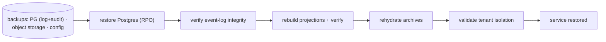
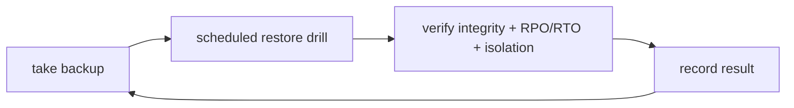

# Quad — Disaster Recovery

> **Engineering-process doc.** Owns backups, restore drills, RPO/RTO posture, and event-log integrity during recovery. Conforms to `DATABASE.md`, `EVENT_SOURCING.md`, `DEPLOYMENT.md`, `SECURITY.md`, `ARCHIVES.md`, `OPERATIONS.md`. Does not rewrite contracts; contradictions → unresolved risks. No code/configs; no versions; tenant-neutral (Rutgers Quad = tenant #1).

## 1. Purpose & Scope
DR ensures Quad's **permanence promise survives disasters** (`PRIN-PERMANENCE`). **In scope:** data priority, backup/restore strategy, RPO/RTO ownership, drills, disaster scenarios. **Out of scope:** deploy mechanics (`DEPLOYMENT.md`), runbook execution (`OPERATIONS.md`), storage schema (`DATABASE.md`).

## 2. Responsibilities vs. Non-Responsibilities
| DR owns | Doesn't own |
| --- | --- |
| Backup/restore strategy + drills + RPO/RTO posture | Deploy pipeline (`DEPLOYMENT.md`) / runbook ops (`OPERATIONS.md`) |
| Data priority + event-log integrity in recovery | Storage design (`DATABASE.md`) / event semantics (`EVENT_SOURCING.md`) |

## 3. Principles
- **`DR-DP-1` The event log is the crown jewel** — highest backup priority; its integrity is paramount.
- **`DR-DP-2` Projections are rebuildable** — derivable from the log, so they need less stringent RPO (but are still backed up for speed).
- **`DR-DP-3` Restore drills required** — a backup is unproven until a restore succeeds (`LG-8`).
- **`DR-DP-4` Backups are useless unless tested** — drills are scheduled, not theoretical.
- **`DR-DP-5` Preserve audit history** — `DC4` audit is restored intact.

## 4. Data Priority Order
1. **Event log** (truth) → 2. **Audit log** (`DC4`) → 3. **Tenants/users/memberships** → 4. **Current projections** → 5. **Archive artifacts** (object storage) → 6. **Derived analytics** (rebuildable, lowest priority).

## 5. Backup Strategy
- **Postgres:** regular backups + point-in-time recovery; the event-log + audit are the priority targets; tenant-scoped integrity preserved.
- **Object storage:** durable storage + versioning for archive artifacts.
- **Configs:** tenant config (`@quad/config`) versioned in repo/IaC.
- **Secrets:** **metadata/rotation posture only** — secrets live in the secrets manager (`DEPLOYMENT.md`), never in backups in plaintext; DR documents how to re-provision, not the secrets themselves.

## 6. Restore Strategy
1. **Restore Postgres** (event log + audit + relational data) to target RPO.
2. **Verify event-log integrity** (append-only continuity; recommended hash-chain check, `ES-INV-12`).
3. **Rebuild projections** from the log (`EVENT_SOURCING.md` §14) + verify via shadow compare.
4. **Rehydrate archives/replay assets** from object storage if needed.
5. **Validate tenant isolation** post-restore (cross-tenant→404; scoped data intact).

## 7. RPO/RTO Posture
Concrete **RPO/RTO targets are owned here but set with the deployment provider** (`DEPLOYMENT.md`/`ADR-0010`): the event log targets a **low RPO** (minimal acceptable data loss) and a **defined RTO**; projections may tolerate a higher RPO since they're rebuildable. Targets are placeholders until provider + load are fixed; they must be **tested** (§9).

## 8. Restore-Drill Expectations
Periodic, scheduled drills that: restore to a clean environment, verify event-log integrity, rebuild projections deterministically, confirm tenant isolation, and measure actual RPO/RTO against targets. **A passing drill is a launch gate (`LG-8`).**

## 9. Disaster Scenarios
| Scenario | Response |
| --- | --- |
| **Postgres loss** | restore from backup/PITR → verify log integrity → rebuild projections |
| **Redis loss** | ephemeral; cooldown/presence reset; placements fail-closed until restored; no data loss |
| **Object-storage loss** | restore from versioned storage; regenerate replay/image assets from the log if needed |
| **Bad migration** | forward-fix (expand/contract); restore from pre-migration backup if necessary (`DEPLOYMENT.md`) |
| **Region/provider outage** | fail over per provider capability (deferred); restore in alternate region |
| **Accidental tenant-config break** | revert config (versioned); validate at load; no platform redeploy needed |
| **Audit/integrity concern** | freeze; verify hash chain/backups; preserve evidence (`SECURITY.md` §19) |

## 10. DR Testing Expectations
Backup success monitoring; **restore drills** (§8); integrity-verification tests; projection-rebuild determinism; tenant-isolation-after-restore tests. Drills are tracked and their results recorded.

## 11. DR Invariants (`DR-INV-*`)
- **`DR-INV-1`** The event log is the top restore priority; its integrity is verified on restore.
- **`DR-INV-2`** Projections are rebuilt from the log and verified (never trusted blindly post-restore).
- **`DR-INV-3`** Backups are proven by scheduled restore drills (`LG-8`).
- **`DR-INV-4`** The audit log (`DC4`) is restored intact; history is never lost.
- **`DR-INV-5`** Secrets are not stored in plaintext backups; DR re-provisions via the secrets manager.
- **`DR-INV-6`** Tenant isolation is validated after every restore.

## 12. Diagrams

## 13. Document Control
- **Path:** `docs/DISASTER_RECOVERY.md` · **Purpose:** backups, restore, RPO/RTO, event-log integrity in recovery.
- **Dependencies:** `DATABASE`, `EVENT_SOURCING`, `DEPLOYMENT`, `SECURITY`, `ARCHIVES`, `OPERATIONS`. **Consumed by:** `OPERATIONS`, launch gate `LG-8`.
- **Acceptance:** ☑ principles (log=crown jewel, projections rebuildable, drills required) ☑ data priority ☑ backup strategy ☑ restore strategy (verify integrity + rebuild + isolation) ☑ RPO/RTO posture+ownership ☑ drill expectations (`LG-8`) ☑ disaster scenarios ☑ DR tests ☑ `DR-INV-*` ☑ 2 diagrams ☑ no code/versions ☑ tenant-neutral.
- **Next:** `docs/CODE_QUALITY.md`.
