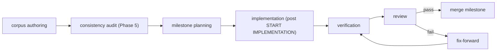
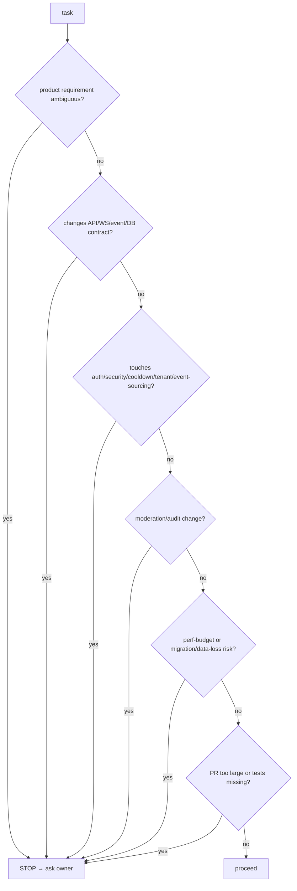
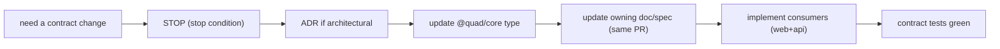
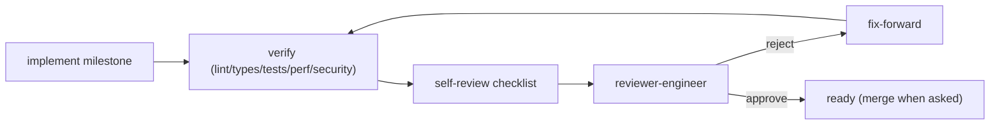

# Quad — engineering Development Workflow

> **This document owns the operating model for building Quad with engineering: how engineers plan, implement, verify, review, stop, and avoid architecture drift while working *from this corpus*.** It is **process, not app architecture**. It conforms to [`process/SPEC_PLAN.md`](../process/SPEC_PLAN.md) and all completed docs.
>
> **Altitude:** workflow + governance. **No** code, and **no** concrete `process/*` role guides, `templates/*`, playbook files, CI files, or scripts — those are **Phase 4** scaffolding. **No** versions (`TECH_BASELINE.md`). Tenant-neutral (Rutgers Quad = tenant #1).
>
> **Hard gate:** **no application implementation happens before the owner issues `START IMPLEMENTATION`** (`PROC-INV-6`). Until then, engineers author docs/specs/scaffolding only.

---

## 1. Purpose & Scope
The corpus is large precisely so that engineering roles can implement Quad **milestone-by-milestone without loss of architectural context**. This doc is the rulebook that turns the corpus into safe, reviewable, drift-free implementation. **In scope:** principles, engineer roles, workflow phases, task intake, implementation/verification/review protocols, stop conditions, playbook *shapes*, drift controls, safety rails, failure handling, doc-update rules, PR discipline, invariants. **Out of scope:** the milestone sequence (`MILESTONES.md`), full test strategy (`TESTING.md`), formal PR review (`REVIEW_PROCESS.md`), code standards (`CODE_QUALITY.md`), and the concrete role/playbook/template artifacts (Phase 4).

## 2. Responsibilities vs. Non-Responsibilities
| engineering workflow **owns** | It does **not** own |
| --- | --- |
| How engineers plan/implement/verify/review/stop | App architecture (the Phase 2 docs) |
| Drift controls + safety rails (process form) | The milestone list (`MILESTONES.md`) |
| Playbook *shapes* + artifact expectations | Concrete playbook/engineer/template files (Phase 4) |
| Doc-update + PR discipline | Full test strategy (`TESTING.md`) / review detail (`REVIEW_PROCESS.md`) |

## 3. Core Principles
- **`PROC-DP-1` Spec-first** — implement *against* a spec + milestone; never invent product requirements (`PROC-INV-1`).
- **`PROC-DP-2` Docs are source of truth** — a contract change updates the doc/spec in the **same PR** (`PROC-INV-2`).
- **`PROC-DP-3` Small milestone PRs** — one milestone, small diff, no unrelated rewrites (`PROC-INV-3`).
- **`PROC-DP-4` Tests before claims** — no "it works" without commands + results (`PROC-INV-4`).
- **`PROC-DP-5` No architecture drift** — `@quad/core` contracts, clean boundaries, hard rules (`§12`).
- **`PROC-DP-6` Stop instead of guessing** — hit a stop condition → ask (`§8`).
- **`PROC-DP-7` No implementation before `START IMPLEMENTATION`.**

## 4. Engineer Operating Model (roles)
Each role becomes a concrete `process/<role>-guidelines.md` in Phase 4; here are their lanes. All obey the global rules (Phase 4 `process/engineering-rules.md`).

| Role | Lane |
| --- | --- |
| **Planner** | break work into milestone-sized, spec-linked tasks |
| **Architect** | uphold the Phase 2 architecture + invariants; own ADRs |
| **Frontend** | `apps/web`/`@quad/ui` (no business logic, mounts `@quad/render`) |
| **Backend** | `apps/api`/domain services/command handlers |
| **Database** | `@quad/db` schema/repositories/migrations |
| **Realtime** | `@quad/realtime` WS + pub/sub |
| **Rendering** | `@quad/render` engine |
| **Security** | threat model + controls + security tests |
| **Testing** | test layers, coverage, gates |
| **DevOps** | CI/CD, deploy, infra |
| **Reviewer** | enforce specs/tests/docs/guardrails; can reject |

A single engineer may wear multiple hats on a small milestone, but the **lane boundaries and invariants still apply**.

## 5. Workflow Phases

We are currently in **corpus authoring**; implementation begins only after the audit + `START IMPLEMENTATION`.

## 6. Task Intake Protocol
Before writing code for a task, the engineer:
1. **Reads the relevant docs** (the owning subsystem doc(s) + `PRINCIPLES`/`NON_GOALS`).
2. **Identifies the owning spec/doc** the work implements against.
3. **Identifies contracts touched** (API/WS/event/DB/`@quad/core` types).
4. **Identifies tests required** (per `TESTING.md`/the spec).
5. **Identifies stop conditions** (`§8`) — and stops *now* if any apply before guessing.

## 7. Implementation Protocol
- **One milestone per PR**; **small diff**; **no unrelated rewrites** (`PROC-INV-3`).
- **Update docs/specs with any contract change in the same PR** (`PROC-INV-2`).
- **Keep package boundaries clean** — contracts in `@quad/core`; DB I/O only in `@quad/db`; realtime only in `@quad/realtime`; no business logic in components.
- Implement against the spec's acceptance criteria; add the spec's required tests.
- Leave the codebase green (lint/typecheck/tests) before declaring done.

## 8. Stop Conditions (ask, don't guess)

A stop condition means **pause and request review/clarification with options + a recommendation** — not silently choose. (Contract/auth/cooldown/event-sourcing/tenant/moderation changes typically also require an **ADR**.)

## 9. Verification Protocol
Before claiming done, run and report (with output): **lint · typecheck · unit · integration · relevant e2e · security tests · performance tests where relevant · doc/spec consistency check**. Critical subsystems (event sourcing, cooldown, auth, WS, rendering, moderation, tenant isolation) are **never** "manually verified only" (`PROC-INV-4`). Full matrix → `TESTING.md`.

## 10. Playbook Patterns (shapes, not files)
Concrete reusable playbooks live in `process/playbooks/*` (Phase 4). Each shares a shape:

| Playbook | Key sections |
| --- | --- |
| **Milestone implementation** | goal · linked spec/milestone · files to touch · files **not** to touch · contracts touched · tests required · acceptance criteria · stop conditions · doc updates |
| **Bugfix** | repro · root cause · minimal fix · regression test · affected contracts/docs |
| **Refactor** | scope · invariants preserved · no behavior change · tests unchanged-green · no contract drift |
| **Verification** | what to run · expected results · evidence to capture · pass/fail criteria |
| **Documentation-update** | which contract/behavior changed · which doc/spec/`@quad/core` type to update · same-PR requirement |
| **PR review** | spec linkage · acceptance met · tests present+green · docs updated · guardrails respected · scope creep check |

## 11. Artifact Expectations (every implementation task)
A completed task reports: **implementation summary · files changed · tests run (with results) · risks · follow-up/doc updates**. **No hidden background work**; **no fabricated results** (`PROC-INV-10`). If something wasn't done/verified, say so.

## 12. Architecture Drift Controls
Enforced (process + code review):
- **`@quad/core` owns contracts**; **no duplicate DTOs**; **no untyped WS payloads**.
- **No hardcoded tenants** outside tenant config.
- **No business logic in React components.**
- **No direct DB writes outside repositories/services.**
- **No undocumented endpoints** (every endpoint in `API.md`).
Each maps to a code-review rejection reason (`§14`) and a test where feasible.

## 13. engineering Safety Rails (this repo)
- **No secrets** in code/PRs; **no production data** in dev/tests.
- **No destructive migrations without a migration spec** (`DATABASE.md` §19).
- **No bypassing auth/cooldown/moderation/audit** (`SECURITY.md` invariants).
- **No fabricated test results**; **no claiming verification without commands + results.**
- **No untested event-sourcing changes** (`ES-INV-*`).
- **No `START IMPLEMENTATION` violation** — docs/specs/scaffolding only until the signal.

## 14. Review Model
- **Self-review checklist** (pre-request): spec linked · acceptance met · tests green · docs updated · guardrails respected · diff small/scoped.
- **Reviewer-engineer role** (`process/review-guidelines.md`, Phase 4) independently verifies the same.
- **Rejection reasons:** missing tests · missing/contradicted docs · drift (any `§12` rule) · scope creep · contract change without ADR · unverifiable claims.
- **Required evidence:** test commands + results; doc/spec diffs alongside contract changes.
(Formal process → `REVIEW_PROCESS.md`.)

## 15. Handling Failures
| Situation | Response |
| --- | --- |
| Failing tests | do not merge; fix or revert; report honestly |
| Partial implementation | keep task open/in-progress; don't mark done |
| Discovered contradiction with a core doc | **stop**; surface it; fix the doc via ADR/doc-update, don't silently diverge |
| Missing spec | stop; request/author the spec first (spec-first) |
| Performance regression | stop if it risks a `PERFORMANCE.md` blocking threshold |
| Security concern | stop; escalate per `SECURITY.md` |

## 16. Documentation Update Rules
A PR **must** update docs/specs (same PR) when it changes: a **contract** (API/WS/event/DB/`@quad/core` type) · **behavior** · adds a **new endpoint/event/schema** · adds a **migration** · introduces a **new security/performance assumption**. No undocumented behavior; no invisible architecture (`PROC-INV-2`).

## 17. Branch / PR Discipline
- **One milestone per PR**; soft size cap ≈ 400 non-generated changed lines / ~10 files — larger ⇒ split the milestone.
- **Commit/PR messages** state the milestone, contracts touched, and tests run (architecture-level expectation; exact format → `REVIEW_PROCESS.md`).
- **No `git commit` unless explicitly asked** (`PROC-INV-12`); branch from the default branch, never commit straight to it.

## 18. Relationship to Future Files
| File | Relationship |
| --- | --- |
| `MILESTONES.md` | the actual implementation sequence this workflow executes |
| `CHECKPOINTS.md` | gates between milestone groups |
| `TESTING.md` | the full test strategy referenced by §9 |
| `CODE_QUALITY.md` | standards + architecture fitness rules behind §12 |
| `REVIEW_PROCESS.md` | formal PR review behind §14 |
| Phase 4 `process/*`, `process/playbooks/*`, `templates/*` | the concrete engineers/playbooks/templates implementing §4/§10 |

## 19. Engineering Workflow Invariants (`PROC-INV-*`)
- **`PROC-INV-1`** Spec-first — every implementation traces to a spec/doc + milestone; engineers never invent product requirements.
- **`PROC-INV-2`** Docs are source of truth; a contract/behavior change updates the doc/spec in the same PR.
- **`PROC-INV-3`** One milestone per PR; small, scoped diff; no unrelated rewrites.
- **`PROC-INV-4`** Tests accompany every feature; critical subsystems are automated; no verification claim without commands + results.
- **`PROC-INV-5`** On any stop condition, the engineer stops and asks (with options + recommendation) instead of guessing.
- **`PROC-INV-6`** No application implementation before the explicit `START IMPLEMENTATION` signal.
- **`PROC-INV-7`** `@quad/core` owns contracts; no duplicate DTOs / untyped WS payloads.
- **`PROC-INV-8`** No hardcoded tenants; no business logic in React; no DB writes outside repos/services; no undocumented endpoints.
- **`PROC-INV-9`** Never bypass auth/cooldown/moderation/audit; never ship untested event-sourcing changes.
- **`PROC-INV-10`** No secrets, no production data, no fabricated results, no hidden background work.
- **`PROC-INV-11`** Every implementation PR carries a summary (files · tests+results · risks · doc updates).
- **`PROC-INV-12`** No `git commit` unless explicitly asked.

## 20. Diagrams
- **Milestone workflow** — §5. **Stop-condition decision tree** — §8.
### 20.1 Contract-change workflow

### 20.2 Verification / review loop

## 21. Decisions Deferred to Deeper Docs
| Decision | Owner |
| --- | --- |
| Reusable playbook files | Phase 4 `process/playbooks/*` |
| PR review template | `templates/pr-review.md` / `REVIEW_PROCESS.md` |
| Exact CI commands | `DEPLOYMENT.md`/CI (Phase 4) |
| Milestone list/sequence | `MILESTONES.md` |
| Full test matrix | `TESTING.md` |
| Code standards / fitness rules | `CODE_QUALITY.md` |

## 22. Document Control
- **Path:** `docs/ENGINEERING_WORKFLOW.md`
- **Purpose:** The operating model for engineering development of Quad — planning, implementation, verification, review, stop conditions, and drift control built on this corpus.
- **Dependencies:** `process/SPEC_PLAN.md`, `ARCHITECTURE`, `PRODUCT`, `PRINCIPLES`, `NON_GOALS`, all Phase 2 contract docs, `SECURITY`, `PERFORMANCE`, `DEPLOYMENT`. **Consumed by:** `MILESTONES`, `CHECKPOINTS`, `TESTING`, `CODE_QUALITY`, `REVIEW_PROCESS`, Phase-4 `process/*`/`templates/*`/`ENGINEERING_CONTEXT.md`.
- **Acceptance checklist:** ☑ all 22 parts ☑ process-not-architecture ☑ principles (spec-first, docs-as-truth, small PRs, tests-before-claims, stop-not-guess, no pre-`START IMPLEMENTATION`) ☑ engineer roles ☑ workflow phases ☑ task intake ☑ implementation protocol ☑ stop conditions (tree) ☑ verification protocol ☑ playbook shapes ☑ artifact expectations ☑ drift controls ☑ safety rails ☑ review model ☑ failure handling ☑ doc-update rules ☑ PR discipline (no commit unless asked) ☑ future-file relationships ☑ `PROC-INV-1…12` ☑ 4 Mermaid diagrams ☑ no role/playbook/template files created ☑ versions referenced not declared ☑ tenant-neutral.
- **Open questions:** see §21.
- **Next recommended:** `docs/MILESTONES.md` (the actual milestone-by-milestone implementation sequence this workflow executes).
