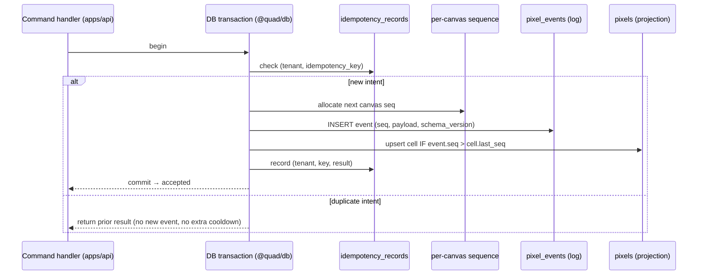
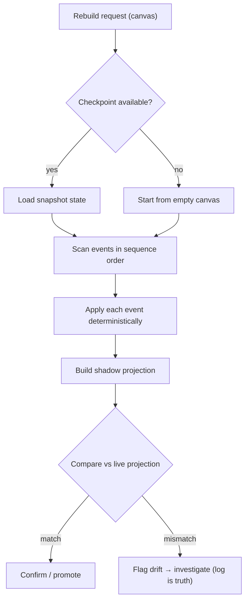
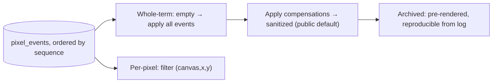
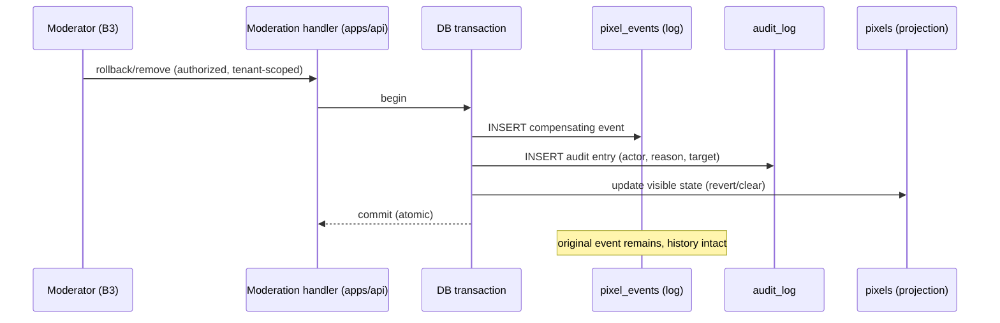

# Quad: Event Sourcing Semantics

> **This is the authoritative document for what events *mean* in Quad: the event model, the canonical catalog, append/ordering/concurrency/idempotency rules, projection-rebuild and replay-derivation semantics, moderation compensation, schema evolution, failure modes, and integrity.** It conforms to [`PRODUCT.md`](PRODUCT.md), [`PRINCIPLES.md`](PRINCIPLES.md), [`ARCHITECTURE.md`](ARCHITECTURE.md), [`BACKEND.md`](BACKEND.md), and [`DATABASE.md`](DATABASE.md); IDs cited (`P-*`, `PRIN-*`, `ARCH-INV-*`, `BE-INV-*`, `DB-INV-*`, `DC*`, `B*`).
>
> **Boundary with `DATABASE.md`:** that doc owns **physical storage** (tables, ERD, indexing, partitioning); **this doc owns *semantics*** (meaning, ordering, replay, compensation). Where they meet, e.g., "`pixel_events` is append-only", they agree; the *why and how-it-replays* lives here, the *how-it's-stored* lives there.
>
> **Altitude:** semantics. Event payloads are described **conceptually** (field lists), **not** as TypeScript types, JSON Schema, Prisma models, or source files. **No** REST DTOs (`API.md`/`@quad/core`), **no** WS payloads (`WEBSOCKETS.md`), **no** versions (`TECH_BASELINE.md`), **no** app code/package files.
>
> **Naming:** platform = **Quad**; **Rutgers Quad** = tenant #1 (example data only). No tenant literal in event semantics (`PRIN-CONFIG-OVER-CODE`).

---

## 1. Purpose & Scope

Event sourcing is how Quad keeps its deepest promise: **preserve every action forever** (`PRIN-PERMANENCE`, `P-VISION-3`). The event log is the source of truth; the canvas, profiles, leaderboards, heatmaps, archives, and replays are all *derived*. This document defines the rules that make that true, correct, and fair.

**In scope:** event model + catalog, append/ordering/concurrency/idempotency rules, projection model + rebuild, replay derivation, moderation via compensating events, schema evolution, failure modes, integrity/auditability, performance/security, testing, invariants.

**Out of scope (owned elsewhere):** physical storage (`DATABASE.md`), REST contracts (`API.md`), WebSocket messages (`WEBSOCKETS.md`), moderation tool UX/permission ladder (`MODERATION.md`), archive artifact formats (`ARCHIVES.md`), replay player/UI (`REPLAY.md`), cooldown algorithm (`COOLDOWN.md`).

---

## 2. Responsibilities vs. Non-Responsibilities

| Event sourcing **owns** | It does **not** own |
| --- | --- |
| What each event *means* and its payload fields (conceptually) | How events are physically stored/indexed/partitioned (`DATABASE.md`) |
| Ordering, concurrency, idempotency, replay determinism | The Prisma schema / migrations |
| Projection-rebuild + replay-derivation semantics | The replay player UI (`REPLAY.md`) / archive blob formats (`ARCHIVES.md`) |
| Moderation-as-compensation semantics | Moderation tools/roles (`MODERATION.md`) |
| Event naming + schema versioning rules | REST DTOs / WS payloads (`API.md`/`WEBSOCKETS.md`) |

---

## 3. Why Quad Is Event-Sourced

- **Permanence by construction**: an append-only log cannot silently lose or overwrite history (`PRIN-PERMANENCE`).
- **Every pixel tells its story**: per-pixel history and replay fall out naturally from a complete event stream (`P-ATTR-5/6`, `P-FEAT-9`).
- **Reversible, auditable moderation**: corrections are *new* events, so safety and permanence coexist (`PRIN-NO-INVISIBLE-LOSS`).
- **Derive anything later**: new projections (a future heatmap, a new stat) are computed by replaying existing events; no data is "missing" because it was never thrown away.

**Scoping decision (important):** the **canvas/pixel and moderation domains are fully event-sourced** (the crown jewel). **Account/membership identity is primarily state** (tables in `DATABASE.md`) with **audit events** recorded for consequential changes (verification, role grants, bans/suspensions). Quad does **not** event-source everything, it event-sources what must be permanent and replayable.

---

## 4. The Event Log as Source of Truth

- `pixel_events` (and the moderation/lifecycle events that share the log/audit) is the **single source of truth** (`ES-INV-1`).
- **All projections derive from it** and are rebuildable (`DB-INV-3`, `ES-INV-7`).
- The current canvas a user sees is a *projection*; if it ever disagreed with a faithful replay of the log, **the log wins** and the projection is rebuilt.

---

## 5. Event Model

Every event carries a common envelope (conceptual fields; storage in `DATABASE.md` §7):

| Field | Meaning |
| --- | --- |
| **Event identity** | A unique event id. |
| **Tenant id** | Owning tenant (`B4`); every event is tenant-scoped (`ES-INV-11`). |
| **Canvas id** | Owning canvas/term (present for canvas-domain events). |
| **Actor id** | The user/operator responsible — an **internal id**, resolved to a `DC2` public handle for display; **never the email** (`ES-INV-10`). |
| **Event type** | The canonical type name (§7), e.g., `PixelPlaced`. |
| **Payload** | Type-specific data (e.g., coordinate, prev/new color). |
| **Metadata** | Non-authoritative context (request/correlation id, source). **No `DC3`**; sensitive signals (e.g., IP) are excluded or hashed and live with abuse tooling, not the public event. |
| **Timestamp** | Wall-clock time of the event — **informational/display only**, not the ordering authority. |
| **Sequence / order key** | A strictly increasing **per-canvas** sequence assigned at append — **the authoritative replay order** (`§10`). |
| **Idempotency key** | Ties the event to a single command intent for duplicate-safety (`§12`). |
| **Schema version** | The event's payload schema version (`§17`). |

---

## 6. Canonical Event Categories

- **Pixel placement events**: the core canvas-changing events.
- **Moderation / compensating events**: reverse visible state without deleting history.
- **Canvas lifecycle events**: term/canvas state transitions.
- **Report events**: the reporting workflow.
- **User/account/membership events**: *audit-grade* records of consequential identity changes (not a full event-sourced aggregate, see §3).
- **Archive/replay generation**: produced by **jobs** (`BACKEND.md` §15); the domain event is the lifecycle event (`CanvasArchived`), while generation itself is a job that records job/audit metadata, not a per-step domain stream.

---

## 7. Initial Event Catalog (Architecture Level)

Conceptual payloads (key fields only; not schemas). All include the §5 envelope.

| Event | Category | Key payload | Projection effect |
| --- | --- | --- | --- |
| **`PixelPlaced`** | Placement | x, y, prev_color, new_color | Upsert `pixels` cell; update stats/analytics |
| **`PixelRolledBack`** | Compensating | x, y, restored_color (prev/blank), reason_ref | Revert cell to restored state |
| **`RegionRolledBack`** | Compensating | region (bounds/selection), restored_state_ref, reason_ref | Revert affected cells |
| **`ArtworkRemoved`** | Compensating | region/selection, reason_ref | Clear/replace offending cells (sanitized) |
| **`CanvasCreated`** | Lifecycle | canvas meta, dimensions, palette_snapshot_ref | Canvas enters `upcoming` |
| **`CanvasActivated`** | Lifecycle | activated_at | Canvas → `active` (placement opens) |
| **`CanvasFrozen`** | Lifecycle | frozen_at | Canvas → `frozen` (placement stops) |
| **`CanvasArchived`** | Lifecycle | archive_refs (image/stats/replay) | Canvas → `archived`; seals record |
| **`ReportSubmitted`** | Report | reporter_id, target_ref, reason | New report (queue) |
| **`ReportResolved`** | Report | report_id, resolution, resolver_id | Report → resolved |
| **`UserSuspended`** | Moderation/audit | user_id, duration, reason_ref | Suspension state + audit |
| **`UserBanned`** | Moderation/audit | user_id, reason_ref | Ban state + audit |
| **`ModerationActionRecorded`** | Moderation/audit | actor_id, action_type, target_ref, reason | Audit entry (`DC4`) tying an action to its effect |

> Additional architecture-level events as needed: **`MembershipVerified`** (audit-grade account event), **`CanvasSnapshotCheckpointed`** (optional projection checkpoint for fast rebuild, `§14`). The catalog is **extensible** by adding new types (additively, `§8`/`§17`), never by repurposing an existing one. Concrete payload shapes are declared in `@quad/core`.

---

## 8. Event Naming & Versioning Rules

- **Names are past-tense facts** (`PixelPlaced`, not `PlacePixel`), events record what *happened*.
- **Names are canonical and stable**: declared once in `@quad/core`; never renamed (deprecate + add instead).
- **Types are tenant-neutral**: no tenant-specific event types; tenant is an envelope field.
- **Every event has a `schema_version`** (`§17`); a breaking payload change introduces a new version, never an in-place rewrite of past events.

---

## 9. Event Append Rules

- **Append-only, immutable**: events are only inserted; never updated or deleted (`ES-INV-2`, `DB-INV-1`).
- **Single writer**: only `apps/api` via `@quad/db` appends (`ES-INV-3`, `BE-INV-3`).
- **Transaction boundary with projections**: an append commits **atomically** with: per-canvas sequence allocation, the **hot current-canvas projection** update, and the **idempotency record** (`ES-INV-5`, `DB-INV-4`). Either all commit or none do; the projection never reflects an un-appended event, and never misses one.
- **Heavier projections** (leaderboards, analytics) may update **outside** the placement transaction (eventually consistent), since they are not correctness-critical to the placement itself (`§13`).

---

## 10. Ordering Model

- **Per-canvas total order.** Each event gets a strictly increasing **per-canvas sequence** assigned inside the append transaction. Replay and rebuild use **sequence order**, not timestamps (`ES-INV-4`).
- **Per-canvas (not global) is deliberate.** A global sequence would be a write bottleneck and is unnecessary: replay reconstructs **one canvas at a time**, and partitioning is per-canvas (`DATABASE.md` §14). Per-canvas ordering scales horizontally across tenants/canvases.
- **Timestamp vs. sequence.** Wall-clock timestamps drift across instances and are for **display/analytics**, never for ordering. The sequence is the deterministic truth.
- **Deterministic replay order.** Applying a canvas's events in ascending sequence yields exactly one canvas state, the determinism that makes replay and rebuild trustworthy (`ES-INV-7`).

---

## 11. Concurrency Model

- **Two users place the same cell "simultaneously":** both are valid, independent events. The append transaction **serializes** them (sequence A < sequence B); both are preserved in history. The current projection ends at the **higher-sequence** event's color, **last-writer-by-sequence wins** for *visible* state, with **no lost history** (`PRIN-PERMANENCE`).
- **Placements are additive, not compare-and-set.** There is no "conflict" to reject, a later placement legitimately overwrites a cell's *color* while the *prior event remains* (`P-CANVAS-5`).
- **Projection race handling.** The cell upsert applies an event **only if its sequence exceeds the cell's recorded `last_seq`** (monotonic guard), so concurrent/retried applies are safe and order-independent in effect.
- **Isolation requirement.** Sequence allocation + cell upsert + idempotency insert are serialized per cell/canvas (row locking, or serializable isolation on the sequence allocation). The exact isolation level/locking mechanism is a `DATABASE.md`/implementation choice; the **requirement** is: no two events share a per-canvas sequence, and the cell converges to the highest-sequence event.

---

## 12. Idempotency Model

- **Each placement command carries an idempotency key** representing one user intent. Uniqueness is enforced as `(tenant_id, key)` within the append transaction (`DB-INV-8`).
- **Duplicate prevention:** a retried request or a double-tap with the **same key** returns the prior result and appends **no** second event (`ES-INV-6`).
- **Retry behavior:** safe, at-least-once delivery from the client cannot double-apply.
- **Double-tap behavior:** the frontend's deliberate two-step confirm reduces accidental taps (`FE-INV-8`), but the **server idempotency guard is the real protection**.
- **Cooldown fairness implication:** because a real placement maps to exactly one event, it charges **exactly one** cooldown, no double-charge, no free extra placement (`PRIN-EQUAL-POWER`, `BE-INV-7/11`).

---

## 13. Projection Model

All projections derive from the log (`DATABASE.md` §10 owns storage):

- **Current canvas projection (`pixels`)**: maintained **in the append transaction** (must be correct immediately for hover/snapshot).
- **User/profile stats**: counters (placed, surviving, streak, favorite color) per term + lifetime; may be incremental or job-recomputed.
- **Leaderboard stats**: ranked scores; **eventually consistent** (job-refreshed; staleness is a tolerance).
- **Heatmaps / analytics**: bucketed aggregates; eventually consistent.
- **Archive/replay projections**: pre-rendered artifacts produced at archive time, always reproducible from the log.

**Split rule:** the **hot, correctness-critical** projection (current canvas) is transactional; **heavier, tolerant** projections are async and rebuildable.

---

## 14. Projection Rebuild Semantics

- **Full rebuild**: replay all of a canvas's events from empty, in sequence, to reconstruct any projection.
- **Per-canvas rebuild**: the common unit (canvases are independent); rebuild one canvas without touching others.
- **Partial rebuild**: start from an optional **checkpoint/snapshot** (`CanvasSnapshotCheckpointed`) and apply only subsequent events, for speed on large terms.
- **Verification**: rebuild into a **shadow** projection and compare against the live one; a mismatch flags **drift** (bug/corruption) and is investigated, with the **log as the authority** (`ES-INV-7`). Rebuild determinism is a tested guarantee (`§22`).

---

## 15. Replay Derivation Semantics

- **Whole-term replay**: from an empty canvas, apply events in sequence to the final artwork; the player scrubs by sequence/time (`P-REPLAY-1/2`).
- **Per-pixel replay**: filter a single `(canvas, x, y)`'s events by sequence to show that cell's color history (`P-ATTR-6`).
- **Moderation-aware replay (canonical = sanitized).** The **default/public** replay applies compensating events, so content that was removed by moderation **stays removed**: replay must **not** re-expose offensive artwork (`PRIN-NO-INVISIBLE-LOSS` + safety). The **raw, pre-compensation** history remains in the log and is available to **moderators/audit** under authorization (`B3`). (Whether/how a moderator-only "as-it-happened" view is exposed is a `REPLAY.md`/`MODERATION.md` UI decision.)
- **Archived replay**: generated at archive time (pre-rendered to object storage for fast playback) but **always reproducible** from the log; archives are immutable (`P-ARCH-1`).

---

## 16. Moderation & Compensating Events

- **Rollback/removal is a *new* event** (`PixelRolledBack`, `RegionRolledBack`, `ArtworkRemoved`), **never a delete or edit** of the offending event (`ES-INV-8`, `P-MOD-5`).
- **Atomic with audit**: the compensating event, the visible-state update, and the **audit entry** (`ModerationActionRecorded` / `audit_log`) commit together (`DB-INV-6`, `BE-INV-8`).
- **Visible state vs. historical truth**: the projection (and sanitized replay) reflects the compensation; the **full history**, including the original offending event, remains for accountability and audit.
- **Audit relationship**: every compensating/moderation event is tied to an audit record capturing actor, reason, target, and time (`DC4`). Tool/permission details are `MODERATION.md`'s.

---

## 17. Event Schema Evolution

- **Versioned payloads**: each event records its `schema_version`; readers/projectors must handle **all** historical versions (`ES-INV-9`).
- **Additive, backward-compatible changes**: add new optional fields or new event types; never remove/repurpose fields in old versions.
- **Upcasting at read time**: a projector may upcast an older payload to the current shape **in memory**; the **stored event is never rewritten** (no destructive backfill of the log).
- **New derived needs**: if a new projection needs data that old events don't carry, derive what's possible and **document the gap** (history before the change legitimately lacks it); do not fabricate or mutate past events.

---

## 18. Failure Modes & Handling

| Failure | Handling |
| --- | --- |
| **Append succeeds, hot projection fails** | Impossible — they share one transaction (`§9`); a failure rolls back both. |
| **Projection drift** (async projections) | Detected by rebuild-and-verify (`§14`); remediated by rebuild; log is truth. |
| **Duplicate events** | Prevented by idempotency uniqueness (`§12`). |
| **Out-of-order consumption** | Consumers process by per-canvas sequence; the monotonic cell guard makes apply order-independent in effect (`§11`). |
| **Replay mismatch** | Determinism tests catch it; if it occurs, rebuild from the log (authority). |
| **Corrupted event payload** | Detected by schema validation on read (+ optional hash chain, `§19`); quarantine/alert; recover via immutability + backups (`DATABASE.md` §20). |

---

## 19. Event Integrity & Auditability

- **Append-only + single-writer + restricted write path** are the baseline integrity controls (`§9`).
- **Recommended: a per-canvas tamper-evidence hash chain**: each event stores a hash of `(previous_hash + canonical_payload)`, so any retroactive alteration is detectable (`ES-INV-12`). This directly addresses the "event-log tampering" threat in `SYSTEM_CONTEXT.md` §10. Final decision (cost vs. benefit, exact scheme) is deferred to `SECURITY.md`/implementation, but the **posture is recommended**.
- **Audit-log relationship**: moderation/admin events tie to `DC4` audit records; the event log itself is an auditable, immutable history. Access to raw history/audit is authorization-gated (`B3`/`B5`).

---

## 20. Performance Considerations

- **Hot placement path**: append + sequence allocation + cell upsert + idempotency must be fast and contention-bounded (per-cell/per-canvas serialization, not global).
- **Append throughput**: per-canvas sequencing avoids a global bottleneck; partition-aligned inserts keep writes cheap (`DATABASE.md` §14).
- **Replay/rebuild scans**: large sequential reads over a canvas's partition; checkpoints (`§14`) bound rebuild cost.
- **Partition-aware access**: current-canvas operations prune to the active partition; archived canvases are cold.
- Concrete budgets are owned by `PERFORMANCE.md`.

---

## 21. Security & Privacy Considerations

- **No `DC3` in event payloads or public projections**: events reference an **actor id**, resolved to a `DC2` handle for display; the email never enters the event stream or any public-facing read (`ES-INV-10`, `DB-INV-7`, `CTX-INV-3`).
- **Attribution without exposure**: per-pixel/history attribution shows the public handle only (`P-ATTR-3/4`).
- **Moderation/audit access**: raw history, compensations, and audit are authorization-gated (`B3`/`B5`); sanitized replay is the public default (`§15`).
- **Sensitive abuse signals** (e.g., IP) are not stored in domain events; they live with abuse tooling per `SECURITY.md`.

---

## 22. Testing Expectations

Critical-subsystem tests (against real Postgres; strategy → `TESTING.md`):

- **Append-only tests**: updates/deletes on the event log are rejected/impossible.
- **Ordering tests**: per-canvas sequences are strictly increasing and unique; replay order = sequence order.
- **Idempotency tests**: duplicate keys never produce a second event or extra cooldown charge.
- **Projection rebuild tests**: rebuild is **deterministic** and matches incrementally-maintained state.
- **Replay determinism tests**: identical inputs yield identical replays.
- **Moderation compensation tests**: compensating event + audit are atomic; original history is preserved; sanitized replay hides removed content.
- **Tenant isolation tests**: replay/rebuild operate within a canvas/tenant; no cross-tenant event access (`P-AC-13`).
- **Schema-version compatibility tests**: projectors correctly handle every historical event version.

---

## 23. Event-Sourcing Invariants (`ES-INV-*`)

- **`ES-INV-1`** The event log is the single source of truth; all projections derive from it.
- **`ES-INV-2`** Events are append-only and immutable, never updated or deleted.
- **`ES-INV-3`** Single writer: only `apps/api` via `@quad/db` appends events.
- **`ES-INV-4`** Each event has a strictly increasing **per-canvas sequence** assigned at append; replay order = sequence order (not timestamp).
- **`ES-INV-5`** Append + hot-projection update + idempotency record are atomic.
- **`ES-INV-6`** An identical idempotency key never produces a second event.
- **`ES-INV-7`** Every projection is deterministically rebuildable from the log and matches incremental state.
- **`ES-INV-8`** Moderation changes visible state only via new compensating events + atomic audit; historical events are never removed.
- **`ES-INV-9`** Every event carries a `schema_version`; readers handle all versions; old events are never rewritten.
- **`ES-INV-10`** No `DC3` in event payloads/public projections; attribution is via actor id → `DC2` handle.
- **`ES-INV-11`** Events are tenant- and canvas-scoped; replay/rebuild operate within a canvas.
- **`ES-INV-12`** *(Recommended)* Per-canvas tamper-evidence (hash chain) enables integrity verification.

---

## 24. Diagrams

- **Event append + projection transaction**: §9.
- **Projection rebuild flow**: §14.
- **Replay derivation flow**: §15.
- **Moderation compensation flow**: §16.

(All four are inline above at the section that owns them.)

---

## 25. Decisions Deferred to Deeper Docs

| Open decision | Owner |
| --- | --- |
| Concrete event payload types/schemas (declarations) | `@quad/core` (+ `API.md`/`WEBSOCKETS.md` for wire shapes) |
| Physical storage, sequence implementation, partitioning, isolation level/locking | `DATABASE.md` / implementation |
| Hash-chain integrity scheme (adopt? exact algorithm) | `SECURITY.md` / implementation |
| Checkpoint/snapshot cadence + format | implementation (`DATABASE.md`/`PERFORMANCE.md`) |
| Moderation-only "as-it-happened" replay exposure | `REPLAY.md` / `MODERATION.md` |
| Archive artifact formats (final image, replay assets) | `ARCHIVES.md` / `REPLAY.md` |
| Whether account/membership lifecycle gains its own event stream later | future / `AUTHENTICATION.md` |
| Cooldown computation that gates placement acceptance | `COOLDOWN.md` |

---

## 26. Document Control

- **Path:** `docs/EVENT_SOURCING.md`
- **Purpose:** The authoritative semantics of Quad's event sourcing, event model/catalog, append/ordering/concurrency/idempotency, projection rebuild, replay derivation, moderation compensation, schema evolution, integrity, that `apps/api` and `@quad/db` implement.
- **Dependencies:** `DATABASE.md` (storage), `BACKEND.md` (command lifecycle), `ARCHITECTURE.md`, `PRODUCT.md`, `PRINCIPLES.md`. **Consumed by:** `API.md`, `WEBSOCKETS.md`, `MODERATION.md`, `REPLAY.md`, `ARCHIVES.md`, `ANALYTICS.md`, `PROFILES.md`, `LEADERBOARDS.md`, `@quad/core` (event type declarations).
- **Acceptance checklist:** ☑ all 26 parts present ☑ semantics altitude (no Prisma/DTOs/WS payloads/source files) ☑ event model + canonical catalog (incl. all requested events) ☑ append-only/single-writer/atomic-with-projection rules ☑ per-canvas ordering decision (sequence > timestamp) ☑ concurrency (last-writer-by-sequence, no lost history) ☑ idempotency (duplicate-safe, one cooldown charge) ☑ projection rebuild + replay derivation (sanitized default) ☑ moderation compensation (no hard delete, atomic audit) ☑ schema evolution (versioned, additive, upcast) ☑ failure modes ☑ integrity (recommended hash chain) ☑ 4 Mermaid diagrams ☑ `ES-INV-1…12` ☑ no `DC3` in events ☑ versions referenced not declared ☑ tenant-neutral (Rutgers = example) ☑ no app code/package files.
- **Open questions:** see §25 (hash chain adoption, checkpoint cadence, moderator replay exposure, payload declarations).
- **Next recommended:** `docs/API.md` (the complete REST contract, resources, request/response DTOs, errors, built on these events and projections).
