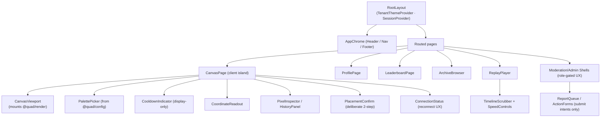
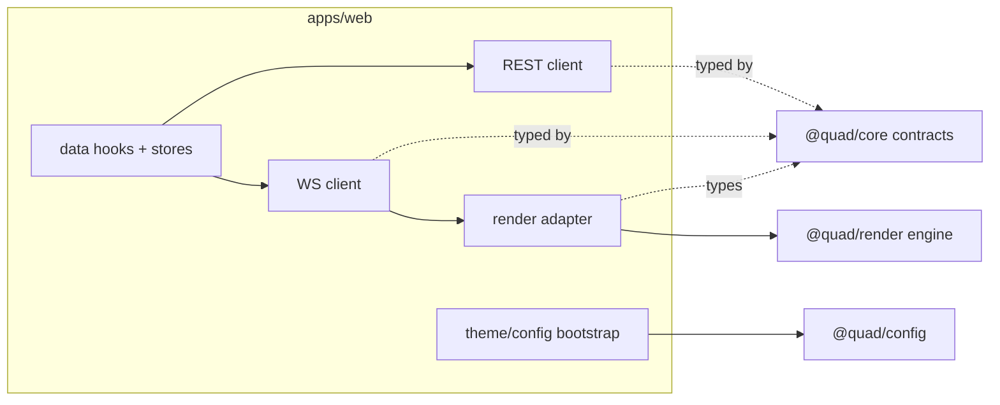

# Quad: Frontend Architecture (`apps/web`)

> **This document defines the web application: its shell, routes, component architecture, state model, integration seams, and the UX/accessibility/privacy/security responsibilities it owns.** It conforms to [`PRODUCT.md`](PRODUCT.md), [`PRINCIPLES.md`](PRINCIPLES.md), [`NON_GOALS.md`](NON_GOALS.md), [`ARCHITECTURE.md`](ARCHITECTURE.md), and [`SYSTEM_CONTEXT.md`](SYSTEM_CONTEXT.md); IDs are cited (`P-*`, `PRIN-*`, `ARCH-INV-*`, `CTX-INV-*`, `B*`, `DC*`).
>
> **⚠️ Dependency-order note.** The documentation manifest lists `RENDERING.md` as a dependency of this doc, but **`FRONTEND.md` is authored before `RENDERING.md`.** Therefore this document defines **only the web-app shell, UI/state boundaries, and the integration *seam* with `@quad/render`**, the dedicated canvas engine. **Deep canvas-rendering internals (dirty-region, batching, zoom math, GPU/2D strategy) are deferred to [`RENDERING.md`](RENDERING.md).** Where this doc touches rendering, it describes the *mount/feed contract*, not the algorithm.
>
> **Altitude:** frontend architecture only. **No** backend schemas, REST endpoint specs, WebSocket payload specs, database tables, or rendering algorithms. **No** versions (see [`TECH_BASELINE.md`](TECH_BASELINE.md)). **No** app code or package files.
>
> **Naming:** platform = **Quad**; **Rutgers Quad** = tenant #1 (a config example only). No tenant literal appears in UI logic or strings (`PRIN-CONFIG-OVER-CODE`, `ARCH-INV-8`).

---

## 1. Purpose & Scope

`apps/web` is the **presentation tier**: it renders the live canvas and surrounding experience, captures user intents, and orchestrates calls to the backend, and nothing more. It is the human-facing surface of the system black box described in `SYSTEM_CONTEXT.md`, operating from the **public-internet (`B1`)** and **authenticated-participant (`B2`)** boundaries.

**In scope:** Next.js app shell, route/page architecture, component hierarchy, client/server boundary, the client state model, integration seams (REST, WebSocket, `@quad/render`, `@quad/core`, `@quad/config`), mobile-first interaction, accessibility, tenant theming, in-UI privacy, moderation/reporting UI *shells*, error/offline/reconnect UX, and the performance/security/testing responsibilities the frontend owns.

**Out of scope (owned elsewhere):** canvas rendering internals (`RENDERING.md`), REST contracts (`API.md`), WebSocket payloads/lifecycle (`WEBSOCKETS.md`), auth mechanism (`AUTHENTICATION.md`), tenant resolution (`MULTI_TENANCY.md`), moderation tooling (`MODERATION.md`), shared component inventory/design system (`specs/ui`, `@quad/ui`).

---

## 2. Responsibilities vs. Non-Responsibilities

| `apps/web` **is** responsible for | `apps/web` is **not** responsible for |
| --- | --- |
| Presenting the canvas + UI and capturing intents (select color, choose cell, confirm) | **Deciding placement validity** — server-authoritative (`ARCH-INV-3`, `B2`) |
| Displaying the cooldown countdown from server-provided values | **Deciding cooldown eligibility** — server computes/enforces (`P-COOL-1`, `PRIN-FAIRNESS`) |
| Orchestrating data fetching + realtime subscription | **Owning truth** — the event log/projections are the source of truth (`ARCH-INV-1/2`) |
| Reflecting auth/session state in the UI | **Deciding tenant membership** — established at the auth boundary (`B2`/`B6`) |
| Rendering moderation/report UI shells and submitting intents | **Moderation authority/actions/audit** — server-side (`B3`, `P-MOD-4`) |
| Mounting and feeding `@quad/render` | **Low-level rendering** — `@quad/render` owns it (`ARCH-INV-7` analogue → `FE-INV-7`) |
| Theming per tenant via `@quad/config` | **Defining tenant facts** — config, not code (`ARCH-INV-8`) |

**Governing rule:** the frontend **renders and orchestrates; it never decides anything fairness- or security-critical, and never trusts its own state for those decisions** (`FE-INV-2`, `FE-INV-3`).

---

## 3. Next.js App Structure (High Level)

`apps/web` is a Next.js **App Router** application (version baseline in `TECH_BASELINE.md`; Turbopack is the default bundler there). High-level structure:

- **`app/`**: routes via the App Router. A **tenant-aware root layout** establishes theme + session context; nested layouts wrap feature areas. Server Components render shells, SEO, and initial data; Client Components own interactivity.
- **`components/`**: presentational + container components (the canvas surface, palette, panels, dialogs), composed from `@quad/ui` primitives.
- **`lib/`**: thin client-side seams: the typed REST client, the WebSocket client wrapper, the `@quad/render` adapter, data-fetching hooks, and tenant/theme bootstrapping from `@quad/config`. **No domain/business logic lives here**, it orchestrates and adapts.
- **`public/`**: static assets (non-tenant; tenant branding comes from config).
- **`tests/`**: component, E2E, a11y, and rendering-seam suites (§17).

The internal folder taxonomy is indicative; the binding rules are the boundaries (§6), state model (§7), and invariants (§18), not the directory names.

---

## 4. Route / Page Architecture

Routes are tenant-scoped (the active tenant is resolved upstream, mechanism in `MULTI_TENANCY.md`). Each page's *type* and *data sources* are fixed here; concrete endpoints/payloads are deferred.

| Page / Route (illustrative) | Nature | Auth | Primary data sources | Notes |
| --- | --- | --- | --- | --- |
| **Landing / tenant home** | Mostly server-rendered | Public (`B1`) | REST (tenant meta, current canvas summary) | Tenant-branded; entry to sign-in; optional read-only canvas preview pending `P-Q-2` |
| **Live canvas** (`/`) | Client island over server shell | Public view / `B2` to place | REST snapshot + **WebSocket** deltas | The heartbeat; mounts `@quad/render` (§8); placement requires `B2` |
| **Auth entry / verification states** | Server + client | Transitional | Auth flow (mechanism → `AUTHENTICATION.md`) | States: signed-out, email-sent, verifying, verified, error; **no passwords** (`NG-ANON`) |
| **Pixel history / inspector** | Client (modal or route) | Public view | REST (per-pixel history) + per-pixel replay | Opened from a cell (`P-ATTR-5/6`); shows `DC2` handle only |
| **Profile** | Server shell + client | `B2` (own) / public view per policy | REST (profile stats, heatmap) | `DC2` identity; respects profile privacy (`P-PROF-4`) |
| **Leaderboards** | Mostly server-rendered | Public/`B2` | REST (ranked queries) | `DC2` identities; categories per `P-LEAD-1` |
| **Archives** (list + per-term) | Server-rendered | Public/`B2` | REST (archive index, term archive) + object-storage assets | Permanent, browsable (`P-ARCH-2`) |
| **Replay** (per-term) | Client | Public/`B2` | REST/asset (replay data) | Play/pause/scrub/speed/jump (`P-REPLAY-2`) |
| **Report flow** | Client dialog | `B2` | Submits report intent (REST) | Available to participants (`P-JOURNEY-6`) |
| **Moderator / admin surfaces** | Client **UI shells only** | `B3` (role-gated UX) | Submit intents (REST); read queues | **Authority is server-side**; gating is UX, not security (`FE-INV-10`) |

---

### 4a. Design realization & deferred UI data

The screens are skinned to the design system in [`specs/ui/DesignSystem.md`](../specs/ui/DesignSystem.md). The design comps depict some affordances that have **no backing field or endpoint yet**; the frontend **omits them rather than fabricating data** (`FE-INV-2` posture — the UI shows only what the server provides). Tracked omissions, by screen:

- **Live canvas:** the "just placed" activity feed, a live painter count, a total-pixels figure, and a global cooldown chip are omitted (cooldown is per-user from the placement result; there is no activity-feed/stats endpoint). The custom-colour eyedropper is omitted — placement takes a palette **index**, not an arbitrary hex.
- **Landing:** marketing stat figures and a live read-only preview are decorative-only (no tenant-stats endpoint); the term label is omitted (`PublicTenant` has no term).
- **Sign in:** accepted-domain chips are omitted — the allowed-domain list is a tenant fact **not** in `PublicTenant` (would violate `FE-INV-6` if hardcoded); link-expiry minutes and the post-verify handle are omitted (not delivered to the client).
- **Profile:** only the real pixel counts (term / lifetime) render; surviving-pixel, streak, longest-streak, and favourite-colour stats, and a recent-placements list, are omitted (no fields on the profile DTO).
- **Leaderboards:** the surviving-% column and the metric tabs (today / all-time / surviving) are omitted (the query exposes a single dataset with no category/window params); the "you" row highlight is omitted (the view does not fetch the session).
- **Archives:** per-card pixel/painter/day counts and per-card thumbnails are omitted on the list (the summary carries none, and per-card snapshot fetches are avoided); the per-term "days" stat is omitted.
- **Replay:** calendar date/month labels are omitted — the engine exposes only an event sequence, so progress is shown as a sequence-based "% of term"; the jump-to-moment and per-pixel-replay feature cards are omitted (no deep-link or per-cell-history surface).
- **Moderation:** only the real Resolve / Dismiss actions render; roll-back / suspend / ban, the summary stat cards, and the audit-log timeline are omitted (no endpoints).

**Deferred follow-ups (separate changes, owning docs update when built):** expand the canvas palette toward the ~32-colour target (`@quad/config`, `P-CANVAS-4`); surface tenant accepted email-domains (`@quad/config` / `AUTHENTICATION.md`); backend fields for profile survival/streak/favourite + recent placements (`PROFILES.md`), leaderboard survival + metric windows (`LEADERBOARDS.md`), per-term archive card stats (`ARCHIVES.md`); moderation roll-back/suspend/ban + queue counts + audit feed (`MODERATION.md`); and promotion of the token/primitive layer into `@quad/ui`.

---

## 5. Component Hierarchy (Architecture Level)

A logical hierarchy (not an exhaustive prop list). The canvas page is the critical surface.

- **`CanvasViewport`** is the only component that touches `@quad/render` (the seam in §8); everything else is standard React composed from `@quad/ui`.
- **`CooldownIndicator`** is strictly a display of server-provided state (§7); it never gates placement itself.
- Moderation/admin components are **shells** that submit intents and display server-provided queues/state.

---

## 6. Client / Server Component Boundary

- **Server Components** render: marketing/landing, SEO metadata, page shells, archive/leaderboard listings, and initial data hydration (fast first paint, no client JS for static parts).
- **Client Components** own interactivity: the **CanvasViewport** (a client island), palette, cooldown indicator, inspectors, replay scrubber, dialogs, and anything driven by realtime updates or gestures.
- **Rules:**
  - The live canvas is a **client island** mounted within a server-rendered shell so the page is fast and SEO-friendly while the canvas stays fully interactive.
  - Request-time server APIs are awaited per the App Router model (see `TECH_BASELINE.md`); the frontend does not assume synchronous request data.
  - **No business logic in either kind of component** (`FE-INV-1`): data fetching lives in server components or dedicated client data hooks; decisions live on the server.

---

## 7. State Model

Five state categories. **Every authoritative value is server-owned; the client holds mirrors and view state.**

| State | Source of truth | Owner in `apps/web` | Lifetime | Notes |
| --- | --- | --- | --- | --- |
| **Server-sourced data** (canvas snapshot, profiles, boards, archives) | Server (REST) | Data-fetch hooks/cache | Cached + revalidated | Read model; never mutated client-side except via server round-trip |
| **Local UI state** (view transform/zoom/pan, selected color, open panels, dialog state) | Client | Component/local store | Session/ephemeral | Pure presentation; safe to own fully |
| **Realtime canvas state** (live deltas) | Server (WebSocket) | WS client → render adapter | Live; rebuilt on reconnect | Deltas applied over the snapshot; **converges to server truth on reconnect** (`ARCHITECTURE.md` §11) |
| **Cooldown state** (remaining time) | **Server** (global, authoritative) | CooldownIndicator (display) | Until next placement allowed | **Display-only countdown** derived from server value; never a client decision (`P-COOL-5`, `FE-INV-3`) |
| **Auth/session state** | **Server** (session) | SessionProvider (read-only reflection) | Session | UI reflects membership/role; UI gating is UX, not enforcement (`FE-INV-10`) |

**Principle:** local UI state may be fully client-owned; **fairness/identity/validity state is only a reflection** of server truth. On any divergence (e.g., after reconnect or a rejected placement), the client re-syncs to the server (§14).

---

## 8. Integration Seams

Five seams, each a thin, typed boundary. The frontend owns the *adapter*, not the other side's internals.

1. **REST client**, a thin wrapper issuing authenticated requests, typed end-to-end by **`@quad/core` DTOs**. It carries no business logic and defines no shapes of its own. Endpoint contracts → `API.md`.
2. **WebSocket client**, connects to the tenant/canvas channel, applies inbound updates, and handles reconnect by re-fetching a snapshot and resubscribing. Messages are typed by **`@quad/core` WS schemas**. Lifecycle/payloads → `WEBSOCKETS.md`.
3. **`@quad/render` seam (mount/feed)**, `CanvasViewport` **mounts** the engine and **feeds** it: (a) the initial canvas snapshot, (b) a stream of applied deltas, (c) view commands (zoom/pan/select). The engine **emits back** interaction events (hover/long-press target, coordinate under cursor, cell selection) which the React layer turns into UI (inspector, coordinate readout, placement confirm). **This doc defines only this contract; the rendering algorithm is `RENDERING.md`'s** (`FE-INV-7`).
4. **`@quad/core` contracts**, the single source of shared types (DTOs, WS payloads, domain enums like palette/coordinate types). The web app **imports** them and **never declares parallel types** (`FE-INV-4`, `ARCH-INV-6`).
5. **`@quad/config` (tenant theme/branding/features)**, supplies the active tenant's theme tokens, palette, title/logo, and feature flags (e.g., whether read-only viewing is enabled). The UI reads tenant facts **only** from here (`FE-INV-6`).

---

## 9. Mobile-First Interaction Model

Mobile is the primary target (`P-USER-1`, `PRIN-MOBILE-FIRST`). The interaction layer (inside/around `CanvasViewport`) translates input into view commands fed to `@quad/render` and into placement intents.

- **Pinch-zoom** and **drag-pan** for navigating the canvas (`P-CANVAS-8`), with deep-zoom support and crisp pixels (crispness owned by `RENDERING.md`).
- **Tap-to-target / tap-to-place** as the touch placement path (`P-JOURNEY-2`).
- **Touch hover alternative:** since touch has no hover (`P-ATTR-2`), inspection uses **tap-to-inspect / long-press** to reveal coordinate + `DC2` attribution, instead of desktop hover.
- **Safe confirmation UX:** placement is a **deliberate two-step**: select a cell, then confirm, so a stray tap never wastes the (5–20 min) cooldown (`FE-INV-8`). Desktop mirrors this with a confirm affordance.
- **Responsive layout:** controls reachable one-handed; the canvas remains the focal element across breakpoints.

Gesture disambiguation (pan vs. place vs. zoom) is a frontend concern; the precise heuristics are an implementation detail flagged in §19.

---

## 10. Accessibility (Canvas-Heavy App)

A pixel canvas is inherently opaque to assistive tech, so the frontend provides accessible **parallels** (target: WCAG AA; detailed bar in `TESTING.md`/`specs/ui`):

- **Keyboard navigation:** move a focus cursor across cells (arrows), read the focused cell's coordinate/color, and place via keyboard with the same confirm step.
- **ARIA live regions:** announce cooldown changes, placement success/rejection, and reconnect status (`P-COOL-5`).
- **Accessible pixel inspection:** the inspector/history panel is fully navigable and exposes coordinate, color (by name/value, not color alone), `DC2` owner, and timestamps as text.
- **Don't rely on color alone:** palette entries carry names/labels; UI state uses text/icons in addition to color.
- **Focus management** in modals/dialogs (inspector, report, confirm); visible focus styles.
- **Reduced-motion** support for replay/animations; **adequate touch-target sizing**; sufficient contrast for chrome.

Accessibility is a launch concern only at the **baseline** in MVP; richer enhancements are post-MVP (`P-POST-8`) but the parallels above are required from the start.

---

## 11. Tenant Theming / Branding Rules

- The active tenant's **theme tokens, palette, title, and logo** come from `@quad/config`; the root layout injects the tenant primary as a CSS custom property and the accent token **`--qa`** (with tints `--qa-tint`/`--qa-tint2`) is **derived from it in CSS**, so the whole UI tracks config with no hardcoded campus colour. Concrete tokens, the type scale, and the `.quad-*` primitives are speced in [`specs/ui/DesignSystem.md`](../specs/ui/DesignSystem.md).
- **No tenant literals** in components or strings, Rutgers Quad's Scarlet theme, domains, and palette are **config values for tenant #1**, identical in mechanism to any future tenant (`PRIN-CONFIG-OVER-CODE`, `ARCH-INV-8`, `FE-INV-6`).
- The **color palette is tenant configuration** (`P-CANVAS-4`); the UI renders whatever palette config provides, with no hardcoded color set.
- The app is effectively **white-label**: swapping the tenant changes branding/palette/feature-flags without code changes (`P-ADMIN-1/2`).

---

## 12. UI Privacy Rules

Built directly on the data classes in `SYSTEM_CONTEXT.md` §7:

- **Show `DC2` (public handle / display name) only.** Attribution everywhere, hover/inspect, pixel history, profiles, leaderboards, uses the public handle (`P-ATTR-3`).
- **Never render or log `DC3`** (full email, internal ids, tokens) anywhere in the UI or client logs (`P-ATTR-4`, `CTX-INV-3`, `FE-INV-5`).
- **Respect profile privacy settings** (`P-PROF-4`): the UI honors what a user has chosen to expose.
- **Moderator shells** may surface additional context only as the server provides it for authorized roles; the UI still never invents identity exposure, and any expanded identity view is governed by `MODERATION.md`/`AUTHENTICATION.md`, not decided here.
- **No client-side persistence** of sensitive identity beyond the session the server grants.

---

## 13. Moderation / Reporting UI Boundaries

- **Reporting** is a participant-facing dialog that submits a report *intent*; triage/decisions happen server-side (`P-JOURNEY-6`, `B3`).
- **Moderator/admin surfaces are UI shells**: they display server-provided queues/state and submit action *intents*. They **do not** decide authority, perform actions, or write audit entries, all of that is server-side (`P-MOD-4`, `FE-INV-2`).
- **Role-gated rendering is UX only.** Hiding a tool from a non-moderator improves UX but is **not** a security control; the server enforces authority regardless (`FE-INV-10`).
- Tool inventory, action semantics, and audit are owned by `MODERATION.md`.

---

## 14. Error / Loading / Offline / Reconnect UX

- **Loading:** skeletons for data views; a clear initial-snapshot state for the canvas before first paint.
- **Placement outcomes:** a placement is **not shown as final until the server acks it** (`FE-INV-9`); on rejection, show the reason and remaining cooldown (`P-COOL-5/7`). Optimistic feedback, if any, is visibly provisional and reconciled to the server result.
- **WebSocket disconnect:** show a non-alarming "reconnecting" state; on reconnect, **re-fetch the canvas snapshot and resubscribe**, then converge to server truth (consistent with `ARCHITECTURE.md` §11 and `FE-INV-3`).
- **Offline:** detect connectivity loss; disable placement affordances with explanation; recover gracefully when back online.
- **Error boundaries:** isolate a failing panel (e.g., inspector) without taking down the canvas; surface actionable messages, never raw internals (and never `DC3`).

---

## 15. Frontend Performance Responsibilities

Frontend owns the **client-side share** of the budgets in `PERFORMANCE.md` (it does not define them):

- Keep the UI **feeling instantaneous** (`PRIN-ALIVE`): fast initial canvas paint from the snapshot, responsive controls.
- **Feed `@quad/render` efficiently:** batch applied deltas and avoid a React re-render per pixel, **React orchestrates; the engine paints** (rendering FPS/dirty-region is `RENDERING.md`'s concern, but the frontend must not create needless React work that starves it).
- **Code-split / lazy-load** heavy, non-critical views (e.g., replay), keep the main thread free during canvas interaction, and minimize bundle weight on the canvas path.
- Measure against the client-side budgets; regressions on the canvas path are gated by tests (`§17`, `PERFORMANCE.md`).

---

## 16. Frontend Security Responsibilities

Defense-in-depth; the frontend enforces nothing authoritatively (`B1`/`B2` posture):

- **Never trust client state for fairness/security** (`FE-INV-3`): validity, cooldown, authority, and membership are server-decided; the UI only reflects them.
- **Authenticated requests:** every state-changing call carries the server-issued session/credential (mechanism + CSRF posture → `AUTHENTICATION.md`/`SECURITY.md`).
- **XSS hygiene:** escape/encode all user-controlled text (handles, report text) before display; avoid unsafe HTML injection. The canvas is pixels, not markup, but inspector/handle/text surfaces must be safe.
- **No secrets in the client bundle**; respect `DC3` non-exposure (`§12`); avoid leaking identifiers into client logs (`CTX-INV-8`).
- Treat all server data as the source of truth and all user input as untrusted.

---

## 17. Testing Expectations

Frontend test layers (tooling per `TECH_BASELINE.md`; overall strategy in `TESTING.md`):

- **Component tests**: UI logic, state transitions, cooldown display, confirm flow, privacy rendering (`DC2` only), role-gated rendering (UX).
- **Playwright E2E flows**: onboarding/verification states, place-a-pixel (with confirm), inspect pixel history, profile, leaderboard, replay scrub, report submission.
- **Mobile/touch tests**: device emulation for pinch-zoom, drag-pan, tap-place, long-press inspect; responsive layout.
- **Accessibility tests**: automated (axe) + keyboard navigation, ARIA live announcements, focus management, contrast/color-independence.
- **Rendering-seam tests**: verify the web app feeds `@quad/render` the correct snapshot/deltas/view-commands and correctly handles emitted events, using a **mock/contract of the render seam**, **without** testing rendering internals (those are `RENDERING.md`/`@quad/render`'s tests). This keeps the seam verified while honoring the ownership boundary.

Critical UX (placement confirm, reconnect convergence, privacy non-exposure) must be covered by automated tests, not manual checks only.

---

## 18. Frontend Invariants (`FE-INV-*`)

- **`FE-INV-1`** No business logic in React components, they render and orchestrate only.
- **`FE-INV-2`** The frontend never decides placement validity, cooldown eligibility, moderation authority, or tenant membership; it displays server decisions.
- **`FE-INV-3`** Client state is never authoritative for fairness/security; the UI mirrors server truth and converges on reconnect.
- **`FE-INV-4`** All shared shapes (DTOs/WS payloads) come from `@quad/core`; the web app declares no parallel types.
- **`FE-INV-5`** `DC3` (full email/internal ids/tokens) is never rendered or logged client-side; only `DC2` is shown.
- **`FE-INV-6`** No tenant literals in UI logic/strings; branding, palette, and feature flags come from `@quad/config`.
- **`FE-INV-7`** `apps/web` mounts and feeds `@quad/render` but contains no low-level rendering algorithm.
- **`FE-INV-8`** Placement is a deliberate, confirmed action; no accidental one-tap placement wastes a cooldown.
- **`FE-INV-9`** Optimistic UI never presents an unconfirmed placement as final.
- **`FE-INV-10`** Role-gated UI is UX only, never a security control.

---

## 19. Decisions Deferred to Deeper Docs

| Open decision | Owner |
| --- | --- |
| Canvas rendering internals (dirty-region, batching, zoom math, 2D vs WebGL) + exact mount/feed event shape | `RENDERING.md`, `@quad/render` |
| REST endpoint contracts the data hooks call | `API.md` |
| WebSocket message payloads + connection lifecycle/reconnect protocol | `WEBSOCKETS.md` |
| Auth/session mechanism, where the session crosses into the WS handshake, CSRF posture | `AUTHENTICATION.md`, `ADR-0006` |
| Tenant resolution at the routing layer (host/subdomain → tenant) | `MULTI_TENANCY.md` |
| Moderation tool inventory + any expanded identity exposure in moderator shells | `MODERATION.md` |
| Data-fetching/caching library + client state-management approach | Frontend implementation decision (flagged; pick at `START IMPLEMENTATION`) |
| Read-only spectator UI surface (changes public routes) | `P-Q-2` → `MULTI_TENANCY.md`/product |
| Public-handle exposure specifics in profiles/attribution | `P-Q-1` → `PROFILES.md`/`AUTHENTICATION.md` |
| Shared component inventory / design-system tokens | **Resolved (app-local):** token layer + `.quad-*` primitives in `apps/web` (`app/globals.css` + `components/ui/`), fonts via `next/font`, speced in [`specs/ui/DesignSystem.md`](../specs/ui/DesignSystem.md); promotion to `@quad/ui` deferred to a later shared-extraction change |
| Replay export UI | post-MVP (`P-POST-5`) |

---

## 20. Document Control

- **Path:** `docs/FRONTEND.md`
- **Purpose:** Define the `apps/web` architecture, shell, routes, components, state, integration seams, and frontend-owned UX/a11y/privacy/security/testing responsibilities, within the boundaries set by `ARCHITECTURE.md`.
- **Dependencies:** `ARCHITECTURE.md`, `SYSTEM_CONTEXT.md`, `PRODUCT.md`, `PRINCIPLES.md`, `NON_GOALS.md`, `TECH_BASELINE.md`. **Forward dependency (deferred):** `RENDERING.md` (seam consumer, see dependency-order note). **Consumed by:** `specs/ui`, `RENDERING.md`, `API.md`/`WEBSOCKETS.md` (client expectations), `TESTING.md`.
- **Acceptance checklist:** ☑ all 20 parts present ☑ frontend altitude only (no backend schemas/API/WS payloads/DB tables/rendering algorithms) ☑ dependency-order note (authored before `RENDERING.md`; shell + seams only) ☑ hard boundaries encoded (renders/orchestrates, never decides fairness/security; `@quad/render` seam only; no logic in components; no self-trust) ☑ state model with server-as-truth ☑ mobile-first + a11y + privacy (`DC2` only) ☑ moderation UI = shells ☑ `FE-INV-1…10` ☑ versions referenced not declared ☑ tenant-neutral, no Rutgers hardcoding ☑ no app code/package files.
- **Open questions:** see §19 (rendering seam shape, data/state libraries, spectator UI, handle exposure).
- **Next recommended:** `docs/BACKEND.md` (the `apps/api` service architecture, command handling, domain orchestration, transport, jobs).
