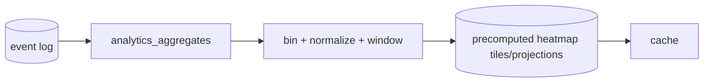
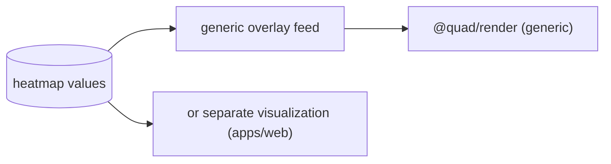

# Quad: Heatmaps

> **Derived-feature doc.** Heatmaps are **derived projections/visualizations**; the renderer stays generic and this doc doesn't redefine event/analytics semantics or rendering internals. Conforms to [`ANALYTICS.md`](ANALYTICS.md), [`EVENT_SOURCING.md`](EVENT_SOURCING.md), [`RENDERING.md`](RENDERING.md), [`PROFILES.md`](PROFILES.md), [`MODERATION.md`](MODERATION.md), [`MULTI_TENANCY.md`](MULTI_TENANCY.md), [`API.md`](API.md), [`FRONTEND.md`](FRONTEND.md), [`PRODUCT.md`](PRODUCT.md), [`PRINCIPLES.md`](PRINCIPLES.md). Contradictions flagged in §9.
>
> No app code/schemas/versions. Tenant-neutral (Rutgers Quad = tenant #1).

## 1. Purpose & Scope
Heatmaps visualize where/when activity, contention, moderation, and contribution concentrate (`P-FEAT-7`, `P-HEAT` per `PRODUCT.md` §1 heatmaps). **In scope:** heatmap types, sources, derivation, privacy, renderer relationship, performance, failure modes. **Out of scope:** metric pipeline (`ANALYTICS.md`), renderer internals (`RENDERING.md`), profile composition (`PROFILES.md`).

## 2. Responsibilities vs. Non-Responsibilities
| Heatmaps own | Don't own |
| --- | --- |
| Heatmap types + derivation (binning/normalization/windows) | Metric pipeline (`ANALYTICS.md`) |
| Overlay-vs-separate visualization relationship | Renderer internals (`RENDERING.md`) |
| Heatmap privacy posture | Profile privacy policy (`PROFILES.md`) |

## 3. Dependency References
`ANALYTICS.md` (aggregates), `EVENT_SOURCING.md` (source events), `RENDERING.md` (overlay), `PROFILES.md` (user heatmap rules), `MODERATION.md` (rollback density), `MULTI_TENANCY.md` (scope), `API.md`/`FRONTEND.md`.

## 4. Heatmap Types
| Type | Shows | Privacy |
| --- | --- | --- |
| **Activity density** | placements per cell/region | aggregate |
| **Contested/edit density** | most-changed cells | aggregate |
| **Moderation/rollback density** | where compensations occurred | aggregate; admin emphasis |
| **User contribution heatmap** | one user's own placements | profile-owned (`PROFILES.md`) |
| **Time-window heatmaps** | activity over hours/days | aggregate |

## 5. Data Sources
Event log + projections + `analytics_aggregates` (`ANALYTICS.md`). **Derived, never authoritative** (`HEATMAP-INV-1`); rebuildable from the log.

## 6. Derivation Model
- **Grid/binning:** the canvas is binned (per cell, or coarser tiles at low zoom) into density values.
- **Normalization:** values normalized (e.g., to a 0–1 scale or percentile) for stable color mapping; **avoid misleading normalization** (document scale; handle sparse data, §9).
- **Time windows:** per-window aggregates (live, daily, term, archived).
- **Scope:** per canvas / per region; tenant-scoped.

## 7. Privacy
**Aggregate heatmaps by default; no `DC3`** (`HEATMAP-INV-2`). A **user contribution heatmap** is shown only under that user's profile privacy (`PROFILES.md`) and never reveals another user's identity. Moderation/rollback heatmaps emphasize admin/operator context; public versions stay aggregate and non-identifying.

## 8. Rendering Relationship · API/Frontend · Performance
- **Renderer stays generic:** a heatmap is either an **overlay layer** fed to `@quad/render` (color values per cell/tile, same generic feed) or a **separate visualization** in `apps/web`; the engine doesn't gain heatmap-specific logic (`HEATMAP-INV-3`, `RENDER-INV-1`).
- **API/Frontend:** served via analytics endpoints (`/analytics/...`, `API.md`); visualized by `FRONTEND.md`.
- **Performance:** **precompute tiles/projections** for large canvases; cache; refresh per `PERFORMANCE.md`. Heavy heatmaps are eventually consistent (not on the placement hot path).

## 9. Failure Modes · Testing
- **Failure:** stale heatmap (serve last good + freshness note), **misleading normalization** (document the scale; clamp; handle outliers), **sparse data** (avoid over-amplifying tiny counts; show low-confidence state).
- **Testing:** derivation correctness (binning/normalization/windows), aggregate-only/no-`DC3`, user-heatmap honors profile privacy, overlay feed keeps renderer generic, tenant isolation, rebuild determinism.

## 10. Decisions Deferred
| Decision | Owner |
| --- | --- |
| Bin/tile sizes + normalization method | impl / `PERFORMANCE.md` |
| Overlay vs separate-view default | `FRONTEND.md`/`RENDERING.md` |
| Color scales/accessibility (colorblind-safe) | `FRONTEND.md` (a11y) |
| Precompute cadence/caching | `PERFORMANCE.md` |
| User-heatmap default visibility | `PROFILES.md` (`P-Q-1`) |

## 11. Heatmap Invariants (`HEATMAP-INV-*`)
- **`HEATMAP-INV-1`** Heatmaps are derived projections, never authoritative; rebuildable from the log.
- **`HEATMAP-INV-2`** Heatmaps are aggregate and contain no `DC3`; user heatmaps are profile-owned only.
- **`HEATMAP-INV-3`** Heatmaps render via the generic `@quad/render` feed or a separate view; the renderer gains no heatmap-specific logic.
- **`HEATMAP-INV-4`** Heatmaps are tenant-scoped.
- **`HEATMAP-INV-5`** Normalization is documented and avoids misleading representations of sparse data.

## 12. Diagrams
### 12.1 Heatmap projection flow

### 12.2 Overlay rendering relationship

## 13. Document Control
- **Path:** `docs/HEATMAPS.md` · **Purpose:** heatmap derivation + visualization semantics.
- **Dependencies:** `ANALYTICS`, `EVENT_SOURCING`, `RENDERING`, `PROFILES`, `MODERATION`, `MULTI_TENANCY`, `API`, `FRONTEND`. **Consumed by:** `PROFILES`, `FRONTEND`, `specs/*`.
- **Acceptance:** ☑ types ☑ sources ☑ derivation (grid/normalize/windows) ☑ aggregate-only/no-`DC3` ☑ generic renderer relationship ☑ perf (precompute/cache) ☑ failure modes ☑ `HEATMAP-INV-*` ☑ tenant-neutral ☑ no code/versions.
- **Open questions:** §10. **Next:** **Phase 2 checkpoint**.
