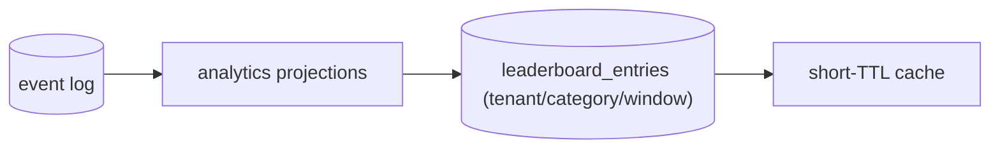
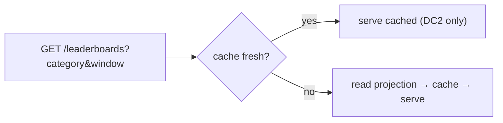

# Quad: Leaderboards

> **Derived-feature doc.** Leaderboards are **derived ranking projections, never authoritative**; this doc does not redefine event/analytics semantics or contracts. Conforms to [`ANALYTICS.md`](ANALYTICS.md), [`EVENT_SOURCING.md`](EVENT_SOURCING.md), [`DATABASE.md`](DATABASE.md), [`PROFILES.md`](PROFILES.md), [`MODERATION.md`](MODERATION.md), [`MULTI_TENANCY.md`](MULTI_TENANCY.md), [`PRODUCT.md`](PRODUCT.md), [`PRINCIPLES.md`](PRINCIPLES.md), [`NON_GOALS.md`](NON_GOALS.md). Contradictions flagged in §11.
>
> No app code/schemas/versions. Tenant-neutral (Rutgers Quad = tenant #1).

## 1. Purpose & Scope
Leaderboards celebrate real, attributable contribution per tenant (`P-FEAT-6`, `P-LEAD-1…5`). **In scope:** categories, ranking projections, windows, tie-breaking, identity/privacy, anti-abuse, caching, archive snapshots. **Out of scope:** metric derivation pipeline (`ANALYTICS.md`), profile data (`PROFILES.md`), event semantics (`EVENT_SOURCING.md`).

## 2. Responsibilities vs. Non-Responsibilities
| Leaderboards own | Don't own |
| --- | --- |
| Category/window/tie-break definitions | Underlying metric derivation (`ANALYTICS.md`) |
| Ranking projection + caching expectations | Profile identity policy (`PROFILES.md`) |
| Anti-abuse category policy (what's public) | Event/storage semantics |

## 3. Dependency References
`ANALYTICS.md` (metrics), `EVENT_SOURCING.md` (source), `DATABASE.md` (§7 `leaderboard_entries`, §13 indexing), `PROFILES.md` (`DC2` identity), `MODERATION.md` (surviving counts post-compensation), `MULTI_TENANCY.md` (scope).

## 4. Data Sources / Projections
Derived from analytics/projections over the event log; materialized as `leaderboard_entries` (per tenant/canvas/category/window). **Never** source of truth (`LEADERBOARD-INV-1`).

## 5. Leaderboard Categories
| Category | Basis | Public? |
| --- | --- | --- |
| **Most placements** | total placements | ✅ |
| **Most retained pixels** | currently-surviving placements | ✅ |
| **Longest streak** | consecutive participation | ✅ |
| **Most contested pixels contributed to** | participation in high-activity cells | ✅ (framed positively) |
| **Most rollbacks received** | moderation against a user | ❌ **not public** (shame metric) — moderator/admin oversight only, if computed at all |
| **Team/group** | groups | ⛔ deferred (post-MVP) |

**Anti-abuse policy:** categories must **not incentivize vandalism** and must **not expose public "shame" metrics** (`LEADERBOARD-INV-3`, watch-out honored). Rankings derive from **real attributable** activity and resist gaming (`P-LEAD-4`).

## 6. Ranking Windows
All-time term · daily · weekly · **archived-term snapshot** (final rankings frozen at archive, `ARCHIVES.md`).

## 7. Tie-Breaking
Deterministic, stable order: primary metric → earliest-achieved (lower sequence) → stable id. No randomness; ties never reorder between refreshes unless data changes.

## 8. Public Identity
**`DC2` only** (public handle/display name); **never `DC3`** (`LEADERBOARD-INV-2`). Honors profile privacy/opt-out (`PROFILES.md`); an opted-out user is excluded from public boards (still counts internally if needed). Opt-out policy is a `PROFILES.md`/product decision (`P-Q-1`).

## 9. Caching / Freshness · Archive Snapshots
- **Eventually consistent**, short-TTL cached (`API.md` §17); "today" refreshes promptly; cadence → `PERFORMANCE.md`.
- **Archived snapshot** is immutable (sealed with the term, `ARCHIVES.md`).

## 10. Privacy/Security · Failure Modes · Testing
- **Privacy/Security:** `DC2`-only, no shame metrics public, tenant-scoped (`TENANT-INV-5`), opt-out respected.
- **Failure modes:** projection lag (serve last good + flag), rebuild mismatch (rebuild from log), gaming attempt (anti-abuse + audit).
- **Testing:** category correctness, tie-break determinism, window correctness, archived-snapshot immutability, `DC2`-only/no-`DC3`, no public shame category, tenant isolation, opt-out exclusion.

## 11. Decisions Deferred
| Decision | Owner |
| --- | --- |
| Exact metric formulas/windows | `ANALYTICS.md`/product |
| Opt-out policy + default visibility | `PROFILES.md` (`P-Q-1`) |
| Whether "rollbacks received" is computed at all (oversight-only) | `MODERATION.md`/product |
| Team/group boards | post-MVP (`P-POST-7`) |
| Refresh cadence/TTL | `PERFORMANCE.md` |

## 12. Leaderboard Invariants (`LEADERBOARD-INV-*`)
- **`LEADERBOARD-INV-1`** Leaderboards are derived projections, never authoritative; rebuildable from the log.
- **`LEADERBOARD-INV-2`** Public entries show `DC2` only; never `DC3`; opt-out respected.
- **`LEADERBOARD-INV-3`** No public category incentivizes vandalism or exposes a "shame" metric.
- **`LEADERBOARD-INV-4`** Rankings derive from real attributable activity and resist gaming.
- **`LEADERBOARD-INV-5`** Tenant-scoped (no global cross-tenant board in MVP); tie-breaking is deterministic.

## 13. Diagrams
### 13.1 Projection flow

### 13.2 Ranking query/cache

## 14. Document Control
- **Path:** `docs/LEADERBOARDS.md` · **Purpose:** leaderboard categories, ranking projections, privacy, caching.
- **Dependencies:** `ANALYTICS`, `EVENT_SOURCING`, `DATABASE`, `PROFILES`, `MODERATION`, `MULTI_TENANCY`, `PRODUCT`, `PRINCIPLES`, `NON_GOALS`. **Consumed by:** `PROFILES`, `ARCHIVES`, `API`, `specs/*`.
- **Acceptance:** ☑ categories ☑ windows ☑ tie-break ☑ `DC2`-only ☑ no public shame/vandalism-incentive ☑ derived-not-truth ☑ archive snapshot ☑ `LEADERBOARD-INV-*` ☑ tenant-neutral ☑ no code/versions.
- **Open questions:** §11. **Next:** `docs/PROFILES.md`.
