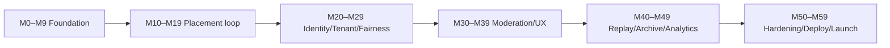
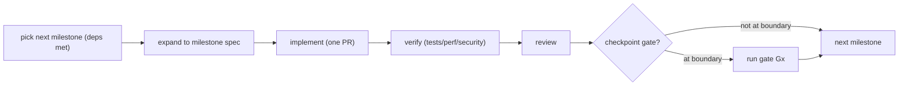
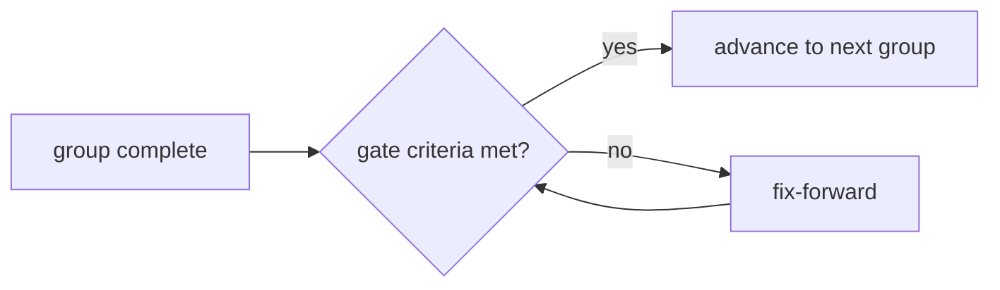

# Quad: Milestones (Implementation Plan)

> **This document owns the milestone-by-milestone implementation sequence** from empty repo to public MVP launch: ordering, acceptance shape, checkpoint gates, and the MVP/post-MVP split. It conforms to [`process/SPEC_PLAN.md`](../process/SPEC_PLAN.md), [`ENGINEERING_WORKFLOW.md`](ENGINEERING_WORKFLOW.md), [`ROADMAP.md`](ROADMAP.md), [`LAUNCH_PLAN.md`](LAUNCH_PLAN.md), and all architecture docs.
>
> **Altitude:** sequence + acceptance shape. **No** code, package files, templates, specs, or scaffolding (Phase 4 + `START IMPLEMENTATION` own those). **No** versions (`TECH_BASELINE.md`). Tenant-neutral (Rutgers Quad = tenant #1).
>
> **Status:** the sequence is **built and merged to `main`**, every milestone group is implemented and the checkpoints **G1–G5 have PASSED**, with all MVP acceptance criteria (`P-AC-1…13`) met and verified (`docs/CHECKPOINTS.md` §4, `docs/ACCEPTANCE_TRACEABILITY.md`). Remaining for full launch (**G6**): `LG-9` (legal/ToS/university approval) and a live cloud deployment, both external/organizational. This document remains the dependency-ordered map; further work follows it one milestone per PR.

---

## 1. Purpose & Scope
Turn the corpus into a build path an engineer can execute **one PR at a time without guessing** (`PROC-DP-3`). **In scope:** milestone principles, the milestone template, the phase map, the full M0–M59 sequence, MVP/post-MVP split, dependency ordering, checkpoint gates, per-group testing/security/perf/doc gates, PR/rollback posture, launch mapping. **Out of scope:** the milestone *templates* (Phase 4 `templates/milestone.md`), full test strategy (`TESTING.md`), checkpoint protocol detail (`CHECKPOINTS.md`), review detail (`REVIEW_PROCESS.md`), code standards (`CODE_QUALITY.md`).

## 2. Responsibilities vs. Non-Responsibilities
| Milestones **own** | They don't own |
| --- | --- |
| The implementation order + dependency rules | App architecture (Phase 2 docs) |
| Each milestone's objective/acceptance/tests shape | The full test matrix (`TESTING.md`) |
| Checkpoint gates + MVP/post-MVP split | Checkpoint protocol detail (`CHECKPOINTS.md`) |
| Launch mapping (`LG-*`) | Concrete templates/specs (Phase 4) |

## 3. Milestone Principles
- **`M-DP-1` One milestone per PR**, spec-linked, small diff (`PROC-INV-3`).
- **`M-DP-2` Acceptance-testable**: every milestone has testable acceptance + required tests (`MILESTONE-INV-2`).
- **`M-DP-3` Dependency-ordered**: no milestone depends on a later one (`MILESTONE-INV-3`).
- **`M-DP-4` No drift**: `@quad/core` contracts, clean boundaries (`ENGINEERING_WORKFLOW.md` §12).
- **`M-DP-5` No product behaviour ahead of its milestone**: the foundation is built; product groups follow their checkpoint gates.

## 4. Numbering & Naming
`M<NN>, <imperative title>`, grouped in tens (M0–M9 …). IDs are **stable** (deprecate, don't renumber). A milestone may be split into `M12a/M12b` if it exceeds PR size; the parent objective stays.

## 5. Milestone Template (fields)
Each milestone (authored against `templates/milestone.md` in Phase 4) carries:
**Objective · Owner lane · Prerequisite docs/specs · Allowed files/packages · Forbidden scope · Contracts touched · Implementation outline · Acceptance criteria · Required tests · Risks/stop conditions · Rollback/fix-forward note.**

## 6. Phase Map → Groups
| Build phase | Group |
| --- | --- |
| Foundation/scaffolding | M0–M9 |
| Core placement loop (contracts·DB·event log·API·WS·render·frontend) | M10–M19 |
| Identity/tenant/realtime/fairness | M20–M29 |
| UX/features/moderation | M30–M39 |
| Replay/archive/analytics | M40–M49 |
| Hardening/deployment/launch | M50–M59 |

## 7. Milestone Sequence

### M0–M9: Foundation *(all MVP-blocking)*
| ID | Objective | Lane | Contracts | Key acceptance |
| --- | --- | --- | --- | --- |
| M0 | Root workspace scaffolding (pnpm/Turbo/tsconfig base) | DevOps | — | `pnpm i` + Turbo graph build green |
| M1 | CI gates skeleton (lint/typecheck/test/build) | DevOps | — | CI runs all gates on PR |
| M2 | Docker-first local infra (Postgres+Redis via compose) | DevOps | — | `docker compose up` yields PG+Redis |
| M3 | `@quad/core` contract skeleton (domain/DTO/WS/event/cooldown/tenant types) | Architect | **core** | types compile; imported by web+api |
| M4 | `@quad/config` tenant registry + palette + env validation (Rutgers = tenant #1) | Backend | tenant config | config validated at load; no tenant literals in logic |
| M5 | `@quad/db` Prisma foundation: tenants/users/memberships/canvases + migration runner | Database | DB | migrate up/down clean; tenant-scoped uniqueness |
| M6 | `@quad/db` event log + current projection (pixel_events, pixels) + partition foundation | Database | DB/event | append-only constraints; PK `(canvas,x,y)` |
| M7 | `@quad/testing` harness + Dockerized integration base | Testing | — | integration tests hit real PG+Redis |
| M8 | `apps/api` Fastify skeleton (config/tenant-resolver/error/health plugins) + `/healthz` `/readyz` | Backend | — | health/readiness green; tenant context attached |
| M9 | `apps/web` Next.js skeleton (tenant theme provider, shell; no canvas) | Frontend | — | tenant-branded shell renders from config |
→ **Checkpoint G1: Foundation.**

### M10–M19: Core placement loop *(all MVP-blocking)*
| ID | Objective | Lane | Contracts | Key acceptance |
| --- | --- | --- | --- | --- |
| M10 | Tenant resolution (host→tenant; **no default tenant**) | Backend | — | unknown host → no context/landing |
| M11 | Event-sourcing core: append + atomic projection + idempotency (service level) | Backend/DB | event | append+projection atomic; dup key safe (`ES-INV`) |
| M12 | Placement command `POST /canvas/current/pixels` (validate + Idempotency-Key) | Backend/API | API/DTO | valid place → event; dup → same result |
| M13 | Snapshot/metadata + hover + history endpoints | Backend/API | API/DTO | snapshot + per-pixel history (DC2) |
| M14 | `@quad/realtime` WS server (connect/subscribe/heartbeat) | Realtime | WS | tenant-scoped subscribe; heartbeat |
| M15 | Redis pub/sub fan-out → broadcast `PixelPlaced` | Realtime/Backend | WS | placement on A reaches clients on B |
| M16 | `@quad/render` MVP (snapshot paint + delta apply + pan/zoom + crisp) | Rendering | render seam | paints snapshot; applies deltas; crisp zoom |
| M17 | `apps/web` CanvasViewport (mount render, fetch snapshot, subscribe, place w/ 2-step confirm) | Frontend | — | place a pixel end-to-end (single tenant) |
| M18 | Reconnect → resnapshot convergence | Frontend/Realtime | WS | drop+reconnect converges to truth |
| M19 | Live delta end-to-end verified | Testing | — | multi-client live update under test |
→ **Checkpoint G2: Placement loop.**

### M20–M29: Identity / tenant / realtime / fairness *(all MVP-blocking)*
| ID | Objective | Lane | Contracts | Key acceptance |
| --- | --- | --- | --- | --- |
| M20 | Auth foundation: `@auth/core` in api; email-verification (request/confirm) + domain allowlist | Auth/Security | API | only eligible domains verify; no passwords |
| M21 | Revocable server-side sessions + secure host-only cookie + `/session` | Auth | API | session issue/validate/revoke |
| M22 | Authorization: role model + per-endpoint authz | Auth/Backend | — | roles enforced server-side |
| M23 | WS handshake auth (cookie + origin) + subscription authz | Realtime/Auth | WS | unauth/forbidden subscribe rejected |
| M24 | Tenant isolation enforcement + tests (cross-tenant→404) | Backend/DB | — | no cross-tenant read/write/subscribe |
| M25 | Cooldown state in Redis + enforcement at placement (`COOLDOWN_ACTIVE`) | Backend | API | active cooldown rejects; one charge |
| M26 | Cooldown recompute job (load score + smoothing + bounds) + `CooldownUpdated` | Backend/Realtime | WS | value moves with load, 5–20, gradual |
| M27 | Cooldown fail-closed + key protection + frontend countdown | Backend/Frontend | — | Redis down → reject; countdown shown |
| M28 | Presence + load-input metrics feeding cooldown | Realtime/Backend | — | presence count; metrics wired |
| M29 | Anti-abuse: rate limiting + idempotency hardening + bot hooks | Security | — | rate limits + abuse hooks active |
→ **Checkpoint G3: Auth/tenant/fairness.**

### M30–M39: UX / features / moderation *(M30–M37,M39 MVP; M38 baseline MVP)*
| ID | Objective | Lane | MVP? |
| --- | --- | --- | --- |
| M30 | Profiles: `user_stats` projection + `/profiles/me` + `/{handle}` (DC2) | Backend/FE | ✅ |
| M31 | Leaderboards: projection + endpoint + UI (DC2, no shame categories) | Backend/FE | ✅ |
| M32 | Pixel inspector/history UI (click-through, per-pixel) | Frontend | ✅ |
| M33 | Reporting: submit endpoint + report dialog | Backend/FE/Mod | ✅ |
| M34 | Moderation tools: action endpoint + compensating events + atomic audit | Backend/Mod | ✅ |
| M35 | Moderation queue + moderator UI shells + WS mod channel | FE/Realtime/Mod | ✅ |
| M36 | Ban/suspend + immediate session revocation | Auth/Mod | ✅ |
| M37 | Admin: tenant config + canvas lifecycle (create/activate/freeze) + roster/roles | Backend/Admin | ✅ |
| M38 | Mobile polish + accessibility baseline (keyboard nav, ARIA live) | Frontend | ✅ baseline |
| M39 | Sanitized public surfaces verified (removed content not re-exposed) | Mod/FE | ✅ |
→ **Checkpoint G4: Moderation.**

### M40–M49: Replay / archive / analytics *(replay+archive+basic analytics MVP; rich analytics/heatmaps partly post-MVP)*
| ID | Objective | Lane | MVP? |
| --- | --- | --- | --- |
| M40 | Projection checkpoints/keyframes | Backend/DB | ✅ |
| M41 | Replay derivation (sanitized) + per-pixel replay | Backend | ✅ |
| M42 | Replay player UI (play/pause/scrub/speed/jump) | Frontend | ✅ |
| M43 | Term freeze + archive lifecycle (freeze window, no placements) | Backend/Arch | ✅ |
| M44 | Archive generation: final image + stats + leaderboard snapshot + provenance → object storage | Backend/Arch | ✅ |
| M45 | Archive browsing UI + visibility flag | Frontend | ✅ |
| M46 | Analytics projections (placement volume, contested, color usage) | Analytics | ✅ baseline |
| M47 | Heatmaps: derivation + overlay/visualization | Analytics/Render/FE | ⛔ post-MVP (rich) |
| M48 | Contribution heatmap on profile | Frontend | ⛔ post-MVP |
| M49 | Replay/archive performance (precomputed assets + CDN) | Backend/DevOps | ✅ |
→ **Checkpoint G5: (folded into pre-launch).**

### M50–M59: Hardening / deployment / launch *(all MVP-blocking)*
| ID | Objective | Lane |
| --- | --- | --- |
| M50 | Security hardening + security tests (CSRF/origin/authz/no-DC3/integrity) | Security |
| M51 | Event-log integrity (optional hash chain) + projection-rebuild verification | Backend/DB |
| M52 | Performance/load testing to budgets (B01–B14) at launch tier | Testing/Perf |
| M53 | Observability wiring (logs/metrics/traces + request ids) | DevOps |
| M54 | Staging environment (prod-like) + CI/CD deploy + smoke | DevOps |
| M55 | Backups + restore drill + DR verification (event-log integrity) | DevOps/DR |
| M56 | Migration rehearsal (expand/contract) on staging | DevOps/DB |
| M57 | Content policy + moderation readiness + moderator roster | Product/Mod |
| M58 | Legal/launch prerequisites (ToS, privacy, license, university approval) tracking | Product |
| M59 | Launch gate checklist (`LG-1…LG-10`) → go/no-go → production launch | Product/All |
→ **Checkpoint G6: Launch readiness.**

## 8. Milestone Groups (summary)
M0–M9 foundation · M10–M19 core placement loop · M20–M29 identity/tenant/realtime/fairness · M30–M39 UX/features/moderation · M40–M49 replay/archive/analytics · M50–M59 hardening/deployment/launch.

## 9. Detail Sufficiency
Each row above is intentionally terse; at implementation time each milestone is expanded into a full `templates/milestone.md` instance (Phase 4) with all §5 fields, that expansion is what an engineer implements against (and what prevents guessing, per `PROC-INV-1`). The **owner lane**, **contracts touched**, and **acceptance** here fix the milestone's intent and boundaries.

## 10. MVP-Blocking Milestones
**Blocking for public Rutgers MVP:** M0–M46, M49, M50–M59 (i.e., the full placement loop, identity/tenant/fairness, moderation, replay+archive+baseline analytics, and hardening/deployment/launch).

## 11. Post-MVP Milestones (separate)
Rich heatmaps (M47), profile contribution heatmap (M48), and beyond-baseline analytics; plus `ROADMAP.md` R2+ items (badges, replay export, SSO, second tenant onboarding, advanced abuse detection). These do **not** block launch.

## 12. Dependency Graph / Ordering Rules

Rules: contracts (`@quad/core`, DB/event log) before consumers; auth/tenant/cooldown before exposing public placement broadly; moderation before public scale; archive dry-run (M43/M44) before any real term close; hardening + gates before launch. **No milestone depends on a later one** (`MILESTONE-INV-3`).

## 13. Checkpoint Gates
| Gate | After | Must be true (summary) |
| --- | --- | --- |
| **G1 Foundation** | M9 | workspace+CI+infra+core/db skeletons green |
| **G2 Placement loop** | M19 | place→event→projection→broadcast→render, reconnect converges |
| **G3 Auth/tenant/fairness** | M29 | verified membership, tenant isolation, cooldown enforced+fair |
| **G4 Moderation** | M39 | reversible+audited moderation; sanitized public surfaces |
| **G5 Replay/Archive** | M45 | archive dry-run + faithful replay proven |
| **G6 Launch readiness** | M59 | all `LG-*` pass → go/no-go |
A failed gate → **fix-forward**, not skip (`MILESTONE-INV-7`). Detail → `CHECKPOINTS.md`.

## 14. Testing Expectations per Group
- **Foundation:** build/CI green; migration up/down; integration harness boots.
- **Placement loop:** event append/projection atomicity + idempotency; WS broadcast; reconnect convergence; render seam.
- **Identity/fairness:** auth/session, tenant isolation (cross-tenant→404), cooldown enforcement/fail-closed.
- **Moderation:** compensating events + atomic audit + no-hard-delete + sanitized replay.
- **Replay/archive:** replay determinism; archive generation + reproducibility.
- **Hardening:** security suite + load tests to budgets + DR restore drill.
Full matrix → `TESTING.md`.

## 15. Security / Performance Gates per Group
- **Placement loop:** placement hot-path budget (B06/B07); no client authority.
- **Identity/fairness:** authz/tenant security tests; cooldown fail-closed; rate limits.
- **Moderation:** audit atomicity; least-privilege; no `DC3`.
- **Hardening:** no open critical/high security issues; budgets met at launch tier (`LG-5/6`).

## 16. Documentation / Spec Update Requirements
Any milestone touching a contract updates `@quad/core` + the owning doc/spec **in the same PR** (`PROC-INV-2`, `MILESTONE-INV-5`). New endpoint/event/schema/migration ⇒ doc/spec + test in the same PR.

## 17. PR Size / Split Rules
One milestone = one PR; soft cap ≈ 400 non-generated LOC / ~10 files; larger ⇒ split into `M<NN>a/b` keeping the parent objective (`ENGINEERING_WORKFLOW.md` §17).

## 18. Rollback / Fix-Forward Posture
App rollback is instant (stateless tiers); **data/schema changes are forward-fix** with expand/contract (`DEPLOYMENT.md` §15–§16). A failed milestone stays open; never mark done on red.

## 19. Launch-Readiness Mapping
M50–M59 map directly to `LAUNCH_PLAN.md` gates: M50/M51→`LG-6` (security/integrity), M52→`LG-5` (performance), M53→ops readiness, M54/M56→deploy readiness, M55→`LG-8` (DR), M57→`LG-2/3` (content policy/moderation), M58→`LG-9` (legal), M59→`LG-1…LG-10` go/no-go.

## 20. Milestone Invariants (`MILESTONE-INV-*`)
- **`MILESTONE-INV-1`** One milestone = one PR, spec-linked, small diff.
- **`MILESTONE-INV-2`** Each milestone has testable acceptance + required tests; no merge without them.
- **`MILESTONE-INV-3`** Milestones are dependency-ordered; none depends on a later one.
- **`MILESTONE-INV-4`** No milestone rewrites unrelated subsystems or crosses lanes without reason.
- **`MILESTONE-INV-5`** Contract-touching milestones update `@quad/core` + docs/specs in the same PR.
- **`MILESTONE-INV-6`** No implementation milestone starts before `START IMPLEMENTATION`.
- **`MILESTONE-INV-7`** Checkpoint gates must pass before the next group; failure → fix-forward, not skip.
- **`MILESTONE-INV-8`** All MVP-blocking milestones complete + launch gates pass before public launch.

## 21. Diagrams
- **Milestone dependency flow**: §12. **Checkpoint gate flow**, below. **MVP path**, below.
### 21.1 Implementation PR lifecycle

### 21.2 Checkpoint gate flow

### 21.3 MVP path

## 22. Decisions Deferred
| Decision | Owner |
| --- | --- |
| Concrete package scaffold files | Phase 4 + `START IMPLEMENTATION` |
| Per-milestone spec expansions | `templates/milestone.md` (Phase 4) |
| Full test matrix | `TESTING.md` |
| Checkpoint protocol detail | `CHECKPOINTS.md` |
| Review process | `REVIEW_PROCESS.md` |
| Code standards | `CODE_QUALITY.md` |
| Deployment provider | `ADR-0010` |

## 23. Document Control
- **Path:** `docs/MILESTONES.md`
- **Purpose:** The dependency-ordered implementation sequence (M0–M59), acceptance shape, checkpoint gates, and MVP/post-MVP split for building Quad to public launch.
- **Dependencies:** `process/SPEC_PLAN.md`, `ENGINEERING_WORKFLOW.md`, `ROADMAP.md`, `LAUNCH_PLAN.md`, all Phase 2 docs, `SECURITY`, `PERFORMANCE`, `DEPLOYMENT`. **Consumed by:** `CHECKPOINTS.md`, `TESTING.md`, `REVIEW_PROCESS.md`, Phase-4 `templates/milestone.md`, the first-10-tasks build plan (Phase 5).
- **Acceptance checklist:** ☑ all 23 parts ☑ principles ☑ numbering convention ☑ milestone template fields ☑ phase map ☑ full M0–M59 sequence (objective/lane/contracts/acceptance) ☑ MVP-blocking vs post-MVP split ☑ dependency ordering rules ☑ checkpoint gates G1–G6 ☑ per-group testing/security/perf/doc gates ☑ PR size/split + rollback posture ☑ launch mapping to `LG-*` ☑ `MILESTONE-INV-1…8` ☑ 4 Mermaid diagrams ☑ no code/templates/specs created ☑ versions referenced not declared ☑ tenant-neutral ☑ no implementation before `START IMPLEMENTATION`.
- **Open questions:** see §22.
- **Next recommended (batch):** engineering-support batch, `docs/CHECKPOINTS.md`, `docs/TESTING.md`, `docs/OBSERVABILITY.md`, `docs/OPERATIONS.md`, `docs/DISASTER_RECOVERY.md`, `docs/CODE_QUALITY.md`, `docs/REVIEW_PROCESS.md`: then the **Phase 3 checkpoint**.
