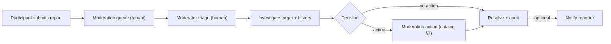
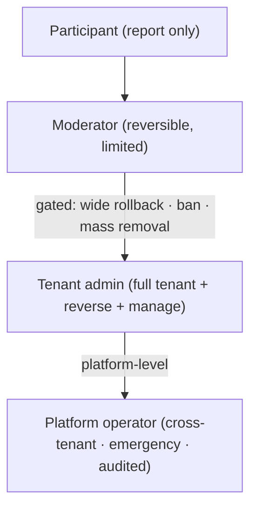
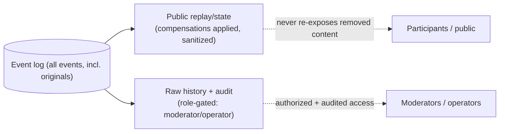

# Quad: Moderation, Audit & Safety

> **This document owns moderation: the report workflow, the action catalog, the permission ladder, the compensating-event/audit architecture, and the safety posture that keeps the canvas safe *without erasing history*.** It conforms to [`PRODUCT.md`](PRODUCT.md), [`PRINCIPLES.md`](PRINCIPLES.md), [`NON_GOALS.md`](NON_GOALS.md), [`SYSTEM_CONTEXT.md`](SYSTEM_CONTEXT.md), [`AUTHENTICATION.md`](AUTHENTICATION.md), [`MULTI_TENANCY.md`](MULTI_TENANCY.md), [`DATABASE.md`](DATABASE.md), [`EVENT_SOURCING.md`](EVENT_SOURCING.md), [`API.md`](API.md), [`WEBSOCKETS.md`](WEBSOCKETS.md), [`FRONTEND.md`](FRONTEND.md), and [`RENDERING.md`](RENDERING.md); IDs cited (`P-*`, `PRIN-*`, `B*`, `DC*`, `*-INV-*`).
>
> **Altitude:** moderation architecture. **No** code/source/schema/migration/route/UI/job/config files. **No** versions (`TECH_BASELINE.md`). The formal strategy is routed to **`ADR-0009`**.
>
> **Naming:** platform = **Quad**; **Rutgers Quad** = tenant #1 (example). Moderation is tenant-scoped and tenant-neutral.

---

## 1. Purpose & Scope

Moderation reconciles two principles that pull against each other: **safety** (remove offensive content) and **permanence** (`PRIN-PERMANENCE`, never lose history). Quad resolves this with **reversible, audited compensating events**: moderation changes what the canvas *shows*, never what *happened* (`PRIN-NO-INVISIBLE-LOSS`, `P-MOD-*`).

**In scope:** moderation principles, actor/role model, the report workflow + targets, the action catalog, the permission ladder, the event-sourcing/audit relationship, DB/API/WS/frontend/replay relationships, identity/privacy, tenant isolation, abuse handling, emergency controls, failure modes, appeal/reversal, observability, security, testing, invariants.

**Out of scope (owned elsewhere):** event semantics (`EVENT_SOURCING.md`), physical storage (`DATABASE.md`), REST paths (`API.md`), WS contracts (`WEBSOCKETS.md`), role/session mechanics (`AUTHENTICATION.md`), full threat model (`SECURITY.md`), replay/archive artifact behavior (`REPLAY.md`/`ARCHIVES.md`), the formal ADR (`ADR-0009`).

---

## 2. Responsibilities vs. Non-Responsibilities

| Moderation **owns** | It does **not** own |
| --- | --- |
| Report workflow + action catalog + permission ladder | Event append/compensation *semantics* (`EVENT_SOURCING.md`) |
| The safety/audit posture (no hard delete, atomic audit) | Physical tables for reports/audit (`DATABASE.md`) |
| Which role may do what; escalation/approval rules | Role/session *mechanics* (`AUTHENTICATION.md`) |
| Public-sanitized vs gated-raw policy | Replay player / archive artifact behavior (`REPLAY.md`/`ARCHIVES.md`) |
| Abuse handling at the moderation layer | The full abuse threat model (`SECURITY.md`) |

---

## 3. Moderation Principles

- **`MOD-DP-1` Safety without invisible deletion**: remove the *visible* offense; preserve the *record* (`PRIN-NO-INVISIBLE-LOSS`).
- **`MOD-DP-2` Reversible + audited**: every action is undoable and recorded (`P-MOD-1/4`).
- **`MOD-DP-3` Tenant-scoped authority**: moderators/admins act only within their tenant (`B3`/`B4`).
- **`MOD-DP-4` Least privilege**: each role gets only what it needs; destructive power is gated (`§8`).
- **`MOD-DP-5` No placement-power advantage**: moderation power is separate from placement; it never shortens cooldown or grants pixels (`P-COOL-6`, `NG-UNEQUAL-POWER`).
- **`MOD-DP-6` Public replay stays sanitized**: the public default never re-exposes removed content (`EVENT_SOURCING.md` §15).

---

## 4. Actor & Role Model

(Mechanics in `AUTHENTICATION.md` §13; here, moderation capability.)

| Actor | Moderation capability |
| --- | --- |
| **Participant reporter** | submit reports; see own report status (as appropriate) |
| **Moderator** (tenant) | triage, investigate, perform reversible actions within limits (`§8`) |
| **Tenant admin** (tenant) | full tenant moderation incl. destructive actions + reverse actions + manage moderators |
| **Platform operator** (`B5`) | cross-tenant incident response + emergency controls, audited; preserves isolation |

---

## 5. Report Workflow

1. **Submit**, a participant reports a target with a reason (`POST /api/v1/reports`, `API.md`).
2. **Triage**, the report enters the tenant's moderation queue (`GET /api/v1/moderation/reports`); a moderator reviews. **Reports never auto-trigger destructive actions**, human triage is required (`MOD-INV-8`).
3. **Investigate**, the moderator inspects the target's pixel/region/history (raw history is role-gated, `§15/§16`).
4. **Resolve**, choose an action from the catalog (`§7`) or mark "no action"; the report is resolved.
5. **Notify**, the reporter may be informed of the outcome where appropriate (mechanism/policy `P-MOD-8`/`P-Q-6`, deferred).



---

## 6. Report Targets

- **Pixel**: a single cell.
- **Region**: a rectangular/selected area.
- **Artwork / cluster**: a coherent offending group of cells.
- **User / profile / handle**: a participant (for behavior, not just one pixel).
- **Archive / replay artifact** *(if applicable)*, content surfaced in an archived term (handled per `§15`, exceptional + audited).

---

## 7. Moderation Action Catalog

| Action | Effect | Compensating event / record |
| --- | --- | --- |
| **No action** | report dismissed | report resolved (audited) |
| **Mark report resolved** | close report | report status + audit |
| **Hide / sanitize pixel** | cell visually cleared/sanitized | `PixelRolledBack`/`ArtworkRemoved` |
| **Rollback pixel** | revert cell to prior color | `PixelRolledBack` |
| **Rollback region** | revert a set of cells | `RegionRolledBack` |
| **Remove artwork** | clear/replace an offending cluster | `ArtworkRemoved` |
| **Suspend user** | temporary block on writes | `UserSuspended` + audit; sessions invalidated |
| **Ban user** | permanent block | `UserBanned` + audit; sessions invalidated |
| **Restore / reverse action** | undo a prior moderation action (if safe) | new compensating event + audit (prior audit retained) |
| **Escalate** | hand to tenant admin / operator | audit + queue routing |

All actions are **reversible-by-design** and produce **append-only audit** (`§10`); none hard-delete (`MOD-INV-1`).

---

## 8. Permission Ladder

| Capability | Moderator | Tenant admin | Platform operator |
| --- | --- | --- | --- |
| Triage / investigate / resolve reports | ✅ | ✅ | ✅ (cross-tenant, audited) |
| Hide/rollback **pixel** | ✅ | ✅ | ✅ |
| Rollback **small region** | ✅ | ✅ | ✅ |
| **Remove artwork** / **wide region/time-range rollback** | ⚠️ gated¹ | ✅ | ✅ |
| **Suspend** user (temporary) | ✅ | ✅ | ✅ |
| **Ban** user (permanent) | ⚠️ gated¹ | ✅ | ✅ |
| **Reverse** a moderation action | own recent² | ✅ | ✅ |
| Manage moderators / roles | ❌ | ✅ | ✅ |
| **Emergency freeze / tenant-wide restrict** | ❌ | ✅ | ✅ |
| Cross-tenant action | ❌ | ❌ | ✅ (audited) |

¹ **Gated = requires tenant-admin approval or two-person review** for the most destructive actions (wide/time-range rollback, mass removal, permanent ban). Threshold/approval flow is recommended here and finalized in `ADR-0009` (`MOD-INV-7`).
² A moderator may reverse their own recent action; broader reversal is admin-level.

**Least privilege + no placement advantage** hold throughout (`MOD-DP-4/5`).



---

## 9. Event-Sourcing Relationship

- Moderation uses **compensating events only** (`PixelRolledBack`, `RegionRolledBack`, `ArtworkRemoved`, `UserSuspended`, `UserBanned`), **no hard delete** (`EVENT_SOURCING.md` §16, `MOD-INV-1`).
- **The original event remains** in the append-only log; visible state changes via the compensating event applied to the projection.
- The public/sanitized replay reflects compensations; raw history (incl. the original offense) is retained for audit (`§15`).

---

## 10. Audit Model

- **Every action records:** actor, target, reason, timestamp, tenant id (and the related compensating event) (`P-MOD-4`).
- **Audit is atomic with the action effect**: the compensating event/ban and the audit row commit in the **same transaction**; there is no state where an action took effect without an audit entry (`DB-INV-6`, `BE-INV-8`, `MOD-INV-2`).
- **`DC4` handling**: the audit log is sensitive moderation data, **append-only and immutable**; it is never edited or deleted (`MOD-INV-6`).
- **Access rules**: audit is readable only by authorized roles (moderator/admin within tenant; operator cross-tenant), all access itself observable (`§22`).

---

## 11. Database Relationship

(Storage in `DATABASE.md` §7.)

- **`reports`**: submitted reports + status.
- **`moderation_actions`**: typed moderation actions (may be a typed view over `audit_log`; `DATABASE.md` §24).
- **`audit_log`**: the append-only `DC4` audit record.
- **`bans`**: ban/suspension enforcement state, backed by audit.
- **Relationship to the event log**: compensating events live in `pixel_events`; moderation tables capture workflow + audit; effect + audit are atomic (`§10`).

---

## 12. API Relationship

(Paths in `API.md` §12.)

- **`POST /api/v1/reports`**: submit a report (participant, rate-limited).
- **`GET /api/v1/moderation/reports`**: queue (moderator).
- **`POST /api/v1/moderation/actions`**: perform an action (moderator/admin; gated actions enforce approval).
- **Admin/operator endpoints**: roster/role management, tenant config, lifecycle, platform onboarding (admin/operator).
- **No undocumented endpoints** (`API-INV-3`); contract changes update `API.md` in the same PR.

---

## 13. WebSocket Relationship

(Contracts in `WEBSOCKETS.md` §8/§18.)

- **Public sanitized updates**: compensating events broadcast as `PixelRolledBack`/`RegionRolledBack`/`ArtworkRemoved` (sanitized visible state) on the canvas channel.
- **Moderator/admin channel**: `ModerationActionApplied`, `ReportStatusUpdated` on the role-gated `…:mod` channel only.
- The public channel never reveals moderation rationale or `DC3` (`§16`).

---

## 14. Frontend Relationship

(UI in `FRONTEND.md` §13.)

- **Report dialog**: participant-facing submission.
- **Moderation queue shell + action forms**: display server-provided queues, submit intents.
- **Action confirmation UX + dangerous-action warnings**: destructive actions require explicit confirmation; gated actions surface the approval requirement.
- **Role-gated UI is UX, not security**: the api enforces authority regardless (`FE-INV-10`, `MOD-INV` via server checks).

---

## 15. Replay / Archive Relationship

- **Sanitized public replay**: the default replay applies compensations; removed content stays removed (`EVENT_SOURCING.md` §15, `MOD-DP-6`).
- **Raw audit history is gated**: moderators/operators may access the unsanitized history (incl. original offending events) under authorization, for investigation/appeal.
- **Moderation after archive**: archives are **immutable after seal** (`P-MOD-7`); corrections normally happen in the **freeze window** before archival. If offensive content is discovered *after* archive, post-archive correction is an **exceptional, operator-level, audited** action that produces a **corrected artifact** while preserving the original record under audit (and any legal hold). The exact post-archive policy is deferred to `ADR-0009`/legal (`§27`).

---

## 16. Identity / Privacy Rules

- **Public attribution remains `DC2`**: moderation never exposes more identity publicly (`P-ATTR-4`).
- **`DC3` is never public**: even in moderation outputs visible beyond authorized roles (`CTX-INV-3`).
- **Moderator expanded context is scoped + audited**: an authorized moderator may see more context than the public (still governed; raw email exposure is constrained by policy/`AUTHENTICATION.md`), and such access is itself observable (`§22`).

---

## 17. Tenant Isolation

- **Moderators act only inside their tenant**: reports, queues, actions, and audit are tenant-scoped (`B4`, `TENANT-INV-5`).
- **Operator cross-tenant action is audited**: the only cross-tenant moderation path (`B5`, `MOD-INV-3`).
- **No cross-tenant report leakage**: a report/queue from tenant A is never visible to tenant B.

---

## 18. Abuse Handling

| Threat | Moderation response |
| --- | --- |
| **Spam reports** | report rate limits + dedup; queue noise controls |
| **Bad-faith reporting** | human triage (no auto-action); reporter flagging/reputation signals |
| **Coordinated vandalism** | wide rollback tools (gated) + emergency freeze (`§19`) |
| **Ban evasion** | identity/abuse controls + device/IP signals (`AUTHENTICATION.md`/`SECURITY.md`); bans backed by audit |
| **Offensive content clusters** | artwork removal (gated) + region rollback; sanitized replay |

Detailed detection/heuristics → `SECURITY.md`.

---

## 19. Emergency Controls

- **Freeze canvas**: admin/operator may pause placement tenant-wide during an incident (`P-ADMIN-7`).
- **Restrict placement tenant-wide**: a more-restrictive cooldown override (never per-user advantage, `COOLDOWN.md` §16).
- **Escalate incident**: route to operator; preserve evidence.
- **Preserve audit**: all emergency actions are audited; history is never destroyed.
- **No individual placement advantage**: emergency levers are tenant-wide and fairness-preserving (`MOD-DP-5`).

---

## 20. Failure Modes

| Failure | Handling |
| --- | --- |
| **Action partially fails** | atomic transaction — effect + audit commit together or roll back (`§10`); no partial state |
| **Audit write fails** | the **action fails** (no action without audit, `MOD-INV-2`) |
| **Rollback/projection mismatch** | rebuild projection from the log (`EVENT_SOURCING.md` §14); log is truth |
| **Report queue backlog** | prioritization + escalation; backlog is observable (`§22`) |
| **Moderator mistake** | reverse the action (audited); original audit retained |
| **Abusive moderator/admin** | least privilege + gated destructive actions + full audit → detectable/reversible; operator can intervene |
| **Moderation after archive** | exceptional operator-level audited correction (`§15`) |

---

## 21. Appeal / Reversal Posture

- **Reversal is first-class**: any action can be reversed if safe, via a new compensating event + audit (`§7`).
- **Reversal is itself audited**; the **prior audit is never deleted** (append-only, `MOD-INV-6`).
- A formal **appeals process** (who reviews, SLAs) is **architecture-ready** but its workflow detail is a product/policy decision (deferred, `§27`).

---

## 22. Observability

Moderation metrics (`OBSERVABILITY.md`):

- **Report volume** + queue depth/backlog.
- **Resolution time** (triage→resolve).
- **Action counts** by type; **rollback counts**.
- **Moderator actions** per actor (for oversight).
- **Abuse patterns** (spike detection, coordinated reports).
- **Audit-access events** (who read sensitive history).

---

## 23. Security Considerations

- **Least privilege** + **gated destructive actions** (`§8`).
- **Audit immutability**: append-only `DC4`; tamper-evident (aligns with the event-log integrity posture, `EVENT_SOURCING.md` §19).
- **Role escalation**: server-enforced role checks; escalations audited.
- **`DC3` exposure**: never public; authorized expanded context only (`§16`).
- **Operator misuse**: the highest-blast-radius path; least privilege + full audit (`B5`).
- **Tenant confusion**: actions are tenant-scoped; cross-tenant fails closed (`§17`).
- Full threat model → `SECURITY.md`.

---

## 24. Testing Expectations

(Strategy → `TESTING.md`; critical subsystem, automated.)

- **Report flow**: submit → triage → resolve.
- **Permission**: each role's capabilities + gated-action approval enforced server-side.
- **Tenant isolation**: no cross-tenant report/queue/action/audit access.
- **Audit atomicity**: action effect + audit commit together; audit-write failure aborts the action.
- **Compensating-event**: rollback/removal produce correct compensating events; visible state updates.
- **Sanitized replay**: public replay hides removed content; raw history gated.
- **No-hard-delete**: original events/history always preserved.
- **Privacy**: no `DC3` in public moderation surfaces.
- **Abusive moderator/admin**: destructive actions are gated, audited, reversible; oversight works.
- **Archive-after-moderation**: pre-archive corrections apply; post-archive correction is exceptional + audited.

---

## 25. Moderation Invariants (`MOD-INV-*`)

- **`MOD-INV-1`** Moderation never hard-deletes; visible state changes only via compensating events.
- **`MOD-INV-2`** Every moderation action writes an audit entry atomically with its effect; no action without audit.
- **`MOD-INV-3`** Moderators/admins act only within their tenant; operator cross-tenant action is audited.
- **`MOD-INV-4`** Moderation grants no placement-power advantage; cooldown/placement rules are unchanged for moderators.
- **`MOD-INV-5`** Public replay/visible state is sanitized; raw history is access-gated to authorized roles.
- **`MOD-INV-6`** Actions are reversible; reversals are audited; the audit log is append-only and never deleted.
- **`MOD-INV-7`** The most destructive actions (wide/time-range rollback, mass removal, permanent ban) require elevated approval / two-person review.
- **`MOD-INV-8`** Reports never auto-trigger destructive actions; human triage is required.
- **`MOD-INV-9`** No `DC3` in public moderation surfaces; expanded moderator context is scoped + audited.
- **`MOD-INV-10`** Least privilege, each role gets only what it needs; escalation is explicit + audited.
- **`MOD-INV-11`** Archives are immutable after seal; post-archive correction is an exceptional, audited operator action that preserves the original record.

---

## 26. Diagrams

- **Report workflow**: §5.
- **Permission ladder**: §8.
- **Moderation action + compensating event + audit transaction**: below.
- **Sanitized public replay vs raw audit history**: below.

### 26.1 Action + compensating event + audit (atomic)
```mermaid
sequenceDiagram
  participant M as Moderator/Admin (B3)
  participant A as apps/api (moderation handler)
  participant TX as DB transaction
  participant LOG as pixel_events (log)
  participant AUD as audit_log (DC4)
  participant PROJ as projection
  M->>A: action (authorized; gated if destructive)
  A->>TX: begin
  TX->>LOG: append compensating event
  TX->>AUD: append audit (actor, target, reason, time, tenant)
  TX->>PROJ: update visible (sanitized) state
  TX-->>A: commit (atomic), or abort if audit fails
  A-->>M: applied (+ WS ModerationActionApplied)
  Note over LOG: original event preserved
```

### 26.2 Sanitized public replay vs raw audit history


---

## 27. Decisions Deferred to Deeper Docs / ADRs

| Open decision | Owner |
| --- | --- |
| **Formal moderation & auditability strategy** (gated-action thresholds, two-person review flow, audit retention) | **`ADR-0009`** |
| Post-archive correction policy (exceptional path, legal hold) | `ADR-0009` / `ARCHIVES.md` / legal (`LAUNCH_PLAN.md` `LG-9`) |
| Reporter notification of outcomes (`P-MOD-8`/`P-Q-6`) | product / `AUTHENTICATION.md` |
| Formal appeals workflow + SLAs | product / `ADR-0009` |
| Moderator sourcing + permission-ladder specifics (`P-Q-5`) | product / `AUTHENTICATION.md` |
| Expanded-identity exposure for moderators (vs `DC3`) | `AUTHENTICATION.md` / policy |
| Abuse-detection heuristics (ban evasion, coordinated reports) | `SECURITY.md` |

---

## 28. Document Control

- **Path:** `docs/MODERATION.md`
- **Purpose:** Define Quad's moderation, report workflow, action catalog, permission ladder, compensating-event/audit architecture, and safety posture, keeping the canvas safe without destroying history.
- **Dependencies:** `EVENT_SOURCING.md`, `DATABASE.md`, `AUTHENTICATION.md`, `MULTI_TENANCY.md`, `API.md`, `WEBSOCKETS.md`, `FRONTEND.md`, `SYSTEM_CONTEXT.md`, `PRODUCT.md`, `PRINCIPLES.md`, `NON_GOALS.md`. **Consumed by:** `REPLAY.md`, `ARCHIVES.md`, `SECURITY.md`, `OBSERVABILITY.md`, `ADR-0009`.
- **Acceptance checklist:** ☑ all 28 parts present ☑ moderation altitude (no code/schema/UI/route files) ☑ principles (safety w/o deletion, reversible+audited, tenant-scoped, least privilege, no placement advantage, sanitized replay) ☑ actor/role model + report workflow + targets ☑ action catalog ☑ permission ladder w/ gated destructive actions ☑ compensating-event + atomic-audit model ☑ DB/API/WS/frontend/replay/archive relationships ☑ identity/privacy (`DC2` public, `DC3` gated) ☑ tenant isolation ☑ abuse handling + emergency controls ☑ failure modes + appeal/reversal ☑ observability + security ☑ `MOD-INV-1…11` ☑ 4 Mermaid diagrams ☑ versions referenced not declared ☑ tenant-neutral ☑ no app code/files.
- **Open questions:** see §27 (`ADR-0009`, post-archive policy, notifications, appeals, moderator sourcing).
- **Next recommended (batch):** derived-features batch, `docs/REPLAY.md`, `docs/ARCHIVES.md`, `docs/ANALYTICS.md`, `docs/LEADERBOARDS.md`, `docs/PROFILES.md`, `docs/HEATMAPS.md`: then the **Phase 2 checkpoint**.
