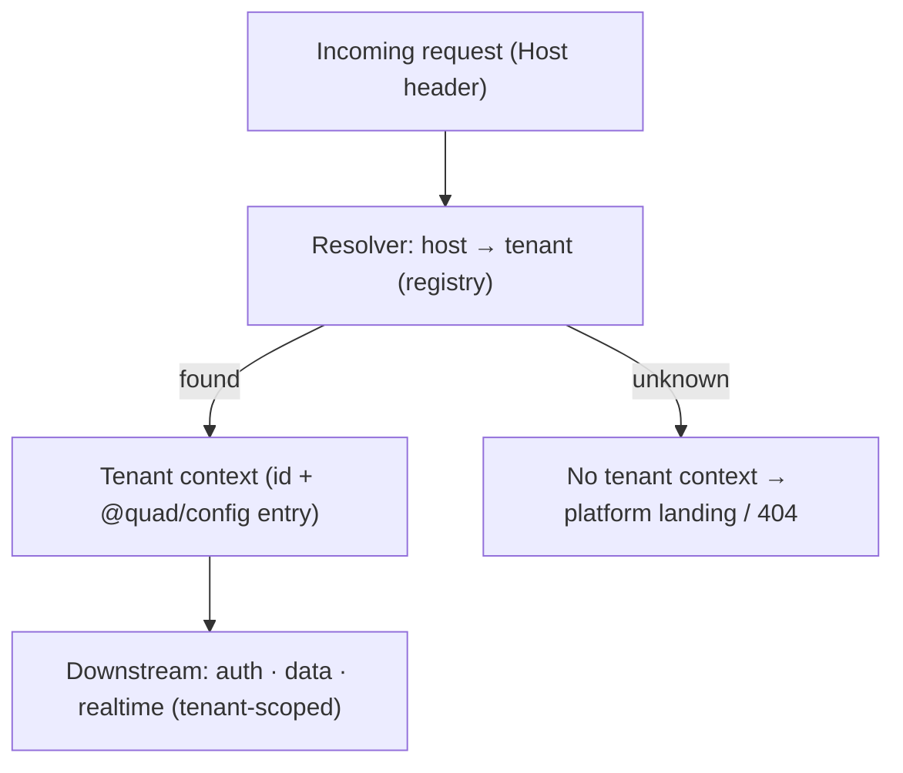
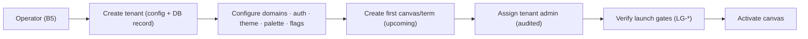
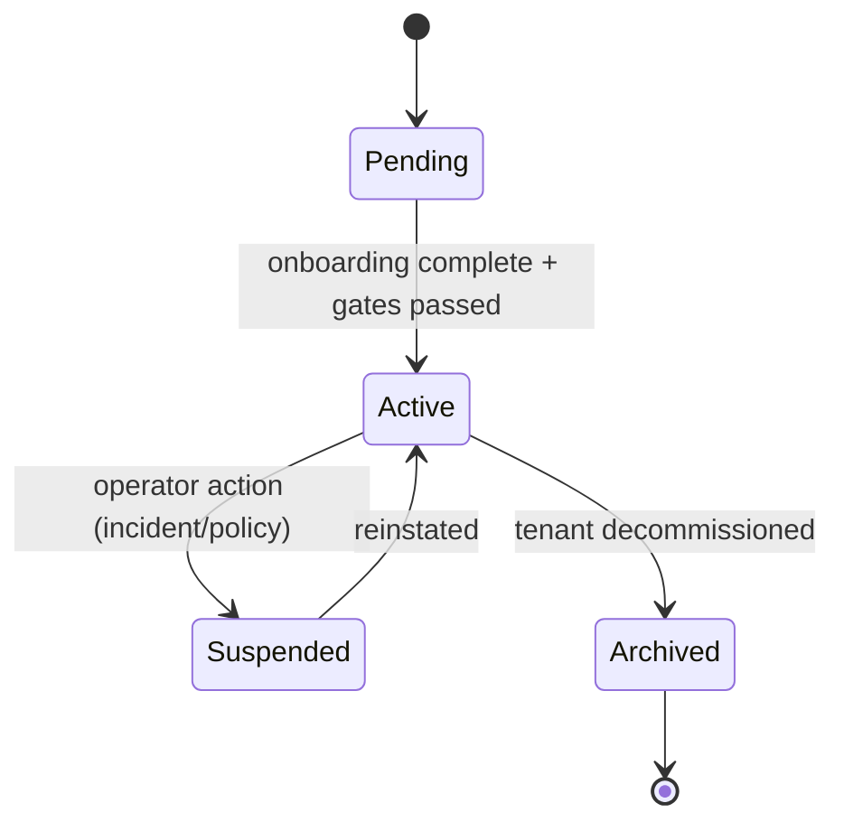
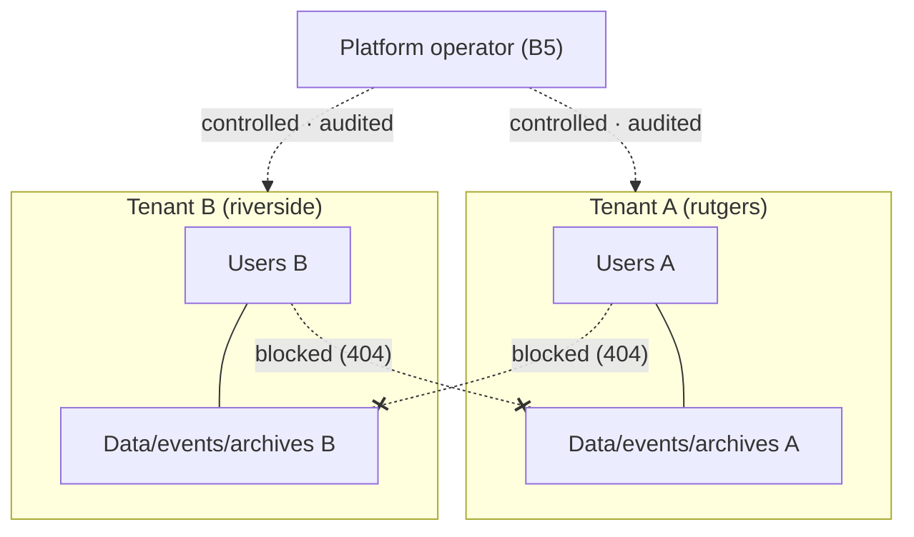

# Quad: Multi-Tenancy: Model, Routing & Isolation

> **This document owns the tenant model, tenant configuration, tenant resolution/routing, and isolation architecture**, the mechanics that `ARCHITECTURE`, `SYSTEM_CONTEXT`, `DATABASE`, `API`, `WEBSOCKETS`, and `AUTHENTICATION` all deferred here. It conforms to [`PRODUCT.md`](PRODUCT.md), [`PRINCIPLES.md`](PRINCIPLES.md), [`SYSTEM_CONTEXT.md`](SYSTEM_CONTEXT.md), [`ARCHITECTURE.md`](ARCHITECTURE.md), [`DATABASE.md`](DATABASE.md), [`API.md`](API.md), [`WEBSOCKETS.md`](WEBSOCKETS.md), and [`AUTHENTICATION.md`](AUTHENTICATION.md); IDs cited (`P-*`, `PRIN-*`, `B*`, `DC*`, `*-INV-*`).
>
> **Altitude:** architecture. **No** config/registry files, schemas, migrations, or route handlers (illustrative config in §13 is documentation, not a created file). **No** versions (`TECH_BASELINE.md`). The formal strategy is routed to **`ADR-0007`**. **No** app code/package files.
>
> **Naming:** platform = **Quad**; **Rutgers Quad** = tenant #1 (example config only). The whole point of this doc is that **no tenant is special in code** (`PRIN-CONFIG-OVER-CODE`).

---

## 1. Purpose & Scope

Multi-tenancy is the architectural expression of `P-VISION-5` ("Rutgers is just tenant #1") and `PRIN-ISOLATION`/`PRIN-CONFIG-OVER-CODE`. This document defines what a tenant *is*, where its configuration lives, how a request is mapped to a tenant, and how isolation is enforced across every layer.

**In scope:** tenant principles, tenant model + registry ownership, resolution strategy (dev/staging/prod), per-layer tenant context (API/WS/auth/DB/event-sourcing/frontend), tenant config example, onboarding/lifecycle, canvas-per-term relationship, feature flags, isolation failure modes, privacy/security, testing, invariants.

**Out of scope (owned elsewhere):** identity/session mechanics (`AUTHENTICATION.md`), physical tables (`DATABASE.md`), REST paths (`API.md`), WS lifecycle (`WEBSOCKETS.md`), full threat model (`SECURITY.md`), cooldown (`COOLDOWN.md`), the formal ADR (`ADR-0007`).

---

## 2. Responsibilities vs. Non-Responsibilities

| Multi-tenancy **owns** | It does **not** own |
| --- | --- |
| The tenant model + config schema (conceptual) | Identity/session mechanics (`AUTHENTICATION.md`) |
| Tenant resolution/routing (host→tenant) | Physical table design (`DATABASE.md`) |
| Tenant-context propagation contract across layers | REST paths (`API.md`) / WS lifecycle (`WEBSOCKETS.md`) |
| Isolation architecture + failure modes | Full threat model/mitigations (`SECURITY.md`) |
| Onboarding/lifecycle of tenants | Cooldown/rendering/moderation internals |

---

## 3. Core Tenant Principles

- **`MT-DP-1` Tenant-neutral platform**: the codebase has no notion of a specific university; it operates on "the resolved tenant."
- **`MT-DP-2` Rutgers Quad is tenant #1 only**: a registry entry, never a branch in code (`TENANT-INV-7`).
- **`MT-DP-3` Config over code**: adding/onboarding a tenant is configuration + data, never a code change (`P-ADMIN-8`).
- **`MT-DP-4` Isolation by default**: every layer is tenant-scoped unless explicitly an operator path; cross-tenant is structurally hard (`PRIN-ISOLATION`, `P-AC-13`).
- **`MT-DP-5` No tenant literals in shared logic**: tenant facts come only from `@quad/config` (`ARCH-INV-8`).

---

## 4. Tenant Model

A tenant's conceptual fields (storage in `DATABASE.md` §7; config in §5):

| Field | Meaning |
| --- | --- |
| **`id`** | Stable internal tenant id (the scoping key everywhere). |
| **`slug`** | Short stable identifier (e.g., `rutgers`). |
| **`publicTitle`** | Display name (e.g., "Rutgers Quad"). |
| **`hosts` / subdomain** | The host(s)/subdomain(s) that resolve to this tenant (§6). |
| **`domains`** | Email-domain allowlist for membership verification (`AUTHENTICATION.md` §12). |
| **`authProvider`** | Membership method config (email-verification MVP; SSO later). |
| **`theme`** | Branding tokens (colors, logo). |
| **`palette`** | The tenant's color palette (`P-CANVAS-4`). |
| **`featureFlags`** | Per-tenant toggles (§17). |
| **`termCadence`** | Term model (semester default; configurable, `P-Q-4`). |
| **`status`** | Lifecycle state (§15). |

---

## 5. Tenant Registry Ownership

- **`@quad/config` is the canonical source of tenant *configuration***, declarative settings (hosts, domains, auth provider, theme, palette, feature flags), loaded and **validated** at runtime.
- **Postgres holds tenant *records***, a `tenants` row per tenant provides the relational anchor (FKs from `canvases`, `memberships`, etc.) and operational state (`DATABASE.md`).
- **Relationship:** config is authoritative for **settings**; the DB is authoritative for **data relationships + operational state**. Onboarding creates both consistently (§14). Keeping them in sync (and reconciling drift) is an operational detail deferred to implementation/`OPERATIONS.md`; the **rule** is: settings change in config (reviewed), never as ad-hoc DB edits.

---

## 6. Tenant Resolution Strategy

The active tenant is resolved **at the edge** from the request **Host** (and used for both REST and the WS handshake):

- **Production:** each tenant maps to a **host/subdomain** (e.g., `rutgers.quad.app`) or a **custom domain** (config maps `host → tenant id`). The resolver looks up the host in the registry.
- **Local development:** wildcard local hosts (e.g., `*.localhost` / `*.localtest.me`) map to tenants by subdomain; a dev-only override (env/header) is permitted for convenience but **never** in staging/prod.
- **Staging:** staging subdomains per tenant, same mechanism as prod.
- **Fallback / error:** an **unknown host yields no tenant context**: tenant-scoped operations are rejected and the user sees a platform landing/`404`. **There is no implicit default tenant** (`TENANT-INV-1`), defaulting to Rutgers would be exactly the hardcoding this architecture forbids.



---

## 7. API Tenant Context

- The **active tenant is contextual** (from host resolution); **normal endpoints do not include a tenant id in the path** (`/api/v1/canvas/current`, `API.md` §6).
- **Operator endpoints** (`/api/v1/platform/...`) may take an explicit tenant identifier for cross-tenant administration (`B5`).
- **Cross-tenant access returns `404`** (no existence leak, `API-INV-11`).

---

## 8. WebSocket Tenant Context

- The **tenant is resolved at connect** and pinned to the connection (`WEBSOCKETS.md` §6).
- **Canvas subscriptions are tenant-scoped** (`tenant:{id}:canvas:{canvasId}`); a connection cannot subscribe outside its tenant (`WS-INV-3`).
- **Moderator/admin channels are tenant-scoped + role-gated** (`…:mod`).
- **No cross-tenant subscription**: attempts error with `WS_TENANT_MISMATCH`.

---

## 9. Authentication Tenant Context

- **Membership eligibility = email domain ∈ the resolved tenant's `domains`** (config allowlist; `AUTHENTICATION.md` §12), no tenant literals.
- **Sessions are bound to one tenant** (`AUTH-INV-5`); a session minted under tenant A's host cannot act as tenant B.
- **Cookie scoping reinforces isolation:** sessions use **host-only cookies per tenant subdomain**, so the browser never sends tenant A's session cookie to tenant B's host (`TENANT-INV-4`), this also cleanly tenant-scopes the WS-handshake cookie.
- **Operator exception:** the platform operator (`B5`) is the only cross-tenant identity, under controls + audit.
- **SSO per tenant:** each tenant may configure its own IdP (`P-POST-1`), resolved via its config.

---

## 10. Database Tenant Isolation

(Per `DATABASE.md` §12, restated as the tenancy contract.)

- **`tenant_id` on every tenant-scoped table**; **tenant-scoped unique constraints** (uniqueness never spans tenants).
- **Repository-level tenant context required**: `@quad/db` methods take/enforce a tenant context; no unscoped tenant queries.
- **RLS as optional hardening**: row-level security can reinforce repository scoping (decision → `SECURITY.md`/implementation).

---

## 11. Event-Sourcing Tenant Isolation

(Per `EVENT_SOURCING.md` §10–§11.)

- **Events are tenant- and canvas-scoped** (`ES-INV-11`); the per-canvas sequence is naturally within a tenant.
- **Replay/rebuild operate within a canvas/tenant**: there are **no cross-tenant event streams**.
- Projections, archives, and analytics are likewise tenant-scoped.

---

## 12. Frontend Tenant Behavior

(Per `FRONTEND.md` §11.)

- **Theme, public title, and palette come from `@quad/config`** via a tenant theme provider; the app is effectively white-label.
- **No tenant-specific React branches or strings** (`FE-INV-6`, `TENANT-INV-8`); Rutgers Quad's Scarlet theme is config for tenant #1.

---

## 13. Tenant Config Example (Illustrative: not a created file)

Two tenants, **identical in mechanism**, proving generality. This is documentation of the *shape*; the real registry lives in `@quad/config` at implementation.

```yaml
# ILLUSTRATIVE ONLY: shows the tenant config shape; not a real file.
tenants:
  - id: "ten_rutgers"          # tenant #1
    slug: "rutgers"
    publicTitle: "Rutgers Quad"
    hosts: ["rutgers.quad.app"]
    domains: ["rutgers.edu", "scarletmail.rutgers.edu"]
    authProvider: { type: "email-verification" }   # SSO later
    theme: { primary: "#CC0033", logo: "rutgers" }  # Scarlet (config, not code)
    palette: "default-32"
    termCadence: "semester"
    featureFlags: { readOnlyViewing: true, archiveVisibility: "public" }
    status: "active"

  - id: "ten_riverside"        # fictional example tenant, proves no special-casing
    slug: "riverside"
    publicTitle: "Riverside University Quad"
    hosts: ["riverside.quad.app"]
    domains: ["riverside.edu"]
    authProvider: { type: "sso", idp: "riverside-cas" }
    theme: { primary: "#0B5", logo: "riverside" }
    palette: "default-32"
    termCadence: "quarter"
    featureFlags: { readOnlyViewing: false, archiveVisibility: "members" }
    status: "pending"
```

Both are **config only**, no code path references either by name. The second tenant differs in auth method, palette policy, term cadence, and flags purely through configuration.

---

## 14. Tenant Onboarding Flow

1. **Operator creates the tenant** (`B5`), registry config entry + Postgres `tenants` record (consistent).
2. **Configure** domains/auth provider/theme/palette/feature flags.
3. **Create the first canvas/term** for the tenant (`upcoming`).
4. **Assign a tenant admin** (role grant, audited, `AUTHENTICATION.md`).
5. **Verify launch gates** (`LAUNCH_PLAN.md` `LG-*`) before the canvas goes `active`.

All steps are **configuration + data**, no code change (`MT-DP-3`), and are **audited** (`TENANT-INV-9`).



---

## 15. Tenant Lifecycle



- **Pending**: configured, not yet live.
- **Active**: operating; canvases can be active.
- **Suspended**: temporarily halted (incident/policy); data retained.
- **Archived/decommissioned**: no longer operating; **data retained, read-only** (`PRIN-PERMANENCE`); never hard-deleted.

---

## 16. Canvas / Term Relationship per Tenant

- **One official active canvas per term per tenant** (`P-LIFE-1`).
- **Term cadence is configurable** (semester default; quarter/trimester possible, `P-Q-4`) via `termCadence`.
- **Archived canvases remain tenant-scoped** and permanent (`P-ARCH-4`); a tenant accrues a per-term history.

---

## 17. Tenant-Specific Feature Flags

| Flag | Effect |
| --- | --- |
| **`readOnlyViewing`** | Whether non-members may view read-only (`P-Q-2`); flips several read endpoints public/participant (`API.md`) |
| **`authMethod`** | Email-verification vs SSO (`AUTHENTICATION.md`) |
| **`palette`** | Which palette the tenant uses (`P-CANVAS-4`) |
| **`moderationSettings`** | Tenant moderation policy parameters (`MODERATION.md`) |
| **`archiveVisibility`** | Public vs members-only archive access |

Flags are config; the platform reads them generically (no per-flag tenant branches).

---

## 18. Isolation Failure Modes

| Failure | Control that prevents it |
| --- | --- |
| **Wrong tenant resolution** | Strict host→tenant lookup; unknown host → no context (`TENANT-INV-1`); resolution tests (§20) |
| **Wrong cookie/session scope** | Host-only per-subdomain cookies; session bound to tenant (`§9`, `TENANT-INV-4`) |
| **Cross-tenant API read** | Tenant-scoped repositories + `404` on cross-tenant (`§7`, `API-INV-11`) |
| **Cross-tenant WS subscription** | Connect-time tenant pin + subscription authorization (`§8`, `WS-INV-3`) |
| **Cross-tenant DB query** | Mandatory tenant context in `@quad/db`; tenant-scoped uniqueness; optional RLS (`§10`) |
| **Operator misuse** | Least privilege + full audit on cross-tenant operator actions (`§9`, `TENANT-INV-6`) |

---

## 19. Privacy & Security Considerations

- **Tenant confusion** is treated as a security defect, every layer must agree on the resolved tenant; mismatches fail closed (`404`/reject).
- **Cookie-domain strategy:** **host-only cookies per tenant subdomain** prevent a session from crossing tenants and keep the WS-handshake cookie tenant-scoped (`§9`).
- **`DC3` containment**: private identity never crosses a tenant boundary or appears publicly (`CTX-INV-3`).
- **No tenant data leakage**: isolation is verified by tests (§20) and reinforced at DB/repo/RLS layers.
- **Operator access is audited** (`DC4`), the only cross-tenant path is observable.
- Full threat model → `SECURITY.md`.

---

## 20. Testing Expectations

(Strategy → `TESTING.md`.)

- **Tenant resolution**: known hosts resolve correctly; unknown host → no context (no default tenant).
- **API tenant isolation**: cross-tenant reads/writes return `404`; no leakage.
- **WS subscription isolation**: cannot subscribe to another tenant's canvas/mod channel.
- **Auth domain allowlist**: only the resolved tenant's configured domains verify.
- **DB repository tenant-scope**: every repository enforces tenant context; tenant-scoped uniqueness holds.
- **Frontend theming**: theme/title/palette come from config; no tenant branches.
- **Operator audit**: cross-tenant operator actions are recorded.

---

## 21. Multi-Tenancy Invariants (`TENANT-INV-*`)

- **`TENANT-INV-1`** No implicit default tenant; an unresolved host yields no tenant context and rejects tenant-scoped operations.
- **`TENANT-INV-2`** Every tenant-scoped operation carries a resolved tenant id; non-operator cross-tenant access is impossible (`404`).
- **`TENANT-INV-3`** Tenant facts come only from `@quad/config`; no tenant literals in shared logic.
- **`TENANT-INV-4`** Sessions/cookies are tenant-scoped (host-only per subdomain); a session for one tenant cannot act on another.
- **`TENANT-INV-5`** Data, events, channels, and archives are tenant-scoped; no cross-tenant streams/queries.
- **`TENANT-INV-6`** Only the platform operator may act cross-tenant, and only with audit.
- **`TENANT-INV-7`** Rutgers Quad is config (tenant #1), not code; adding a tenant is config + data, no code change.
- **`TENANT-INV-8`** The frontend renders tenant identity from config; no tenant-specific branches.
- **`TENANT-INV-9`** Tenant onboarding/lifecycle changes are audited.

---

## 22. Diagrams

- **Tenant resolution flow**: §6.
- **Request tenant-context propagation**: `ARCHITECTURE.md` §8 (resolve → context → tenant-scoped auth/data/realtime).
- **Tenant lifecycle**: §15.
- **Tenant onboarding flow**: §14.

### 22.1 Cross-tenant isolation boundary


---

## 23. Decisions Deferred to Deeper Docs / ADRs

| Open decision | Owner |
| --- | --- |
| **Formal multi-tenancy strategy** (host/subdomain vs custom domains, cookie scoping, config↔DB sync) | **`ADR-0007`** |
| RLS adoption for DB-layer isolation hardening | `SECURITY.md` / implementation |
| Config↔DB reconciliation/drift handling | implementation / `OPERATIONS.md` |
| Read-only viewing default per tenant (`P-Q-2`) | product / feature flag |
| Term cadence generalization (`P-Q-4`) | product / config |
| Custom-domain provisioning + TLS | `DEPLOYMENT.md` |
| Cross-term eligibility (`P-Q-7`) | product / `AUTHENTICATION.md` |

---

## 24. Document Control

- **Path:** `docs/MULTI_TENANCY.md`
- **Purpose:** Define Quad's tenant model, configuration, resolution/routing, and isolation architecture so every layer scopes to the right tenant and Rutgers remains tenant #1-by-config.
- **Dependencies:** `SYSTEM_CONTEXT.md`, `ARCHITECTURE.md`, `DATABASE.md`, `API.md`, `WEBSOCKETS.md`, `AUTHENTICATION.md`, `PRODUCT.md`, `PRINCIPLES.md`. **Consumed by:** `SECURITY.md`, `MODERATION.md`, `DEPLOYMENT.md`, `OPERATIONS.md`, `ADR-0007`, `@quad/config`.
- **Acceptance checklist:** ☑ all 24 parts present ☑ tenant principles (neutral, config-over-code, isolation, Rutgers = tenant #1) ☑ tenant model + registry ownership (`@quad/config` ↔ Postgres) ☑ resolution strategy (host/subdomain; dev/staging/prod; **no default tenant**) ☑ per-layer tenant context (API/WS/auth/DB/ES/frontend) ☑ config example w/ Rutgers + fictional tenant (config-only) ☑ onboarding + lifecycle ☑ canvas-per-term ☑ feature flags ☑ isolation failure modes + controls ☑ cookie-scoping decision ☑ `TENANT-INV-1…9` ☑ 4 Mermaid diagrams ☑ versions referenced not declared ☑ no tenant literals / no app code/package files.
- **Open questions:** see §23 (`ADR-0007`, RLS, config↔DB sync, read-only default, term cadence).
- **Next recommended:** `docs/COOLDOWN.md` (the dynamic global cooldown algorithm, inputs, smoothing, and Redis state, the fairness engine).
