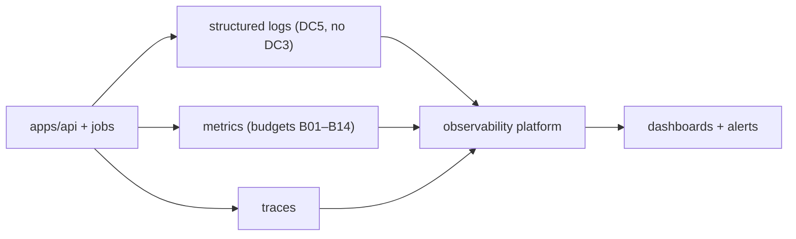

# Quad: Observability

> **Engineering-process doc.** Owns logs/metrics/traces, dashboards, alerts, and telemetry posture. Conforms to `SECURITY.md`, `PERFORMANCE.md`, `DEPLOYMENT.md`, `BACKEND.md`. Does not rewrite contracts; contradictions → unresolved risks. No code/configs/dashboards-as-files; no versions; tenant-neutral (Rutgers Quad = tenant #1).

## 1. Purpose & Scope
Observability makes Quad's behavior visible enough to operate it, hit performance budgets, and detect abuse, without leaking identity. **In scope:** logging/metrics/tracing models, dashboards, alerts, telemetry privacy, retention. **Out of scope:** the threat model (`SECURITY.md`), the budgets themselves (`PERFORMANCE.md`), provider choice (`DEPLOYMENT.md`).

## 2. Responsibilities vs. Non-Responsibilities
| Observability owns | Doesn't own |
| --- | --- |
| What to log/measure/trace + dashboards/alerts | Budgets (`PERFORMANCE.md`) / threats (`SECURITY.md`) |
| Telemetry privacy + retention posture | Provider/platform (`DEPLOYMENT.md`) |

## 3. Principles
- **`O-DP-1` No `DC3` in telemetry**: reference user/correlation ids, never email (`BE-INV-10`, `SEC-INV-5`).
- **`O-DP-2` Request/correlation ids** on every log/trace.
- **`O-DP-3` Audit ≠ telemetry**: the moderation audit (`DC4`) is a durable authoritative record, separate from operational telemetry (`DC5`).
- **`O-DP-4` Actionable alerts**: alert on conditions an operator can act on, tied to budgets/SLOs.
- **`O-DP-5` Budget-driven dashboards**: dashboards track the `PERFORMANCE.md` budgets.

## 4. Logging Model
Structured (JSON) logs with: timestamp, level, service, **request/correlation id**, tenant id, event type, and safe context, **never `DC3`**. Security-relevant events (auth failures, authz denials, rate-limit/abuse triggers, tenant-mismatch) are logged at appropriate levels. Logs are `DC5` (operational), distinct from `DC4` audit.

## 5. Metrics Model
Counters/gauges/histograms per tenant/canvas where relevant: placement rate, current cooldown + load score, WS connection counts + fan-out latency, projection lag, error/rejection rates (incl. `COOLDOWN_ACTIVE`/`RATE_LIMITED`), queue depths, job health, latency histograms for `B01–B14`.

## 6. Tracing Model
Distributed traces spanning the request/command lifecycle (`BACKEND.md` §5), resolve→authn→authz→validate→cooldown→append→projection→publish, with the correlation id, to locate latency and failures. Traces carry no `DC3`.

## 7. Dashboards
API health · WS health · **placement hot path** (B06/B07/B09/B10) · cooldown/load score · database/projection lag · Redis health · moderation/report queue depth · archive/replay job health · security events. Each dashboard ties to budgets/SLOs.

## 8. Alerts
| Alert | Trigger |
| --- | --- |
| Performance | a budget metric approaches its blocking threshold (`PERFORMANCE.md`) |
| Error spike | error/rejection rate jumps |
| Auth failures | abnormal auth-failure/verification-abuse rate |
| Tenant-isolation failure | any cross-tenant access signal (**page**) |
| Infra | Redis/Postgres/object-storage unavailable/degraded |
| Projection lag | lag exceeds threshold |
| Report backlog | moderation queue depth/age exceeds threshold |

## 9. Telemetry Privacy
**No `DC3`** anywhere in telemetry; scrub/avoid PII; identity referenced by id. Public/aggregate analytics are separate (`ANALYTICS.md`). Telemetry access is operator-scoped.

## 10. Retention Posture
Operational telemetry (`DC5`) has bounded retention; the **audit log (`DC4`) is durable/append-only** with its own (longer) retention/legal-hold posture (`MODERATION.md`/`ADR-0009`). Exact windows → `DEPLOYMENT.md`/`OPERATIONS.md`.

## 11. Relationship to Security / Performance / Deployment
- **`SECURITY.md`:** security-relevant events feed detection; no `DC3` leakage (logging rules §16 there).
- **`PERFORMANCE.md`:** dashboards/alerts track its budgets; regression detection across releases.
- **`DEPLOYMENT.md`:** telemetry wired from day one; platform/provider chosen there.

## 12. Observability Invariants (`OBS-INV-*`)
- **`OBS-INV-1`** No `DC3` in any log/metric/trace.
- **`OBS-INV-2`** Every request carries a correlation id propagated through logs/traces.
- **`OBS-INV-3`** Audit (`DC4`) is separate from operational telemetry (`DC5`).
- **`OBS-INV-4`** Alerts are actionable and tied to budgets/SLOs; tenant-isolation failures page.
- **`OBS-INV-5`** Telemetry access is operator-scoped; retention is bounded.

## 13. Diagrams

## 14. Document Control
- **Path:** `docs/OBSERVABILITY.md` · **Purpose:** logs/metrics/traces/dashboards/alerts + telemetry posture.
- **Dependencies:** `SECURITY`, `PERFORMANCE`, `DEPLOYMENT`, `BACKEND`, `COOLDOWN`, `MODERATION`. **Consumed by:** `OPERATIONS`, `DISASTER_RECOVERY`, impl.
- **Acceptance:** ☑ principles (no `DC3`, correlation ids, audit≠telemetry) ☑ logging/metrics/tracing models ☑ dashboards ☑ alerts ☑ privacy ☑ retention ☑ rel to SEC/PERF/DEPLOY ☑ `OBS-INV-*` ☑ 2 diagrams ☑ no code/versions ☑ tenant-neutral.
- **Next:** `docs/OPERATIONS.md`.
