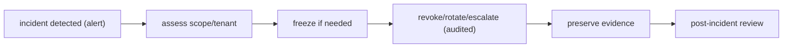
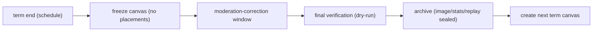

# Quad: Operations & Runbooks

> **Engineering-process doc.** Owns operator procedures, recurring operations, and semester/tenant lifecycle ops. Conforms to `DEPLOYMENT.md`, `SECURITY.md`, `DISASTER_RECOVERY.md`, `MODERATION.md`, `COOLDOWN.md`, `ARCHIVES.md`. Does not rewrite contracts; contradictions → unresolved risks. No code/scripts/configs; no versions; tenant-neutral (Rutgers Quad = tenant #1).

## 1. Purpose & Scope
Operations is how humans (platform operators, tenant admins) run Quad safely and repeatably. **In scope:** runbook categories, operator roles/permissions, emergency controls, scheduled-job ops, maintenance, comms. **Out of scope:** deploy mechanics (`DEPLOYMENT.md`), DR drills (`DISASTER_RECOVERY.md`), moderation rules (`MODERATION.md`).

## 2. Responsibilities vs. Non-Responsibilities
| Operations owns | Doesn't own |
| --- | --- |
| Runbooks + recurring ops + lifecycle ops | Deploy pipeline (`DEPLOYMENT.md`) / RPO-RTO (`DISASTER_RECOVERY.md`) |
| Operator roles/permissions + emergency procedure | Threat model (`SECURITY.md`) / moderation rules (`MODERATION.md`) |

## 3. Principles
- **`OP-DP-1` Scripted/repeatable** where possible, prefer runbooks over ad-hoc.
- **`OP-DP-2` Audited operator actions**: consequential ops are logged (`DC4`).
- **`OP-DP-3` Least privilege**: operators get only what a task needs.
- **`OP-DP-4` No silent production changes**: changes go through config/deploy/migration, not manual DB edits.
- **`OP-DP-5` Tenant-scoped operations**: act within a tenant; cross-tenant only as operator, audited.

## 4. Runbook Categories
Deploy · rollback · incident response · tenant freeze · session revocation · secret rotation · moderation escalation · archive generation · replay asset regeneration · projection rebuild · tenant onboarding · semester rollover. Each runbook states: trigger · preconditions · steps · verification · audit · comms.

## 5. Operator Roles & Permissions
| Role | Scope | Powers |
| --- | --- | --- |
| **Tenant admin** | one tenant | tenant config, canvas lifecycle, roster/roles, emergency freeze (tenant) |
| **Platform operator** | cross-tenant (`B5`) | onboarding, rollover, incident response, infra ops — **least privilege + full audit** |
All elevated actions are audited (`OPS-INV-2`); cross-tenant is operator-only (`OPS-INV-4`).

## 6. Emergency Controls
- **Freeze canvas / tenant-wide placement restrict** (audited), primary incident lever (`MODERATION.md` §19, `COOLDOWN.md` §16); never an individual advantage.
- **Revoke sessions** (targeted/tenant-wide), on compromise/abuse (`AUTHENTICATION.md`).
- **Secret rotation**: on suspected compromise (`DEPLOYMENT.md` §10).
- **Escalate incident**: route to operator + preserve evidence (`SECURITY.md` §19).

## 7. Scheduled-Job Operations
Operate (monitor/retry/backfill) the background jobs (`BACKEND.md` §15): cooldown recompute, projection jobs, archive/replay generation, analytics/leaderboard/heatmap projections, cleanup/retention. Jobs are idempotent; a failed job is retried/backfilled, not skipped. Job health is on dashboards (`OBSERVABILITY.md`).

## 8. Maintenance Windows
Prefer zero-downtime (expand/contract migrations, rolling deploys, `DEPLOYMENT.md`). When a window is unavoidable, schedule off-peak, announce, and keep the canvas read-only rather than fully down where possible.

## 9. Communication Expectations
Announce launches, incidents (status + ETA), maintenance, and term-close/archive availability to the tenant's students. Incident comms are honest and timely; post-incident reviews are shared internally (`SECURITY.md` §19).

## 10. Relationship to Deployment / Security / DR
- **`DEPLOYMENT.md`:** deploy/rollback/migration mechanics the runbooks invoke.
- **`SECURITY.md`:** incident-response levers + audit.
- **`DISASTER_RECOVERY.md`:** restore runbooks + drills.

## 11. Operations Invariants (`OPS-INV-*`)
- **`OPS-INV-1`** Recurring ops are runbook-driven and repeatable.
- **`OPS-INV-2`** Consequential operator actions are audited (`DC4`).
- **`OPS-INV-3`** Operators act under least privilege; no silent production changes (no manual DB edits).
- **`OPS-INV-4`** Operations are tenant-scoped; cross-tenant is operator-only and audited.
- **`OPS-INV-5`** Emergency controls preserve fairness (no individual advantage) and audit.

## 12. Diagrams

## 13. Document Control
- **Path:** `docs/OPERATIONS.md` · **Purpose:** runbooks + operator procedures + lifecycle ops.
- **Dependencies:** `DEPLOYMENT`, `SECURITY`, `DISASTER_RECOVERY`, `MODERATION`, `COOLDOWN`, `ARCHIVES`, `AUTHENTICATION`, `OBSERVABILITY`. **Consumed by:** operators, incident response.
- **Acceptance:** ☑ runbook categories ☑ operator roles/permissions ☑ emergency controls ☑ scheduled-job ops ☑ maintenance ☑ comms ☑ rel to DEPLOY/SEC/DR ☑ `OPS-INV-*` ☑ 2 diagrams (incident, rollover) ☑ no code/versions ☑ tenant-neutral.
- **Next:** `docs/DISASTER_RECOVERY.md`.
