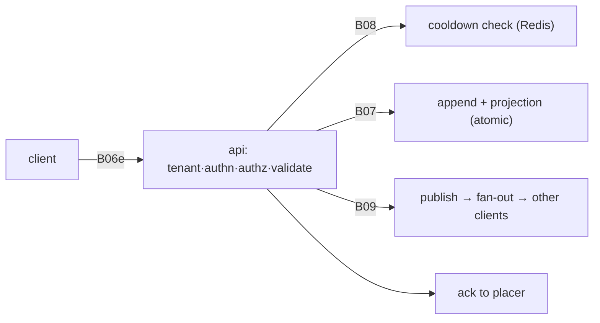
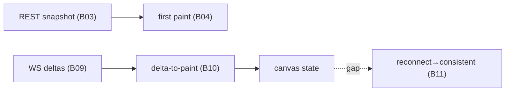
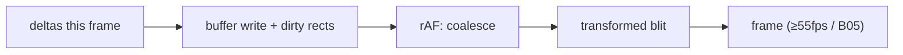
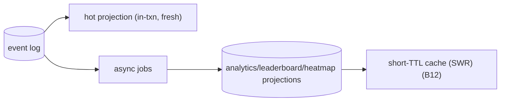
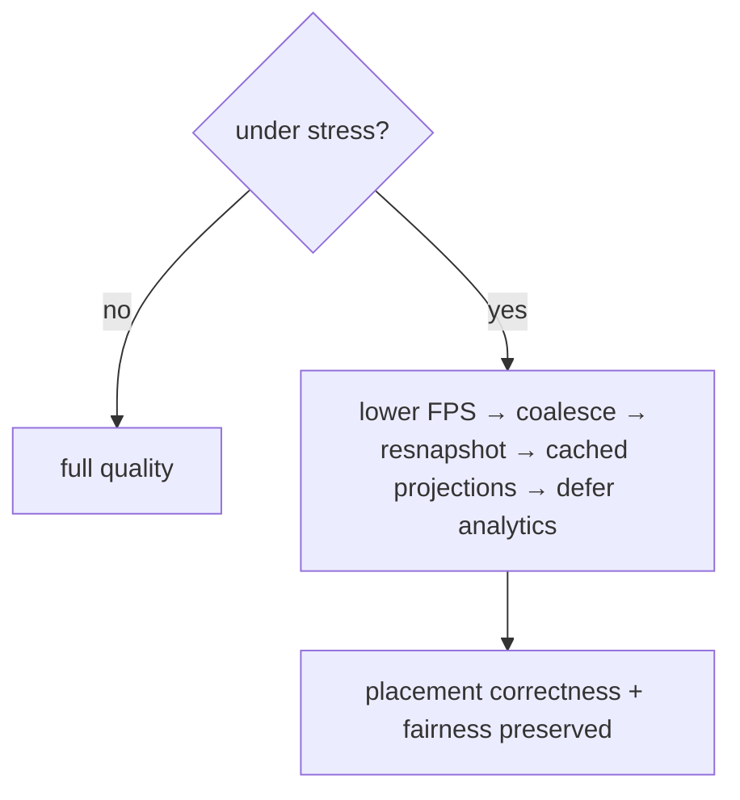

# Quad — Performance Budgets & Scalability

> **This document owns Quad's concrete, testable performance budgets, scalability assumptions, and performance-test expectations.** Every budget has a **target** and a **blocking threshold** so claims are verifiable (`PRIN-ALIVE`). It conforms to all Phase 1–3 docs and does **not** rewrite any contract.
>
> **Altitude:** budgets + measurement + scalability. **No** code/benchmarks/dashboards/config. **No** versions (`TECH_BASELINE.md`). Tenant-neutral (Rutgers Quad = tenant #1). Numbers below are **initial budgets** to validate via load tests (`LG-5`) and tune via ADRs; the *shape* (target + blocking + method) is the contract, the exact figures are tunable.
>
> **Measurement convention:** latencies are **p95** unless noted, measured server-side excluding client network where stated; client metrics assume a **representative mid-tier mobile device on a typical campus network**.

---

## 1. Purpose & Scope
The canvas must *feel instantaneous* at thousands of concurrent users while never trading away correctness or fairness. This doc fixes the budgets that make "alive" measurable. **In scope:** principles, critical journeys, the budget table, per-layer budgets, scalability/load tiers, degradation, anti-patterns, observability + perf tests, invariants. **Out of scope:** concrete infra (`DEPLOYMENT.md`), dashboards/alerts detail (`OBSERVABILITY.md`), overall test strategy (`TESTING.md`), contract definitions (owned by their docs).

## 2. Responsibilities vs. Non-Responsibilities
| Performance **owns** | It does **not** own |
| --- | --- |
| Budgets (target + blocking) + measurement methods | Contracts (API/WS/DB/ES/render/cooldown/auth/tenant) |
| Scalability assumptions + load tiers | Concrete infrastructure (`DEPLOYMENT.md`) |
| Required performance tests + regression gates | Dashboard/alert specifics (`OBSERVABILITY.md`) |

## 3. Performance Principles
- **`P-DP-1` Testable budgets** — every target has a blocking threshold + measurement (`PERF-INV-1`).
- **`P-DP-2` User-perceived responsiveness** — optimize the journeys users feel, not vanity metrics.
- **`P-DP-3` Graceful degradation** — shed quality, never correctness (`§18`).
- **`P-DP-4` Correctness over speed** — never a fairness/security shortcut for latency (`PERF-INV-2`).
- **`P-DP-5` Mobile-first** — budgets assume mid-tier mobile, not a workstation.

## 4. Critical User Journeys
Initial canvas load · pan/zoom · place pixel · cooldown display · live WS update · reconnect/resnapshot · report→rollback moderation · replay playback · archive browsing · leaderboard/profile/heatmap loading. Each maps to budget rows (§5) and a perf test (§21).

## 5. Performance Budget Table
| # | Metric | Target (p95) | Blocking threshold | Method |
| --- | --- | --- | --- | --- |
| B01 | Initial HTML/app-shell interactive | < 1.5 s | > 3 s | synthetic (mid-tier mobile) |
| B02 | Canvas metadata load | < 150 ms | > 500 ms | API timing |
| B03 | Snapshot fetch + decode (typical canvas) | < 800 ms | > 2 s | client timing |
| B04 | First canvas paint after decode | < 200 ms | > 800 ms | client timing |
| B05 | Pan/zoom FPS | ≥ 55 fps | < 30 fps | render profiler |
| B06 | Pixel placement API (server-side) | < 100 ms | > 300 ms | API timing |
| B06e | Placement end-to-end ack (incl. network) | < 250 ms | > 750 ms | client timing |
| B07 | Event append + projection update (in-txn) | < 30 ms | > 100 ms | DB timing |
| B08 | Cooldown check read (Redis) | < 5 ms | > 25 ms | Redis timing |
| B09 | WS delta fan-out (commit → other clients) | < 200 ms | > 1 s | end-to-end probe |
| B10 | Client delta-to-paint | ≤ next rAF (~16 ms) | > 100 ms | render profiler |
| B11 | Reconnect → consistent state | < 2 s | > 5 s | client timing |
| B12 | Leaderboard/profile/analytics query (cached) | < 200 ms | > 1 s | API timing |
| B13 | Replay scrub/jump (with checkpoints) | < 300 ms | > 1.5 s | client timing |
| B14 | Archive artifact (final image) load | < 1.5 s | > 4 s | client timing |

Budgets are **per tenant/canvas** and hold at the launch load tier (§17). Blocking thresholds **gate launch** (`LG-5`) and, where feasible, **gate merge** on the hot path (§21).

## 6. Frontend Performance
- **React boundaries:** the canvas is a client island; **no per-pixel React re-render** — deltas go to `@quad/render`, not React state (`FE-INV-7`, `PERF-INV-4`).
- **Bundle/code-split:** lazy-load heavy/non-critical views (replay, admin); keep the canvas path lean.
- **Mobile input latency:** gestures handled in the engine, not via heavy state churn; tap→feedback feels immediate.
- **Accessibility not sacrificed:** keyboard/ARIA parallels remain even under degradation (`FRONTEND.md` §10).

## 7. Rendering Performance (`@quad/render`)
- **Budgets:** B04/B05/B10. **Dirty-region + rAF coalescing**; many deltas → one frame.
- **2D baseline** with offscreen 1px/cell buffer; visible frame = single transformed blit.
- **Memory budget:** offscreen buffer ≈ W×H×4 bytes (e.g., 1000² ≈ 4 MB, 2000² ≈ 16 MB); cap client buffer (≈ ≤ 64 MB) → **tiling** beyond.
- **Low-end/mobile:** degrade to ≥ 30 fps + cheaper blit before stutter.
- **WebGL/tiling upgrade triggers:** sustained sub-budget FPS, or canvas size exceeding the memory cap → `ADR-0005`.

## 8. API Performance
- **Hot placement path** (B06): minimal work before the atomic append — resolve tenant, authn (cached session), authz, validate, cooldown read, append.
- **Idempotency/validation overhead** kept small (indexed key check; schema validation is cheap).
- **Auth/session lookup** is a fast server-side read (Redis-backed sessions).
- **Tenant resolution** is an in-memory registry lookup.
- **Error paths** are cheap (no heavy work on rejection, incl. `COOLDOWN_ACTIVE`).

## 9. Database Performance
- **Event append** (B07): sequential insert into the active-canvas partition.
- **Current projection update**: single-cell upsert (PK `(canvas,x,y)`), atomic with append.
- **Pixel history lookup**: index-backed `(canvas,x,y,seq)`, paginated.
- **Stats/leaderboard projections**: eventually consistent, off the hot path.
- **Indexing/partitioning**: per `DATABASE.md` §13–§14; partition pruning keeps the hot path fast; archived partitions cold.

## 10. Redis/Valkey Performance
- **Cooldown check/set** (B08): O(1) reads/writes; sub-5 ms target.
- **Presence**: approximate counters with heartbeat TTL.
- **WS fan-out / pub/sub**: low-latency publish; contributes to B09.
- **Key eviction constraints**: cooldown keys **protected from eviction** (eviction = unfair early placement, `COOL-INV-12`).

## 11. WebSocket Performance
- **Connection targets**: launch tier ≈ **10k+ concurrent connections per tenant** (stretch 25k+), horizontally scaled (§16).
- **Fan-out latency**: B09.
- **Batching/coalescing**: coalesce rapid deltas, especially to slow clients (`WEBSOCKETS.md` §14).
- **Backpressure / slow-client**: bounded send buffers; coalesce → `ReconnectRequired`; never block the server.

## 12. Cooldown Performance
- **Recompute interval**: ~30–60 s (illustrative; `COOLDOWN.md`).
- **Load-score input collection**: cheap reads from Redis/metrics; off the placement path.
- **Cooldown check latency**: B08.
- **Fail-closed**: under Redis uncertainty, reject placements (correctness > availability of writes).
- **Write-load is naturally bounded**: sustained placement rate ≈ `activeUsers / cooldownSeconds` (e.g., 10k users at the 5-min floor ⇒ ~33 placements/s); the dynamic cooldown rises under load, further capping append throughput (`PERF-INV-9`) — a key scalability property.

## 13. Event-Sourcing / Rebuild Performance
- **Projection rebuild**: bounded by canvas event count; **checkpoints/keyframes** keep rebuild/scrub cheap (`EVENT_SOURCING.md` §14).
- **Shadow verification**: run off-peak/async; not on the hot path.
- **Replay/chunk derivation**: chunked + precomputed assets for archived terms (`REPLAY.md`).

## 14. Analytics / Leaderboards / Profiles / Heatmaps Performance
- **Projection freshness**: eventually consistent; "today" refreshes promptly.
- **Cache TTLs + stale-while-revalidate**: short-TTL cached reads (B12); serve stale while recomputing where acceptable.
- **Query budgets**: B12; always paginated/bounded.
- **Precomputation**: heatmap tiles + leaderboard projections precomputed; never computed on the placement path.

## 15. Archives / Replay Performance
- **Final-image generation**: server-side, off-peak at freeze; not user-blocking.
- **Replay asset generation**: precomputed at archive; reproducible from log.
- **Archive browsing**: B14; immutable artifacts are CDN/cache-friendly.
- **Post-archive correction artifact**: generated separately, exceptional (`ARCHIVES.md`).

## 16. Scalability Model
- **Single-tenant launch**: one busy tenant meets all budgets.
- **Multiple tenants**: tenants are independent; load doesn't bleed across (`COOL-INV-10`, `TENANT-INV-5`).
- **Horizontal API scale**: stateless api instances behind a load balancer.
- **WS instance scale**: many WS instances; **Redis pub/sub** connects them (fan-out latency is the scaling watch-item).
- **Redis fan-out limits**: monitor pub/sub throughput; shard/scale Redis as connection counts grow (topology → `DEPLOYMENT.md`).
- **Postgres scaling**: read replicas for projections/queries; the append hot path is bounded by cooldown (§12); partitioning per canvas.

## 17. Load Tiers
| Tier | Scale | Budget posture |
| --- | --- | --- |
| **Local/dev** | 1–few users | functional, not load-validated |
| **Closed pilot** | tens–hundreds | budgets met; observe real behavior |
| **Rutgers public launch** | ~10k+ concurrent/tenant | **all blocking thresholds must pass** (`LG-5`) |
| **Multi-tenant future** | many tenants concurrently | per-tenant budgets hold; horizontal scale |

## 18. Graceful Degradation
Under stress, shed quality in this order, **always preserving placement correctness/fairness**:
1. Lower rendering FPS (≥30) + cheaper blit.
2. Batch/coalesce deltas to slow/lagging clients.
3. Force `ReconnectRequired` → snapshot resync for far-behind clients.
4. Serve cached/stale projections (leaderboards/analytics/heatmaps).
5. Delay/defer heavy analytics + non-critical jobs.
6. (Cooldown naturally rises under load, reducing write pressure.)
Placement validity, cooldown enforcement, audit, and tenant isolation are **never** degraded.

## 19. Anti-Patterns (forbidden)
- **Polling** the live canvas (use WS deltas) (`PERF-INV-3`).
- **Per-pixel React state/re-render**.
- **Unbounded history/query** (always paginate) (`PERF-INV-6`).
- **Synchronous heavy analytics on the placement path** (must be async) (`PERF-INV-5`).
- **Client-side authority** for cooldown/fairness.
- **Redis as durable truth** (`PERF-INV-8`).

## 20. Observability Requirements
(Detail → `OBSERVABILITY.md`.) Collect: latency histograms for B01–B14; FPS/frame-time; WS connection counts + fan-out latency; cooldown value + load score; projection lag; error/rejection rates; queue depths. Traces/spans across the placement hot path. **Alert** when a metric approaches its blocking threshold. **Regression detection**: track budget metrics over releases.

## 21. Performance Testing Expectations
(Strategy → `TESTING.md`.)
- Microbenchmarks where useful (cooldown calc, projection apply).
- **API latency tests** (B06/B07/B12) against real Postgres/Redis.
- **DB integration benchmarks** (append/projection/history at volume).
- **WS fan-out load tests** (connection counts + B09).
- **Rendering FPS tests** (B05/B10) on representative inputs/devices.
- **Reconnect tests** (B11) and **replay scrub tests** (B13).
- **Archive generation tests** (B14/freeze pipeline).
- **Tenant isolation under load** (no cross-tenant degradation).
- **No-regression budgets in CI** for the canvas hot path where feasible (B06/B07/B10).

## 22. Performance Invariants (`PERF-INV-*`)
- **`PERF-INV-1`** Every performance claim has a target, a blocking threshold, and a measurement method.
- **`PERF-INV-2`** Correctness/fairness is never sacrificed for speed.
- **`PERF-INV-3`** No polling for the live canvas; updates are WS deltas.
- **`PERF-INV-4`** No per-pixel React re-render; rendering is rAF-coalesced and decoupled.
- **`PERF-INV-5`** The placement hot path does minimal work before the atomic append; heavy analytics are async.
- **`PERF-INV-6`** History/queries are always bounded (paginated); no unbounded scans on the hot path.
- **`PERF-INV-7`** Under load, degrade gracefully while preserving placement correctness.
- **`PERF-INV-8`** Redis is cache/coordination only, never durable truth; cooldown uncertainty → fail closed.
- **`PERF-INV-9`** Write load is naturally bounded by cooldown (≈ activeUsers/cooldown).
- **`PERF-INV-10`** Budgets are enforced by automated perf tests; hot-path regressions gate merge where feasible.

## 23. Diagrams
### 23.1 Placement hot-path latency

### 23.2 Snapshot + WS delta performance

### 23.3 Rendering frame pipeline

### 23.4 Projection/cache freshness

### 23.5 Graceful degradation

## 24. Decisions Deferred to Deeper Docs / ADRs
| Decision | Owner |
| --- | --- |
| Exact production load target + final budget numbers | load tests / `ADR` / `DEPLOYMENT.md` |
| Canvas dimensions (drives B03/memory) (`P-Q-3`) | product / `MULTI_TENANCY.md` config |
| WebGL/tiling trigger | `ADR-0005` |
| Postgres partitioning/index specifics + read replicas | `DATABASE.md` / `DEPLOYMENT.md` |
| Redis topology/sharding | `DEPLOYMENT.md` |
| CDN / object-storage delivery strategy | `DEPLOYMENT.md` |
| Load-test tooling + CI perf gates | `TESTING.md` / `DEPLOYMENT.md` |

## 25. Document Control
- **Path:** `docs/PERFORMANCE.md`
- **Purpose:** Quad's concrete, testable performance budgets, scalability model, and performance-test expectations.
- **Dependencies:** all Phase 1–3 docs (esp. `RENDERING`, `WEBSOCKETS`, `COOLDOWN`, `DATABASE`, `EVENT_SOURCING`, `API`, `SECURITY`). **Consumed by:** `TESTING.md`, `OBSERVABILITY.md`, `DEPLOYMENT.md`, `MILESTONES.md`, `specs/*`, ADRs.
- **Acceptance checklist:** ☑ all 25 parts ☑ principles ☑ critical journeys ☑ budget table with **target + blocking** (B01–B14) ☑ per-layer budgets (frontend/render/API/DB/Redis/WS/cooldown/ES/analytics/archives) ☑ scalability + load tiers ☑ degradation ladder (correctness preserved) ☑ anti-patterns ☑ observability + perf tests ☑ `PERF-INV-1…10` ☑ 5 Mermaid diagrams ☑ no contracts rewritten ☑ versions referenced not declared ☑ tenant-neutral ☑ no code/benchmark/config files.
- **Open questions:** see §24.
- **Next recommended:** `docs/DEPLOYMENT.md` (local/staging/prod topology, Docker, CI/CD, env/secrets, migrations, rollbacks).
