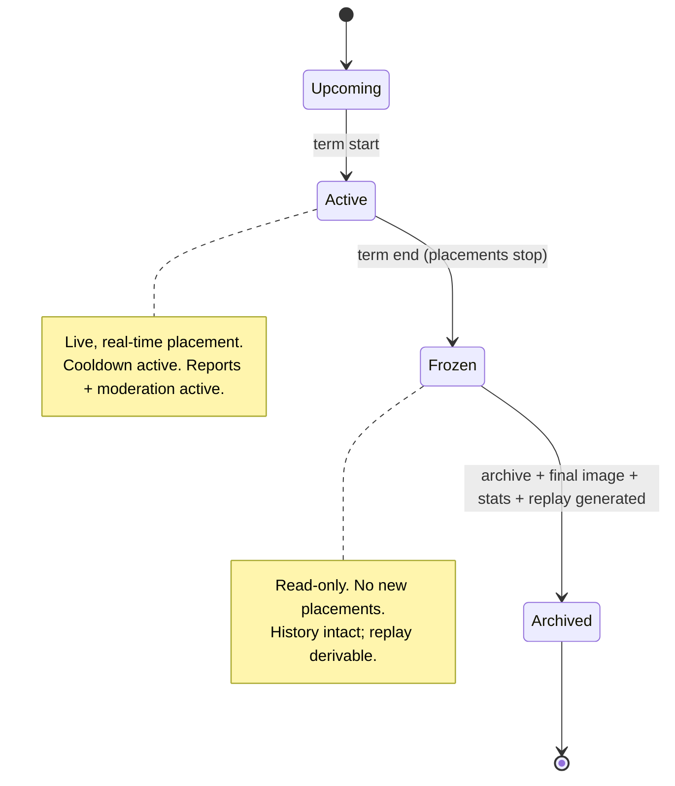

# Quad — Product Specification

> **This is the product source of truth.** It defines *what* Quad is and *how it must behave for users* — not how it is built. Architecture, data models, APIs, and algorithms live in their own docs (`ARCHITECTURE.md`, `DATABASE.md`, `API.md`, `COOLDOWN.md`, …) and must conform to this document. When product intent and an architecture doc disagree, **this file wins** until it is explicitly changed.
>
> **Naming:** the platform is **Quad**. **Rutgers Quad** is **tenant #1 / the first deployment** — never a hardcoded assumption in platform behavior. Code lives in the `quad-canvas` repo under `@quad/*` packages. Wherever this doc says "the university" or "the tenant," it means *any* current or future tenant.
>
> **Versions:** see [`docs/TECH_BASELINE.md`](TECH_BASELINE.md). Not repeated here.
>
> **Requirement IDs** (e.g., `P-CANVAS-3`) are stable handles for specs, milestones, and tests to reference. Do not renumber; deprecate instead.

---

## 1. Product Vision

Quad is a **production-quality, real-time collaborative pixel canvas for verified university communities.** Inspired by Reddit's r/place but built for a single campus at a time, Quad turns an academic term into a **shared, semester-long social experiment**: thousands of students at one university place individual pixels on one live canvas, cooperating and competing to create a single evolving work of art that captures the culture of that campus in that moment in time.

At the end of each term the canvas is **frozen forever**, archived, and turned into a replay and a downloadable final image — a permanent historical artifact a university can revisit for years.

The experience must feel **alive, fair, and instantaneous**:

- **`P-VISION-1` Equal power.** Every verified student gets exactly one account, one pixel per placement, and the same cooldown as everyone else. No money, status, or seniority changes a student's influence.
- **`P-VISION-2` Always alive.** Pixels from other students appear in real time; the canvas is never stale.
- **`P-VISION-3` Permanent memory.** Every action is preserved; history is never overwritten or deleted.
- **`P-VISION-4` Identity, not anonymity.** Participation requires verified university membership; every pixel is attributable.
- **`P-VISION-5` A platform, not a one-off.** Rutgers is first; onboarding another university is configuration, not a rewrite.

**Success looks like:** a meaningful share of a campus participates over a term, the canvas tells a recognizable story of that campus, moderation keeps it safe without feeling heavy-handed, and the archive becomes something the community is proud to revisit.

---

## 2. Target Users

| Persona | Who they are | What they need from Quad |
| --- | --- | --- |
| **Student participant** *(primary)* | A verified, enrolled member of a tenant university, mostly on mobile | Fast onboarding, an instant-feeling canvas, a clear cooldown, the ability to find their pixels and see their impact |
| **Spectator / lapsed participant** | A verified member who mostly watches | Browse the live canvas, explore pixel stories, watch replays, check leaderboards |
| **Moderator** *(secondary)* | Trusted, tenant-scoped staff/students with elevated permissions | Review reports, act on abuse quickly and reversibly, with a full audit trail |
| **Tenant admin** | University-level operator of a single tenant | Configure the tenant (branding, palette, term, membership rules), manage moderators, see analytics |
| **Platform operator** | Quad team running the platform across tenants | Onboard new tenants, run semester rollovers, monitor health, respond to incidents |
| **University stakeholder** *(non-user)* | Student life / administration | Confidence that participation is verified, safe, attributable, and archived |

**Primary device target is mobile** (`P-USER-1`): touch placement, pinch-zoom, drag-pan, and responsive layout are first-class, not afterthoughts. Desktop is fully supported.

---

## 3. Tenant Model (Product Level)

A **tenant** is one university's complete, self-contained Quad presence. From the product's point of view, every tenant has:

- **`P-TENANT-1` Identity & branding** — name, public-facing title (e.g., "Rutgers Quad"), theme/colors, logo.
- **`P-TENANT-2` Membership rule** — how a person proves they belong (MVP: verified university email domain(s); later: official campus SSO). Defined per tenant; see `AUTHENTICATION.md` for mechanism.
- **`P-TENANT-3` Its own canvases** — one official canvas per term, plus archives of past terms.
- **`P-TENANT-4` Its own people** — its students, its moderators, its admins. **No cross-tenant participation:** a verified member of University A cannot place pixels on University B's canvas.
- **`P-TENANT-5` Its own configuration** — color palette, canvas dimensions, term schedule, cooldown bounds (within platform-allowed limits), and moderation roster.
- **`P-TENANT-6` Its own archives & analytics** — fully isolated; one tenant never sees another's private data.

**`P-TENANT-7` Isolation is a product guarantee, not just a technical one:** accounts, pixels, leaderboards, profiles, reports, and archives are always scoped to a single tenant. Leaderboards and heatmaps are per-tenant; there is no global cross-university ranking in MVP.

**Rutgers Quad** is tenant #1: membership via `@rutgers.edu` / `@scarletmail.rutgers.edu` (MVP), Scarlet theme, one canvas per semester. These are *configuration values for tenant #1*, never platform constants.

> Terminology note: Quad uses "term" generically; most tenants (including Rutgers) use **semesters**. Tenants whose calendars differ (quarters/trimesters) are a configuration concern (see §21 Open Questions).

---

## 4. Core User Journeys

Each journey is the canonical happy path; edge cases live in feature specs.

1. **`P-JOURNEY-1` Onboarding & verification.** A student arrives → sees the live canvas (read-only preview allowed) → signs in with their university email → completes verification → becomes a participant who can place pixels. Non-members cannot pass verification.
2. **`P-JOURNEY-2` Place a pixel.** Participant selects a color → selects a coordinate (tap/click) → confirms → pixel updates instantly for everyone → the global cooldown countdown starts for that user.
3. **`P-JOURNEY-3` Explore a pixel's story.** Hover (desktop) shows quick attribution; tapping/clicking opens the pixel's full placement history and a per-pixel replay.
4. **`P-JOURNEY-4` Track personal impact.** Participant opens their profile → sees pixels placed, pixels currently surviving, streak, favorite color, contribution heatmap, for this term and lifetime.
5. **`P-JOURNEY-5` Compete & spectate.** Participant checks leaderboards and heatmaps; watches the term replay; shares a moment.
6. **`P-JOURNEY-6` Report bad content.** Any participant reports an offensive area or a user; the report enters the moderation queue.
7. **`P-JOURNEY-7` Moderate.** A moderator reviews a report → takes a reversible, audited action (rollback a pixel/region, remove artwork, suspend/ban a user) → the canvas and audit log reflect it.
8. **`P-JOURNEY-8` Term rollover.** At term end the canvas freezes → archive, final image, statistics, and replay are produced → a new term's canvas opens.
9. **`P-JOURNEY-9` Browse history.** Any member browses past archived terms, views final images, and replays them.

---

## 5. Core Features

| # | Feature | One-line product promise |
| --- | --- | --- |
| `P-FEAT-1` | **Live canvas** | A pixel-perfect, zoomable, pannable canvas that updates in real time and feels instantaneous on phone and laptop. |
| `P-FEAT-2` | **Pixel placement** | Pick a color, place one pixel, see it appear everywhere immediately. |
| `P-FEAT-3` | **Dynamic global cooldown** | A single fair cooldown (5–20 min) shared by everyone, adjusting to activity. |
| `P-FEAT-4` | **Attribution & pixel history** | Every pixel shows who placed it and when, with full history and per-pixel replay. |
| `P-FEAT-5` | **Profiles** | Personal stats, streaks, and contribution heatmap, per term and lifetime. |
| `P-FEAT-6` | **Leaderboards** | Per-tenant rankings across multiple categories and time windows. |
| `P-FEAT-7` | **Heatmaps & analytics** | Visual insight into contested areas, activity over time, and color usage. |
| `P-FEAT-8` | **Archives** | Permanent, browsable record of every past term — never deleted. |
| `P-FEAT-9` | **Replay** | Watch a whole term unfold from blank canvas to final artwork. |
| `P-FEAT-10` | **Moderation & auditability** | Reversible, fully audited tools to keep the canvas safe; nothing hard-deleted. |
| `P-FEAT-11` | **Multi-tenant universities** | Each university gets its own isolated, branded Quad. |

---

## 6. Semester Lifecycle

Each tenant has **exactly one official canvas per term** (`P-LIFE-1`). A canvas moves through these product states:

- **`P-LIFE-2` Upcoming** — canvas configured (dimensions, palette, schedule) but not yet open; optional read-only preview.
- **`P-LIFE-3` Active** — the live experience: placement, cooldown, real-time updates, reports, and moderation all operate.
- **`P-LIFE-4` Frozen** — at the scheduled term end, **placement stops permanently** for that canvas. It becomes read-only. No retroactive edits except audited moderation corrections during a short, clearly-bounded freeze window (see §14).
- **`P-LIFE-5` Archived** — the platform generates and preserves: the **final image**, **term statistics**, and a **replay**. The archive is permanent and browsable.
- **`P-LIFE-6` Rollover** — a new term's canvas is created (Upcoming → Active). Past canvases are **never deleted or overwritten** (`P-LIFE-7`).

---

## 7. Canvas Rules

- **`P-CANVAS-1` Fixed grid per term.** Each canvas has tenant-configured dimensions, fixed for that term. (Concrete default dimensions are a tenant config + architecture concern.)
- **`P-CANVAS-2` Coordinate system.** Every cell has integer coordinates; the UI shows the current coordinate under the cursor/finger.
- **`P-CANVAS-3` One pixel per placement.** A placement changes exactly one cell to one palette color.
- **`P-CANVAS-4` Configurable palette.** ~32 colors by default, editable per tenant **without code changes**; palette may expand over time. Placements must use a current palette color.
- **`P-CANVAS-5` Overwriting is allowed; forgetting is not.** A later placement can change a cell's color, but the previous state is preserved in history forever.
- **`P-CANVAS-6` Equal power.** No cell, color, region, or account has special placement privileges.
- **`P-CANVAS-7` Real-time consistency.** All viewers converge on the same canvas state quickly; a placement is visible to others within the platform's real-time latency budget (see `PERFORMANCE.md`).
- **`P-CANVAS-8` Smooth navigation.** Zoom (including deep zoom) and pan are smooth, with crisp (non-blurry) pixels at high zoom, on mobile and desktop.

---

## 8. Dynamic Cooldown — Product Behavior

The cooldown is the fairness throttle that gates how often a student may place a pixel. **This section defines behavior only; the algorithm, smoothing, and inputs are specified in [`COOLDOWN.md`](COOLDOWN.md).**

- **`P-COOL-1` Global, not personal.** At any moment there is **one** cooldown value in effect for the whole tenant. Everyone placing during the same window waits the same amount.
- **`P-COOL-2` Bounded 5–20 minutes.** The cooldown is always at least **5 minutes** and at most **20 minutes**. These bounds are never exceeded. (Platform-enforced; a tenant may narrow within, but not beyond, platform limits.)
- **`P-COOL-3` Load-responsive.** It trends toward the **minimum** when activity is low (encourage participation) and toward the **maximum** when activity is high (slow placement, reduce load, raise the stakes of each pixel).
- **`P-COOL-4` Gradual, not jumpy.** The value changes smoothly over time; it must not oscillate rapidly between extremes.
- **`P-COOL-5` Always visible & honest.** A participant can always see their remaining cooldown as a clear countdown, and can see the current global cooldown value. The countdown the user sees is the one actually enforced.
- **`P-COOL-6` No exceptions, ever.** No premium tier, purchase, referral, achievement, or admin favor shortens a user's cooldown. (Admins may place via normal rules; moderation actions are separate from placement and are not a cooldown bypass.)
- **`P-COOL-7` Fair on placement, not on intent.** The cooldown starts when a placement succeeds; failed/blocked attempts do not consume it.

---

## 9. Attribution, Hover & Pixel History

- **`P-ATTR-1` Every pixel is attributable.** Each current cell has a known placer and placement time.
- **`P-ATTR-2` Hover/quick-look.** On hover (desktop) or quick-look (mobile), a cell shows: coordinate, current color, the placer's **public handle**, and placement timestamp.
- **`P-ATTR-3` Public handle, not email.** Identity is shown as a tenant-defined **public handle** (e.g., a NetID-style handle at Rutgers Quad) or chosen display name. **The full university email is never shown publicly** (`P-ATTR-4`).
- **`P-ATTR-5` Full pixel story on click.** Selecting a cell opens its complete history: current color & owner, every historical placement (who, when, previous→new color), in order.
- **`P-ATTR-6` Per-pixel replay.** A user can replay a single cell's color changes over time.
- **`P-ATTR-7` Privacy floor.** Attribution exposes only what's needed to make the canvas accountable; sensitive identifiers (email, internal IDs) are never exposed. Exact public-handle policy is a tenant setting (see §21).

---

## 10. Profiles

Each participant has a profile, scoped per tenant.

- **`P-PROF-1` Term + lifetime stats:** pixels placed, pixels currently surviving, favorite color, longest-surviving pixel, current streak, semester participation, lifetime participation.
- **`P-PROF-2` Contribution heatmap:** a personal heatmap of where/when the user contributed.
- **`P-PROF-3` Identity:** shows the user's public handle/display name — never their email.
- **`P-PROF-4` Privacy controls:** a user controls what is publicly visible on their profile within tenant policy (e.g., display name vs handle). Defaults favor minimal exposure.
- **`P-PROF-5` Badges (post-MVP):** a future achievements/badges system; the model should not preclude it.

---

## 11. Leaderboards

- **`P-LEAD-1` Categories:** most pixels placed, most surviving pixels, most active today, most active this term, most active all-time.
- **`P-LEAD-2` Per-tenant only (MVP):** rankings are scoped to a single university; no cross-tenant global board in MVP.
- **`P-LEAD-3` Identity:** entries show public handles/display names, honoring profile privacy settings.
- **`P-LEAD-4` Fair & resistant to gaming:** rankings derive from real, attributable activity; abuse (botting, multi-accounting) must not be able to climb the board (ties to §15).
- **`P-LEAD-5` Freshness:** "today"/"this term" boards reflect recent activity promptly; exact refresh cadence is a performance concern (`PERFORMANCE.md`).

---

## 12. Archives

- **`P-ARCH-1` Permanent & immutable:** every completed term is archived forever and never deleted or altered (audited moderation corrections happen only before archival, per §6).
- **`P-ARCH-2` Browsable history:** members can browse all past terms for their tenant ("years of campus history").
- **`P-ARCH-3` Final artifacts per term:** a downloadable **final image**, **term statistics**, and a **replay**.
- **`P-ARCH-4` Tenant-scoped:** archives belong to their tenant and respect tenant isolation.
- **`P-ARCH-5` Stable references:** an archived term has a stable, shareable identity (e.g., "Rutgers Quad — Fall 2026").

---

## 13. Replay

- **`P-REPLAY-1` Whole-term replay:** play the canvas from blank to final artwork for any term (active or archived).
- **`P-REPLAY-2` Controls:** play, pause, a timeline scrubber, variable speed, and jump-to-timestamp.
- **`P-REPLAY-3` Accuracy:** the replay faithfully reflects the real sequence of placements (it is derived from the permanent history).
- **`P-REPLAY-4` Per-pixel replay:** replay a single cell's history (shared with §9).
- **`P-REPLAY-5` Shareable moments:** a user can link to a specific point in a replay. (Export/video is post-MVP — see §18.)

---

## 14. Moderation — Product Requirements

Moderation keeps the canvas safe **without erasing history**. All moderation is tenant-scoped and performed by authorized moderators/admins.

- **`P-MOD-1` Everything is attributable & reversible.** Because every pixel is attributable and history is permanent, moderators can act precisely and undo mistakes.
- **`P-MOD-2` Tools:** ban a user; temporarily suspend a user; roll back a single pixel; roll back a time range / region; remove offensive artwork; view and triage reports; search by user handle; search by coordinate/region.
- **`P-MOD-3` Reports:** any participant can report a region or user; reports form a queue with status (open/in-review/resolved).
- **`P-MOD-4` Audit log (mandatory):** every moderation action is recorded with actor, action, target, reason, and time. **No moderation action without an audit entry.**
- **`P-MOD-5` Nothing is hard-deleted.** "Removal"/"rollback" changes the visible canvas state but **never destroys history**; actions are themselves reversible and traceable.
- **`P-MOD-6` Proportionate & bounded power:** moderators act only within their tenant; the most destructive actions (e.g., wide rollbacks) are reserved for higher roles and are clearly logged.
- **`P-MOD-7` Freeze-window corrections:** between term Freeze and Archive, only audited moderation corrections are permitted; after Archive, the record is immutable.
- **`P-MOD-8` Transparency (product stance):** affected users can be informed of actions taken against them (mechanism TBD — see §21).

---

## 15. Anti-Abuse — Product Requirements

- **`P-ABUSE-1` One real student, one account.** Participation requires verified university membership; the product is designed so a person cannot trivially run many accounts.
- **`P-ABUSE-2` Cooldown as the primary throttle** (per §8), reinforced by rate limiting on actions.
- **`P-ABUSE-3` Bot resistance:** automated/scripted placement is discouraged and detectable; the product provides hooks for bot detection and may challenge suspicious behavior.
- **`P-ABUSE-4` Device/network limits:** reasonable limits to curb mass multi-accounting (e.g., per-device/IP signals feeding abuse detection), balanced against shared-campus-network realities.
- **`P-ABUSE-5` Every placement is traceable** to an account and time, enabling after-the-fact investigation.
- **`P-ABUSE-6` Report + review loop** (per §14) lets the community surface abuse.
- **`P-ABUSE-7` No fairness bypass:** anti-abuse never creates a paid/privileged lane; mitigations apply equally. Detailed threat model and mitigations are in [`SECURITY.md`](SECURITY.md).

---

## 16. Admin Capabilities

Two product roles above moderator (exact role model in `AUTHENTICATION.md`/`MODERATION.md`):

**Tenant admin** (one university):
- **`P-ADMIN-1`** Configure tenant identity, theme/branding, and public title.
- **`P-ADMIN-2`** Configure the color palette (no code changes).
- **`P-ADMIN-3`** Configure canvas dimensions and the term schedule (start/end), and trigger/confirm rollover.
- **`P-ADMIN-4`** Set cooldown bounds within platform-allowed limits.
- **`P-ADMIN-5`** Manage moderators and roles for the tenant.
- **`P-ADMIN-6`** View tenant analytics dashboards (participation, activity, health).
- **`P-ADMIN-7`** Emergency controls: pause/freeze the active canvas in an incident (audited).

**Platform operator** (across tenants):
- **`P-ADMIN-8`** Onboard a new tenant (create + configure) **via configuration**, not code changes.
- **`P-ADMIN-9`** Run and monitor semester rollovers and platform health.
- **`P-ADMIN-10`** Respond to incidents across tenants while preserving tenant isolation.

---

## 17. MVP Scope

The smallest release that delivers the core promise for **one tenant (Rutgers Quad)**:

**In MVP:**
- `P-FEAT-1` live canvas with smooth zoom/pan, real-time updates, coordinate readout, mobile + desktop.
- `P-FEAT-2` pixel placement with palette selection.
- `P-FEAT-3` dynamic **global** cooldown (5–20 min) with visible countdown.
- Authentication via **verified university email** (Rutgers domains) — Auth.js email verification (no passwords).
- `P-FEAT-4` attribution: hover quick-look + click-through pixel history + per-pixel replay.
- `P-FEAT-5` basic profiles (term + lifetime core stats, contribution heatmap).
- `P-FEAT-6` leaderboards (core categories).
- `P-FEAT-8` semester lifecycle through **freeze + archive + final image + term stats**.
- `P-FEAT-9` term replay (play/pause/scrub/speed).
- `P-FEAT-10` moderation essentials: reports, ban/suspend, rollback pixel + region/time-range, remove artwork, search by handle/coordinate, **audit log**.
- `P-FEAT-11` multi-tenant foundation present (tenant config drives everything) even though only Rutgers is live.
- `P-FEAT-7` baseline analytics/heatmaps sufficient for archive stats.

**MVP fairness/quality bars (non-negotiable):** equal power, no pay-to-win, no anonymous participation, real-time feel, permanent history, mobile-first.

---

## 18. Post-MVP Scope

- **`P-POST-1`** Official campus **SSO/CAS** replacing/augmenting email verification (per tenant).
- **`P-POST-2`** Onboarding additional tenants (Princeton, Michigan, Penn State, Georgia Tech, …) via configuration.
- **`P-POST-3`** Profile **badges/achievements**.
- **`P-POST-4`** Richer heatmaps & analytics (most contested, hourly activity, color trends, density).
- **`P-POST-5`** Replay **export** (image/video/GIF) and richer sharing.
- **`P-POST-6`** Advanced abuse detection (behavioral/bot scoring, challenges).
- **`P-POST-7`** Expanded leaderboards/time windows; possibly opt-in cross-tenant showcases (not rankings).
- **`P-POST-8`** Accessibility enhancements beyond the MVP baseline; localization.
- **`P-POST-9`** Tenant-configurable term cadence (quarters/trimesters) if a non-semester tenant onboards.

Prioritization and sequencing live in `ROADMAP.md` (not yet generated).

---

## 19. Non-Goals (Summary)

Quad deliberately excludes the following; the authoritative list with rationale is in `NON_GOALS.md` (not yet generated):

- **`P-NONGOAL-1`** No chat, **no** direct messages, **no** comments.
- **`P-NONGOAL-2`** No social graph: no following/followers.
- **`P-NONGOAL-3`** No marketplace, **no** purchasing pixels, **no** payments of any kind.
- **`P-NONGOAL-4`** No cryptocurrency, **no** NFTs.
- **`P-NONGOAL-5`** No machine-generated artwork features.
- **`P-NONGOAL-6`** No anonymous participation.
- **`P-NONGOAL-7`** No premium tiers or any mechanism that gives one student more power than another.

These are product guarantees: features must not reintroduce them by the back door (e.g., "boosts," "priority placement").

---

## 20. Acceptance Criteria (Product Level)

MVP is acceptable only if all hold (each is testable; specs translate these into concrete tests):

- **`P-AC-1`** A non-member cannot create an account or place a pixel; a verified member can.
- **`P-AC-2`** Placing a pixel updates the canvas for all connected viewers in real time (within the `PERFORMANCE.md` latency budget).
- **`P-AC-3`** At any instant, the enforced cooldown is identical for all users of a tenant and always within 5–20 minutes; no action shortens it for anyone.
- **`P-AC-4`** The cooldown moves with load and changes gradually (no rapid oscillation), staying within bounds.
- **`P-AC-5`** Every current pixel shows a public handle + timestamp on quick-look, and a full, ordered history on click; the full email is never exposed.
- **`P-AC-6`** A user's profile reflects accurate term + lifetime stats and a contribution heatmap.
- **`P-AC-7`** Leaderboards rank by real attributable activity and resist obvious gaming.
- **`P-AC-8`** At term end the canvas freezes (no new placements), and an archive with final image, stats, and a faithful replay is produced and remains permanently browsable.
- **`P-AC-9`** A term replay reproduces the real placement sequence and supports play/pause/scrub/speed/jump.
- **`P-AC-10`** Every moderation action is reversible-by-design, leaves history intact, and writes an audit entry; nothing is hard-deleted.
- **`P-AC-11`** All participant-facing flows work well on mobile (touch place, pinch-zoom, drag-pan) and desktop.
- **`P-AC-12`** No Rutgers-specific value is hardcoded in platform behavior; switching/adding a tenant is a configuration change. (Verified in `CONSISTENCY_AUDIT.md`.)
- **`P-AC-13`** One tenant's data (accounts, pixels, boards, profiles, reports, archives) is never visible to another tenant.

---

## 21. Open Product Questions

Genuine product decisions to resolve before or during the relevant milestone (not architecture details):

- **`P-Q-1` Public handle policy.** Is the public handle the raw NetID, a derived handle, or a user-chosen display name? Default visibility? (Privacy vs. accountability trade-off; affects §9–§11.)
- **`P-Q-2` Read-only access for non-members.** Can unverified visitors view the live canvas/replays, or is everything gated behind verification?
- **`P-Q-3` Canvas dimensions & growth.** Default size per tenant; does the canvas ever expand mid-term, or is it fixed for the term?
- **`P-Q-4` Term cadence generalization.** Commit to "semester" for MVP, or model arbitrary terms now (affects multi-tenant breadth)?
- **`P-Q-5` Moderator sourcing & scope.** Who can be a moderator (staff, elected students), and what's the exact permission ladder vs. admins?
- **`P-Q-6` User notification of moderation** (`P-MOD-8`). Are users told when action is taken against them, and how?
- **`P-Q-7` Account lifecycle.** What happens to a graduating student's account/pixels across terms? Eligibility re-checks?
- **`P-Q-8` Multi-account/device limits vs. shared campus networks.** How aggressive can device/IP limits be without harming legitimate dorm/library users? (Product tolerance feeds `SECURITY.md`.)
- **`P-Q-9` Cooldown transparency.** Do we show *why* the cooldown is at its current value (e.g., "high activity"), or just the number?
- **`P-Q-10` Final-image & replay sharing.** What sharing/export is in scope for MVP vs. post-MVP (`P-REPLAY-5`, `P-POST-5`)?
- **`P-Q-11` Content policy.** What is the tenant's content standard (the basis for "offensive"), and who owns it?

---

## Document control

- **Path:** `docs/PRODUCT.md`
- **Purpose:** The authoritative product specification for Quad — what it is and how it must behave for users; the source every spec, milestone, and acceptance test traces back to.
- **Dependencies:** `README.md` (overview), `docs/TECH_BASELINE.md` (versions, referenced not repeated). **Consumed by:** `PRINCIPLES`, `NON_GOALS`, `ROADMAP`, `LAUNCH_PLAN`, and all architecture docs (which must conform to it, not redefine it).
- **Acceptance checklist:** ☑ all 21 required sections present ☑ product truth only (no schemas/APIs/algorithms) ☑ tenant-neutral (Quad platform; Rutgers Quad = tenant #1) ☑ no Rutgers hardcoding in platform behavior ☑ versions referenced, not repeated ☑ stable requirement IDs for traceability ☑ testable acceptance criteria ☑ no app code / package files created.
- **Open questions:** see §21 (`P-Q-1`…`P-Q-11`).
- **Next recommended:** product-support batch — `docs/PRINCIPLES.md`, `docs/NON_GOALS.md`, `docs/ROADMAP.md`, `docs/LAUNCH_PLAN.md`.

---

`NEXT STEP: ask me to continue with the product-support batch: docs/PRINCIPLES.md, docs/NON_GOALS.md, docs/ROADMAP.md, docs/LAUNCH_PLAN.md`
