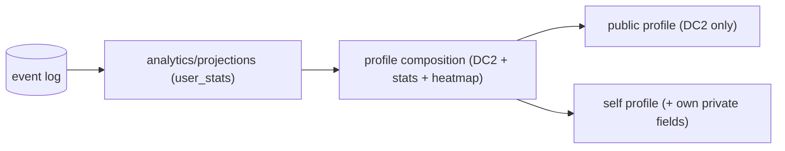
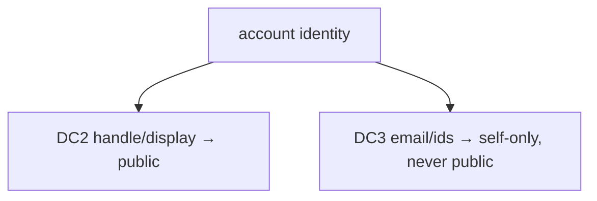

# Quad: Profiles

> **Derived-feature doc.** Profile stats are **derived projections**; identity policy here defers mechanics to `AUTHENTICATION.md`. Conforms to [`AUTHENTICATION.md`](AUTHENTICATION.md), [`ANALYTICS.md`](ANALYTICS.md), [`HEATMAPS.md`](HEATMAPS.md), [`LEADERBOARDS.md`](LEADERBOARDS.md), [`MODERATION.md`](MODERATION.md), [`MULTI_TENANCY.md`](MULTI_TENANCY.md), [`DATABASE.md`](DATABASE.md), [`API.md`](API.md), [`FRONTEND.md`](FRONTEND.md), [`PRODUCT.md`](PRODUCT.md), [`PRINCIPLES.md`](PRINCIPLES.md). Contradictions flagged in §10.
>
> No app code/schemas/versions. Tenant-neutral (Rutgers Quad = tenant #1).

## 1. Purpose & Scope
Each student has a per-tenant profile showing their contribution and impact (`P-FEAT-5`, `P-PROF-1…5`). **In scope:** public vs private/self data, handle policy, stats, heatmap link, privacy settings, moderation-state display, tenant scoping, API/frontend relationship. **Out of scope:** auth/session mechanics (`AUTHENTICATION.md`), stat derivation (`ANALYTICS.md`), heatmap derivation (`HEATMAPS.md`), ranking (`LEADERBOARDS.md`).

## 2. Responsibilities vs. Non-Responsibilities
| Profiles own | Don't own |
| --- | --- |
| Public/private profile composition + privacy settings | Identity/session mechanics (`AUTHENTICATION.md`) |
| Handle-display policy surface (`DC2` only public) | Stat/heatmap derivation (`ANALYTICS`/`HEATMAPS`) |
| Moderation-state display policy | Ranking math (`LEADERBOARDS.md`) |

## 3. Dependency References
`AUTHENTICATION.md` (§5 identity, §14 handle policy), `ANALYTICS.md` (stats), `HEATMAPS.md` (contribution heatmap), `LEADERBOARDS.md`, `MODERATION.md` (suspended/banned), `MULTI_TENANCY.md` (tenant scope), `DATABASE.md` (§7 `user_stats`), `API.md` (`/profiles/me`,`/profiles/{handle}`), `FRONTEND.md`.

## 4. Public Profile Data
Public handle/display identity (**`DC2`**); contribution stats (placements, retained pixels, streaks, per-term + lifetime); optional **contribution heatmap** (`HEATMAPS.md`); **badges** *(future, recognition-only, never placement power, `P-POST-3`, `NG-UNEQUAL-POWER`)*. **Never** the email or internal ids (`PROFILE-INV-2`).

## 5. Private / Self Profile Data
The owner sees: own settings/preferences, own membership/verification status, own report/moderation-status views (as appropriate). **Own email is visible to self only, never public** (`DC3`). No password (none exists).

## 6. Public Handle Policy
**`DC2` public, `DC3` never public** (`P-ATTR-4`, `AUTHENTICATION.md` §14). Whether the handle is a raw NetID, a derived handle, or a chosen display name, and whether it's changeable, is **open (`P-Q-1`)** and owned by product/`AUTHENTICATION.md`; this doc enforces only the `DC2`/`DC3` boundary.

## 7. Profile Stats
Placements · currently-retained pixels · longest-surviving pixel · current streak · favorite color · per-term contribution · lifetime participation · archive history (which terms the user took part in). All **derived** from analytics/projections (`PROFILE-INV-1`).

## 8. Heatmap & Privacy Settings
- **Contribution heatmap** is a per-user view derived by `HEATMAPS.md`, shown per profile privacy.
- **Privacy settings** (`P-PROF-4`): the user controls what is publicly visible (e.g., show stats/heatmap, leaderboard opt-out) within tenant policy; defaults favor minimal exposure.

## 9. Moderation Relationship · Tenant Isolation · API/Frontend
- **Moderation display:** suspended/banned state is shown per policy (e.g., a neutral "account restricted" rather than punitive shaming); identity moderation (handle abuse) handled via `MODERATION.md`. No public shame surface.
- **Tenant isolation:** a profile is **scoped to its tenant** (`TENANT-INV-5`); the same person may hold memberships across tenants in the future, but each profile is independent (no cross-tenant identity join exposed). 
- **API/Frontend:** `/profiles/me` + `/profiles/{handle}` (`API.md`); profile pages owned by `FRONTEND.md` (server-rendered shell + client widgets), `DC2`-only rendering (`FE-INV-5`).

## 10. Decisions Deferred
| Decision | Owner |
| --- | --- |
| Handle form + changeability + default visibility | `AUTHENTICATION.md`/product (`P-Q-1`) |
| Badge taxonomy (recognition-only) | post-MVP (`P-POST-3`) |
| Suspended/banned display wording | `MODERATION.md`/product |
| Cross-tenant identity linkage (future) | `MULTI_TENANCY.md`/`AUTHENTICATION.md` (`P-Q-7`) |

## 11. Privacy/Security · Failure Modes · Testing
- **Privacy/Security:** `DC2`-only public; `DC3` self-only; privacy settings honored; tenant-scoped.
- **Failure modes:** stat projection lag (show last good + freshness note), missing heatmap (degrade), privacy-setting race (default to less exposure).
- **Testing:** public shows `DC2` only / never `DC3`; privacy settings enforced; stats match projections; tenant isolation; moderation-state display policy; opt-out reflected on leaderboards.

## 12. Profile Invariants (`PROFILE-INV-*`)
- **`PROFILE-INV-1`** Profile stats are derived projections, never authoritative.
- **`PROFILE-INV-2`** Public profiles expose `DC2` only; `DC3` (email/ids) is never public (self-only).
- **`PROFILE-INV-3`** Privacy settings are honored; defaults favor minimal exposure.
- **`PROFILE-INV-4`** Profiles are tenant-scoped; no cross-tenant identity is exposed.
- **`PROFILE-INV-5`** Any future badges are recognition-only and never affect placement power.

## 13. Diagrams
### 13.1 Profile data flow

### 13.2 Public/private identity split

## 14. Document Control
- **Path:** `docs/PROFILES.md` · **Purpose:** public/private profile architecture.
- **Dependencies:** `AUTHENTICATION`, `ANALYTICS`, `HEATMAPS`, `LEADERBOARDS`, `MODERATION`, `MULTI_TENANCY`, `DATABASE`, `API`, `FRONTEND`. **Consumed by:** `LEADERBOARDS`, `HEATMAPS`, `FRONTEND`, `specs/*`.
- **Acceptance:** ☑ public/private split ☑ handle policy (`DC2`/`DC3`) ☑ stats derived ☑ heatmap link ☑ privacy settings ☑ moderation display ☑ tenant-scoped ☑ `PROFILE-INV-*` ☑ no `DC3` public / no code / no versions ☑ tenant-neutral.
- **Open questions:** §10. **Next:** `docs/HEATMAPS.md`.
