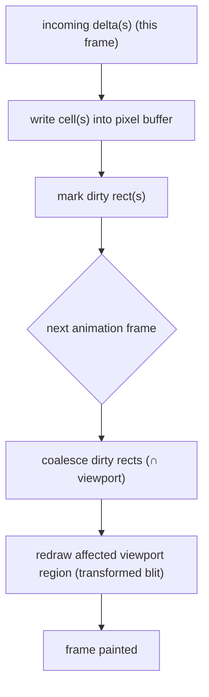
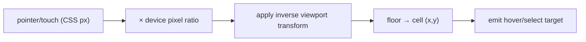

# Quad — Canvas Rendering Engine (`@quad/render`)

> **This document owns the high-performance canvas rendering engine: how the live pixel canvas is painted, panned, zoomed, and kept crisp; how it consumes the server snapshot + deltas; its internal state, dirty-region strategy, coordinate model, and performance constraints.** It conforms to [`PRODUCT.md`](PRODUCT.md), [`PRINCIPLES.md`](PRINCIPLES.md), [`FRONTEND.md`](FRONTEND.md), [`API.md`](API.md), [`WEBSOCKETS.md`](WEBSOCKETS.md), [`EVENT_SOURCING.md`](EVENT_SOURCING.md), [`DATABASE.md`](DATABASE.md), and [`COOLDOWN.md`](COOLDOWN.md); IDs cited (`P-*`, `PRIN-*`, `FE-INV-*`, `WS-INV-*`, `ES-INV-*`).
>
> **Altitude:** engine architecture. **No** engine/source/worker/shader files, packages, schemas, tests, or configs. Data structures are described **conceptually**. **No** versions (`TECH_BASELINE.md`). The formal rendering strategy is routed to **`ADR-0005`**.
>
> **Naming:** platform = **Quad**; **Rutgers Quad** = tenant #1 (example). The engine is tenant-neutral — it paints colors at coordinates and knows nothing about tenants.

---

## 1. Purpose & Scope

The canvas must feel **alive and instantaneous** on a phone and a laptop (`PRIN-ALIVE`, `PRIN-MOBILE-FIRST`, `P-CANVAS-1/7/8`). `@quad/render` is the dedicated engine that makes that real: a fast, imperative renderer that `apps/web` mounts and feeds, decoupled from React's render cycle.

**In scope:** rendering principles, the `@quad/render` package boundary, integration with `apps/web`, snapshot + delta consumption, internal state, rendering/dirty-region strategy, coordinate system, pan/zoom, emitted interaction events, accessibility hooks, performance (incl. mobile), replay/archive relationships, error/fallback, security, testing, invariants.

**Out of scope (owned elsewhere):** route/page/component architecture + accessible wrappers (`FRONTEND.md`), WS lifecycle/reconnect (`WEBSOCKETS.md`), snapshot endpoint contract (`API.md`), event semantics/ordering (`EVENT_SOURCING.md`), final-image export formats (`ARCHIVES.md`), replay player/timeline (`REPLAY.md`), the formal ADR (`ADR-0005`).

---

## 2. Responsibilities vs. Non-Responsibilities

| `@quad/render` **owns** | It does **not** own |
| --- | --- |
| Painting the canvas from a fed snapshot + deltas | Fetching data (no REST/WS I/O — `RENDER-INV-2`) |
| Pan/zoom, crisp scaling, dirty-region redraw | Reconnect/gap recovery (delegated to web/WS) |
| Internal pixel buffer + viewport transform | Business/fairness/auth/cooldown decisions (`RENDER-INV-1`) |
| Emitting interaction events (hover/select/viewport) | Building UI/modals/accessible wrappers (`FRONTEND.md`) |
| Hit-testing screen↔cell + render metrics | Snapshot encoding contract (`API.md`) / event order (`EVENT_SOURCING.md`) |

---

## 3. Core Rendering Principles

- **`R-DP-1` Fast initial paint** — once the snapshot arrives, the canvas paints quickly (`PRIN-ALIVE`).
- **`R-DP-2` Smooth pan/zoom** — fluid navigation incl. deep zoom (`P-CANVAS-8`).
- **`R-DP-3` Crisp pixels** — no blurry scaling at any zoom (nearest-neighbor; `P-CANVAS-8`, `RENDER-INV-6`).
- **`R-DP-4` Mobile-first touch** — pinch/drag/tap are first-class (`PRIN-MOBILE-FIRST`).
- **`R-DP-5` Server-authoritative** — the engine displays fed state; it never invents pixels (`RENDER-INV-3`, `FE-INV-3`).
- **`R-DP-6` No business logic in the renderer** — it paints; it decides nothing (`RENDER-INV-1`).

---

## 4. `@quad/render` Package Boundary

- **A pure rendering engine** — given a canvas surface + a data feed, it paints and reports interactions. Framework-agnostic core (mounted by React in `apps/web`).
- **No REST calls, no WebSocket ownership** — it never opens a socket or fetches; `apps/web` owns transport and feeds the engine (`RENDER-INV-2`).
- **No auth/cooldown/business decisions** — it has no concept of identity, fairness, or tenancy.
- **Consumes data fed by `apps/web`** — snapshot, deltas, view commands in; interaction events + metrics out.

---

## 5. Integration with `apps/web`

The `CanvasViewport` component (`FRONTEND.md` §5/§8) is the only mount point:

- **Mount/unmount** — `apps/web` creates the engine on a canvas surface and tears it down on unmount.
- **Snapshot feed** — the initial canvas state + sequence watermark (§6).
- **Delta feed** — a stream of applied changes from WS (§7).
- **View-state commands** — zoom-to, pan-to, set-selection, resize (from UI controls/gestures).
- **Emitted interaction events** — hover/inspect target, long-press target, selected cell, viewport changed, render metrics (§13).

```mermaid
flowchart LR
  subgraph WEB["apps/web (CanvasViewport)"]
    WS["WS client → deltas"]
    REST["REST snapshot"]
    UI["UI controls / gestures"]
  end
  subgraph ENG["@quad/render engine"]
    BUF["pixel buffer"]
    VT["viewport transform"]
    DRAW["frame renderer"]
  end
  REST -->|snapshot + watermark| ENG
  WS -->|deltas (seq)| ENG
  UI -->|view commands| ENG
  ENG -->|interaction events + metrics| WEB
```

---

## 6. Snapshot Consumption

- **Initial snapshot** — the engine initializes its pixel buffer from the snapshot fetched via `GET /canvas/current/snapshot` (`API.md`). Encoding (efficient/binary) is owned by `API.md`/implementation; the engine consumes whatever the agreed shape is.
- **Sequence watermark** — the snapshot carries the last applied per-canvas sequence; the engine records it as `lastAppliedSeq` to gate deltas (§7).
- **Palette/config dependency** — color indices map to actual colors via the tenant palette (fed from `@quad/config` through `apps/web`); the engine renders whatever palette it's given (`P-CANVAS-4`).
- **Large-snapshot considerations** — the snapshot may be large; it is delivered once over REST (not WS), decoded efficiently, and held in the buffer (§8). Re-fetched on reconnect (`WEBSOCKETS.md` §12), not streamed repeatedly.

---

## 7. Delta Consumption

The engine applies these fed change messages (semantics in `EVENT_SOURCING.md`; wire form in `WEBSOCKETS.md`):

| Delta | Effect on buffer |
| --- | --- |
| **`PixelPlaced`** | set one cell to a new color |
| **`PixelRolledBack`** | revert one cell to a restored color |
| **`RegionRolledBack`** | revert a set of cells |
| **`ArtworkRemoved`** | clear/replace a region (sanitized) |

- **Monotonic sequence guard** — apply a delta only if `seq > lastAppliedSeq`; ignore duplicates/stale (`RENDER-INV-4`, mirrors `WS-INV-4`/`ES-INV-4`).
- **Gap/reconnect behavior is delegated** — the engine does not chase missing messages; when `apps/web`/WS decides to re-snapshot, it re-initializes the engine from the fresh snapshot (`RENDER-INV-5`).

---

## 8. Internal State Model

| State | Description |
| --- | --- |
| **Canvas dimensions** | width × height in cells (from snapshot/canvas meta) |
| **Pixel buffer** | a compact 1-cell-per-unit store of current colors (e.g., an offscreen surface / typed-array of color indices) — the authoritative *local* copy of the projection |
| **Dirty regions** | accumulated changed areas to redraw this frame (§10) |
| **Viewport transform** | pan offset + zoom scale (+ device pixel ratio) (§11) |
| **Selection / hover target** | the currently selected/hovered cell (for highlight + emitted events) |
| **Palette lookup** | color-index → color value mapping (from config) |
| **`lastAppliedSeq`** | sequence watermark for the delta guard (§7) |

---

## 9. Rendering Strategy

- **2D Canvas baseline.** The MVP uses the 2D canvas context. The full canvas is kept in an **offscreen buffer at 1 px per cell**; each visible frame is a **single transformed blit** (offscreen → visible canvas) under the current pan/zoom — cheap even for large canvases.
- **Offscreen buffer** — single-pixel updates write one pixel into the offscreen buffer; the visible frame redraws from it. (`OffscreenCanvas`/worker offload is an optional enhancement, §16/`ADR-0005`.)
- **Dirty-region redraw** — only changed areas (and the viewport on pan/zoom) are redrawn; many deltas in a frame coalesce (§10).
- **Full-redraw fallback** — on resize, context loss, big zoom change, or uncertainty, redraw the whole viewport from the buffer.
- **Future WebGL path** — for extreme scale/performance, a GPU/WebGL renderer (canvas as a texture, GPU scaling) is the documented upgrade path; **2D is the baseline**, WebGL is `ADR-0005`'s decision.

---

## 10. Dirty-Region Model

- **Single pixel update** — write the cell into the buffer, mark a 1-cell dirty rect.
- **Region rollback/update** — mark the affected region dirty.
- **Viewport pan/zoom** — invalidates the visible area; redraw the viewport from the buffer (one transformed blit), not per-cell.
- **Batching/coalescing** — accumulate dirty rects and **render once per animation frame (`requestAnimationFrame`)**, not per delta — this is what keeps high-activity periods smooth and **decouples rendering from React** (`RENDER-INV-7`, `FE-INV-7`). Under floods, coalesce aggressively (merge rects / redraw viewport once).



---

## 11. Coordinate System

- **Canvas coordinates** — integer cell `(x, y)` in `[0,width) × [0,height)`; the authoritative grid space.
- **Screen/CSS coordinates** — pointer/touch positions in CSS pixels.
- **Backing-store pixels** — CSS pixels × **device pixel ratio (DPR)**; the canvas backing store is sized by DPR for crispness on retina/mobile.
- **Zoom transform** — `screen = translate(pan) · scale(zoom) · canvasCell` (with DPR factored in). The **inverse transform** maps a screen point back to a cell for **hit-testing** (hover/select/place).
- **Hit testing** — screen → inverse transform → floor to integer cell → emit as hover/select target.



---

## 12. Pan / Zoom Model

- **Desktop** — mouse drag to pan; wheel/trackpad to zoom toward the cursor.
- **Mobile** — one-finger drag to pan; pinch to zoom toward the gesture centroid (`P-USER-1`).
- **Min/max zoom** — min shows the whole canvas; max supports **deep zoom** to individual cells; clamped to sane bounds.
- **Snap/crispness** — at high zoom, **image smoothing is disabled** (nearest-neighbor) so cells render as crisp blocks, never blurry (`R-DP-3`, `P-CANVAS-8`); integer-aligned scaling where practical.
- **Deep zoom** — only visible cells are drawn (viewport culling), so extreme zoom stays cheap.

---

## 13. Interaction Events Emitted to React

The engine emits (it does **not** act on them — React builds the UI):

| Event | Use in `apps/web` |
| --- | --- |
| **Hover/inspect target** | coordinate readout + hover quick-look (`P-ATTR-2`) |
| **Touch long-press target** | touch inspect (hover alternative, `FRONTEND.md` §9) |
| **Selected cell** | placement confirm (deliberate 2-step, `FE-INV-8`) |
| **Viewport changed** | minimap/zoom indicator/coordinate context |
| **Render performance metrics** | fps/frame-time for perf monitoring (`§15`) |

The engine never opens modals, calls APIs, or places pixels — it reports; React decides (`RENDER-INV-1/2`).

---

## 14. Accessibility Relationship

- **The renderer is not the only accessible surface.** A pixel canvas is opaque to assistive tech, so **textual/keyboard equivalents are owned by `apps/web`** (`FRONTEND.md` §10).
- **The engine exposes hooks** the frontend needs: move/highlight a **focus cell**, read a cell's coordinate/color, and apply keyboard-driven viewport moves — so `apps/web` can build keyboard navigation and ARIA-live feedback on top.
- The engine renders a visible focus indicator for the focused cell.

---

## 15. Performance Responsibilities

The engine owns the client-side rendering budget (numbers in `PERFORMANCE.md`):

- **Frame budget** — target ~60 fps during interaction; degrade gracefully (e.g., 30 fps) on weak devices rather than stutter.
- **Initial paint** — paint fast after the snapshot decodes (`R-DP-1`).
- **Update latency** — an applied delta becomes visible within the next frame.
- **Memory budget** — the pixel buffer is bounded by canvas size; large canvases get an explicit budget and a degradation plan (§16).
- **Batching** — coalesce deltas per frame (§10).
- **No React re-render per pixel** — rendering is imperative and rAF-driven, fully decoupled from React (`RENDER-INV-7`).

---

## 16. Mobile Performance

- **Touch latency** — gestures feel immediate; input handled on the engine side, not via heavy React state churn.
- **Low-end devices** — cap effective quality/fps; prefer the cheap blit path; avoid large per-frame allocations.
- **Memory pressure** — bound the buffer; for very large canvases, a **tiled buffer** (render only visible/nearby tiles) is the documented scale strategy (`ADR-0005`), preventing OOM (`RENDER-INV-10`).
- **Battery/CPU** — render only on change (idle when static), throttle under background/inactive tabs, and avoid busy loops.

---

## 17. Replay Rendering Relationship

- **Same engine, same feed interface** — replay feeds the engine snapshots (at scrub points) and ordered deltas (between them); the engine paints them exactly as live (`RENDER-INV-9`).
- **The replay player/timeline is owned by `REPLAY.md`** — play/pause/scrub/speed/jump live there; the engine stays **timeline-agnostic** (it just renders what it's fed).
- Replay deltas are the same delta types (§7), applied under the same monotonic guard.

---

## 18. Archive / Final-Image Relationship

- **Live renderer vs export renderer** — the live engine paints the interactive canvas; the **final downloadable image** is a separate artifact whose generation is owned by `ARCHIVES.md` (typically produced **server-side** from the projection/event log for full resolution, not from the live client).
- The engine *could* render an export of its current buffer, but the canonical archive pipeline (format, full-res, storage) is `ARCHIVES.md`'s.

---

## 19. Error / Fallback Behavior

| Failure | Handling |
| --- | --- |
| **Invalid/corrupt snapshot** | reject + signal `apps/web` to re-fetch; don't paint garbage |
| **Unsupported canvas size** | guard against oversize; apply tiling/limits (`§16`) or surface an error to web |
| **Rendering context loss** | re-acquire the canvas context and **full-redraw from the buffer** (or re-snapshot if buffer is lost) (`RENDER-INV-11`) |
| **Out of memory** | shrink/tier buffers, reduce quality, degrade gracefully — never crash silently |
| **Corrupted delta** | validate at the boundary; drop the bad delta and let `apps/web` decide to re-snapshot |

---

## 20. Security & Privacy Considerations

- **The renderer handles pixels, not identity** — it receives colors + coordinates only; **no `DC3`** ever reaches it (`RENDER-INV-8`). Attribution (`DC2`) is shown by React panels, not drawn into the canvas.
- **No HTML injection** — the engine draws to a canvas (pixels), not the DOM; any text the engine draws (if ever) is non-HTML. User-controlled identity/text is rendered by React with proper escaping (`FRONTEND.md` §16).
- **Untrusted input validation at the boundary** — snapshot/deltas are validated (size, bounds, palette range) before being applied; out-of-bounds coordinates/colors are rejected.

---

## 21. Testing Expectations

(Strategy → `TESTING.md`. The **rendering-seam** contract is also tested from `apps/web` per `FRONTEND.md` §17.)

- **Snapshot rendering** — a snapshot paints the correct buffer/output.
- **Delta application** — each delta type mutates the buffer correctly.
- **Dirty-region** — only changed areas redraw; coalescing works.
- **Coordinate transform** — screen↔cell round-trips correctly across zoom/DPR.
- **Zoom/pan** — bounds, crispness (no smoothing), deep zoom culling.
- **Mobile gestures** — pinch/drag/tap map to correct transforms/targets.
- **Monotonic sequence guard** — duplicate/stale deltas are ignored; final state correct.
- **Performance regression** — frame-time/throughput budgets enforced on representative inputs.
- **Context-loss/fallback** — recovery via re-acquire + full redraw.

---

## 22. Rendering Invariants (`RENDER-INV-*`)

- **`RENDER-INV-1`** The renderer contains no business logic and makes no fairness/security/auth/cooldown decisions.
- **`RENDER-INV-2`** The renderer performs no REST/WS I/O; it consumes data fed by `apps/web`.
- **`RENDER-INV-3`** Server state is authoritative; the renderer displays fed snapshot + deltas and never invents pixels.
- **`RENDER-INV-4`** Deltas apply under a monotonic per-canvas sequence guard; duplicates/stale are ignored.
- **`RENDER-INV-5`** Gap/reconnect recovery is not the renderer's job; it re-initializes from a fed snapshot when told.
- **`RENDER-INV-6`** Pixels render crisp (no interpolation/blur) at all zoom levels.
- **`RENDER-INV-7`** Rendering is decoupled from React; many deltas coalesce into one rAF frame; no per-pixel React render.
- **`RENDER-INV-8`** No `DC3` enters the renderer; it handles colors and coordinates only.
- **`RENDER-INV-9`** The renderer is timeline-agnostic — it renders live or replay through the same feed interface.
- **`RENDER-INV-10`** Memory is bounded by an explicit buffer budget; oversized canvases degrade gracefully, never crash silently.
- **`RENDER-INV-11`** On context loss, the renderer recovers by re-acquiring context and redrawing from the buffer/snapshot.

---

## 23. Diagrams

- **`apps/web` ↔ `@quad/render` integration** — §5.
- **Snapshot + delta rendering flow** — §10 (buffer write → coalesce → rAF blit).
- **Dirty-region redraw flow** — §10.
- **Coordinate transform / hit-test flow** — §11.

---

## 24. Decisions Deferred to Deeper Docs / ADRs

| Open decision | Owner |
| --- | --- |
| **Formal rendering strategy** (2D baseline confirm; WebGL upgrade trigger; OffscreenCanvas/worker; tiling) | **`ADR-0005`** |
| Snapshot encoding (binary/efficient) the engine consumes | `API.md` / implementation |
| Exact frame/latency/memory budgets | `PERFORMANCE.md` |
| Default + max canvas dimensions per tenant (`P-Q-3`) | product / `MULTI_TENANCY.md` config |
| Final-image export pipeline/format | `ARCHIVES.md` |
| Replay player/timeline | `REPLAY.md` |
| Tiled-buffer threshold for very large canvases | `ADR-0005` / `PERFORMANCE.md` |

---

## 25. Document Control

- **Path:** `docs/RENDERING.md`
- **Purpose:** Define the `@quad/render` canvas engine — snapshot/delta consumption, dirty-region rendering, pan/zoom, coordinate model, and performance constraints — that `apps/web` mounts and feeds.
- **Dependencies:** `FRONTEND.md` (mount/seam), `API.md` (snapshot), `WEBSOCKETS.md` (deltas), `EVENT_SOURCING.md` (delta semantics/order), `DATABASE.md`, `COOLDOWN.md`, `PRODUCT.md`, `PRINCIPLES.md`. **Consumed by:** `REPLAY.md` (same engine), `ARCHIVES.md` (export relationship), `PERFORMANCE.md`, `specs/rendering`, `ADR-0005`.
- **Acceptance checklist:** ☑ all 25 parts present ☑ engine altitude (no engine/source/worker/shader files) ☑ principles (fast paint, smooth/crisp, mobile-first, server-authoritative, no logic) ☑ package boundary (no REST/WS I/O; fed by web) ☑ snapshot + delta consumption (watermark + monotonic guard; gap → web) ☑ internal state model ☑ rendering strategy (2D baseline + offscreen buffer; WebGL future) ☑ dirty-region + rAF coalescing (decoupled from React) ☑ coordinate system (DPR, hit-test) ☑ pan/zoom (crisp, deep zoom) ☑ emitted interaction events ☑ accessibility hooks (web owns wrappers) ☑ performance + mobile ☑ replay/archive relationships ☑ error/fallback (context loss) ☑ security (no `DC3`, no HTML injection) ☑ `RENDER-INV-1…11` ☑ 4 Mermaid diagrams ☑ versions referenced not declared ☑ tenant-neutral ☑ no app code/files.
- **Open questions:** see §24 (`ADR-0005`, snapshot encoding, canvas dimensions, tiling threshold).
- **Next recommended:** `docs/MODERATION.md` (moderation tools, permission ladder, rollback/audit internals — the last solo core-architecture doc).
