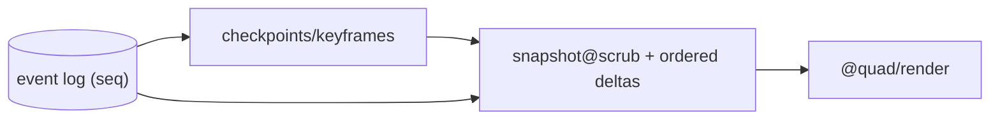
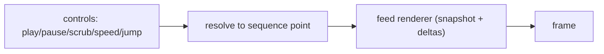
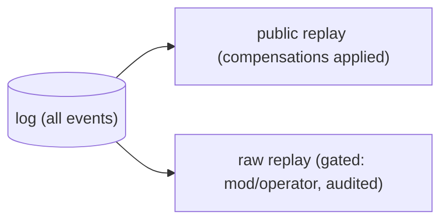

# Quad — Replay

> **Derived-feature doc.** Replay is *derived from* the event log and projections; it does **not** define event semantics, ordering, storage, rendering internals, or moderation rules — it consumes them. Conforms to [`EVENT_SOURCING.md`](EVENT_SOURCING.md), [`RENDERING.md`](RENDERING.md), [`MODERATION.md`](MODERATION.md), [`ARCHIVES.md`](ARCHIVES.md), [`API.md`](API.md), [`WEBSOCKETS.md`](WEBSOCKETS.md), [`DATABASE.md`](DATABASE.md), [`PRODUCT.md`](PRODUCT.md), [`PRINCIPLES.md`](PRINCIPLES.md). Contradictions with a core doc are flagged in §10, never silently fixed here.
>
> No app code/schemas/versions. Tenant-neutral (Rutgers Quad = tenant #1).

## 1. Purpose & Scope
Replay lets anyone watch a canvas unfold from blank to final artwork, scrub a timeline, and replay a single pixel's story (`P-FEAT-9`, `P-REPLAY-1…5`, `P-ATTR-6`). **In scope:** replay sources, modes, controls, ordering, moderation-aware playback, renderer relationship, archive relationship, performance, failure modes. **Out of scope:** event meaning/order (`EVENT_SOURCING.md`), renderer internals (`RENDERING.md`), archive artifacts (`ARCHIVES.md`), moderation rules (`MODERATION.md`).

## 2. Responsibilities vs. Non-Responsibilities
| Replay owns | Replay does not own |
| --- | --- |
| Replay UX (controls/timeline) + derivation behavior | Event ordering/semantics (`EVENT_SOURCING.md`) |
| Sanitized-vs-raw playback policy surface | The renderer (`RENDERING.md`) — it only feeds it |
| Replay asset/metadata expectations | Archive artifact formats (`ARCHIVES.md`) |

## 3. Dependency References
`EVENT_SOURCING.md` (§10 ordering, §14 rebuild, §15 derivation), `RENDERING.md` (§17 same engine), `MODERATION.md` (§15 sanitized), `ARCHIVES.md`, `API.md` (`/archives/{term}/replay`), `WEBSOCKETS.md` (live), `DATABASE.md` (log/checkpoints).

## 4. Data Sources / Projections Used
- **Event log** — the authoritative ordered source (per-canvas sequence).
- **Projection checkpoints/snapshots** — optional keyframes for fast scrubbing (`EVENT_SOURCING.md` §14).
- **Archived replay assets** — precomputed artifacts for archived terms (`ARCHIVES.md`).
Replay derives from these; it is **never** a source of truth.

## 5. Replay Modes
- **Full-term replay** — empty → final, applying events in sequence.
- **Per-pixel replay** — one `(x,y)` cell's color history.
- **Region replay** — a bounded area over time.
- **User/profile contribution replay** *(if allowed by profile privacy)* — a user's own placements over time (`PROFILES.md`; never exposes others' `DC3`).

## 6. Replay Controls
Play · pause · scrub (timeline) · variable speed · jump to timestamp/**sequence** (`P-REPLAY-2`). The scrubber maps UI position to a sequence point.

## 7. Sequence-Based Ordering
**The per-canvas sequence is the authoritative replay order** (`ES-INV-4`); timestamps are **display only**. Jump-to-time resolves to the nearest sequence. This guarantees deterministic, reproducible replays (`REPLAY-INV-2`).

## 8. Moderation-Aware Replay (sanitized public default)
- **Public replay applies compensating events** → removed/rolled-back content **stays removed**; it is never re-exposed publicly (`MODERATION.md` §15, `EVENT_SOURCING.md` §15, `REPLAY-INV-3`).
- **Raw, pre-compensation replay is access-gated** to authorized moderators/operators for investigation (`B3`/`B5`), audited.

## 9. Relationship to `@quad/render`, Archives, API/WS/Frontend
- **Renderer:** replay feeds the **same `@quad/render` feed interface** (snapshot at a scrub point + ordered deltas); the renderer stays timeline-agnostic (`RENDER-INV-9`).
- **Archives:** for archived terms, replay uses precomputed metadata/assets (`ARCHIVES.md`); always reproducible from the log.
- **API/WS/Frontend:** `GET /archives/{term}/replay` returns `ReplayMetaResponse` (`API.md`); the replay player is owned by `FRONTEND.md`; live "replay-from-now" simply continues the WS delta stream.

## 10. Performance Strategy
**Checkpoints/keyframes** (jump without replaying from zero), **chunking** (load event ranges on demand), **precomputed replay assets** for archived terms, and viewport-culled rendering (`RENDERING.md`). Budgets owned by `PERFORMANCE.md`.

## 11. Privacy & Security
Sanitized public default (§8); **no `DC3`** in any replay output (attribution is `DC2` only); raw history gated + audited; user-contribution replay honors profile privacy.

## 12. Failure Modes
| Failure | Handling |
| --- | --- |
| Replay/projection mismatch | log is truth; rebuild (`EVENT_SOURCING.md` §14) |
| Missing chunk/asset | re-derive from log; degrade gracefully |
| Post-archive correction | use corrected artifact; original retained under audit (`ARCHIVES.md`) |
| Corrupt event | validate; skip/flag; integrity per `EVENT_SOURCING.md` §19 |

## 13. Testing Expectations
Determinism (same inputs → same replay) · sanitized-vs-raw access · per-pixel/region correctness · jump-to-sequence accuracy · checkpoint correctness · no-`DC3` · renderer-feed contract.

## 14. Replay Invariants (`REPLAY-INV-*`)
- **`REPLAY-INV-1`** Replay is derived from the log/projections; never a source of truth.
- **`REPLAY-INV-2`** Replay order is the per-canvas sequence; timestamps are display-only; replays are deterministic.
- **`REPLAY-INV-3`** Public replay is sanitized (compensations applied); removed content is never re-exposed; raw replay is gated + audited.
- **`REPLAY-INV-4`** Replay feeds the same `@quad/render` interface; the renderer stays timeline-agnostic.
- **`REPLAY-INV-5`** No `DC3` in any replay output.

## 15. Decisions Deferred
| Decision | Owner |
| --- | --- |
| Checkpoint cadence/format | `EVENT_SOURCING.md`/`PERFORMANCE.md`/impl |
| Precomputed asset format | `ARCHIVES.md` |
| Moderator-only "as-it-happened" replay exposure | `MODERATION.md`/`REPLAY` UI |
| User-contribution replay default visibility | `PROFILES.md` (`P-Q-1`) |

## 16. Diagrams
### 16.1 Replay derivation

### 16.2 Replay playback

### 16.3 Sanitized vs raw access

## 17. Document Control
- **Path:** `docs/REPLAY.md` · **Purpose:** replay experience + derivation behavior.
- **Dependencies:** `EVENT_SOURCING`, `RENDERING`, `MODERATION`, `ARCHIVES`, `API`, `WEBSOCKETS`, `DATABASE`. **Consumed by:** `FRONTEND`, `ARCHIVES`, `specs/*`.
- **Acceptance:** ☑ all parts ☑ sanitized-public/gated-raw ☑ sequence-authoritative ☑ same renderer feed ☑ derived-not-truth ☑ no `DC3` ☑ tenant-neutral ☑ no code/versions.
- **Open questions:** §15. **Next:** `docs/ARCHIVES.md`.
