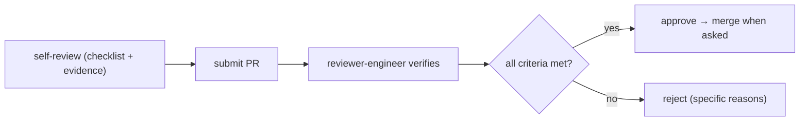
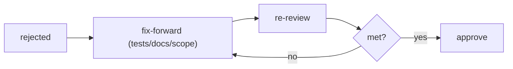

# Quad — PR Review Process

> **Engineering-process doc.** Owns the formal PR review protocol, evidence, rejection reasons, and merge readiness. Conforms to `ENGINEERING_WORKFLOW.md`, `MILESTONES.md`, `TESTING.md`, `CODE_QUALITY.md`. Does not rewrite contracts; contradictions → unresolved risks. No code/templates (the PR-review template is Phase 4 `templates/pr-review.md`); no versions; tenant-neutral (Rutgers Quad = tenant #1).

## 1. Purpose & Scope
Review is the gate that keeps every merge spec-linked, tested, documented, and drift-free. **In scope:** review principles, the PR checklist, required evidence, rejection reasons, reviewer/self-review roles, approval + merge criteria, follow-up handling. **Out of scope:** the workflow itself (`ENGINEERING_WORKFLOW.md`), test detail (`TESTING.md`), standards (`CODE_QUALITY.md`), the concrete template (Phase 4).

## 2. Responsibilities vs. Non-Responsibilities
| Review owns | Doesn't own |
| --- | --- |
| PR checklist + evidence + rejection reasons + merge criteria | Workflow phases (`ENGINEERING_WORKFLOW.md`) |
| Reviewer/self-review roles | Test matrix (`TESTING.md`) / standards (`CODE_QUALITY.md`) |

## 3. Principles
- **`R-DP-1` Evidence over claims** — verification means commands + results, not assertions (`PROC-INV-4`).
- **`R-DP-2` Docs/specs updated with contract changes** — same PR (`PROC-INV-2`).
- **`R-DP-3` Tests green** — required tests pass (`TESTING.md`).
- **`R-DP-4` Small scoped PRs** — one milestone; size caps (`ENGINEERING_WORKFLOW.md` §17).
- **`R-DP-5` A reviewer can reject for missing docs or tests alone.**

## 4. PR Review Checklist
- [ ] **Milestone/spec linked** (which `M<NN>` + spec).
- [ ] **Scope correct** — one milestone; no unrelated rewrites; within size caps.
- [ ] **Contracts touched listed** (API/WS/event/DB/`@quad/core`).
- [ ] **Docs/specs updated** for any contract/behavior change (same PR).
- [ ] **Tests present** for the change + touched critical subsystems (`TESTING.md` matrix).
- [ ] **Tests run with results** included in the summary.
- [ ] **Security/performance impacts considered** (`SECURITY.md`/`PERFORMANCE.md`; gates where relevant).
- [ ] **Tenant neutrality preserved** (no hardcoded tenant; config-driven).
- [ ] **No forbidden patterns** (`CODE_QUALITY.md` §5) / fitness checks pass.

## 5. Required Evidence in PR Summary
Files changed · milestone/spec link · contracts touched · **test commands + results** · security/perf notes · doc/spec diffs (for contract changes) · risks · follow-ups. **No hidden background work; no fabricated results** (`PROC-INV-10/11`).

## 6. Rejection Reasons
Missing/failing tests · missing or contradicted docs/specs · architecture drift (any `CODE_QUALITY.md` §5 / fitness violation) · scope creep / oversized PR · contract change without ADR (where required) · unverifiable claims (no evidence) · tenant hardcoding · security/perf regression. **Any single one is sufficient to reject.**

## 7. Reviewer-Engineer Responsibilities
The reviewer (`process/review-guidelines.md`, Phase 4) independently verifies the §4 checklist, re-runs/inspects evidence, checks invariants across the touched subsystems, and rejects with specific, actionable reasons. The reviewer is **independent** of the implementing engineer.

## 8. Self-Review Responsibilities
Before requesting review, the author completes the §4 checklist, runs the full verification set (`ENGINEERING_WORKFLOW.md` §9), and writes the §5 summary. A PR that fails self-review is not submitted.

## 9. Approval Criteria
All §4 items satisfied · required tests green with evidence · docs/specs updated · no open rejection reasons · invariants upheld.

## 10. Merge Criteria
Approved + CI green (`TESTING.md` §11) + checkpoint context respected (if at a gate boundary, the gate is considered, `CHECKPOINTS.md`). **No `git commit`/merge unless explicitly asked** by the owner (`PROC-INV-12`); never merge straight to the default branch.

## 11. Handling Follow-Up Work
Out-of-scope discoveries become **new milestones/issues**, not scope creep in the current PR. Known follow-ups are listed in the PR summary and tracked; a PR is not held hostage to unrelated work, nor merged with its own required work deferred.

## 12. Relationship to Other Docs
`ENGINEERING_WORKFLOW.md` (review model §14) · `MILESTONES.md` (one milestone per PR) · `TESTING.md` (merge-blocking tests) · `CODE_QUALITY.md` (forbidden patterns/fitness). The concrete checklist artifact is `templates/pr-review.md` (Phase 4).

## 13. Review Invariants (`REVIEW-INV-*`)
- **`REVIEW-INV-1`** No merge without the completed checklist + green required tests + evidence.
- **`REVIEW-INV-2`** Contract/behavior changes merge only with same-PR doc/spec updates.
- **`REVIEW-INV-3`** Missing tests or missing docs are each sufficient grounds to reject.
- **`REVIEW-INV-4`** Review is independent (reviewer ≠ implementer) and reasons are specific/actionable.
- **`REVIEW-INV-5`** PRs are one-milestone, scoped, within size caps; follow-ups become new milestones.
- **`REVIEW-INV-6`** No merge/commit unless explicitly asked; never directly to the default branch.

## 14. Diagrams

## 15. Document Control
- **Path:** `docs/REVIEW_PROCESS.md` · **Purpose:** formal PR review protocol, evidence, rejection reasons, merge readiness.
- **Dependencies:** `ENGINEERING_WORKFLOW`, `MILESTONES`, `TESTING`, `CODE_QUALITY`, `CHECKPOINTS`, `SECURITY`, `PERFORMANCE`. **Consumed by:** every implementation PR, `templates/pr-review.md` (Phase 4), `process/review-guidelines.md` (Phase 4).
- **Acceptance:** ☑ principles ☑ PR checklist ☑ required evidence ☑ rejection reasons ☑ reviewer + self-review roles ☑ approval + merge criteria (no commit unless asked) ☑ follow-up handling ☑ relationships ☑ `REVIEW-INV-*` ☑ 2 diagrams ☑ no code/templates/versions ☑ tenant-neutral.
- **Next:** **Phase 3 checkpoint**.
