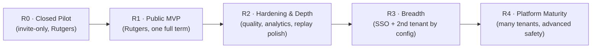

# Quad: Product Roadmap

> **This is a product-level roadmap: the order in which user-facing capability becomes real.** It describes *what the product can do for people* at each stage and the product readiness to move between stages.
>
> **This is not an engineering plan.** Sprints, PRs, file-level tasks, and build sequencing live in [`docs/MILESTONES.md`](MILESTONES.md) (generated later). If you're looking for "which package to build first," this is the wrong document.
>
> **Naming:** Quad = platform; **Rutgers Quad** = tenant #1 / first deployment. Scope IDs reference [`PRODUCT.md`](PRODUCT.md) (`P-FEAT-*`, `P-POST-*`).

---

## Shape of the roadmap

Quad grows along two independent axes:

- **Depth**: how complete the experience is for a single tenant (canvas → attribution → profiles/leaderboards → archive/replay → moderation maturity).
- **Breadth**: how many tenants and how rich the platform (Rutgers only → SSO → second university → many).

We deliberately go **deep before broad**: prove a premium, fair, safe single-tenant experience on **Rutgers Quad** before expanding to other universities. Each stage is gated by *product readiness*, not by a calendar.

> Term anchoring is illustrative, not a commitment: the first full public term targets a **Fall semester** at Rutgers Quad. Actual dates and go/no-go are owned by [`LAUNCH_PLAN.md`](LAUNCH_PLAN.md).

---

## R0: Closed Pilot *(prove the core loop is fair, alive, and safe)*

**Product goal.** A small, invited group of verified Rutgers students can experience the heartbeat of Quad: place a pixel, see everyone's pixels live, feel the global cooldown, and explore who placed what.

**User-facing capabilities.**
- Verified sign-in for the pilot group (`P-JOURNEY-1`).
- Live canvas with smooth zoom/pan and real-time updates (`P-FEAT-1`).
- Pixel placement with palette selection (`P-FEAT-2`).
- Global dynamic cooldown with a visible countdown (`P-FEAT-3`).
- Basic attribution: hover quick-look + click-through history (`P-FEAT-4`).
- Minimal moderation safety net (manual rollback + audit) so the pilot can't go badly wrong (`P-FEAT-10`, subset).

**Product readiness to exit R0 → R1.**
- The core loop *feels* instantaneous and fair to pilot users (qualitative + the latency/fairness intent behind `P-AC-2`, `P-AC-3`).
- Cooldown observed to move with activity and stay within 5–20 min without oscillation (`P-AC-4`).
- No pilot-blocking safety gaps; rollback + audit proven on real misuse.

---

## R1: Public MVP *(one campus, one full term, end to end)*

**Product goal.** Rutgers Quad runs a complete term for the whole eligible student body, from blank canvas to frozen, archived final artwork, delivering the full MVP promise in `PRODUCT.md` §17.

**User-facing capabilities (adds to R0).**
- Open verification for all eligible Rutgers students (`P-AC-1`).
- Profiles with term + lifetime stats and contribution heatmap (`P-FEAT-5`).
- Leaderboards across core categories (`P-FEAT-6`).
- Full attribution incl. per-pixel replay (`P-ATTR-5`, `P-ATTR-6`).
- Reporting + the moderation essentials with mandatory audit log (`P-FEAT-10`, full MVP set).
- Semester lifecycle through **freeze → archive → final image → term stats** (`P-FEAT-8`).
- Term replay with play/pause/scrub/speed/jump (`P-FEAT-9`).
- Baseline analytics/heatmaps sufficient for archive stats (`P-FEAT-7`).
- Multi-tenant foundation present (everything tenant-config-driven) even with only Rutgers live (`P-FEAT-11`).

**Product readiness to exit R1 → R2.**
- A full term completed and archived; the archive + replay are faithful and permanently browsable (`P-AC-8`, `P-AC-9`).
- Moderation demonstrably reversible + audited in production (`P-AC-10`).
- Mobile + desktop flows validated at real scale (`P-AC-11`).
- All MVP acceptance criteria (`P-AC-1`…`P-AC-13`) met.

---

## R2: Hardening & Depth *(make the single-tenant experience excellent)*

**Product goal.** Turn a working MVP into a polished, trustworthy product: deeper insight, smoother sharing, and a safety/operations posture that can survive a contentious term.

**User-facing capabilities.**
- Richer heatmaps & analytics: most-contested areas, hourly activity, color trends, contribution density (`P-POST-4`).
- Replay **export** and richer sharing of moments (`P-POST-5`, building on `P-REPLAY-5`).
- Profile **badges/achievements**: purely recognitional, never affecting placement power (`P-POST-3`; constrained by `NG-UNEQUAL-POWER`).
- Expanded leaderboard windows/categories (`P-POST-7`).
- Accessibility enhancements beyond the MVP baseline (`P-POST-8`).
- Stronger anti-abuse experience (clearer challenges/feedback) at the product surface (`P-POST-6`).

**Product readiness to exit R2 → R3.**
- The single-tenant experience is "premium" by the quality bar; abuse is well-controlled across a real term.
- Archive/replay/analytics are something the community is proud to revisit.

---

## R3: Breadth *(prove "Rutgers is just tenant #1")*

**Product goal.** Onboard a **second university** purely by configuration, with official campus identity sign-in, demonstrating the platform thesis.

**User-facing capabilities.**
- Official campus **SSO/CAS** as a tenant-configurable sign-in method (`P-POST-1`).
- A second tenant fully live and isolated, created via configuration (`P-POST-2`, `P-ADMIN-8`), honoring `PRIN-ISOLATION`.
- Per-tenant branding/theme/palette/term schedule in operators' hands (`P-ADMIN-1`…`P-ADMIN-5`).

**Product readiness to exit R3 → R4.**
- Two tenants run concurrent terms with zero cross-tenant leakage (`P-AC-13`).
- Onboarding a tenant is a documented configuration exercise, no code changes (`P-AC-12`).

---

## R4: Platform Maturity *(many campuses, durable safety & operations)*

**Product goal.** Quad operates as a multi-campus platform with the safety, analytics, and operational depth to run many simultaneous terms.

**User-facing & operator capabilities.**
- Multiple tenants onboarded on a repeatable cadence.
- Advanced abuse detection (behavioral/bot scoring, challenges) matured (`P-POST-6`).
- Optional **opt-in cross-tenant showcases**: celebration, **not** competitive ranking, and never breaking isolation (`P-POST-7`).
- Tenant-configurable term cadence (quarters/trimesters) if a non-semester tenant onboards (`P-POST-9`, resolves `P-Q-4`).

**Steady state.** New tenants and terms become routine; the product's job is to stay fair, alive, safe, and permanent at scale.

---

## What this roadmap deliberately omits

- **Dates/commitments** beyond illustrative term anchoring, owned by `LAUNCH_PLAN.md`.
- **Engineering sequencing** (which subsystem/PR first), owned by `MILESTONES.md`.
- **Any capability that violates a principle or non-goal**: even if "popular," it is not on the roadmap (see `NON_GOALS.md`).

---

## Document control

- **Path:** `docs/ROADMAP.md`
- **Purpose:** Product-level staging of user-facing capability (deep-before-broad), with product readiness gates between stages.
- **Dependencies:** `docs/PRODUCT.md` (`P-FEAT-*`, `P-POST-*`, `P-AC-*`), `docs/PRINCIPLES.md`, `docs/NON_GOALS.md`. **Feeds:** `LAUNCH_PLAN.md` (readiness/go-no-go), and later `MILESTONES.md` (engineering sequencing).
- **Acceptance checklist:** ☑ product-level only (no engineering milestones) ☑ stages with goals + capabilities + readiness gates ☑ deep-before-broad thesis explicit ☑ `P-*` IDs cited ☑ no versions/architecture ☑ tenant-neutral (Rutgers = tenant #1) ☑ explicitly defers dates to LAUNCH_PLAN and sequencing to MILESTONES.
- **Open questions:** first-term timing (→ `LAUNCH_PLAN.md`); term-cadence generalization (`P-Q-4`); cross-tenant showcase scope (post-MVP).
- **Next recommended:** `docs/LAUNCH_PLAN.md` (this batch).
