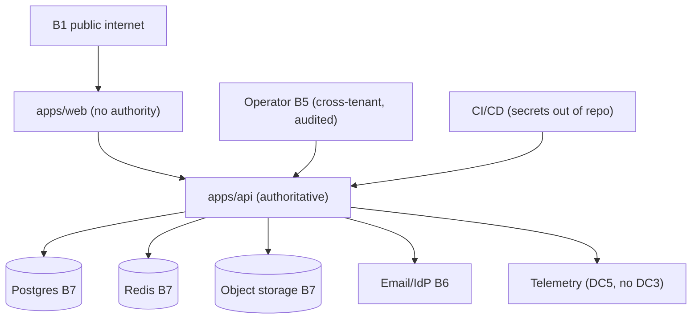
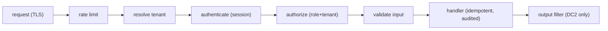
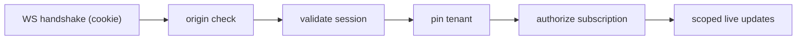
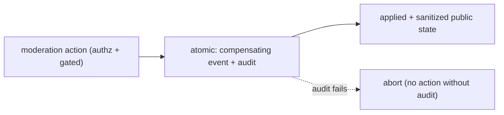
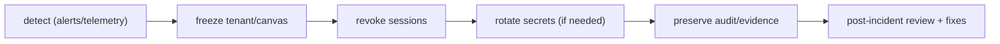

# Quad — Security, Threat Model & Mitigations

> **This document owns Quad's security posture: the threat model across every surface, the data-protection model, the mitigation architecture, the required controls/tests, and the incident-response + launch-gate expectations.** It **synthesizes** the trust boundaries (`B1…B7`) and data classes (`DC1…DC5`) from [`SYSTEM_CONTEXT.md`](SYSTEM_CONTEXT.md) and the invariants from every Phase 1–2 doc; it does **not** rewrite their contracts.
>
> Conforms to all completed docs (`PRODUCT`, `PRINCIPLES`, `NON_GOALS`, `SYSTEM_CONTEXT`, `ARCHITECTURE`, `BACKEND`, `DATABASE`, `EVENT_SOURCING`, `API`, `WEBSOCKETS`, `AUTHENTICATION`, `MULTI_TENANCY`, `COOLDOWN`, `RENDERING`, `MODERATION`, `REPLAY`, `ARCHIVES`, `ANALYTICS`, `LEADERBOARDS`, `PROFILES`, `HEATMAPS`).
>
> **Altitude:** threat model + mitigation architecture + required tests. **No** code/middleware/config/secrets/deploy files. **No** versions (`TECH_BASELINE.md`). Tenant-neutral (Rutgers Quad = tenant #1). Specific strategy choices route to ADRs; concrete infra to `DEPLOYMENT.md`; the overall test strategy to `TESTING.md`.

---

## 1. Purpose & Scope

Quad holds verified-student identity, an immutable history, and a fairness guarantee — all of which are attack-worthy. This document is the **single place the system is threat-modeled end to end**, so mitigations are explicit, owned, and testable rather than assumed.

**In scope:** security principles, trust boundaries, data classes, threat model by surface, the consolidated mitigation matrix, required controls, logging/secrets posture, security testing, incident response, launch gates, invariants. **Out of scope:** implementation of controls, the overall test strategy (`TESTING.md`), concrete infra/secrets manager (`DEPLOYMENT.md`), and contract definitions (owned by their docs).

---

## 2. Responsibilities vs. Non-Responsibilities

| Security **owns** | It does **not** own |
| --- | --- |
| The threat model + mitigation architecture across surfaces | Contract definitions (API/WS/auth/tenant/DB/etc.) |
| Required security controls + required security tests | The overall test strategy/tooling (`TESTING.md`) |
| Data-protection model (`DC*`) + logging/secrets posture | Concrete secrets manager/infra (`DEPLOYMENT.md`) |
| Incident response + launch security gates | Formal strategy choices (ADRs) |

---

## 3. Security Principles

- **`SEC-DP-1` Server-authoritative state** — clients never decide fairness/validity/identity (`SEC-INV-1`).
- **`SEC-DP-2` No anonymous writes** — every write authenticated + authorized + tenant-scoped (`PRIN-NO-ANON`).
- **`SEC-DP-3` Tenant isolation** — enforced on every path; cross-tenant → `404`; no default tenant (`PRIN-ISOLATION`).
- **`SEC-DP-4` Least privilege** — minimal roles; elevated/operator actions audited.
- **`SEC-DP-5` No public `DC3`** — only `DC2` is ever public.
- **`SEC-DP-6` Auditability** — every consequential action is recorded (`DC4`, append-only).
- **`SEC-DP-7` No hard deletion** — append-only log; integrity verifiable (`PRIN-PERMANENCE`).
- **`SEC-DP-8` Fairness protection** — cooldown is inviolable; no bypass (`PRIN-FAIRNESS`).

---

## 4. Trust Boundaries (from `SYSTEM_CONTEXT.md`)

| Boundary | What it separates | Primary controls |
| --- | --- | --- |
| **`B1` Public internet** | untrusted callers | TLS, rate limiting, input validation, no writes |
| **Browser/client + `apps/web`** | presentation tier | no authority; no secrets in bundle; XSS hygiene |
| **`apps/api`** | authoritative tier | authn/authz/tenant/cooldown enforcement |
| **`B7` Postgres** | durable truth | network isolation, creds, encryption at rest, append-only log |
| **`B7` Redis/Valkey** | ephemeral state | internal-only, key protection, no client access |
| **`B7` Object storage** | archive blobs | scoped access, signed/controlled URLs, no `DC3` |
| **`B6` Email/IdP** | identity-of-record | validate assertions, domain allowlist |
| **Observability/logging** | telemetry sink | `DC5` only; no `DC3`; access-controlled |
| **CI/CD/deployment** | build/release | secrets out of repo, least-privilege pipelines |
| **`B2`/`B3`/`B5` participant/mod/operator** | privilege tiers | role checks + audit; operator = highest blast radius |

---

## 5. Data Classes

| Class | Examples | Public? | Protection |
| --- | --- | --- | --- |
| **`DC1`** public canvas/artifacts | pixels, replay, archives | yes (per tenant policy) | integrity; sanitized public surfaces |
| **`DC2`** public handle/display identity | handle/display name | yes | only public identity allowed |
| **`DC3`** private account identity | email, internal ids, sessions | **never public** | minimize, encrypt, gate, never in logs |
| **`DC4`** audit/moderation | audit log, reports, bans | role-gated | append-only, immutable, access-audited |
| **`DC5`** operational telemetry | logs, metrics, traces | operator-only | scrub `DC3`; retention limits |

---

## 6. Threat Model by Surface

| Surface | Representative threats |
| --- | --- |
| **Frontend/browser** | XSS via handle/report text, malicious deps, client-state tampering (no authority), token exfiltration |
| **REST API** | injection, broken authz, idempotency abuse, mass-assignment, cross-tenant reads, error/info leakage |
| **WebSocket** | unauthenticated connect, cross-site WS, forbidden/cross-tenant subscription, message flooding, untyped payloads |
| **Auth/session** | stolen/fixated sessions, CSRF, fake/forwarded email, brute-force verification, role escalation, stale sessions post-ban |
| **Multi-tenancy** | wrong host resolution, default-tenant fallback, cookie-domain leakage, unscoped queries, operator misuse |
| **DB / event log** | SQL injection, event-log tampering, unscoped queries, backup exposure, projection drift |
| **Redis/cooldown/presence** | key tampering/eviction (early placement), presence spoofing, outage → fairness failure |
| **Moderation/admin/operator** | abusive moderator/admin, audit tampering, privilege misuse, unaudited action |
| **Replay/archive/public artifacts** | re-exposing removed content, artifact tampering, object-storage exposure |
| **Analytics/leaderboards/profiles/heatmaps** | de-anonymization, `DC3` leakage, gaming/shame exposure |
| **Object storage** | public/unscoped buckets, stale signed URLs, artifact tampering |
| **CI/CD/secrets/deploy** | leaked secrets, dependency compromise, poisoned builds, over-privileged pipelines |

---

## 7. Authentication Threats

(Mitigations owned by `AUTHENTICATION.md`; tracked here.)

| Threat | Mitigation |
| --- | --- |
| Stolen session | httpOnly+Secure+SameSite cookie, short lifetime, rotation, **server-side revocation** |
| Session fixation | rotate session id on auth/privilege change |
| CSRF | SameSite + CSRF token/double-submit for state-changing REST |
| Cross-site WS abuse | handshake **origin allowlist** + cookie SameSite |
| Fake/forwarded university email | domain allowlist + single-use/expiring tokens; residual risk → **SSO** mitigates (flagged) |
| Brute-force verification | rate limit + throttle + single-use tokens |
| Role escalation | server-side role checks; audited grants; no client-asserted roles |
| Stale session after ban/suspension | **immediate session revocation** on ban/suspend (`AUTH-INV-8`) |

---

## 8. Tenant-Isolation Threats

| Threat | Mitigation |
| --- | --- |
| Wrong host resolution | strict registry lookup; unknown host → no context (`TENANT-INV-1`) |
| Default-tenant fallback | **forbidden** — no implicit default tenant |
| Cross-tenant API read | tenant-scoped repositories + `404` (`API-INV-11`) |
| Cross-tenant WS subscription | connect-time tenant pin + subscription authz (`WS-INV-3`) |
| Cookie-domain leakage | **host-only per-subdomain cookies** (`TENANT-INV-4`) |
| Unscoped DB queries | mandatory tenant context in `@quad/db`; tenant-scoped uniqueness; optional RLS |
| Operator misuse | least privilege + full audit on cross-tenant ops (`B5`) |

---

## 9. Fairness / Abuse Threats

| Threat | Mitigation | Residual |
| --- | --- | --- |
| Bots / automated placement | cooldown + rate limit + bot-detection hooks (`P-ABUSE-3`) | cooldown alone insufficient → identity controls |
| Multi-accounting | one-account principle + verified membership + abuse detection | **primary defense is identity**, not cooldown |
| Shared campus NAT/IP false positives | cooldown is **per-user not per-IP**; tune device/IP limits carefully | balance vs. dorm/library networks |
| Cooldown bypass attempts | server-authoritative, **fail-closed**, no bypass path (`COOL-INV-9`) | — |
| Redis key tampering/eviction | internal-only Redis; **cooldown keys protected from eviction** (`COOL-INV-12`) | — |
| Replay/leaderboard gaming | rankings from real attributable activity; no shame categories public | gaming detection ongoing |

---

## 10. Content / Moderation Threats

| Threat | Mitigation |
| --- | --- |
| Offensive content | report + human triage + reversible removal (compensating events) |
| Coordinated vandalism | gated wide rollback + **emergency freeze** (`MODERATION.md` §19) |
| Report spam | report rate limits + dedup |
| Bad-faith reporting | human triage (no auto-action); reporter flags |
| Abusive moderator/admin | least privilege + **gated destructive actions** + full audit → detectable/reversible |
| Audit tampering | append-only `DC4` + tamper-evidence; access audited (`MOD-INV-6`) |
| Post-archive offensive content | exceptional, operator-level, audited correction preserving original (`ARCHIVE-INV-3`) |

---

## 11. Data-Privacy Threats

| Threat | Mitigation |
| --- | --- |
| `DC3` in public responses | output filtering to DTO allow-list; `DC2`-only public (`API-INV-7`) |
| `DC3` in logs | structured logs reference user id, never email (`BE-INV-10`) |
| Profile/leaderboard/heatmap de-anonymization | aggregate-by-default; `DC2`-only; profile-owned user views; no shame metrics |
| Overbroad moderator access | scoped + audited expanded context (`MOD-INV-9`) |
| Object-storage artifact exposure | scoped access, controlled URLs, no `DC3` in artifacts |

---

## 12. Integrity Threats

| Threat | Mitigation |
| --- | --- |
| Event-log tampering | append-only + single-writer + restricted path + **recommended hash chain** (`ES-INV-12`) |
| Projection drift | rebuild-and-verify; log is truth (`ES-INV-7`) |
| Replay mismatch | deterministic replay; rebuild from log (`REPLAY-INV-2`) |
| Archive artifact tampering | integrity reference; immutable after seal (`ARCHIVE-INV-1`) |
| Moderation action without audit | atomic effect+audit; audit-write failure aborts action (`MOD-INV-2`) |

---

## 13. Availability Threats

| Threat | Mitigation |
| --- | --- |
| API overload | rate limiting; horizontal scale; load shedding |
| WS fan-out overload | Redis pub/sub; backpressure/coalescing; force-reconnect (`WEBSOCKETS.md` §14) |
| Redis outage | placement **fails closed**; viewing continues; recover (`COOL-INV-9`) |
| Postgres outage | the durable truth is down → degrade reads from cache where safe; restore (DR) |
| Object-storage outage | archives/replay degrade; live canvas unaffected |
| Recompute job failure | hold last cooldown value + alert (`COOLDOWN.md` §17) |
| Report queue backlog | prioritization/escalation; observable backlog |

(Concrete RPO/RTO/DR drills → `DISASTER_RECOVERY.md`/`OPERATIONS.md`.)

---

## 14. Mitigation Matrix (consolidated, representative)

| # | Threat | Boundary | Mitigation | Owner doc | Required tests | Remaining risk |
| --- | --- | --- | --- | --- | --- | --- |
| S1 | Cross-tenant read | API/`B4` | tenant-scoped repos + `404` | `MULTI_TENANCY`/`API` | tenant-isolation | low |
| S2 | Cooldown bypass | Redis/api | server-enforced, fail-closed, no bypass | `COOLDOWN` | cooldown-abuse | low |
| S3 | Stolen/stale session | auth | revocable cookie sessions; ban→revoke | `AUTHENTICATION` | auth/session | medium |
| S4 | CSRF / cross-site WS | api/WS | SameSite+CSRF token; WS origin checks | `AUTHENTICATION` (→`ADR-0006`) | CSRF/origin | medium |
| S5 | `DC3` leak (response/log) | api/telemetry | output filter; log user-id only | `API`/`BACKEND` | no-`DC3` | low |
| S6 | Event-log tampering | DB | append-only + single writer + hash chain | `EVENT_SOURCING` | integrity | low–med |
| S7 | Abusive moderator/admin | `B3` | least privilege + gated + audit | `MODERATION` | role/audit | medium |
| S8 | Multi-accounting/bots | identity/`B6` | verified membership + abuse hooks | `AUTHENTICATION`/`SECURITY` | abuse | **higher** (ongoing) |
| S9 | Object-storage exposure | `B7` | scoped access, controlled URLs, no `DC3` | `DEPLOYMENT`/`ARCHIVES` | storage-visibility | medium |
| S10 | Dependency/secret compromise | CI/CD | secrets out of repo, scanning, least-privilege | `DEPLOYMENT` | dep-scan | medium |
| S11 | XSS via user text | frontend | escape/encode; no unsafe HTML | `FRONTEND` | component/a11y | low |
| S12 | Re-exposing removed content | replay/archive | sanitized public default | `MODERATION`/`REPLAY` | sanitized-replay | low |

(The matrix is representative, not exhaustive; every §6–§13 threat maps to an owner doc + required test.)

---

## 15. Required Security Controls

- **Input validation** — every request/message validated against its `@quad/core` schema.
- **Output filtering** — responses serialize only allowed DTO fields; `DC3` structurally excluded from public surfaces.
- **CSRF protection** — SameSite + token for state-changing REST (cookie auth).
- **Origin checks** — WS handshake origin allowlist.
- **Rate limiting** — per identity + IP, stricter on auth/write.
- **Idempotency** — `Idempotency-Key` on state-changing commands (`API-INV-6`).
- **Authorization checks** — server-side, per endpoint/subscription, regardless of UI.
- **Tenant-context enforcement** — on every data/auth/realtime path.
- **Audit logging** — every moderation/admin/auth-sensitive action (`DC4`).
- **Secrets handling** — never in repo; injected at runtime; rotated.
- **Encryption in transit** — TLS everywhere (HTTPS/WSS).
- **Encryption at rest** — for `DC3`/sensitive data (managed datastore).
- **Secure cookies** — httpOnly + Secure + SameSite, host-only per tenant.

---

## 16. Logging & Telemetry Rules

- **No `DC3` in normal logs** — reference user/correlation ids, never email (`SEC-INV-5`, `BE-INV-10`).
- **Request/correlation ids** on every log line for tracing.
- **Security-relevant events** (auth failures, authz denials, rate-limit/abuse triggers, tenant-mismatch) are logged for detection.
- **Audit (`DC4`) vs telemetry (`DC5`) separation** — audit is a durable, append-only, authoritative record; telemetry is operational and scrubbed of `DC3`.

---

## 17. Secrets & Configuration Posture

- **No secrets in the repo** — ever; only documented example env files with no real values (`.env.example`, `.env.prod.example`).
- **Rotation posture** — secrets/credentials are rotatable; session-signing/secret rotation supported without data loss.
- **Environment separation** — distinct secrets/config per local/staging/prod; no prod secrets in dev.
- Concrete secrets manager/provider → `DEPLOYMENT.md`.

---

## 18. Security Testing Expectations

(Automated; gate merges for critical subsystems; strategy → `TESTING.md`.)

- Auth/session (valid/expired/revoked; rotation; ban→revoke).
- CSRF/origin (state-changing REST + WS handshake reject bad origin/missing CSRF).
- Tenant isolation (cross-tenant → `404`; no default tenant; no leakage).
- Role permissions (each tier; UI-gated actions still server-enforced; gated destructive actions).
- No-`DC3` (responses **and** logs).
- Event-log integrity (append-only; tamper detection; rebuild determinism).
- Audit atomicity (effect+audit together; audit-fail aborts).
- Cooldown abuse (bypass attempts; fail-closed; no double-charge).
- WS subscription (authz; tenant isolation; flooding/rate limits).
- Object-storage visibility (no public/unscoped exposure; no `DC3` in artifacts).
- Dependency/security scanning (SCA + secret scanning in CI — tooling → `DEPLOYMENT.md`).

---

## 19. Incident-Response Expectations

1. **Freeze** the affected tenant/canvas (emergency control, audited).
2. **Revoke sessions** (targeted or tenant-wide) as needed.
3. **Rotate secrets** if credential compromise is suspected.
4. **Preserve audit/log evidence** (append-only audit + telemetry retained).
5. **Post-incident review** — root cause, timeline, fixes, and prevention; update this doc + mitigations.

(Runbooks/on-call → `OPERATIONS.md`; DR → `DISASTER_RECOVERY.md`.)

---

## 20. Launch / Security Gates

Before public Rutgers Quad launch (ties to `LAUNCH_PLAN.md` `LG-*`):

- No open **critical/high** security issues; tenant isolation verified (`LG-6`).
- Auth lets in only eligible students; no anonymous write path (`LG-4`).
- Moderation tools + audit + reversal verified (`LG-3`).
- Secrets out of repo; encryption in transit + at rest for `DC3`; secure cookies.
- Security tests (§18) green; dependency + secret scanning passing.
- Incident-response levers (freeze/revoke/rotate) rehearsed (`LG-10`).
- Data-residency/privacy posture for `DC3` resolved (`LG-9`).

---

## 21. Security Invariants (`SEC-INV-*`)

- **`SEC-INV-1`** All state changes are server-authoritative; clients never decide fairness/security.
- **`SEC-INV-2`** No anonymous writes; every write is authenticated, authorized, and tenant-scoped.
- **`SEC-INV-3`** Tenant isolation is enforced on every path; cross-tenant → `404`; no default tenant.
- **`SEC-INV-4`** Least privilege; elevated/operator actions are audited.
- **`SEC-INV-5`** `DC3` never appears in public responses or normal logs; only `DC2` is public.
- **`SEC-INV-6`** Every moderation/admin/auth-sensitive action is audited (`DC4`, append-only); audit ≠ telemetry.
- **`SEC-INV-7`** Nothing is hard-deleted; the event log is append-only and tamper-evident.
- **`SEC-INV-8`** Fairness is protected — cooldown is server-enforced, bypass-free, and fail-closed.
- **`SEC-INV-9`** Secrets are never in the repo; TLS in transit; sensitive data encrypted at rest.
- **`SEC-INV-10`** All external input is validated; all output is filtered to allowed fields.
- **`SEC-INV-11`** Cookie-auth state-changing requests are CSRF-protected; WS handshakes are origin-checked.
- **`SEC-INV-12`** Security-critical subsystems have automated tests that gate merge.

---

## 22. Diagrams

### 22.1 Trust-boundary map

### 22.2 Request auth/tenant/security flow

### 22.3 WS security flow

### 22.4 Moderation/audit security flow

### 22.5 Incident response flow

---

## 23. Decisions Deferred to Deeper Docs / ADRs

| Decision | Owner |
| --- | --- |
| Exact CSRF scheme + session storage | `ADR-0006` / `AUTHENTICATION.md` |
| RLS adoption for DB isolation hardening | `ADR-0007` / implementation |
| Bot-detection + multi-account heuristics | implementation / `SECURITY` follow-up |
| Dependency + secret scanning tooling | `DEPLOYMENT.md` / CI |
| Secrets manager + deployment provider | `DEPLOYMENT.md` |
| Audit retention + legal hold | `ADR-0009` (`LG-9`) |
| Event-log hash-chain adoption + algorithm | `EVENT_SOURCING` / implementation |
| Data-residency / FERPA posture for `DC3` | `LAUNCH_PLAN.md` / legal |

---

## 24. Document Control

- **Path:** `docs/SECURITY.md`
- **Purpose:** Quad's end-to-end threat model, data-protection model, mitigation architecture, required controls/tests, incident response, and launch security gates.
- **Dependencies:** all Phase 1–2 docs (esp. `SYSTEM_CONTEXT`, `AUTHENTICATION`, `MULTI_TENANCY`, `EVENT_SOURCING`, `COOLDOWN`, `MODERATION`, `API`, `WEBSOCKETS`). **Consumed by:** `TESTING.md`, `DEPLOYMENT.md`, `OBSERVABILITY.md`, `OPERATIONS.md`, `DISASTER_RECOVERY.md`, ADRs, `specs/security`.
- **Acceptance checklist:** ☑ all 24 parts ☑ principles ☑ boundaries (`B*`) + data classes (`DC*`) ☑ threat model by surface ☑ auth/tenant/fairness/content/privacy/integrity/availability threats ☑ consolidated mitigation matrix (threat·boundary·mitigation·owner·tests·residual) ☑ required controls ☑ logging/secrets posture ☑ security tests ☑ incident response ☑ launch gates ☑ `SEC-INV-1…12` ☑ 5 Mermaid diagrams ☑ no contracts rewritten ☑ versions referenced not declared ☑ tenant-neutral ☑ no code/secrets/config files.
- **Open questions:** see §23.
- **Next recommended:** `docs/PERFORMANCE.md` (concrete, testable performance budgets across canvas/latency/FPS/WS/cooldown/DB/reconnect/load).
