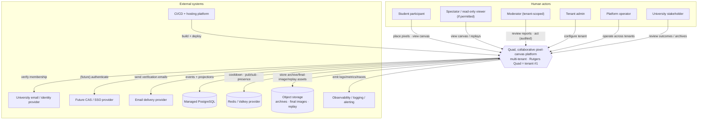
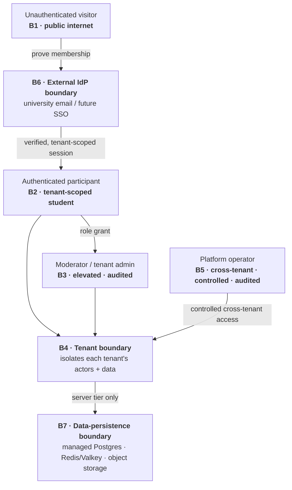

# Quad: System Context (C4 Level 1)

> **This document treats Quad as a single system (a black box) and describes the world around it:** who uses it, what external systems it depends on, where the trust boundaries are, and how data is classified as it crosses them. It is the **context layer beneath** [`ARCHITECTURE.md`](ARCHITECTURE.md), it does **not** repeat Quad's internal containers/packages or any implementation detail.
>
> **Altitude:** context only. **No** schemas, endpoints, WebSocket payloads, database tables, or algorithms. Internal structure → `ARCHITECTURE.md`; details → the per-subsystem docs.
>
> **Conformance:** consistent with [`PRODUCT.md`](PRODUCT.md), [`PRINCIPLES.md`](PRINCIPLES.md), [`NON_GOALS.md`](NON_GOALS.md), [`LAUNCH_PLAN.md`](LAUNCH_PLAN.md); IDs cited as `P-*`/`PRIN-*`/`NG-*`/`LG-*`.
>
> **Naming:** Quad = platform; **Rutgers Quad** = tenant #1. No tenant hardcoded in platform behavior.
>
> **Downstream contract:** the **Trust Boundaries (§5)** and **Data Classification (§7)** here are deliberately explicit so [`SECURITY.md`](SECURITY.md), [`AUTHENTICATION.md`](AUTHENTICATION.md), [`MULTI_TENANCY.md`](MULTI_TENANCY.md), and [`MODERATION.md`](MODERATION.md) can build directly on them. Boundary IDs (`B1…B7`), data-class IDs (`DC1…DC5`), and `CTX-INV-*` are stable handles for those docs to reference.

---

## 1. Purpose

The system context answers four questions before any internal design is discussed:

1. **Who** interacts with Quad (human actors)?
2. **What** does Quad depend on (external systems)?
3. **Where** are the trust boundaries (who is trusted to do what, and where does trust change)?
4. **What** data crosses those boundaries, and how sensitive is it?

It exists so that security, authentication, tenancy, and moderation can be designed against a shared, explicit picture of the system's edges, rather than each doc inventing its own. It is intentionally stable: actors and boundaries change rarely, even as internals evolve.

---

## 2. C4 Level 1: System Context

**Quad is a multi-tenant, real-time collaborative pixel-canvas platform for verified university communities.** From the outside it is a single system that: authenticates university members, serves a live shared canvas, accepts attributed pixel placements under a fair global cooldown, preserves all history permanently, and produces archives/replays/analytics per academic term, each tenant fully isolated.

Quad sits between **human actors** (mostly students, plus moderators, admins, operators, and stakeholders) and a set of **external systems** it relies on for identity, email delivery, data persistence, file storage, observability, and hosting. Quad **owns the canvas experience and its permanent record**; it **delegates** identity-of-record, email transport, and infrastructure operation to external providers (see §8–§9). The full picture is in the diagram in §11.

---

## 3. Primary Human Actors

| Actor | Who they are | Primary goals | Trust level (boundary) |
| --- | --- | --- | --- |
| **Student participant** | A verified, enrolled member of a tenant university | Place pixels, view the live canvas, explore pixel stories, track personal impact | Authenticated, tenant-scoped (`B2`) |
| **Spectator / read-only viewer** *(if permitted, `P-Q-2`)* | A visitor or verified member who only watches | View the live canvas, replays, archives | Public or authenticated, **no write power** (`B1`/`B2`) |
| **Moderator** | Trusted, tenant-scoped staff/students with elevated permissions | Review reports; take reversible, audited actions | Elevated, tenant-scoped, audited (`B3`) |
| **Tenant admin** | University-level operator of one tenant | Configure the tenant (branding, palette, term, roster), view tenant analytics | Elevated, tenant-scoped, audited (`B3`) |
| **Platform operator** | The Quad team running the platform across tenants | Onboard tenants, run rollovers, monitor health, respond to incidents | Highly privileged, **cross-tenant**, audited (`B5`) |
| **University stakeholder** | Student life / administration (typically non-user) | Confidence in verification, safety, attribution, archives | External observer; not a system operator |

The student participant is the **primary** actor; everything else exists to keep their experience fair, safe, and durable (`P-USER-1`, `PRIN-FAIRNESS`).

---

## 4. External Systems

Quad depends on these external/third-party systems. Exact providers are deferred (§14); their *role at the context layer* is fixed here.

| External system | Role for Quad | Data exchanged (high level) | Boundary |
| --- | --- | --- | --- |
| **University email / identity provider** | Source of truth for *who is a member* (MVP: verified university email domain) | Membership proof / email ownership | External IdP (`B6`) |
| **Future CAS / SSO provider** | Official campus authentication, replacing/augmenting email (`P-POST-1`) | Authentication assertions | External IdP (`B6`) |
| **Email delivery provider** | Sends verification (and operational) emails | Outbound email + recipient address | Crosses `B6`→participant during verification |
| **Managed PostgreSQL** | Durable home of Quad's event log + projections | All persistent Quad domain data | Data persistence (`B7`) |
| **Redis / Valkey provider** | Cooldown state, realtime pub/sub fan-out, presence | Ephemeral cooldown/presence + transient messages | Data persistence (`B7`) |
| **Object storage** | Holds archive bundles, final images, replay/export assets | Generated binary artifacts (`P-ARCH-3`, `P-POST-5`) | Data persistence (`B7`) |
| **Observability / logging / alerting** | Receives operational telemetry; powers monitoring/alerts | Logs, metrics, traces (operational telemetry, `DC5`) | Operator-facing; must not carry `DC3` |
| **CI/CD + hosting platform** | Builds, deploys, and runs Quad | Source artifacts → running deployments | Operator/infra; outside request-time trust |

> Managed datastores hold Quad's data but are operated externally; they are inside the **data-persistence boundary** (`B7`) and reachable only by Quad's server tier (per `ARCHITECTURE.md` §5–§6).

---

## 5. Trust Boundaries

Seven boundaries define where trust changes. Each lists what is inside, what crosses, and the controls that govern crossing. These are the foundation `SECURITY.md`/`AUTHENTICATION.md`/`MULTI_TENANCY.md`/`MODERATION.md` build on.

- **`B1` Public internet boundary (untrusted).** Everything outside Quad. Anyone may reach Quad's public edge. **Crossing in:** unauthenticated HTTP/WebSocket requests. **Controls:** transport encryption, rate limiting, input validation, and the rule that **no write is possible from here**: only public reads (canvas/replay/archive) *if* read-only viewing is enabled (`P-Q-2`). Owner of detail: `SECURITY.md`.
- **`B2` Authenticated participant boundary (tenant-scoped).** Inside: verified members acting within their own tenant. **Crossing in:** proving membership via the external IdP (`B6`) to obtain an authenticated, tenant-scoped session. **Grants:** place pixels, view attribution, manage own profile, **within one tenant only**. **Controls:** authenticated session + per-tenant membership check on every action (`PRIN-IDENTITY`, `ARCH-INV-4`). Owner: `AUTHENTICATION.md`.
- **`B3` Moderator / admin boundary (elevated, tenant-scoped, audited).** Inside: actors with moderator/admin roles for a specific tenant. **Crossing in:** an explicit role grant on top of `B2`. **Grants:** moderation/admin tools for that tenant. **Controls:** role checks, scope-to-tenant, and **mandatory audit logging of every action** (`P-MOD-4`, `PRIN-NO-INVISIBLE-LOSS`). Owner: `MODERATION.md` (+ `AUTHENTICATION.md` for the role model).
- **`B4` Tenant boundary (isolation).** Separates one tenant's actors, data, channels, and archives from another's. **Crossing:** prohibited for participants/moderators/admins, **no actor or data crosses tenants** (`PRIN-ISOLATION`, `P-TENANT-4`, `P-AC-13`). **Controls:** tenant id scoping on every auth/data/realtime path (`ARCH-INV-5`). Owner: `MULTI_TENANCY.md`.
- **`B5` Platform-operator boundary (cross-tenant, controlled + audited).** Inside: the Quad operator team, the **only** parties who may act across tenants (for onboarding, rollover, incident response). **Crossing in:** strong operator authentication. **Controls:** least privilege, strong authn, full audit, and the obligation to **preserve tenant isolation while operating**: operator power is the highest-risk path (`P-ADMIN-8…10`). Owner: `SECURITY.md` + `OPERATIONS.md`.
- **`B6` External identity-provider boundary.** Trust for "is this a real member?" is **delegated** to the university email/IdP (and future SSO). **Crossing:** Quad consumes membership/authentication assertions; it **does not mint its own identities** and never implements custom passwords (`NG-ANON`, `P-POST-1`). **Controls:** validate assertions, restrict to configured tenant domains/providers, guard against fake-domain/forwarding abuse (§10). Owner: `AUTHENTICATION.md` (+ `ADR-0006`).
- **`B7` Data-persistence boundary.** Inside: managed Postgres, Redis/Valkey, and object storage holding Quad's data. **Crossing:** **only Quad's server tier** reads/writes here (`ARCH-INV-10`); actors never touch datastores directly. **Controls:** network isolation, credentials/secrets management, encryption in transit/at rest, least-privilege access. Owner: `SECURITY.md`, `DATABASE.md`, `DEPLOYMENT.md`.

---

## 6. Tenant Isolation at the Context Level

At the edges, isolation means:

- **Every human actor except the platform operator belongs to exactly one tenant.** Their identity, actions, and visibility are confined to that tenant (`B2`/`B3` always sit *inside* a `B4` tenant).
- **Identity is proven per tenant.** The external IdP (`B6`) is configured per tenant (e.g., which email domains/providers count); a member of one tenant cannot authenticate into another.
- **Data is partitioned by tenant** behind the data-persistence boundary (`B7`); one tenant's canvas, profiles, leaderboards, reports, and archives are never visible to another (`P-AC-13`).
- **Only the platform operator (`B5`) is cross-tenant**, and only under explicit controls + audit, with a standing obligation never to leak data across `B4`.

**Rutgers Quad** is one tenant inside `B4`; adding another university adds another isolated `B4`, by configuration (`PRIN-CONFIG-OVER-CODE`). Routing/resolution mechanics: `MULTI_TENANCY.md`.

---

## 7. Data Classification (Context Level)

Five classes describe data by sensitivity and who may see it. Downstream docs map these to concrete fields/stores; here they are policy.

| Class | Examples | Sensitivity | Who may see it | Context-level handling rule |
| --- | --- | --- | --- | --- |
| **`DC1` Public canvas data** | Pixels, coordinates, colors, current canvas, replays, archives, final images | Low / shareable | All tenant members (and public if read-only viewing is enabled, `P-Q-2`) | Permanent, immutable history (`PRIN-PERMANENCE`); freely viewable within tenant visibility policy |
| **`DC2` Public handle / display identity** | The tenant-defined public handle or chosen display name shown in attribution | Low-but-personal | Tenant members (public only if policy allows) | **Never reveal the full email** (`P-ATTR-4`); exact exposure governed by `P-Q-1` |
| **`DC3` Private account identity** | Full university email, internal user id, verification/membership status, sessions/tokens | **High (PII; student-data-sensitive)** | The user; authorized moderators/admins/operators for legitimate purposes only — **never public** | Minimize, encrypt, access-control; never crosses `B1`; data-residency/FERPA posture per `LAUNCH_PLAN.md` (`LG-9`) |
| **`DC4` Moderation / audit data** | Reports, moderation actions, bans, the audit log | **High / sensitive** | Moderators/admins (tenant-scoped) + operators | Append-only, retained, access-controlled (`P-MOD-4`); reversible actions, never destroyed (`PRIN-NO-INVISIBLE-LOSS`) |
| **`DC5` Operational telemetry** | Logs, metrics, traces, load signals | Medium (may incidentally contain identifiers) | Platform operators | Must **not** carry `DC3`; scrub/avoid PII; retention limits; owner `OBSERVABILITY.md` |

**Cross-cutting rule:** the higher the class, the more boundaries it must stay behind. `DC3`/`DC4` never cross `B1`; `DC5` must be scrubbed so it cannot leak `DC3`.

---

## 8. High-Level System Responsibilities (what Quad owns)

- Establish and enforce **verified, tenant-scoped membership** before any write (`B2`, `PRIN-IDENTITY`).
- Serve a **live, real-time, mobile-first canvas** and accept **attributed** pixel placements (`P-FEAT-1`, `P-FEAT-2`).
- Enforce the **fair, global, bounded cooldown** server-side (`P-FEAT-3`, `PRIN-FAIRNESS`).
- **Preserve all history permanently** and derive current canvas, profiles, leaderboards, heatmaps, archives, and replays from it (`PRIN-PERMANENCE`).
- Provide **reversible, audited moderation** and a reporting loop (`P-FEAT-10`).
- Keep **tenants isolated** and make tenants **configurable** (`B4`, `PRIN-CONFIG-OVER-CODE`).
- Produce **per-term archives, final images, and replays** (`P-FEAT-8`, `P-FEAT-9`).
- Emit **operational telemetry** for monitoring and incident response.

---

## 9. Responsibilities Explicitly Outside Quad

- **Being the identity source of truth.** The university IdP/SSO (`B6`) decides who is a member; Quad consumes that, it does not enroll students or own campus credentials.
- **Email transport.** Delivered by the email provider; Quad composes, it does not run mail infrastructure.
- **Infrastructure operation.** Datastores, object storage, and hosting are managed externally (`B7`, CI/CD/hosting); Quad uses them.
- **Authoring the content policy.** The *standard* for acceptable content is owned by the tenant/university (`P-Q-11`, `LG-2`); Quad enforces decisions, it does not define campus values.
- **Legal/privacy determinations.** ToS, privacy policy, data-residency/FERPA posture are owned by product + university counsel (`LG-9`).
- **The excluded product surfaces** in `NON_GOALS.md` (chat, DMs, marketplace, payments, crypto, NFTs, machine-generated art), not Quad's responsibility, by design.

---

## 10. Abuse & Security Concerns Visible at the Context Layer

Threats observable at the edges (mitigations are owned by `SECURITY.md`; named here so the threat model has a context anchor):

- **Identity abuse at `B6`:** fake/forwarded university emails, shared/role accounts, multi-accounting to defeat one-person-one-vote (`P-ABUSE-1`).
- **Impersonation / handle confusion at `B2`/`DC2`:** misleading display identity; exposure of `DC3` (esp. full email).
- **Automated abuse at `B1`/`B2`:** botting/scripted placement, scraping public canvas data, cooldown-bypass attempts (`P-ABUSE-2…3`, `NG-MACHINE-ART`).
- **Privilege abuse at `B3`/`B5`:** moderator/admin overreach, **platform-operator or admin account compromise** (highest blast radius), unaudited actions.
- **Tenant-isolation failure at `B4`:** any path that leaks one tenant's actors/data into another (`P-AC-13`).
- **Persistence threats at `B7`:** datastore credential leakage, event-log tampering, archive/object-storage exposure, backup compromise.
- **Telemetry leakage at `DC5`:** PII (`DC3`) accidentally written to logs/metrics.

Each maps to a boundary above, so `SECURITY.md` can attach mitigations boundary-by-boundary.

---

## 11. C4 Context Diagram

---

## 12. Trust-Boundary Diagram

---

## 13. Context-Level Invariants

- **`CTX-INV-1`** No write occurs without crossing `B2`: there is no anonymous write path (`PRIN-NO-ANON`).
- **`CTX-INV-2`** Every actor and every data item belongs to exactly one tenant, **except** the platform operator (`B5`), who is cross-tenant under controls (`PRIN-ISOLATION`).
- **`CTX-INV-3`** `DC3` (private account identity, especially full email) never crosses `B1`; `DC2` is the only identity shown publicly, per policy.
- **`CTX-INV-4`** Membership/authentication originates only at `B6`; Quad mints no identities and stores no custom passwords.
- **`CTX-INV-5`** Every elevated action (`B3`/`B5`) is authorized and **audited** (`DC4` append-only).
- **`CTX-INV-6`** Persistent Quad data lives only behind `B7` and is accessed only by Quad's server tier.
- **`CTX-INV-7`** No data flows across `B4` except via `B5` under explicit, audited controls.
- **`CTX-INV-8`** Operational telemetry (`DC5`) must not carry `DC3`.

---

## 14. Decisions Deferred to Deeper Docs

| Open decision | Owner doc / ADR |
| --- | --- |
| Whether spectators/read-only non-members exist (changes the `B1` surface) | `P-Q-2` → `MULTI_TENANCY.md` / `AUTHENTICATION.md` |
| Public-handle exposure policy (`DC2` visibility) | `P-Q-1` → `AUTHENTICATION.md` / `PROFILES.md` |
| IdP/SSO specifics + how the session crosses `B6`→`B2` and the WS handshake | `AUTHENTICATION.md`, `ADR-0006` |
| Concrete external providers (object storage, observability, hosting, Redis vs Valkey) | `DEPLOYMENT.md`, `ADR-0010` |
| Data-residency / FERPA / privacy posture for `DC3` | `LAUNCH_PLAN.md` (`LG-9`), `SECURITY.md` |
| Tenant resolution mechanism (how a request maps to `B4`) | `MULTI_TENANCY.md` |
| Moderator/admin role model crossing `B3` | `MODERATION.md`, `AUTHENTICATION.md` |

---

## 15. Document Control

- **Path:** `docs/SYSTEM_CONTEXT.md`
- **Purpose:** The C4 Level-1 context for Quad, actors, external systems, trust boundaries, and data classification, providing the shared edge model that security, auth, tenancy, and moderation docs build on.
- **Dependencies:** `ARCHITECTURE.md` (umbrella internals), `PRODUCT.md`/`PRINCIPLES.md`/`NON_GOALS.md`/`LAUNCH_PLAN.md` (constraints, IDs). **Consumed by:** `SECURITY.md`, `AUTHENTICATION.md`, `MULTI_TENANCY.md`, `MODERATION.md`, `OBSERVABILITY.md`.
- **Acceptance checklist:** ☑ all 15 parts present ☑ context altitude only (no schemas/endpoints/WS payloads/tables/algorithms) ☑ 6 human actors ☑ 8 external systems ☑ 7 trust boundaries (`B1…B7`) explicit enough to build on ☑ 5 data classes (`DC1…DC5`) ☑ tenant isolation at context ☑ abuse/security anchored to boundaries ☑ 2 Mermaid diagrams (context, trust-boundary) ☑ `CTX-INV-1…8` ☑ deferrals routed ☑ tenant-neutral.
- **Open questions:** see §14 (read-only viewing, handle exposure, IdP/session crossing, providers, data residency).
- **Next recommended:** `docs/FRONTEND.md` (web app architecture, component hierarchy, canvas surface boundaries).
