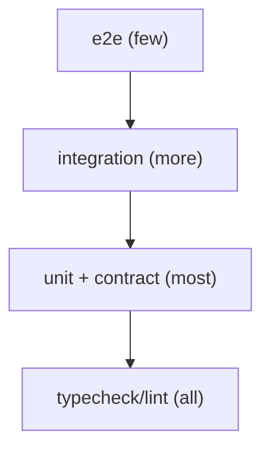
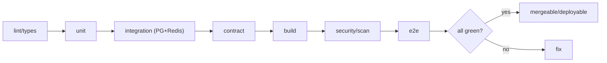

# Quad: Testing Strategy

> **Engineering-process doc.** Owns the full test strategy + merge-blocking matrix. Conforms to `ENGINEERING_WORKFLOW.md`, `MILESTONES.md`, `SECURITY.md`, `PERFORMANCE.md`, all Phase 2 docs. Does not rewrite contracts; contradictions → unresolved risks. No tests/code/versions; tenant-neutral (Rutgers Quad = tenant #1).

## 1. Purpose & Scope
Tests are how Quad earns the right to claim correctness (`PROC-DP-4`). **In scope:** test principles, layers, the critical-subsystem matrix, required tests by milestone group, merge-blocking rules, fixtures/data policy, CI expectations. **Out of scope:** concrete test files (impl), perf *budgets* (`PERFORMANCE.md`), security *threats* (`SECURITY.md`).

## 2. Responsibilities vs. Non-Responsibilities
| Testing owns | Doesn't own |
| --- | --- |
| Layers, matrix, merge-blocking rules, fixtures policy | Budgets (`PERFORMANCE.md`) / threats (`SECURITY.md`) |
| What must be tested per subsystem/milestone | Contract definitions (their docs) |

## 3. Principles
- **`T-DP-1` Tests before claims**: no "works" without commands + results (`PROC-INV-4`).
- **`T-DP-2` Critical systems never manual-only**: event sourcing/cooldown/auth/WS/rendering/moderation/tenant isolation are automated.
- **`T-DP-3` Contract tests for shared contracts**: `@quad/core` DTOs/WS/events validated.
- **`T-DP-4` Integration uses real Postgres/Redis** (Dockerized), not mocks, for stateful correctness.
- **`T-DP-5` Security/performance gates** where relevant; no fabricated results.

## 4. Test Layers
| Layer | Scope |
| --- | --- |
| **Typecheck/static** | strict TS + lint (no `any` in domain) |
| **Unit** | pure domain (`@quad/core`), services, components |
| **Integration** | api + real Postgres + Redis |
| **Contract** | request/response/WS/event shapes vs `@quad/core` |
| **E2E (Playwright)** | user journeys, incl. mobile/touch |
| **Security** | authz, CSRF/origin, no-`DC3`, integrity (`SECURITY.md` §18) |
| **Performance/load** | budgets `B01–B14` at load tiers (`PERFORMANCE.md`) |
| **Migration** | up/down, expand/contract, no destructive log change |
| **Accessibility** | axe + keyboard/ARIA (`FRONTEND.md` §10) |
| **Smoke** | post-deploy health/critical-path (`DEPLOYMENT.md`) |

## 5. Critical-Subsystem Test Matrix
| Subsystem | Must verify |
| --- | --- |
| **Event sourcing** | append-only; per-canvas ordering; idempotency; rebuild determinism (`ES-INV-*`) |
| **Database/projections** | atomic append+projection; tenant-scoped uniqueness; one row per `(canvas,x,y)` |
| **API** | catalog conformance; error model; idempotency; `COOLDOWN_ACTIVE`≠`RATE_LIMITED` |
| **WebSockets** | connect/subscribe authz; fan-out; reconnect convergence; monotonic guard |
| **Auth/session** | verification flow; domain allowlist; revoke-on-ban; CSRF/origin |
| **Multi-tenancy** | cross-tenant→404; no default tenant; no leakage |
| **Cooldown** | bounds 5–20; smoothing; fail-closed; one charge; no bypass |
| **Rendering** | snapshot/delta; dirty-region; crisp zoom; no per-pixel React re-render |
| **Moderation/audit** | compensating events; atomic audit; no hard delete; sanitized replay |
| **Replay/archive** | replay determinism; archive generation + reproducibility; immutability |
| **Analytics/leaderboards/profiles/heatmaps** | derived/rebuildable; aggregate-only; no `DC3`; no shame metrics |
| **Deployment** | migration dry-run; smoke; rollback drill; tenant-routing; Redis eviction-policy |

## 6. Required Tests by Milestone Group
- **M0–M9:** static/build green; migration up/down; integration harness boots.
- **M10–M19:** event-sourcing + projection atomicity/idempotency; WS broadcast; reconnect; render seam.
- **M20–M29:** auth/session; tenant isolation; cooldown enforcement/fail-closed; rate limits.
- **M30–M39:** moderation compensation + atomic audit; profiles/leaderboards (DC2, no shame); a11y baseline.
- **M40–M49:** replay determinism; archive generation/reproducibility; analytics derivation.
- **M50–M59:** full security suite; load tests to budgets; DR restore drill; deploy smoke + rollback.

## 7. Merge-Blocking Rules
A PR **cannot merge** if: typecheck/lint fails · required unit/integration/contract tests fail or are missing · a touched critical subsystem lacks its matrix tests · security tests fail · a hot-path perf budget regresses (where gated) · docs/specs not updated with a contract change. (`TEST-INV-2`.)

## 8. Test Data / Fixtures Policy
Synthetic fixtures + factories (`@quad/testing`); tenant-scoped; **Rutgers data only as example/seed**. Deterministic where possible.

## 8a. Local Test Harness (`@quad/testing`)
The `@quad/testing` package provides reusable, dependency-light building blocks (no product behavior):
- **Fixtures**: `tenantFixtures()` (configured tenants from `@quad/config`) and `makeTenantFixture(overrides?)` (tenant-neutral, DC2-only, **no default tenant**).
- **Readiness helpers**: `waitForPostgres()` (real connect + `SELECT 1`) and `waitForRedis()` (RESP `PING` → `+PONG`): **protocol-level** checks, not just an open TCP port, so a container that has opened its port before the datastore is ready cannot produce a false-green. `waitForPort()` / `isDockerRunning()` are lower-level primitives.
- **Local URLs/creds**: `localTestDatabaseUrl()`, `tenantHost()`, `tenantHostHeader()`, `localTestUrl()`, local-only values matching `docker-compose.yml` (never secrets).

**Tiers & commands** (always run via Turbo so workspace deps `@quad/core`/`@quad/config` build first):
- **Unit** (no Docker; part of `pnpm check`): `pnpm test`.
- **Integration** (needs local datastores): `docker compose up -d postgres redis` → `pnpm test:integration` → `docker compose down`.

Integration tests target the Dockerized Postgres/Redis in `docker-compose.yml` (`TEST-INV-3`) and assert **protocol** readiness, not just port reachability.

## 9. No Production Data
Never use real student/production data in tests/dev (`SEC-INV` privacy). `DC3` never in fixtures beyond synthetic.

## 10. No Fabricated Results
Test results are reported with the commands that produced them; a skipped/failing test is reported as such (`PROC-INV-10`).

## 11. CI Expectations
CI runs (Turbo-cached) lint → typecheck → unit → integration (PG+Redis) → contract → build → security/dep/secret scan → relevant e2e; perf/load on a schedule or pre-launch. Green required before deploy (`DEPLOYMENT.md` §14).

## 12. Testing Invariants (`TEST-INV-*`)
- **`TEST-INV-1`** Every feature ships with tests; claims require commands + results.
- **`TEST-INV-2`** Critical-subsystem matrix tests gate merge; missing tests block.
- **`TEST-INV-3`** Integration tests use real Postgres/Redis, not mocks, for stateful behavior.
- **`TEST-INV-4`** Shared contracts have contract tests; `@quad/core` is the source.
- **`TEST-INV-5`** No production data, no `DC3` in fixtures, no fabricated results.

## 13. Diagrams

## 14. Document Control
- **Path:** `docs/TESTING.md` · **Purpose:** full test strategy + merge-blocking matrix.
- **Dependencies:** `ENGINEERING_WORKFLOW`, `MILESTONES`, `SECURITY`, `PERFORMANCE`, all Phase 2 docs. **Consumed by:** every implementation milestone, `REVIEW_PROCESS`, CI (Phase 4).
- **Acceptance:** ☑ principles ☑ layers ☑ critical-subsystem matrix ☑ tests by group ☑ merge-blocking ☑ fixtures/no-prod-data/no-fabrication ☑ CI ☑ `TEST-INV-*` ☑ 2 diagrams ☑ no code/versions ☑ tenant-neutral.
- **Next:** `docs/OBSERVABILITY.md`.
