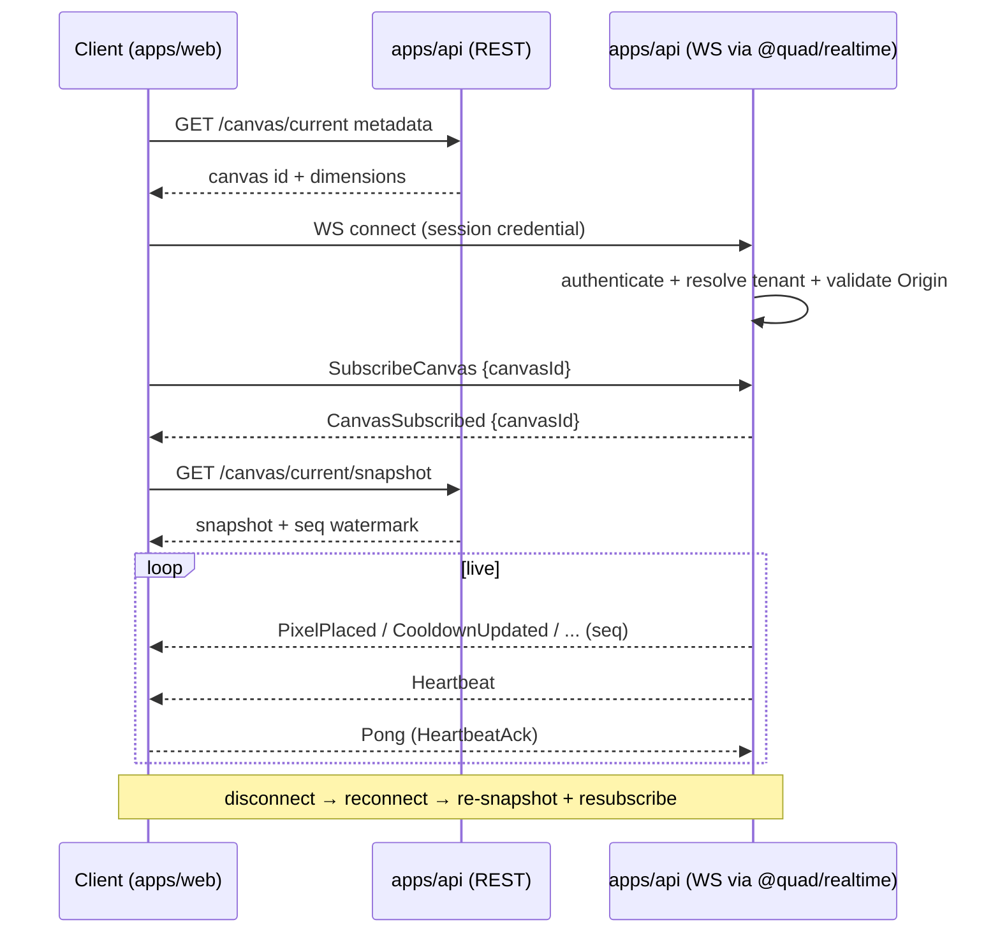
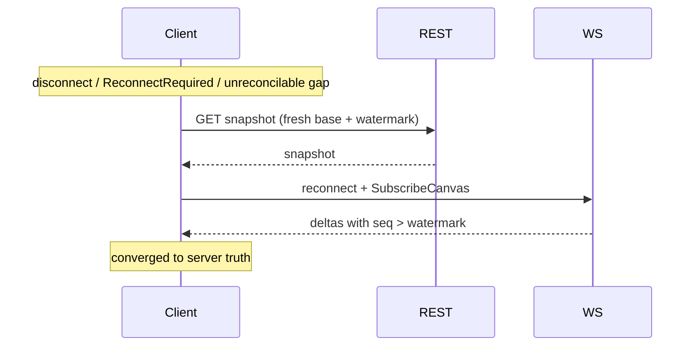
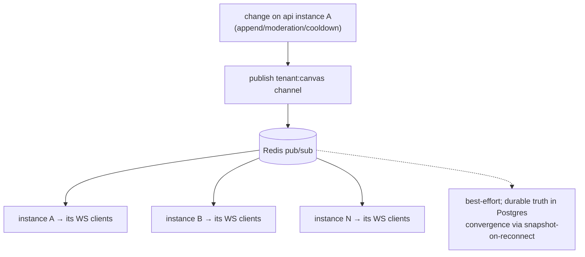
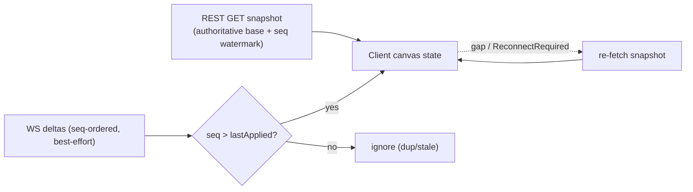

# Quad: WebSocket Protocol & Realtime Contract

> **This document owns the live realtime layer: connection lifecycle, channel scoping, the message envelope, the canonical server↔client message catalogs, ordering/reconnect/fan-out semantics, backpressure, presence, and the realtime error/version model.** It conforms to [`PRODUCT.md`](PRODUCT.md), [`PRINCIPLES.md`](PRINCIPLES.md), [`ARCHITECTURE.md`](ARCHITECTURE.md), [`SYSTEM_CONTEXT.md`](SYSTEM_CONTEXT.md), [`BACKEND.md`](BACKEND.md), [`DATABASE.md`](DATABASE.md), [`EVENT_SOURCING.md`](EVENT_SOURCING.md), and [`API.md`](API.md); IDs cited (`P-*`, `PRIN-*`, `ARCH-INV-*`, `ES-INV-*`, `API-INV-*`, `DC*`, `B*`).
>
> **Altitude:** the realtime contract, **message *types/names*, envelope, lifecycle, and delivery semantics.** Concrete payload **declarations live in `@quad/core`**. **No** WS handler/source files, **no** REST endpoints (`API.md`), **no** event semantics (`EVENT_SOURCING.md`), **no** DB tables (`DATABASE.md`), **no** versions (`TECH_BASELINE.md`), **no** app code.
>
> **Naming:** platform = **Quad**; **Rutgers Quad** = tenant #1 (example only). No tenant literal in channels/payloads.

---

## 1. Purpose & Scope

WebSockets are how Quad stays **alive** (`PRIN-ALIVE`, `P-CANVAS-7`): after a client loads the canvas snapshot over REST, it receives every change in real time over a WS connection, **no polling**. Per `API.md` §16, **REST accepts commands and serves snapshots/history; WS distributes live updates.**

**In scope:** realtime principles, connection lifecycle, auth/tenant scoping at the WS boundary (high level), the message envelope, server→client and client→server message catalogs, disallowed messages, ordering, reconnect/recovery, Redis pub/sub fan-out, backpressure, heartbeat, presence, cooldown/moderation/lifecycle updates, privacy, error/version models, security/performance/testing, invariants.

**Out of scope (owned elsewhere):** REST (`API.md`), event ordering/semantics (`EVENT_SOURCING.md`), auth/session + WS-handshake mechanics (`AUTHENTICATION.md`), tenant resolution (`MULTI_TENANCY.md`), cooldown computation (`COOLDOWN.md`), snapshot encoding/consumption (`RENDERING.md`), DB tables (`DATABASE.md`).

---

## 2. Responsibilities vs. Non-Responsibilities

| WebSockets **own** | They do **not** own |
| --- | --- |
| Live distribution of canvas/cooldown/moderation/lifecycle/presence updates | Accepting authoritative state changes (placement is REST, `WS-INV-1`) |
| Connection lifecycle, channels, heartbeat, reconnect signaling | The snapshot's content/encoding (`RENDERING.md`/`API.md`) |
| Message envelope + typed message catalog | Event ordering/semantics (`EVENT_SOURCING.md`) |
| Delivery semantics (best-effort + snapshot convergence) | Auth/session mechanics (`AUTHENTICATION.md`) |
| Backpressure/presence/error/version at the WS layer | Durable persistence (Postgres; Redis is transport only) |

---

## 3. Realtime Design Principles

- **`WS-DP-1` No polling for live canvas**: liveness is push-based (`PRIN-ALIVE`, `API-INV-12`).
- **`WS-DP-2` Server-authoritative state**: WS conveys facts the server already decided; the client never gains authority via WS (`FE-INV-3`).
- **`WS-DP-3` Tenant-scoped channels**: every subscription is within one tenant/canvas; no cross-tenant subscription (`B4`, `WS-INV-3`).
- **`WS-DP-4` Typed by `@quad/core`**: every message has a declared type + `schemaVersion`; no untyped messages (`ARCH-INV-6`).
- **`WS-DP-5` Reconnect convergence via snapshot**: the snapshot (fetched over REST) is the authoritative base; pub/sub is best-effort and reconciled on (re)connect (`ES`/`ARCHITECTURE` §11).

---

## 4. Connection Lifecycle

1. **Canvas metadata (REST)**, the client resolves the current canvas id via `GET /canvas/current` (`API.md`).
2. **WS connect**, the client opens the WebSocket carrying its session credential and same-tenant `Origin`.
3. **Auth/session/origin validation at connect**, the server authenticates and resolves the tenant **before** any subscription (`§5`).
4. **Subscription**, the client sends `SubscribeCanvas {canvasId}`; the server validates scope and
   replies `CanvasSubscribed {canvasId}` only after the subscription is installed. The client begins
   its snapshot request after this acknowledgement, so concurrent deltas are queued without a gap.
5. **Initial snapshot (REST)**, after the acknowledgement the client fetches `GET /canvas/current/snapshot`, which includes the authoritative **sequence watermark**; subscribed deltas are queued during the request.
6. **Heartbeat**, the server periodically pings; the client replies (`§15`).
7. **Live updates**, the server streams canvas/cooldown/moderation/lifecycle/presence messages, each carrying a per-canvas `seq` where applicable (`§11`).
8. **Disconnect**, on network loss/close, the client enters reconnect.
9. **Reconnect**, the client reconnects, resubscribes, waits for the acknowledgement, then **re-fetches the snapshot** (fresh watermark).
10. **Snapshot refresh after reconnect**, the snapshot is authoritative; the client resumes applying contiguous deltas beyond the new watermark (`§12`).

---

## 5. Authentication at the WS Boundary (High Level)

- The WS connection is **authenticated at connect** and bound to a tenant-scoped identity; **no anonymous elevated subscription** (`PRIN-NO-ANON`, `WS-INV-9`). Public read-only subscription (if read-only viewing is enabled, `P-Q-2`) carries no write/elevated capability.
- **Mechanism is deferred to `AUTHENTICATION.md` + `ADR-0006`.** Note the **browser limitation**: browsers cannot set custom headers on the WS handshake, so the session must travel via an allowed channel (cookie, or subprotocol/first-message token), the exact approach is `AUTHENTICATION.md`'s decision; this doc only requires that the connection is authenticated before subscription.

---

## 6. Tenant Resolution & Channel Scoping

- The **tenant is resolved at connect** (consistent with `API.md` §6; mechanism → `MULTI_TENANCY.md`) and pinned to the connection.
- **Channels are scoped** as `tenant:{tenantId}:canvas:{canvasId}` for public canvas updates, with a **separate role-gated** `…:mod` channel for moderation/admin updates (`§18`).
- **No cross-tenant subscription**: a connection may only subscribe within its resolved tenant; a forbidden/cross-tenant subscribe attempt errors (`§20`, `WS-INV-3`).
- **Operator/admin considerations**: elevated channels require the corresponding role; operators (`B5`) acting cross-tenant do so through controlled, audited paths, never by broadening a participant's subscription.

---

## 7. Message Envelope

Every message (both directions) shares a common envelope (conceptual; declared in `@quad/core`):

| Field | Meaning |
| --- | --- |
| **`msgId`** | Unique message id (for dedupe/ack/correlation). |
| **`type`** | Canonical message type (§8/§9). |
| **`schemaVersion`** | Message schema version (`§21`). |
| **`tenantId` / `canvasId`** | Scope, where applicable. |
| **`seq`** | Per-canvas sequence, on canvas-changing messages (`§11`); absent on non-sequenced messages (heartbeat, presence). |
| **`payload`** | Type-specific data (`DC2`-only for public messages, `§19`). |
| **`ts`** | Wall-clock time — **display only**, never ordering authority. |
| **`correlationId`** | Optional; echoes a client request id on acks/errors. |

---

## 8. Canonical Server→Client Messages

| Type | Purpose | Carries `seq`? | Scope/visibility |
| --- | --- | --- | --- |
| **`CanvasSnapshotAvailable`** | Signals a fresh snapshot should be (re)fetched via REST (e.g., after gap/lifecycle change) | no | canvas |
| **`CanvasSnapshot`** | *Optional* inline snapshot for small canvases; default is REST-fetch (`§13/§23`) | watermark | canvas |
| **`CanvasSubscribed`** | Confirms an authorized canvas subscription is installed; snapshot ordering barrier | no | connection |
| **`PixelPlaced`** | A pixel changed (`DC2` owner, coord, new color) | yes | canvas |
| **`PixelRolledBack`** | Compensating: a cell reverted (moderation) | yes | canvas |
| **`RegionRolledBack`** | Compensating: a region reverted | yes | canvas |
| **`ArtworkRemoved`** | Compensating: offending artwork cleared (sanitized) | yes | canvas |
| **`CooldownUpdated`** | New **global** cooldown value (+ caller's remaining, display-only) | no | canvas / per-connection |
| **`CanvasLifecycleChanged`** | Canvas state change (active/frozen/archived); clients refresh the snapshot/watermark | yes | canvas |
| **`ReportStatusUpdated`** | A report's status changed | no | reporter / mod channel |
| **`ModerationActionApplied`** | A moderation action took effect (audited) | yes | mod channel |
| **`PresenceUpdated`** | Approximate active-participant count | no | canvas |
| **`Heartbeat`** | Liveness ping | no | connection |
| **`Error`** | Protocol/auth/scope/version/rate error (`§20`) | no | connection |
| **`ReconnectRequired`** | Server asks the client to reconnect + re-snapshot | no | connection |

Compensating messages (`PixelRolledBack`/`RegionRolledBack`/`ArtworkRemoved`) reflect **sanitized visible state**; they never re-expose removed content (`EVENT_SOURCING.md` §15/§16).

---

## 9. Canonical Client→Server Messages

| Type | Purpose |
| --- | --- |
| **`SubscribeCanvas`** | Subscribe to a canvas channel `{canvasId}` (validated against tenant scope) |
| **`UnsubscribeCanvas`** | Stop receiving a canvas channel |
| **`Pong` / `HeartbeatAck`** | Reply to server heartbeat (`§15`) |
| **`PresencePing`** *(optional)* | Lightweight liveness/presence signal (telemetry only, `§16`) |

Client→server messages are **validated and rate-limited** (`§20/§22`); an invalid/unauthorized message yields an `Error` (and may trigger `ReconnectRequired` or disconnect).

---

## 10. Messages Explicitly NOT Allowed

- **No client-side `PlacePixel` over WS in MVP**: placement is the REST command `POST /canvas/current/pixels` (`API.md`), so the authoritative path stays one well-validated lane (`WS-INV-1`). (A future change would require an `API.md`/`ADR` update.)
- **No chat / DM / comment messages**: excluded by `NON_GOALS.md` (`NG-CHAT`/`NG-DM`/`NG-COMMENTS`); the realtime layer carries canvas facts, not conversation.
- **No untyped admin/moderation commands over WS**: moderation/admin actions are REST commands (audited); WS only *broadcasts* their results.

---

## 11. Sequence & Ordering Model

- Canvas-changing messages carry the **per-canvas `seq`** assigned at append (`EVENT_SOURCING.md` §10).
- **Delivery order is best-effort**, so the client must not assume strict in-order arrival. The client keeps a **monotonic guard**: apply a message only if `seq > lastAppliedSeq`; ignore duplicates and stale messages (`WS-INV-4`).
- **Gap handling:** if the client detects a gap it cannot reconcile (or receives `ReconnectRequired`/`CanvasSnapshotAvailable`), it **re-fetches the snapshot** to converge (`§12`), it does not attempt to request individual missed messages over WS.

---

## 12. Reconnect & Recovery Model

- **Missed messages are tolerated**: pub/sub is fire-and-forget (`§13`); the design never relies on perfect WS delivery for correctness.
- **Snapshot-on-reconnect is authoritative**: on (re)connect the client fetches a fresh snapshot (REST) with a new watermark and resumes applying `seq`-greater deltas (`WS-INV-5`).
- **Client resubscribes** after reconnect.
- **Server may force reconnect** via `ReconnectRequired` (e.g., on version mismatch, server rollout, or when a slow client has fallen too far behind, `§14`).

---

## 13. Redis Pub/Sub Fan-Out Model

- On a placement/moderation/cooldown/lifecycle change, the handling **api instance publishes** to the tenant/canvas channel in Redis.
- **All api/WS instances** subscribed to that channel **fan out** to their locally-connected clients, so a change on instance A reaches clients on B and C (`ARCHITECTURE.md` §11, `ARCH-GOAL-3`).
- **Best-effort delivery**: pub/sub does not guarantee delivery or order across instances; this is acceptable because **convergence is guaranteed by snapshot-on-reconnect** (`§12`).
- **Persistence stays in Postgres, not Redis**: Redis is **transport only**; losing a pub/sub message loses nothing durable (`WS-INV-10`, `DB-INV-12`).

---

## 14. Backpressure & Slow-Client Strategy

- Each connection has a **bounded send buffer**; the server **never blocks** on a slow client.
- When a client falls behind: **coalesce** (drop superseded intermediate deltas, the latest cell state is what matters) and/or send `CanvasSnapshotAvailable`/`ReconnectRequired` to force a **snapshot resync** rather than replaying a huge backlog.
- A persistently slow/unresponsive client is disconnected with `ReconnectRequired`; it recovers via the snapshot path (`§12`). This keeps one slow client from degrading others (`P-CANVAS-7`).

---

## 15. Heartbeat / Liveness / Timeout Policy (Architecture Level)

- The server sends periodic `Heartbeat`; the client replies with `Pong`/`HeartbeatAck`.
- A connection that misses heartbeats beyond a threshold is considered dead and closed (the client then reconnects).
- Heartbeats also keep intermediaries from idling the connection. Exact intervals/thresholds are tuning parameters (operations/performance), fixed in shape here, values in `OPERATIONS.md`/`PERFORMANCE.md`.

---

## 16. Presence Model

- Presence is **approximate**: an estimated count of active participants per canvas, surfaced via `PresenceUpdated`.
- It is **not authoritative for identity** and never enumerates who is present (privacy); it carries **counts/aggregates only**, never `DC2`/`DC3` identity lists.
- Presence **feeds the cooldown load signal as telemetry** (concurrent-user input to the cooldown, `COOLDOWN.md`), but the cooldown computation/authority lives server-side (`§17`).

---

## 17. Cooldown Updates Over WS

- `CooldownUpdated` distributes the **global** cooldown value when it changes; the connection may also receive its **own remaining** cooldown for display.
- These are **display-only**: the client never enforces or shortens cooldown; enforcement is server-side at placement (`BE-INV-7`, `API-INV-9`, `WS-INV-6`, `P-COOL-6`).
- The cooldown **algorithm/load-score** is owned by `COOLDOWN.md`; WS only transports the resulting value.

---

## 18. Moderation & Lifecycle Updates Over WS

- **Compensating events** broadcast as `PixelRolledBack`/`RegionRolledBack`/`ArtworkRemoved`, reflecting **sanitized visible state** (removed content stays removed; `EVENT_SOURCING.md` §15/§16).
- **Canvas lifecycle** changes broadcast as `CanvasLifecycleChanged` (e.g., **frozen** → clients stop offering placement; **archived** → clients switch to read-only/archive view), consistent with `P-LIFE-*`.
- **Moderation-specific** updates (`ReportStatusUpdated`, `ModerationActionApplied`) go on the **role-gated mod channel** (`§6`), not the public canvas channel.

---

## 19. Privacy Rules

- **`DC2` only in public messages**: canvas/attribution messages carry the public handle/display name, **never `DC3`** (full email/internal ids) (`WS-INV-7`, `CTX-INV-3`, `API-INV-7`).
- **No `DC3` in any WS payload**, public or otherwise; identity is referenced by `DC2`/actor id, not email.
- **Moderator/admin channels are scoped separately** and role-gated; any expanded context there is governed by `MODERATION.md`/`AUTHENTICATION.md`.
- Presence carries **counts, not identities** (`§16`).

---

## 20. Error Model

`Error` messages (and connection closes) use stable codes (declared in `@quad/core`):

| Condition | Code | Behavior |
| --- | --- | --- |
| Malformed/invalid message | `WS_PROTOCOL_ERROR` | reject message; may close on repeat |
| Unauthenticated/expired session | `WS_UNAUTHENTICATED` | close; client re-auths + reconnects |
| Forbidden subscription (role/scope) | `WS_FORBIDDEN` | reject subscribe |
| Cross-tenant subscription | `WS_TENANT_MISMATCH` | reject (no existence leak) |
| Schema/version mismatch | `WS_VERSION_MISMATCH` | `ReconnectRequired` / upgrade playbook (`§21`) |
| Rate limited | `WS_RATE_LIMITED` | throttle/close client→server flood |

Errors never leak internals or `DC3` (`API-INV-8` parity).

---

## 21. Versioning & Compatibility

- Every message carries a **`schemaVersion`**; changes are **additive and backward-compatible** where possible (`ES`/`API` parity).
- **Client minimum-version posture:** a too-old client receives `WS_VERSION_MISMATCH` + `ReconnectRequired` (prompting a refresh/upgrade) rather than being fed incompatible messages.
- Message **types are stable and canonical** (deprecate, never repurpose); new types are added additively.

---

## 22. Security Considerations

- **Auth/session checked at connect** and on privileged subscriptions (`§5`); mechanics → `AUTHENTICATION.md`.
- **CSRF / cross-site WS** concerns (e.g., origin of the handshake, cookie-based auth risks) are **deferred to `AUTHENTICATION.md`/`SECURITY.md`**; this doc flags them as required controls.
- **Origin checks** on the handshake; **input validation** on every client→server message; **rate limiting** on client→server traffic (`WS_RATE_LIMITED`).
- **Abuse/bot prevention**: connection/subscription limits per identity/IP; suspicious patterns feed abuse tooling (`SECURITY.md`, `P-ABUSE-*`).
- **No sensitive data** in payloads (`§19`); Redis carries only transient, non-durable messages.

---

## 23. Performance Considerations

- **Fan-out latency**: placement→broadcast must be fast across instances (`ARCH-GOAL-3`); pub/sub keeps it horizontal.
- **Payload size**: deltas are small (a cell change); the large **snapshot** is delivered once over REST, not repeatedly over WS (`§13`, snapshot encoding → `RENDERING.md`).
- **Batching/coalescing**: high-activity periods may coalesce rapid deltas to slow/lagging clients (`§14`).
- **Compression tradeoffs**: per-message compression saves bandwidth at CPU cost; adopt selectively (decision → `PERFORMANCE.md`/`OPERATIONS.md`).
- **Snapshot vs delta boundary**: initial state = REST snapshot; subsequent changes = WS deltas; reconnect = new snapshot + deltas. This boundary is the core performance contract with `RENDERING.md`.
- Concrete budgets owned by `PERFORMANCE.md`.

---

## 24. Testing Expectations

WS test layers (strategy → `TESTING.md`):

- **Connection lifecycle**: connect → auth → subscribe → updates → disconnect → reconnect.
- **Subscription authorization**: role/scope enforced; forbidden/cross-tenant rejected.
- **Tenant isolation**: no message from another tenant ever reaches a connection (`P-AC-13`).
- **Message contract**: every message conforms to its `@quad/core` type + `schemaVersion`.
- **Reconnect convergence**: after drop + reconnect, the client converges to server truth via snapshot.
- **Duplicate/out-of-order**: monotonic guard ignores stale/dup `seq`; final state is correct.
- **Heartbeat timeout**: missed heartbeats close the connection; client recovers.
- **Slow-client/backpressure**: a slow client is coalesced/forced-resync without degrading others.
- **Privacy**: no `DC3` in any payload; presence carries counts only.

---

## 25. WebSocket Invariants (`WS-INV-*`)

- **`WS-INV-1`** WS distributes live updates only; it accepts no authoritative state change (no placement command over WS in MVP).
- **`WS-INV-2`** Every message is typed by `@quad/core` with a `schemaVersion`; no untyped messages.
- **`WS-INV-3`** Subscriptions are tenant- and canvas-scoped; no cross-tenant subscription.
- **`WS-INV-4`** Canvas-changing messages carry per-canvas `seq`; clients apply via a monotonic guard (duplicate/out-of-order safe).
- **`WS-INV-5`** Snapshot-on-(re)connect (via REST) is the authoritative convergence path; pub/sub is best-effort.
- **`WS-INV-6`** Cooldown values over WS are display-only; the server enforces.
- **`WS-INV-7`** No `DC3` in any WS payload; public messages carry `DC2` only.
- **`WS-INV-8`** Moderation/admin messages are role-scoped on separate channels.
- **`WS-INV-9`** Connections are authenticated as required before subscription; no anonymous elevated subscription.
- **`WS-INV-10`** Durable truth stays in Postgres; Redis pub/sub is transport only.
- **`WS-INV-11`** The server may force reconnect; clients must handle `ReconnectRequired` by re-snapshotting + resubscribing.
- **`WS-INV-12`** Presence is approximate and non-authoritative; never an identity source.

---

## 26. Diagrams

- **Connection lifecycle**: §4.
- **REST snapshot + WS delta flow**: below.
- **Redis pub/sub fan-out**: §13.
- **Reconnect convergence**: §12.

### 26.1 REST snapshot + WS delta flow

---

## 27. Decisions Deferred to Deeper Docs

| Open decision | Owner |
| --- | --- |
| WS-handshake auth mechanism (cookie vs subprotocol/first-message token) + CSRF/origin | `AUTHENTICATION.md`, `ADR-0006`, `SECURITY.md` |
| Concrete message payload shapes/types | `@quad/core` (implementation) |
| Tenant resolution at connect | `MULTI_TENANCY.md` |
| Cooldown value computation/load score | `COOLDOWN.md` |
| Snapshot encoding (binary/efficient) + client consumption | `RENDERING.md` / `API.md` |
| Heartbeat intervals, timeout thresholds, connection limits | `OPERATIONS.md` / `PERFORMANCE.md` |
| Compression adoption + coalescing thresholds | `PERFORMANCE.md` |
| Whether `CanvasSnapshot` inline delivery is used vs REST-only | implementation (default: REST-fetch) |
| Moderation mod-channel exact scoping/role gating | `MODERATION.md` |

---

## 28. Document Control

- **Path:** `docs/WEBSOCKETS.md`
- **Purpose:** Define Quad's realtime WebSocket protocol, lifecycle, channels, message envelope/catalog, ordering, reconnect, fan-out, backpressure, presence, and error/version models, that `@quad/realtime` + `apps/api` implement and `apps/web` consumes.
- **Dependencies:** `API.md`, `EVENT_SOURCING.md`, `BACKEND.md`, `DATABASE.md`, `ARCHITECTURE.md`, `SYSTEM_CONTEXT.md`, `PRODUCT.md`, `PRINCIPLES.md`. **Consumed by:** `AUTHENTICATION.md` (handshake), `COOLDOWN.md` (distribution), `MODERATION.md` (broadcasts), `RENDERING.md` (snapshot/delta consumption), `FRONTEND.md` (WS client), `@quad/core` (message types), `specs/websockets`.
- **Acceptance checklist:** ☑ all 28 parts present ☑ contract altitude (message types/names + lifecycle; no handlers/source/DTO declarations) ☑ realtime principles (no polling, server-authoritative, tenant-scoped, typed, snapshot convergence) ☑ full lifecycle ☑ message envelope + server→client and client→server catalogs ☑ disallowed messages (no WS placement/chat/admin) ☑ ordering (per-canvas seq + monotonic guard) ☑ reconnect/recovery ☑ Redis pub/sub best-effort + Postgres durability ☑ backpressure + heartbeat + presence ☑ cooldown/moderation/lifecycle over WS ☑ privacy (`DC2` only) ☑ error + version models ☑ `WS-INV-1…12` ☑ 4 Mermaid diagrams ☑ versions referenced not declared ☑ tenant-neutral (Rutgers = example) ☑ no app code/package files.
- **Open questions:** see §27 (handshake auth, payload shapes, snapshot inline vs REST, compression/heartbeat tuning).
- **Next recommended:** `docs/AUTHENTICATION.md` (verified-membership auth, sessions, roles, and the WS-handshake auth crossing this protocol depends on).
